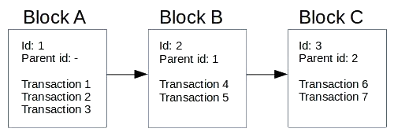
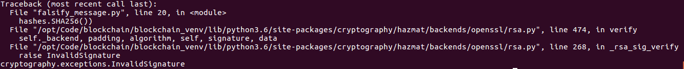
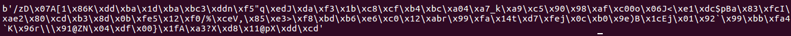
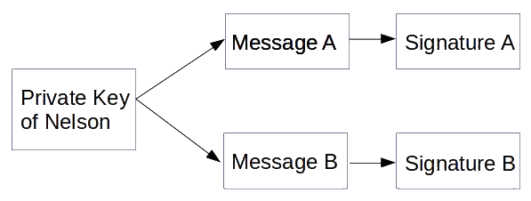
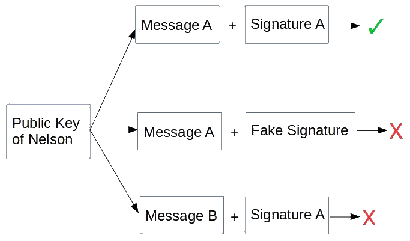
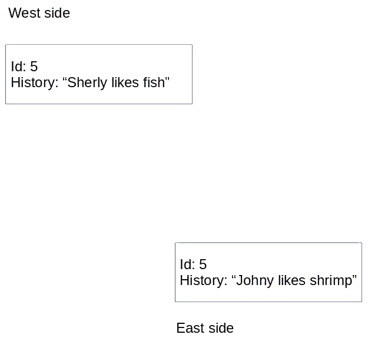
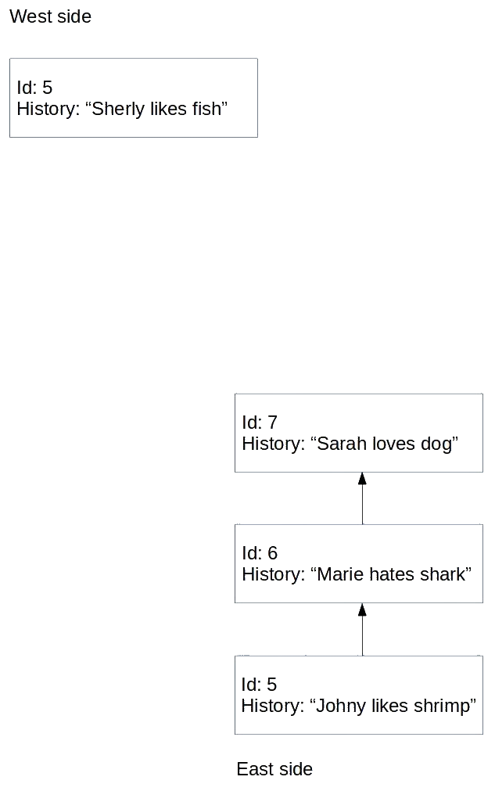
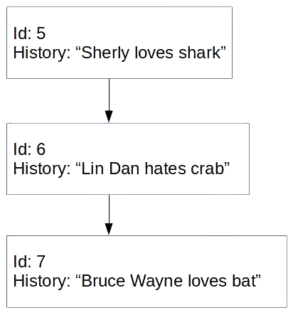
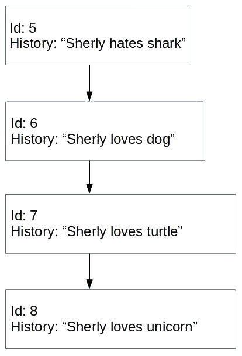

# 区块链编程简介

在本书中，我们将学习区块链编程，以便你在寻找区块链机会时成为一股不可忽视的力量。 要实现这一点，你需要首先了解区块链技术及其含义。 在本章中，我们将学习什么是区块链技术。 区块链如何赋能比特币和以太坊？ 我们将对区块链技术有一个直观的了解。 我们还将复制区块链背后的一些基本功能。

本章将涵盖以下主题：

- 加密货币和区块链的兴起
- 区块链技术
- 密码学
- 哈希函数
- 共识
- 在区块链上编码

## 加密货币和区块链的兴起

假设你在 2017 年没有在山上隐居，你会听说过所有关于加密货币的事情，尤其是比特币。你不必走远就能听到这个话题的流行度、术语及其价值的增长。此时，其他加密货币也开始增长，为以太坊等头条新闻让路，达到 1,000 美元！在这场热潮中，人们讨论了关于加密货币的一切，从波动的价格到其背后的技术，也就是区块链。

区块链被认为是为人类带来正义与繁荣新时代曙光的技术。这将使财富民主化。它会将权力从寡头政治手中夺走，还给人民。它将保护人们的数据。然后是 2018 年，加密货币下跌。晚会结束了。比特币现在的价格为 6,000 美元，而以太坊的价格不到 400 美元。

然而，尽管围绕加密货币的炒作已经平息，但它仍然是一个经常讨论的话题。区块链会议和聚会在许多地方涌现，而投资不断涌入区块链初创公司。硅谷巨头安德森霍洛维茨 (Andreessen Horowitz) 从其有限合伙人处获得了高达 3 亿美元的专用区块链基金。 [1] 在这种情况下，机会在于资金流入的地方。 Blockchain Developers 的首席招聘官 Katheryn Griffith Hill 声称 [2] 目前有 14 个区块链开发人员职位可供每位区块链开发人员使用。另外，我的一个在雅加达参加当地区块链活动的朋友对此发表了评论，说我可以看到大约一百名观众，但只有四五个开发人员。 50%的观众是投资者。想把钱投进区块链的人有，但有能力开发产品的人却少之又少。

区块链开始被用作没有中间人的支付解决方案，即比特币。然后，人们发现区块链还有其他一些有趣的特性。首先，它是透明的，这意味着人们可以对其进行审计以检查是否存在洗钱活动。其次，它在一定程度上为用户提供了隐私，可用于避免分析。

然后，在以太坊发布后，人们突然对如何在现实生活中应用区块链产生了创造力。从创建代币来代表某物的所有权，例如自治组织或完全隐私的支付，到无法复制的数字资产（与 MP3 文件不同）。

## 区块链技术

大多数人都知道比特币的存在是因为区块链。但什么是区块链？它是一个仅附加的数据库，由通过散列链接的块组成。在这里，每个区块都包含许多在受密码保护的参与者之间转移价值（但可能是其他事物）的交易；拥有相同数据库的许多节点之间的共识决定接下来要附加哪个新块。

此时你不必理解定义；有很多话要咀嚼！首先，我将向你解释区块链，以便你在阅读本书时能够适应这些新知识。

回到区块链的定义，我们可以将定义概括为一个附加数据库。一旦你把东西放入数据库，它就不能改变；没有撤消。我们将在第 2 章智能合约基础中讨论此功能的影响。这个定义包含了很多东西，并打开了一个全新的世界。

那么，你可以在这个仅追加的数据库中放入什么？这取决于加密货币。对于比特币，你可以存储转移价值的交易。例如，纳尔逊向 Dian 发送了一个比特币。然而，在将它们附加到数据库之前，我们将许多事务累积到一个块中。对于以太坊来说，可以放入 append-only 数据库的东西更加丰富。这不仅包括转移价值的交易——也可能是状态的改变。我在这里所说的状态是非常普遍的。例如，购买演出门票的队列可以有一个状态。此状态可以为空或满。与比特币类似，在以太坊中，你收集所有交易，然后将它们附加到这个仅附加数据库中。

为了更清楚，我们将所有这些交易放入块中，然后再将它们附加到仅附加数据库中。除了交易列表，我们还在这个区块中存储了其他东西，比如我们将区块追加到仅追加数据库的时间，目标的难度（不知道的不要担心），以及父母的哈希值（我将很快解释这一点），等等。

了解了区块链的区块元素，我们再来看看链元素。如前所述，除了交易列表之外，我们还将父项的哈希值放入区块中。但是现在，让我们只使用一个简单的 ID 来指示父级，而不是使用哈希。父 ID 只是前一个块 ID。在这里，想想堆栈。一开始，没有块。取而代之的是，我们放置了区块 A，它有三个交易：交易 1、交易 2 和交易 3。由于区块 A 是第一个区块，因此它没有父区块。然后我们将区块 B 应用到区块 A，它由两个交易组成：交易 4 和交易 5。区块 B 不是这个区块链中的第一个。因此，我们将 Block B 中的 parent 部分设置为 Block A id，因为 Block A 是 Block B 的 parent。然后，我们将 Block C 放入区块链中，该区块有两个交易：交易 6 和交易 7。

块 C 中的父部分将是块 B id，依此类推。为简化起见，我们将每个新块的 id 从 0 递增 1：



让我们实现一个数据库来记录人们喜欢和讨厌的历史。这意味着当你说你在历史上的某个时刻喜欢猫时，你将无法改变那段历史。你可以在改变主意时添加新的历史记录（例如，如果你当时讨厌猫），但这不会改变你过去喜欢猫的事实。所以，我们可以看到，过去你喜欢猫，但现在你讨厌它们。我们想让这个数据库充满完整性并防止作弊。看看下面的代码块：

```python
class Block:
    id = None
    history = None
    parent_id = None

block_A = Block()
block_A.id = 1
block_A.history = 'Nelson likes cat'

block_B = Block()
block_B.id = 2
block_B.history = 'Marie likes dog'
block_B.parent_id = block_A.id

block_C = Block()
block_C.id = 3
block_C.history = 'Sky hates dog'
block_C.parent_id = block_B.id
```

如果你学过计算机科学，你就会认识这种数据结构，它叫做链表。现在，有一个问题。假设玛丽讨厌纳尔逊，并想以消极的眼光描绘纳尔逊。 Marie 可以通过更改区块 A 的历史记录来做到这一点：

```python
block_A.history = 'Nelson hates cat'
```

这对喜欢猫的尼尔森来说是不公平的。所以，我们需要添加一种方式，让 Nelson 可以写出他自己偏好的历史。这样做的方法是使用私钥和公钥。

### 在区块链中签署数据

在区块链中，我们使用两个密钥对数据进行签名、验证消息并保护消息不被未经授权的用户更改。两个键如下：

- 私钥
- 公钥

私钥保密，不对外公开。另一方面，你让公钥公开发布。你告诉大家，嘿嘿，这是我的公钥。

让我们生成私钥。为此，我们需要 openssl 软件。你可以通过执行以下操作来安装它：

```sh
$ sudo apt-get install openssl
```

因此，Nelson 生成私钥，即 nelsonkey.pem 文件。他必须保守这把钥匙的秘密。它的生成方式如下：

```sh
$ openssl genrsa -out nelsonkey.pem 1024
```

Nelson 从私钥生成公钥：

```sh
$ openssl rsa -in nelsonkey.pem -pubout > nelsonkey.pub
```

Nelson 可以与所有人共享此公钥 nelsonkey.pub。现在，在现实世界中，我们可以建立一个简单的公钥及其所有者字典，如下所示：

```json
{
    'Nelson': 'nelsonkey.pub',
    'Marie': 'mariekey.pub',
    'Sky': 'skykey.pub'
}
```

我们现在将看看纳尔逊如何证明他是唯一可以改变他的历史的人。

首先，让我们创建一个 Python 虚拟环境：

```sh
$ python3 -m venv blockchain
$ source blockchain/bin/activate
(blockchain) $
```

接下来，安装库：

```sh
(blockchain) $ pip install --upgrade pip
(blockchain) $ pip install wheel
(blockchain) $ pip install cryptography
```

这是可用于对消息进行签名的 Python 脚本。将此脚本命名为 verify_message.py（有关完整代码，请参阅以下 GitLab 链接中的代码文件：https://gitlab.com/arjunaskykok/hands-on-blockchain-for-python-developers/blob/master/chapter_01/verify_message.py）：

```python
from cryptography.hazmat.primitives import hashes
from cryptography.hazmat.primitives.asymmetric import padding
from cryptography.hazmat.backends import default_backend
from cryptography.hazmat.primitives.asymmetric import rsa
from cryptography.hazmat.primitives import serialization

# Generate private key
#private_key = rsa.generate_private_key(
# public_exponent=65537,
# key_size=2048,
# backend=default_backend()
#)
...
...

# Message validation executed by other people
public_key.verify(
    signature,
    message,
    padding.PSS(mgf=padding.MGF1(hashes.SHA256()),
                salt_length=padding.PSS.MAX_LENGTH),
    hashes.SHA256())
```

执行此脚本时，不会发生任何事情，正如预期的那样。这意味着使用来自公钥的签名来验证消息。签名只能由 Nelson 创建，因为你需要私钥才能创建签名。但是，要使用签名验证消息，你只需要公钥。

让我们看一个案例，其中 Marie 试图使用名为 falsify_message.py 的脚本来伪造事实。 Marie 尝试将 Nelson hats cat 放入历史数据库中，如下所示：

```python
from cryptography.hazmat.primitives import hashes
from cryptography.hazmat.primitives.asymmetric import padding
from cryptography.hazmat.backends import default_backend
from cryptography.hazmat.primitives.asymmetric import rsa
from cryptography.hazmat.primitives import serialization

message = b'Nelson hates cat'
signature = b'Fake Signature'

with open("nelsonkey.pub", "rb") as key_file:
    public_key = serialization.load_pem_public_key(
        key_file.read(),
        backend=default_backend())

public_key.verify(
 signature,
 message,
 padding.PSS(mgf=padding.MGF1(hashes.SHA256()),
                salt_length=padding.PSS.MAX_LENGTH),
    hashes.SHA256())
```

这是验证方法的工作原理。 Nelson 根据消息计算哈希值，然后用他的私钥对其进行加密。结果是签名。例如，如果 Sky 想要验证签名，他有消息和签名。他计算消息的哈希值。然后，他使用公钥解密签名。结果与消息的散列进行比较。如果它是相同的，那么一切都很好。如果不是，则消息已被更改或用于签署消息的私钥不同。

执行此操作时，你将获得以下输出：



那么，签名是什么样子的呢？返回 verify_message.py 并将此行附加到文件末尾。然后，再次运行脚本：

```python
print(signature)
```

签名如下所示：



每条消息都有不同的签名，玛丽不可能通过猜测签名来伪造消息。因此，使用私钥和公钥，我们可以验证消息是否确实来自经过授权的人，即使我们在不安全的通道上进行通信。

因此，使用私钥，Nelson 可以创建一个签名，该签名对于它尝试签名的消息是唯一的：



世界上每个拥有纳尔逊公钥的人都可以验证纳尔逊确实写了消息 A。纳尔逊可以通过出示签名 A 来证明他确实写了消息 A。每个人都可以通过这两个输入来验证真实性：



因此，要验证是否是 Nelson 编写了 Nelson likes cat，请输入以下内容（完整代码请参阅以下 GitLab 链接中的代码文件：https://gitlab.com/arjunaskykok/hands-on-blockchain-for-python-developers/blob/master/chapter_01/validate_message.py）：

```python
# validate_message.py
from cryptography.hazmat.primitives import hashes
from cryptography.hazmat.primitives.asymmetric import padding
from cryptography.hazmat.backends import default_backend
from cryptography.hazmat.primitives.asymmetric import rsa
from cryptography.hazmat.primitives import serialization

def fetch_public_key(user):
    with open(user + "key.pub", "rb") as key_file:
        public_key = serialization.load_pem_public_key(
           key_file.read(),
           backend=default_backend())
    return public_key

# Message coming from user
message = b"Nelson likes cat"

# Signature coming from user, this is very specific to public key.
# Download the public key from Gitlab repository of this code so this signature matches the message.
# Otherwise, you should generate your own signature.
signature = 
...
...
    padding.PSS(mgf=padding.MGF1(hashes.SHA256()),
                salt_length=padding.PSS.MAX_LENGTH),
    hashes.SHA256())
```

### 从链表到区块链

现在我们知道只有纳尔逊可以写纳尔逊喜欢猫或纳尔逊讨厌猫，我们可以安心了。但是，为了使教程代码简短，我们不会使用私钥和公钥来集成验证。我们假设只有经过授权的人才能在区块中写入历史记录。看看下面的代码块：

```python
>>> block_A.history = 'Nelson likes cat'
```

当这种情况发生时，我们假设是纳尔逊写下了这段历史。那么，用链表记录数据有什么问题呢？

问题是数据很容易被修改。假设纳尔逊想成为一名参议员。如果他所在地区的许多人不喜欢猫，他们可能会对纳尔逊喜欢猫的事实不满意。因此，纳尔逊想要改变历史：

```python
>>> block_A.history = 'Nelson hates cat'
```

就这样，历史被改写了。我们可以通过每天记录区块中的所有历史记录来避免这种作弊方式。因此，当 Nelson 更改数据库时，我们可以将今天区块链中的数据与昨天区块链中的数据进行比较。如果不同，我们可以确认有可疑的事情正在发生。这种方法可行，但让我们看看我们是否能想出更好的方法。

让我们将我们的链表升级到区块链。为此，我们在 Block 类中添加了一个新属性，它是父级的哈希：

```python
import hashlib
import json

class Block:
    id = None
    history = None
    parent_id = None
    parent_hash = None

block_A = Block()
block_A.id = 1
block_A.history = 'Nelson likes cat'

block_B = Block()
block_B.id = 2
block_B.history = 'Marie likes dog'
block_B.parent_id = block_A.id
block_B.parent_hash = hashlib.sha256(json.dumps(block_A.__dict__).encode('utf-8')).hexdigest()

block_C = Block()
block_C.id = 3
block_C.history = 'Marie likes dog'
block_C.parent_id = block_B.id
block_C.parent_hash = hashlib.sha256(json.dumps(block_B.__dict__).encode('utf-8')).hexdigest()
```

让我们演示一下 hashlib() 函数的作用：

```python
>>> print(block_B.__dict__)
{'parent_hash': '880baef90c77ae39d49f364ff1074043eccb78717ecec85e5897c282482012f1', 'history': 'Marie likes dog', 'id': 2, 'parent_id': 1}
>>> print(json.dumps(block_B.__dict__))
{"parent_hash": "880baef90c77ae39d49f364ff1074043eccb78717ecec85e5897c282482012f1", "parent_id": 1, "history": "Marie likes dog", "id": 2}
>>> print(json.dumps(block_B.__dict__).encode(‘utf-8'))
b'{"id": 2, "parent_hash": "69a1db9d3430aea08030058a6bd63788569f1fde05adceb1be6743538b03dadb", "parent_id": 1, "history": "Marie likes dog"}'
>>> print(hashlib.sha256(json.dumps(block_B.__dict__).encode('utf-8')))
<sha256 HASH object @ 0x7f58518e3ee0>
>>> print(hashlib.sha256(json.dumps(block_B.__dict__).encode('utf-8')).hexdigest())
25a7a88637c507d33ae1402ba6b0ee87eefe9c90e33e75c43d56858358f1704e
```

如果我们改变block_A的历史，下面的代码是这样的：

```python
>>> block_A.history = 'Nelson hates cat'
```

再一次，历史就这样被改变了。然而，这一次出现了转折。我们可以通过打印 block_C 的原始父级哈希来验证此更改是否发生：

```python
>>> print(block_C.parent_hash)
ca3d23274de8d89ada13fe52b6000afb87ee97622a3edfa3e9a473f76ca60b33
```

现在，让我们重新计算每个块的父级哈希：

```python
>>> block_B.parent_hash = hashlib.sha256(json.dumps(block_A.__dict__).encode('utf-8')).hexdigest()
>>> block_C.parent_hash = hashlib.sha256(json.dumps(block_B.__dict__).encode('utf-8')).hexdigest()
>>> print(block_C.parent_hash)
10b7d80f3ede91fdffeae4889279f3acbda32a0b9024efccc9c2318e2771e78c
```

这些块是不同的。通过查看这些，我们可以非常确定历史已经被改变了。因此，纳尔逊将被当场抓获。现在，如果 Nelson 想在不被抓住的情况下更改历史记录，仅更改 block_A 中的历史记录是不够的。 Nelson 需要更改每个块中的所有 parent_hash 属性（当然 block_A 除外）。这是更严厉的作弊。只有三个块，Nelson 需要更改两个 parent_hash 属性。对于 1,000 个块，Nelson 需要更改 999 个 parent_hash 属性！

## 密码学

区块链最流行的用途是创建加密货币。由于加密这个词在加密货币中，你可能希望你需要掌握密码学才能成为区块链程序员。那不是真的。你只需要了解有关密码学的两件事：

- 私钥和公钥（非对称加密）
- 散列

这两个已经在本章的前一部分进行了解释。你不需要知道如何设计散列算法或私钥和公钥算法。你只需要直观地了解它们的工作原理以及这些技术的含义。

私钥和公钥的含义是它支持去中心化账户。在普通应用程序中，你有用户名和密码。这两个字段允许某人访问他们的帐户。但是拥有私钥和公钥可以让某人以去中心化的方式拥有一个帐户。

对于散列，它是一种单向函数，这意味着给定输入，你可以轻松获得输出。但是给定一个输出，你无法得到输入。单向函数的一个简单版本是这样的：

$$
f(x, y) >= x + y
$$
这是一个加法过程。如果我告诉你这个函数的输出之一是 999，我问你输入是什么，你猜不到答案。它可以是从 1 和 998 到 500 和 499 的任何值。散列函数就是类似的东西。算法天马行空（你可以在互联网上阅读任何散列函数的算法），但很难逆转算法。

所以，关于散列，你需要知道的就是：给定输入，你得到这个 SHA-256 输出（十六进制）：c96c6d5be8d08a12e7b5cdc1b207fa6b2430974c86803d8891675e76fd992c20。如果你不知道输入，则无法仅根据此输出获得输入。假设你知道输入输入，很难找到产生相同输出的另一个输入。我们甚至不知道这样的输入是否存在。

当你成为区块链开发人员时，这就是你需要了解的所有密码学知识。但是，只有当你成为某种类型的区块链开发人员时，才能在以太坊之上创建程序。

### 对称和非对称密码学

对称密码术在发送方和接收方之间使用相同的密钥。此密钥用于加密和解密消息。例如，你要创建一个加密函数来加密文本。对称密码术可以像在要加密的文本中添加 5 一样简单。如果要加密的文本是 A（或 ASCII 中的 65），则此加密函数会将 5 添加到 65。加密文本将是 F（或 ASCII 中的 71）。要解密它，你只需从加密文本 F 中减去 5。

非对称加密是一种不同的野兽。有两个密钥：公钥和私钥。它们以特殊的数学关系联系在一起。如果使用公钥加密消息，则只能使用私钥解密。如果用私钥加密消息，则只能用公钥解密。公钥和私钥之间没有与对称密钥（加减相同数字）的直接关系。有几种非对称加密算法。我将解释最简单的一种，即 RSA 算法。

生成两个素数，称为 p 和 q。它们应该是非常大的数字（至少有数百位数字），但在本例中，我们选择较小的数字：11 和 17。这些是你的私钥。不要让别人知道这些数字：

```python
n = p x q
```

n 是合数。在我们的例子中，n 是 187。

然后，我们找到 e 数，它应该是互质数，与 (p-1)x(q-1)：

```python
(p-1) * (q-1) = 160
```

相对质数意味着 e 和 (p-1) x (q-1) 不能被除 1 以外的任何数因式分解。除了 1 之外没有其他数可以除以它们而没有余数。所以，e 是 7。但是，e 也可以是 11。在本例中，我们为 e 选择 7。

e 和 n 是你的公钥。你可以将这些数字告诉你在公交车上遇到的陌生人、你的祖母、你友好的邻居或你的约会对象。

假设我们要加密的消息是 A。在现实世界中，像这样加密一条短消息是不安全的。我们必须填充短消息。因此，A 类似于 xxxxxxxxxxxxxxxxxxxA。如果你检查本章前面的先前脚本以加密消息，你会看到有一个填充功能。但是对于这个例子，我们不会填充消息。

加密函数是这样的：

```python
encrypted_message = message ** e (mod n)
```

因此，encrypted_message 将是 65 ** 7 % 187 = 142。
在我们能够解密消息之前，我们需要找到 d 数：

```python
e x d = 1 (mod (p-1) x (q-1))
```

d 是 23。
解密函数是这样的：

```python
decrypted_message = encrypted_message ** d mod n
```

因此，decrypted_message 将是 142 ** 23 % 187 = 65。ASCII 中的 65 是 A。

显然，xy mod n 很容易计算，但是找到整数模 n 的 y 根真的很难。我们称之为陷门排列。分解 n 以找到 p 和 q 真的很难（从公钥生成私钥）。但是，从 p 和 q 中找到 n 很容易（从私钥生成公钥）。这些属性支持非对称加密。

与对称密码术相比，非对称密码术使人们无需先交换密钥即可安全地进行通信。你有两个密钥（私钥和公钥）。你把公钥扔给任何人。你需要做的就是保护私钥的机密性。私钥就像你的比特币/以太坊账户的密码。在任何加密货币中创建帐户只是生成一个私钥。你的地址（或你的加密货币用户名）来自公钥。公钥本身可以从私钥导出。钱包导入格式 (WIF) 中比特币私钥的一个示例是：5K1vbDP1nxvVYPqdKB5wCVpM3y99MzNqMJXWTiffp7sRWyC7SrG。

它有 51 个十六进制字符。每个字符可以有 16 种组合。所以，私钥的数量如下：16 ^ 51 = 25711008708143844408671393477458601640355247900524685364822016（不完全是这个数量，因为你在主网上得到的第一个私钥总是5）。这是一个巨大的数字。因此，当使用强随机过程生成私钥时，有人找到另一个已经装满比特币的帐户的可能性非常非常低。但是那种由私钥和公钥生成的账户没有重置密码的功能。

如果有人将比特币发送到你的地址，而你忘记了你的私钥，那么它就永远消失了。因此，虽然你的公钥记录在保存在每个比特币节点中的区块链上，但人们不会获得私钥。

## 哈希函数

散列是一种函数，它接受任意长度的输入并将其转换为固定长度的输出。因此，为了更清楚地说明这一点，我们可以查看以下代码示例：

```python
>>> import hashlib
>>> hashlib.sha256(b"hello").hexdigest()
'2cf24dba5fb0a30e26e83b2ac5b9e29e1b161e5c1fa7425e73043362938b9824'
>>> hashlib.sha256(b"a").hexdigest()
'ca978112ca1bbdcafac231b39a23dc4da786eff8147c4e72b9807785afee48bb'
>>> hashlib.sha256(b"hellohellohellohello").hexdigest()
'25b0b104a66b6a2ad14f899d190b043e45442d29a3c4ce71da2547e37adc68a9'
```

如你所见，输入的长度可以是 1、5 甚至 20 个字符，但输出将始终是 64 个十六进制数字字符的长度。输出看起来很乱，输入和输出之间似乎没有明显的联系。但是，如果你提供相同的输入，则每次都会提供相同的输出：

```python
>>> hashlib.sha256(b"a").hexdigest()
'ca978112ca1bbdcafac231b39a23dc4da786eff8147c4e72b9807785afee48bb'
>>> hashlib.sha256(b"a").hexdigest()
'ca978112ca1bbdcafac231b39a23dc4da786eff8147c4e72b9807785afee48bb'
```

如果你仅更改一个字符的输入，则输出将完全不同：

```python
>>> hashlib.sha256(b"hello1").hexdigest()
'91e9240f415223982edc345532630710e94a7f52cd5f48f5ee1afc555078f0ab'
>>> hashlib.sha256(b"hello2").hexdigest()
'87298cc2f31fba73181ea2a9e6ef10dce21ed95e98bdac9c4e1504ea16f486e4'
```

现在输出具有固定长度，在本例中为 64，当然会有两个不同的输入具有相同的输出。

> 有趣的是：找到两个不同的输入与此散列函数具有相同的输出是非常令人望而却步的。不可能完成的任务：即使你劫持了世界上所有的计算机并让它们运行散列计算，你也不太可能找到具有相同输出的两个不同输入。

不过，并非所有散列函数都是安全的。 SHA-1 已于 2017 年消亡。这意味着人们可以找到两个具有相同输出的不同长字符串。在本例中，我们将使用 SHA-256。

散列函数的输出可以用作数字签名。假设你有一个长度为 1000 万的字符串（假设你正在写一部小说），并且为了确保这部小说不被篡改，你告诉所有潜在读者他们必须计算 1000 万个字符以确保小说没有被破坏。没有人会那样做。但是通过散列，你可以发布仅包含 64 个字符的输出验证（例如通过 Twitter），你的潜在读者可以散列他们购买/下载的小说并进行比较，以确保他们的小说是合法的。

所以，我们在块类中添加父级的哈希。这样，我们将父块的数字签名保留在我们的块中。这意味着，如果我们顽皮地更改任何块的内容，则任何子块中的父级哈希都将无效，你将被当场抓住。

但是，如果你想更改任何块的内容，就不能更改子块的父级哈希吗？你可以，很明显。但是，更改内容的过程变得更加困难。你必须有两个步骤。现在，假设你有 10 个块，并且你想更改第一个块中的内容：

1. 在这种情况下，你必须在其直接子块中更改父块的哈希值。但是，唉，这有看不见的后果。从技术上讲，父级在其直接子级中的哈希值是该块中内容的一部分。这将意味着其子项（第一个块的孙子项）中的父项散列将无效。
2. 现在，你必须更改该孙子的父级哈希，但这会影响后续块，依此类推。现在，你必须更改所有块的父级哈希。为此，需要采取十个步骤。使用父对象的哈希值会使篡改变得更加困难。

### 工作证明

因此，在这种情况下，我们有三个参与者：Nelson、Marie 和 Sky。但也有另一种类型的参与者：写入区块链的人被称为——在区块链术语中——矿工。为了将交易放入区块链，矿工需要先做一些工作。

以前，我们有三个区块（block_A、block_B 和 block_C），但现在我们有一个候选区块（block_D），我们希望将其添加到区块链中，如下所示：

```python
block_D = Block()
block_D.id = 4
block_D.history = 'Sky loves turtle'
block_D.parent_id = block_C.id
```

但是不是像那样将block_D添加到区块链中，我们首先要求矿工做一些拼图工作。我们序列化该块并要求矿工应用一个额外的字符串，当附加到该块的序列化字符串时，如果它被散列，则将在前面显示至少有五个零的散列输出。

有很多话要咀嚼。首先，我们序列化块：

```python
import json
block_serialized = json.dumps(block_D.__dict__).encode('utf-8')
print(block_serialized)
b'{"history": "Sky loves turtle", "parent_id": 3, "id": 4}'
```

如果序列化块被散列，如果我们希望散列输出的前面至少有五个零，这意味着什么？这意味着我们希望输出看起来像这样：

```sh
00000aa21def23ee175073c6b3c89b96cfe618b6083dae98d2a92c919c1329be
```

或者，我们希望它看起来像这样：

```sh
00000be7b5347509c9df55ca35d27091b41a93acb2afd1447d1cc3e4b70c96ab
```

所以，谜题是这样的：

```python
string serialization + answer = hash output with (at least) 5 leading zeros
```

矿工需要猜测正确的答案。如果将这个谜题转换为 Python 代码，它会是这样的：

```python
answer = ?
input = b'{"history": "Sky loves turtle", "parent_id": 3, "id": 4}' + answer
output = hashlib.sha256(input).hexdigest()
// output needs to be 00000???????????????????????????????????????????????????????????
```

那么，矿工如何解决这样的问题呢？我们可以使用蛮力：

```python
import hashlib

payload = b'{"history": "Sky loves turtle", "parent_id": 3, "id": 4}'
for i in range(10000000):
    nonce = str(i).encode('utf-8')
    result = hashlib.sha256(payload + nonce).hexdigest()
    if result[0:5] == '00000':
        print(i)
        print(result)
        break
```

因此，结果如下：

```sh
184798
00000ae01f4cd7806e2a1fccd72fb18679cb07ede3a2a7ef028a0ecfd4aec153
```

这意味着答案是 184798，或者 {"history": "Sky love turtle", "parent_id": 3, "id": 4}184798 的哈希输出是有五个前导零的那个。在那个简单的脚本中，我们从 0 迭代到 9999999 并将其附加到输入中。这是一个天真的方法，但它有效。当然，你也可以附加数字以外的字符，例如 a、b 或 c。

现在，尝试将前导零的数量增加到六个，甚至十个。在这种情况下，你能找到哈希输出吗？如果没有输出，你可以将范围限制从 10000000 增加到更高的数字，例如 10000000000000。一旦你对其中的辛勤工作有所了解，请尝试理解这一点：比特币需要大约 18 个前导零本书编写时的散列输出。前导零的数量不是静态的，会根据情况而变化（但你不必担心这一点）。

那么，为什么我们需要工作证明呢？我们需要先看看共识的想法。

## 共识

正如我们所看到的，散列函数使历史篡改变得困难，但不会太难。即使我们有一个由 1000 个块组成的区块链，使用最近的计算机更改第一个块的内容并更改其他块上的 999 个父哈希也是微不足道的。因此，为了确保坏人无法改变历史（或至少让它变得非常困难），我们将这个仅附加数据库分发给所有想要保留它的人（我们称他们为矿工）。假设有十个矿工。在这种情况下，你不能仅仅改变你副本中的区块链，因为其他九个矿工会骂，说嘿，我们的记录是历史A，但你的记录是B。在这种情况下，大多数人获胜。

然而，共识不仅仅是选择大多数人选择哪个区块链的情况。当我们想向区块链添加一个新块时，问题就开始了。我们从哪里开始？我们该怎么做呢？答案是我们广播。当我们广播包含新交易的候选区块时，它不会同时到达每个矿工。你可能会到达站在你旁边的矿机，但是你的消息需要时间才能到达远离你的矿机。

这就是有趣的地方：离你很远的矿工可能会先收到另一个新的候选区块。那么，我们如何同步所有这些东西并确保大多数人拥有相同的区块链？简单的规则是选择最长的链。所以如果你是中间的矿工，你可能会同时收到两个不同的候选区块，如下图所示：



你从西边得到这个：

```python
block_E = Block()
block_E.id = 5
block_E.history = 'Sherly likes fish'
block_E.parent_id = block_D.id
```

你从东边得到这个：

```python
block_E = Block()
block_E.id = 5
block_E.history = 'Johny likes shrimp'
block_E.parent_id = block_D.id
```

因此，我们将保留 block_E 的两个版本。我们的区块链现在有一个分支。然而，在很短的时间内，其他街区已经从东边抵达。现在的情况是这样的：



这是西边的：

```python
block_E = Block()
block_E.id = 5
block_E.history = 'Sherly likes fish'
block_E.parent_id = block_D.id
```

这是东边的：

```python
block_E = Block()
block_E.id = 5
block_E.history = 'Johny likes shrimp'
block_E.parent_id = block_D.id

block_F = Block()
block_F.id = 6
block_F.history = 'Marie hates shark'
block_F.parent_id = block_E.id

block_G = Block()
block_G.id = 7
block_G.history = 'Sarah loves dog'
block_G.parent_id = block_F.id
```

至此，我们可以摆脱区块链的西侧版本，因为我们选择了更长的版本。

问题来了。说雪莉讨厌鲨鱼，但雪莉想要从一个大多数人只投票给喜欢鲨鱼的候选人的地区获得选票。为了获得更多选票，Sherly 广播了一个包含以下谎言的区块：

```python
block_E = Block()
block_E.id = 5
block_E.history = 'Sherly loves shark'
block_E.parent_id = block_D.id
```

一切都很好，花花公子。投票会议需要一天时间。一天过去了，区块链又得到了两个区块：

```python
block_E = Block()
block_E.id = 5
block_E.history = 'Sherly loves shark'
block_E.parent_id = block_D.id

block_F = Block()
block_F.id = 6
block_F.history = 'Lin Dan hates crab'
block_F.parent_id = block_E.id

block_G = Block()
block_G.id = 7
block_G.history = 'Bruce Wayne loves bat'
block_G.parent_id = block_F.id
```

下图说明了三个块：



现在，雪莉需要从另一个地区获得选票，那里大多数人只投票给讨厌鲨鱼的候选人。那么，Sherly 如何篡改区块链来使这项工作对她有利？雪莉可以广播四个街区！

```python
block_E = Block()
block_E.id = 5
block_E.history = 'Sherly hates shark'
block_E.parent_id = block_D.id

block_F = Block()
block_F.id = 6
block_F.history = 'Sherly loves dog'
block_F.parent_id = block_E.id

block_G = Block()
block_G.id = 7
block_G.history = 'Sherly loves turtle'
block_G.parent_id = block_F.id

block_H = Block()
block_H.id = 8
block_H.history = 'Sherly loves unicorn'
block_H.parent_id = block_G.id
```

下图说明了四个块：



矿工会选择雪莉的区块链，而不是他们之前保留的区块链，里面包含雪莉爱鲨鱼的历史。所以，雪莉已经能够改变历史。这就是我们所说的双花攻击。

我们可以通过工作量证明（增加区块的激励）来防止这种情况发生。我们在本章前面解释了工作量证明，但我们还没有解释激励系统。激励意味着如果矿工成功地向区块链添加一个新区块，系统会给他们一个数字奖励。我们可以将其集成到代码中，如下所示：

```python
import hashlib

payload = b'{"history": "Sky loves turtle", "parent_id": 3, "id": 4}'
for i in range(10000000):
    nonce = str(i).encode('utf-8')
    result = hashlib.sha256(payload + nonce).hexdigest()
    if result[0:5] == '00000':
        // We made it, time to claim the prize
        reward[miner_id] += 1
        print(i)
        print(result)
        break
```

如果雪莉想要改变历史（通过替换一些积木），她需要花费一些资源在短时间内解决四个谜题。到她完成此操作时，大多数矿工保留的区块链可能会添加更多区块，使其比雪莉的区块链更长。

之所以如此，是因为大多数矿工都希望以尽可能最有效的方式获得我们所说的奖励。为此，他们将获得一个新的候选区块，努力在工作量证明中找到答案，然后尽快将其添加到最长的链中。但是，为什么他们要将它添加到最长的链而不是另一个链？这是因为它确保了他们的奖励。

假设我们有两个版本的区块链。一个有三个块，而另一个有八个块。添加新块的最明智的方法是将其添加到具有 8 个块的区块链中。如果有人将其添加到具有三个区块的区块链中，则更有可能被丢弃。因此，奖励将从矿工那里拿走。无论如何，最长的链吸引了最多的矿工，并且你希望进入由更多人保留的区块链版本。

一些矿工可能会坚持将区块添加到三个区块的区块链中，而其他矿工也可能会坚持将区块添加到区块链的八个区块中。我们称之为硬分叉。大多数时候，矿工会坚持使用最长链的区块链。

为了改变历史，雪莉需要至少超过 50% 的矿工，这是不可能的。块越老，该块中的历史就越安全。假设一个人需要 5 分钟来完成拼图工作。在这种情况下，要替换区块链中的最后五个区块，Sherly 需要超过 25 分钟（因为雪莉需要至少六个区块才能说服矿工替换其区块链中的最后五个区块）。但是在这 25 分钟内，其他矿工会不断向最受欢迎的区块链添加新区块。因此，当 25 分钟过去后，最受欢迎的区块链将获得额外的五个区块！也许矿工们小睡了一个小时，不再添加任何区块。在这种情况下，雪莉可以累积六个区块来篡改最受欢迎的区块链。然而，嵌入在区块链中的激励措施让矿工们 24/7 保持清醒，因为他们希望尽可能多地获得奖励。因此，这对雪莉来说是一场失败的战斗。

## 在区块链上编码

在撰写本书时，两种最流行的加密货币是比特币和以太坊（Ripple 偶尔会排在第二位）。如果你向对加密货币有很多了解的人问一个简单的问题，你可能会得到一个答案：比特币只是用来汇款的，但你可以在以太坊上创建一个程序。该程序可以是代币、拍卖或托管等。但这是对的一半。你还可以在比特币上创建程序。通常，人们称这个程序为脚本。事实上，在比特币交易中提供脚本是必须的。比特币交易可能很平凡，所以如果我想给你发送 1 BTC（比特币的货币单位）并且你的比特币地址是 Z，我需要将这样的脚本上传到比特币区块链：

> 你的公钥是什么？ 如果公钥被散列，它是否等于 Z？ 如果是，你能否提供你的私钥以证明你拥有此公钥？

但它可能会更花哨一些。假设你需要至少四个授权签名中的两个签名才能解锁此帐户；你可以用比特币脚本做到这一点。创造性地思考，你可以想出这样的东西：

> 此交易将被冻结至 5 年后。 然后业务将照常，即支出者必须提供公钥和私钥。

但是比特币脚本是用一种简单的编程语言创建的，甚至不能循环。它是基于堆栈的。因此，你输入指令：散列公钥、检查签名并检查当前时间。然后，它将在比特币节点上从左到右执行。

这意味着你不能在比特币上创建一个花哨的程序，比如拍卖。比特币旨在存储和转移价值（金钱）。所以它是有意设计来避免复杂的程序的。在比特币节点中，每个脚本都被执行。没有循环，比特币脚本将如此简单，你知道它什么时候会停止。但是如果你在比特币脚本中有一个循环，你不知道它什么时候会停止。它可能会在第四次迭代、第 100 万次迭代或遥远的未来停止。

有些人对这个限制不满意，于是创建了以太坊。你在以太坊区块链上配备的编程语言比比特币中的编程语言复杂得多（有一段时间或构造）。从技术上讲，你可以创建一个在以太坊区块链中永远运行的程序。

你可以做你可以在比特币中做的事情，即存储和转移价值。但是你可以在以太坊中做更多的事情。你可以在其上创建投票程序、托管服务、在线拍卖，甚至另一种加密货币。因此，人们喜欢区分比特币（BTC）和以太坊（ETH）的货币。 BTC 就像数字黄金。 ETH 就像石油和天然气。如果我们进行类比的话，两者都是有价值的。但是，你可以使用石油和天然气来创造一个全新的世界，例如通过制造塑料、燃料等。另一方面，除了制作珠宝之外，你可以用黄金做的事情非常有限。

在以太坊之上创建加密货币非常容易。如果你是一名熟练的程序员，你只需要一个周末。你只需继承一个类，并设置你的代币名称和供应限制。然后，你编译它并启动到以太坊生产区块链，你将拥有自己的加密货币。在此之前，创建另一种加密货币意味着分叉比特币。做到这一点所需的技能水平相当高（C++、CMake 和替换比特币核心中的许多文件部分）。

### 其他类型的区块链程序员

本章旨在让你直观地了解区块链的工作原理。但是，这并不是它如何工作的完整范围。我的解释与比特币（甚至是以太坊）的工作方式有很大不同。以太坊不使用 SHA-256 进行散列；它通常使用 Keccak-256 算法。在我们的例子中，我们只在一个区块中放置了一个历史/交易/有效载荷，但比特币可以在一个区块中保存 1,000 多笔交易。然后，我们使用 RSA 密码术生成私钥和公钥，而比特币和以太坊使用椭圆曲线密码术。在我们的例子中，有效载荷是历史（谁喜欢/爱/恨动物），但在比特币中，它是一个依赖于先前有效载荷的交易。在以太坊本身，它是一种程序状态。因此，如果负载中的变量 a 等于整数 5，则可能类似于将变量 a 更改为整数 7。在比特币共识中，我们选择具有最大哈希率能力的区块链，而不是具有最大哈希率能力的区块链最长的链。例如，区块链A有两个区块，但每个区块都有12个前导零的解题答案，而区块链B有10个区块，但每个区块的解题答案只有五个前导零。在这种情况下，区块链 A 拥有最大的算力能力。

现在，我们回到以下问题：成为区块链程序员意味着什么？有多少类型的区块链程序员？这本书的范围是什么？

区块链编程可能意味着你正在努力改善比特币的状态或创建比特币的分叉，例如比特币现金。你需要 C++ 和 Python。如果你要创建比特币分叉，例如 Bitcoin Gold，则需要更深入地研究密码学。在比特币黄金中，开发人员将工作量证明哈希函数从 SHA-256 更改为 Equihash，因为 Equihash 具有 ASIC 抗性。 ASIC 阻力意味着你无法创建特定的机器来进行散列。你需要一台带有 GPU 的计算机来执行 Equihash 散列函数，但本书不会讨论这一点。

此外，区块链编程可能意味着你正在努力改进以太坊虚拟机。你需要 Go、C++ 或 Python。你需要了解如何与低级加密库函数进行交互。对基本密码学的工作原理有直观的理解是不够的，但本书也不会讨论这一点。

区块链编程可能意味着你正在以太坊之上编写程序。为此，你需要 Solidity 或 Vyper，本书将对此进行讨论。你只需要对基本密码学的工作原理有一个直观的了解。你已经从低级密码学中抽象出来了。偶尔，你可能会在你编写的程序中使用散列函数，但没什么特别的。

区块链编程可能意味着你正在编写一个程序来与以太坊上的程序进行交互，这听起来很元。但是你需要什么取决于平台。如果是移动应用，则需要 Kotlin、Java、Swift、Obj-C，甚至 C++。如果是 Web 前端，你很可能需要 JavaScript。只需要对基本密码学的工作原理有一个直观的了解。本书将讨论其中的一些内容。

这就像我问你一样，当有人想成为网络开发人员时，这意味着什么？答案是多种多样的。我应该学习 Ruby、Java、PHP 还是 Python？我应该学习 Ruby on Rails、Laravel 还是 Django？

这本书将教你如何在以太坊之上构建一个程序（不要与构建以太坊本身混淆）。将其与 Web 开发进行比较，这就像在说这本书将教你如何使用 Ruby on Rails 构建 Web 应用程序，但本书并没有教你如何剖析 Ruby on Rails 框架本身。这并不意味着 Ruby on Rails 的内部结构不重要，只是意味着大多数时候，你不需要它们。

本书将教你使用 Python 编程语言，前提是你已经具备 Python 的基本知识。但为什么是 Python？答案是陈词滥调：Python 是最简单和最受欢迎的编程语言之一。它降低了想要进入区块链的人的进入门槛。

## 概括

在本章中，我们研究了比特币和以太坊等加密货币背后的技术。 该技术使存储值或代码的去中心化成为可能。 我们还通过使用私钥和公钥来保护任何数据的完整性来介绍密码学。 进一步，我们了解了哈希函数、工作量证明、共识和区块链编程的基本概念。

在下一章中，我们将了解智能合约，这是一种存在于以太坊中的程序。 智能合约不同于一种存在于服务器中的程序，例如使用 Ruby on Rails、Laravel 或 Django 编写的应用程序。 差异不仅仅是语法； 这个概念与普通的 Web 应用程序完全不同。

## 参考

- https://techcrunch.com/2018/06/25/andreessen-horowitz-has-a-new-crypto-fund-and-its-first-female-general-partner-is-running-it-with-chris-dixon/
- https://bitcoin.org/bitcoin.pdf
- https://bitcoin.org/en/development