# 智能合约基础

在本章中，我们将探讨智能合约的基础知识。 在比特币中我们存储价值，而在以太坊中我们存储代码。 我们存储在以太坊中的代码称为智能合约。 智能合约是一种无需信任的代码，这意味着代码的完整性由算法和密码学保护。 我们可以存储抗审查的代码，甚至可以避免来自智能合约开发者的第三方干扰。 这为创建多种类型的应用程序开辟了可能性，例如透明的数字代币、去信任的众筹、安全投票系统和自治组织。

本章将涵盖以下主题：

- 安装以太坊开发环境
- 编写智能合约
- 将智能合约部署到以太坊区块链
- 与智能合约交互
- 为什么是智能合约？

## 安装以太坊开发环境

是时候创建一个智能合约了。 如果你熟悉 Solidity、Truffle、Ganache 和智能合约基础知识，可以直接跳到第 3 章，使用 Vyper 实现智能合约。 在这里，我们将重点介绍使用 Solidity 创建的智能合约的内容。 在本书的其余部分，我们将使用 Vyper 编程语言来开发智能合约。 但是，在本书的其余部分，我们仍将使用相同的开发环境（例如 Ganache）。

### 安装 Node.js

Node.js 是用于开发 Web 应用程序、移动应用程序和去中心化应用程序的流行框架。前往 https://nodejs.org 并下载最新版本（在撰写本文时为版本 10）。下面是在 Ubuntu Linux 平台上安装 Node.js 的方法：

```sh
$ curl -sL https://deb.nodesource.com/setup_10.x | sudo -E bash -
$ sudo apt-get install -y nodejs
$ node --version
v10.15.0
```

### 安装 Truffle 和 Solidity

Truffle 是一个使用 Solidity 开发智能合约的开发框架。你可以在没有 Truffle 的情况下创建一个，但 Truffle 使它更容易。没有 Truffle，你仍然可以编写智能合约，但要编译它，你必须启动带有某些标志的 Solidity 编译器。然后，为了将此智能合约部署到区块链，你必须创建一个脚本来将字节码发送到区块链。使用 Truffle，为了编译，你调用 truffle compile 命令，并将智能合约部署到区块链，你在编写一个简单的迁移脚本后调用 truffle migrate 命令。 Truffle 还为你提供了与区块链网络中的智能合约进行交互的工具。它拥有开发智能合约所需的一切。然而，如前所述，我们将不会在下一章中使用这个框架。

我们将首先使用 Node.js 包管理器安装 Truffle。在 Ubuntu Linux 中，为了全局安装 Truffle，我们必须使用 sudo。如上一段所述，Truffle 是一个包含许多工具的智能合约开发框架，包括与区块链网络交互的控制台应用程序和开发区块链软件。最重要的是，使用 Truffle，你还可以获得 Solidity 编译器。

但首先，你需要确保 npm 在你的主目录中全局安装软件：

```sh
$ mkdir ~/.npm-global
$ npm config set prefix '~/.npm-global'
```

然后将此行附加到 ~/.配置文件：

```sh
export PATH=~/.npm-global/bin:$PATH
```

现在，打开一个新终端以使新配置文件生效，或者执行以下操作：

```sh
$ source ~/.profile
```

然后，我们可以按如下方式安装 Truffle：

```sh
$ npm install -g truffle
$ truffle version
Truffle v5.0.2 (core: 5.0.2)
Solidity v0.5.0 (solc-js)
Node v10.15.0
```

### 安装 Ganache

为了开发智能合约，人们通常使用 Ganache。 Ganache 是一个私有的开发性以太坊网络，你只能在以太坊开发阶段使用。 Truffle 框架已经包含以太坊区块链网络，其目的与 Ganache 相同。两者之间的区别在于 Ganache 具有前端 GUI 和更加用户友好的界面。

当你启动 Ganache 时，你将配备 10 个账户，每个账户中装有 100 个以太币，这是以太坊区块链中的货币。正如你将在本章后面看到的，以太坊编程中的货币概念（例如持有、发送和接收资金以及跟踪余额）很重要。你需要花钱才能在以太坊区块链中启动智能合约。你可以从一个账户向一个智能合约汇款，而一个智能合约又可以向其他智能合约或其他账户汇款。

要下载该软件，请访问 Ganache 网站：https://www.truffleframework.com/ganache。对于Linux平台，该软件名为ganache-1.2.3-x86_64.AppImage。下载后，你必须在执行之前设置正确的权限：

```sh
$ chmod a+x ganache-1.2.3-x86_64.AppImage
$ ./ganache-1.2.3-x86_64.AppImage
```

## 编写智能合约

一旦安装了所有必需的软件，我们就可以开始编写智能合约了。首先，我们将创建一个新目录，然后使用 Truffle 开发工具对其进行初始化：

```sh
$ mkdir my_first_smart_contract
$ cd my_first_smart_contract
$ truffle init
```

truffle init 命令的输出如下：

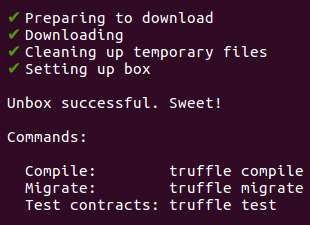

这将命令 Truffle 将你的目录初始化为智能合约开发项目。在此项目目录中开发智能合约时，你可以使用几个目录：


你通常将智能合约的源代码合并到合同文件夹中。 migrations 文件夹包含用于部署智能合约的文件，test 文件夹包含测试文件。你可以在 truffle-config.js 文件中配置智能合约部署设置。我们将使用以下代码创建第一个智能合约并将其命名为 donation.sol：

```sh
$ ls
contracts migrations test truffle-config.js
```

如果你是智能合约的新手，前面的示例中可能会有一些不熟悉的关键字。在本章中，我们不会讨论与 Solidity 相关的所有内容。相反，我们将只研究构建智能合约和学习智能合约概念所必需的 Solidity 功能。

但首先，让我们将这个用 Solidity 编写的智能合约编译为以太坊字节码和应用程序二进制接口 (abi)。为此，我们将在 Truffle 项目目录中运行以下命令：

```js
pragma solidity ^0.5.0;

contract Donation {
  address public donatur;
  address payable donatee;
  uint public money;
  string public useless_variable;

  constructor() public {
    donatee = msg.sender;
    useless_variable = "Donation string";
  }

  function change_useless_variable(string memory param) public {
    useless_variable = param;
  }

  function donate() public payable {
    donatur = msg.sender;
    money = msg.value;
  }

  function receive_donation() public {
    donatee.transfer(address(this).balance);
  }
}
```


编译结果可以在名为 Donation.json 的 build/contracts 文件夹中看到：

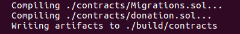

如果你打开该文件，你可以看到许多有趣的东西。这个 .json 文件有 1,530 行。该文件中的 json 对象有 14 个键。你现在只需要考虑两个键。第一个是接口（称为abi），第二个是可以在以太坊虚拟机上执行的二进制文件（称为字节码）。本节代码参考以下GitLab链接中的代码文件：https://gitlab.com/arjunaskykok/hands-on-blockchain-for-python-developers/blob/master/chapter_02/my_first_smart_contract/build/contracts /捐赠.json。

我们不能像编译 C 代码并直接执行二进制文件那样运行这个二进制文件。我们需要将此二进制文件放入以太坊虚拟机中。当我们开发去中心化应用程序时，我们需要接口本身来与智能合约进行交互。当你将智能合约部署到以太坊区块链时，你需要字节码。当你想与已经部署在以太坊区块链中的智能合约进行交互时，你需要 abi 接口。

## 将智能合约部署到以太坊区块链

这些是使用 Truffle 将智能合约部署到以太坊区块链的步骤：

1. 编写迁移脚本：要部署智能合约，你需要编写迁移文件。创建一个名为 migrations/2_deploy_donation.js 的新文件。然后，我们使用以下脚本填充此文件：
    ```python
    var Donation = artifacts.require("./Donation.sol");
    
    module.exports = function(deployer) {
      deployer.deploy(Donation);
    };
    ```
    至于migrations/1_initial_migration.js 和contracts/Migrations.sol 文件，我们暂时保留这些文件。 Truffle 需要这些文件才能部署智能合约。
2. 启动 Ganache（用于以太坊开发的区块链）：现在你需要启动 Ganache。假设你已获得适当的权限，请运行以下命令行来执行该文件：
    ```sh
    ./ganache-1.2.3-x86_64.AppImage
    ```
    至于migrations/1_initial_migration.js 和contracts/Migrations.sol 文件，我们暂时保留这些文件。 Truffle 需要这些文件才能部署智能合约。

    启动 Ganache（用于以太坊开发的区块链）：现在你需要启动 Ganache。假设你已获得适当的权限，请运行以下命令行来执行该文件：

    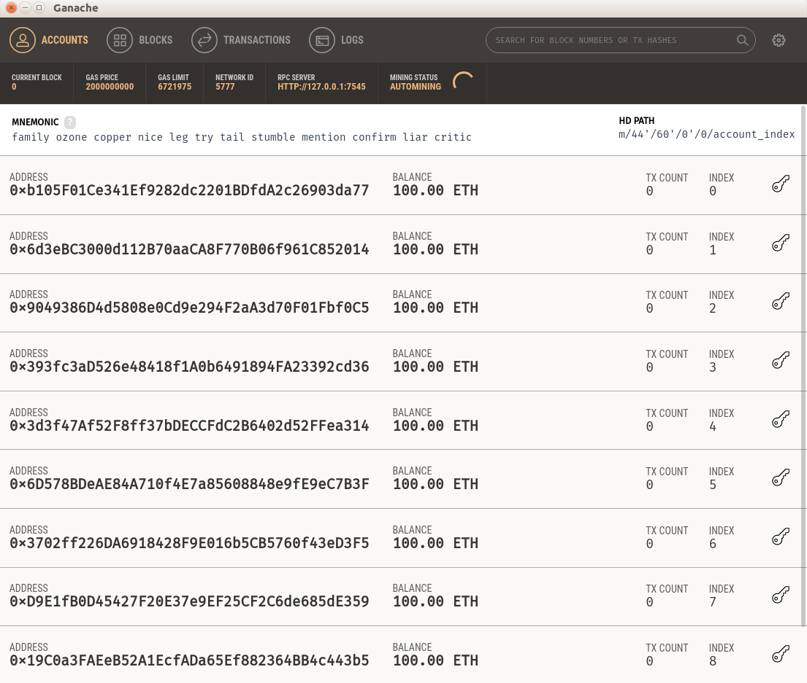

    你会从 Ganache 屏幕注意到的一件事是 RPC SERVER，它位于 http://127.0.0.1:7545。这是你的以太坊区块链位于 Truffle 项目目录中的位置。
3. 编辑 Truffle 配置文件：如果打开 truffle-config.js，去掉注释后的代码如下所示：
    ```js
    module.exports = {
        networks: {
        },
        mocha: {
        },
        compilers: {
            solc: {
            }
        }
    };
    ```
    擦除它并将以下代码行添加到 truffle-config.js 文件中：
    ```js
    module.exports = {
        networks: {
            "development": {
                network_id: 5777,
                host: "localhost",
                port: 7545
            },
        }
    };
    ```
    主机和端口取自 Ganache 屏幕中的 RPC 服务器，而 network_id 取自 Ganache 屏幕中的网络 ID。
4. 执行迁移脚本：要部署你的智能合约，你可以按如下方式执行：
    ```sh
    $ truffle migrate
    ```
    Truffle 框架会将你在 Donation.json 文件中定义的字节码发送到以太坊区块链或 Ganache。这将为你提供以下输出：
    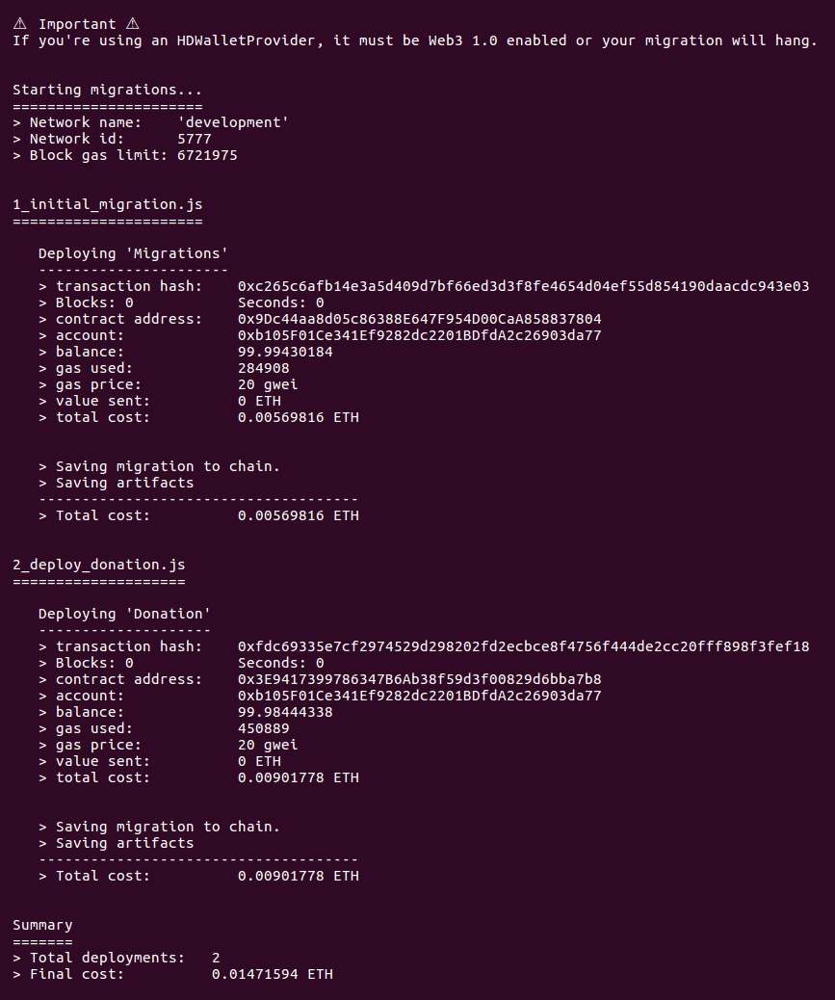

在 2_deploy_donation.js 部分，注意合同地址：后面的十六进制数字，即 0x3e9417399786347b6ab38f59d3f00829d6bba7b8。这是智能合约的地址，类似于 Web 应用程序的 URL。

如果网络是最新的。当你尝试部署智能合约时输出了，你可以删除 build/contracts 目录中的文件并使用 truffle migrate 命令运行此版本：

```sh
truffle migrate --reset
```

现在，我们来看看 Ganache 屏幕上的变化：

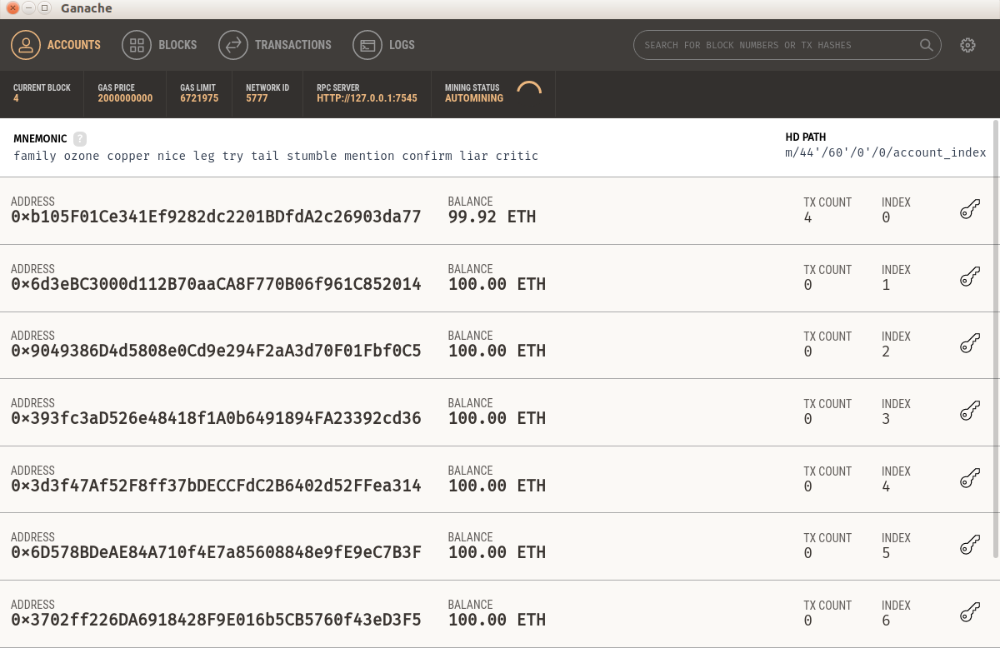

需要注意的最重要的事情是第一个帐户 0xb105F01Ce341Ef9282dc2201BDfdA2c26903da77 赔钱了。余额不再是 100 ETH；它是 99.98 ETH。那么 0.02 ETH 去哪儿了？需要激励矿工才能将你的智能合约写入以太坊区块链。请注意，当前区块不再是 0，而是 4。因此，成功将包含你的智能合约的区块放入区块链的矿工将支付 0.02 ETH 的费用。但是，当然，在这种情况下，没有矿工，因为我们使用了以太坊开发区块链 Ganache。 Ganache 只是通过将智能合约纳入区块链来模拟交易费用。

如果你点击交易标签，你将看到如下内容：

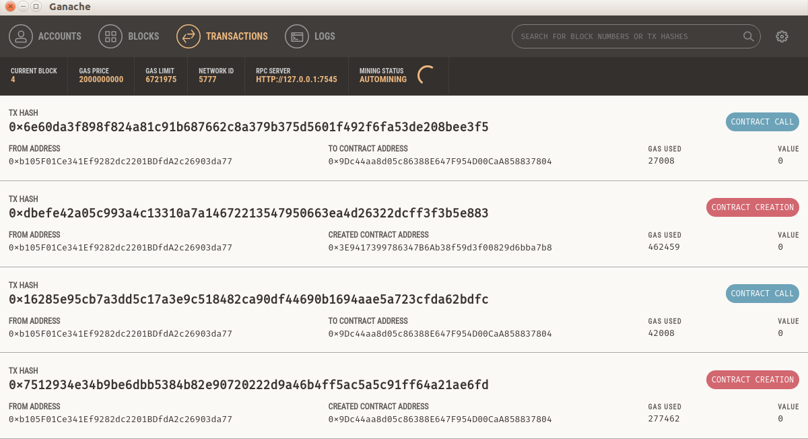

你现在已经创建了两个合同（捐赠和迁移）。一旦部署了智能合约，除非你应用某种方法将其关闭，否则它将永远存在于区块链中。如果你的智能合约中存在错误，则无法修补。你必须在不同的地址部署一个固定的智能合约。

## 与智能合约交互

要与驻留在以太坊区块链中的智能合约进行交互，请在 Truffle 项目目录中执行以下命令：

```sh
$ truffle console
```

然后，在 truffle 控制台提示符下，执行以下命令：

```sh
truffle(development)> Donation.deployed().then(function(instance) { return instance.useless_variable.call(); });
'Donation string'
```

如果你对此感到困惑，Truffle 控制台使用回调的概念，在其上异步执行访问智能合约对象。 Truffle 控制台中的这条语句会在回调执行之前立即返回。在回调函数中，你将接受智能合约实例作为实例参数。然后，我们可以从这个实例参数访问我们的 useless_variable 变量。然后，要检索该值，我们必须对该变量执行 call 方法。

Truffle 框架将使用 Donation.json 文件中定义的 abi 来了解你的智能合约中可用的接口。回想一下，你在智能合约中定义了 useless_variable，并在构造函数（或初始化）函数中将其设置为 Donation 字符串。以这种方式读取公共变量是免费的；它不需要任何以太币，因为它存储在区块链中。

让我提醒你如果变量存储在区块链中意味着什么。如果你将此智能合约合并到以太坊生产区块链中，则 useless_variable 变量将存储在每个以太坊节点中。在撰写本文时，大约有 10,000 个节点。这个数字不断变化，可以在这里看到：https://www.ethernodes.org。一个节点可以在一台计算机中，而一台计算机可以容纳几个节点。但是，很可能一台计算机只拥有一个节点，因为成为节点主机的要求非常高。如果你想与区块链交互，你需要一个节点（还有其他选项，例如使用 API 与其他人的节点交互）。出于这个原因，可以免费读取 useless_variable 变量，因为你只是从计算机上读取它。

如果你对这个免费概念感到困惑，让我们通过将 useless_variable 变量更改为其他内容来使其更清楚：

```sh
truffle(development)> Donation.deployed().then(function(instance) { return instance.change_useless_variable("sky is blue", {from: "0xb105F01Ce341Ef9282dc2201BDfdA2c26903da77" }); });
```

你会得到以下输出：

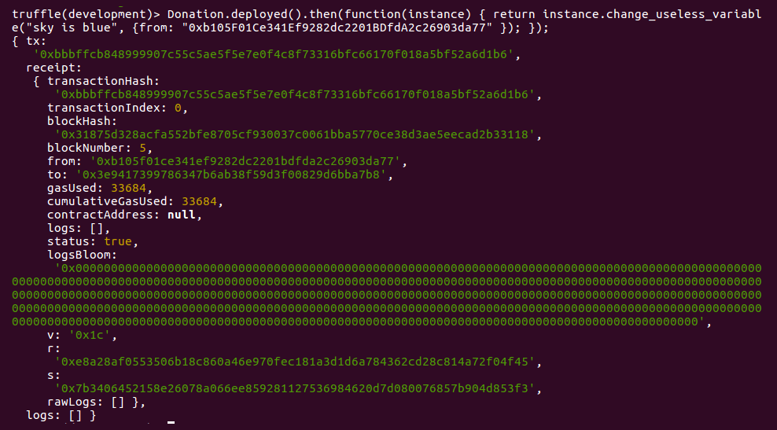

在单词 from 之后还有一个神秘的十六进制数，它是 0xb105F01Ce341Ef9282dc2201BDfdA2c26903da77。这是Ganache第一个账号的公开地址。你可以通过查看 Ganache 屏幕来确认。在这里，你读取 useless_variable 变量并使用不同的内容设置它的方式有所不同。更改变量的内容需要不同的语法，更重要的是，需要使用一个帐户。需要一个帐户，因为你在更改区块链中的变量时需要花费一些钱。当你在区块链的智能合约中改变这个 useless_variable 变量的值时，你基本上是在向以太坊生产区块链中的所有以太坊节点广播，它有大约 10,000 个节点可用于更新 useless_variable 的内容。我们正在使用 Ganache，这是一个以太坊开发区块链，但在生产环境中，你需要签署你的交易以使用私钥更改变量的内容。私钥的用途类似于帐户密码，但私钥不能更改，而你可以根据需要多次更新密码。如果你忘记了密码，你可以重置密码并单击确认电子邮件中的链接进行更新。在区块链中，这不是一种选择。

如果你现在检查 Ganache，你的余额将保持不变；只有块号从 4 增加到 5：


发生这种情况是因为所需的资金量非常小。执行最后一个命令后，你可以查看命令的输出以更改 useless_variable 的值。看用气田；这是你在智能合约中执行功能时所花费的费用。使用的gas量为33684，但这是在gwei中，而不是在ether中。 1 ether 等于 1,000,000,000 gwei，所以大约是 0.00003 ether。在这种情况下，gas 是自动计算的，但稍后你可以设置在以太坊区块链中执行任何函数时要分配多少 gas。如果你没有贡献多少以太，并且分配的气体量很小，那么你的执行很可能会被给予较低的优先级。确认交易需要更长的时间（意味着变量的值已更改）。如果网络流量很大，它可能会被矿工拒绝。

这种花钱改变程序状态的概念是新的。从区块链读取所有内容是免费的，因为所有数据都在你的计算机中（如果你有以太坊节点），但是在区块链中更改或添加某些内容需要花钱。发生这种情况是因为你更改了全球所有以太坊节点中的数据，这很昂贵！除了改变智能合约的状态外，在内存中运行的计算也需要资金。

### 将以太币发送到智能合约

现在，让我们向智能合约发送一些以太币。让我们为此使用第二个帐户。第二个账户想要使用智能合约捐赠 5 个以太币，如下所示：

```sh
truffle(development)> Donation.deployed().then(function(instance) { return instance.donate({ from: "0x6d3eBC3000d112B70aaCA8F770B06f961C852014", value: 5000000000000000000 }); });
```

你会得到以下输出：

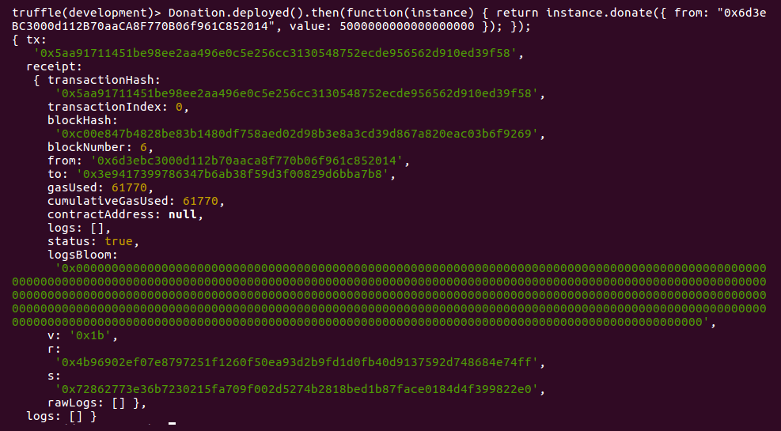

除了 from 字段，你还需要添加一个 value 字段。在此值字段中，你输入要发送给智能合约的金额。你可能想知道为什么这个数字有这么多零。当你在以太坊区块链中转账时，你必须使用最低的货币单位（类似于从美元转换为美分），称为wei。 1 ether 是 1,000,000,000,000,000,000 wei（18 个零）。你想发送 5 个以太币，使其成为 5,000,000,000,000,000,000。现在，如果你查看 Ganache 屏幕，你会注意到余额下降到 95 以太币。因此，智能合约中现在持有 5 个以太币，如下面的屏幕截图所示：

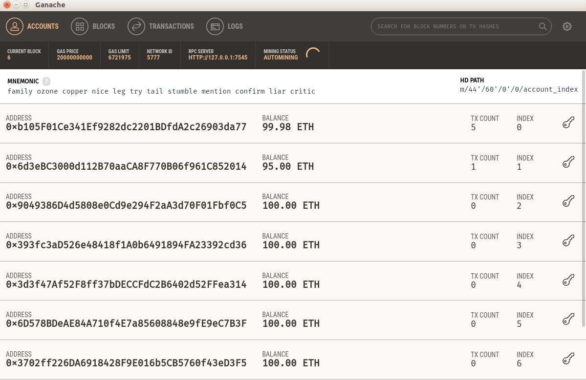

让我们使用第一个帐户提取：

```sh
truffle(development)> Donation.deployed().then(function(instance) { return instance.receive_donation({ from: "0xb105F01Ce341Ef9282dc2201BDfdA2c26903da77" }); });
```

你将获得以下输出：

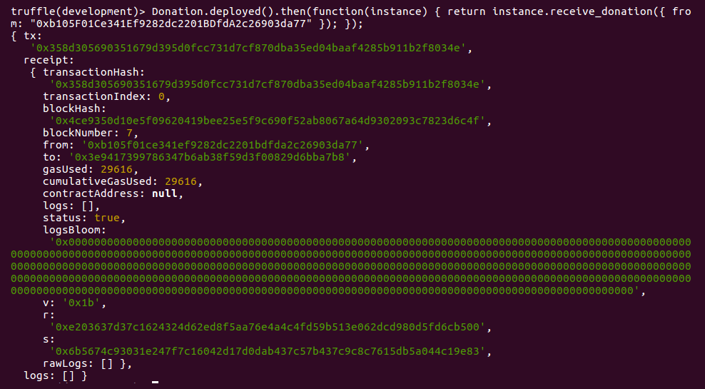

此执行具有与之前相同的语法，但减去值字段。现在看一下 Ganache 屏幕。第一个账户有 104 到 105 个以太币（例如 104.8 或 104.9 以太币）。它不是 105 以太，因为我们已经花费了一些钱来使用第一个帐户启动智能合约，并在执行智能合约中的某些功能时支付交易费用：

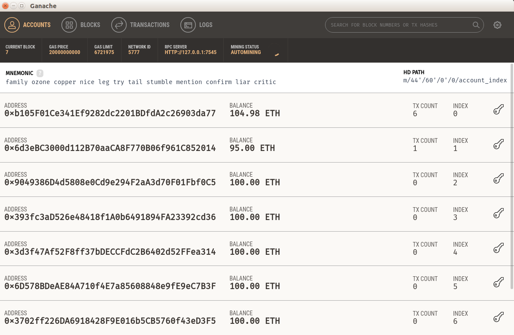

## 为什么是智能合约？

你现在已经看到了一个正在运行的智能合约。那么有什么大惊小怪的呢？智能合约可以做哪些传统程序（普通 Web 应用程序）做不到的事情？当涉及到在网络上的程序中更改变量的值时，我们可以使用远程过程调用。更常见的是，我们可以将变量存储在数据库中，人们可以从 Web 应用程序更改数据库中的值。汇款时，我们可以将 Web 应用程序与 Stripe 或 PayPal 集成，从而为我们提供汇款方式。或者，你可以在数据库中创建一个表来存储数字货币。以太坊中的以太基本上是数字货币。事实上，一个普通的 Web 应用程序可以做智能合约可以做的一切，但速度更快，成本更低。关键的区别在于区块链解决方案可以是去信任的。这意味着你可以信任程序本身，而不是操作员。
在普通的 Web 应用程序中，我们依赖于对 Web 应用程序的操作者（开发人员或系统管理员）的信任。我们希望他们诚实地开发和部署 Web 应用程序。作为 Web 应用程序的用户，我们无法确保 Web 应用程序执行它告诉每个人它正在尝试执行的操作。
假设我们有一个托管视频的 Web 应用程序（例如 YouTube 或 Vimeo）。如果用户单击“喜欢”按钮，Web 应用程序可以增加视频的“喜欢”数量。规则是用户只能喜欢一个视频一次。因此，你希望包含 400 个赞的视频有 400 个喜欢该视频的用户。如果我告诉你，在幕后，系统管理员可以人为地增加点赞数呢？这意味着在 400 个赞中，可能只有 300 个赞来自真正的用户。其他 100 个赞是由系统管理员夸大的。它不必像直接更新数据库中的表那样原始，例如，通过 UPDATE video_likes SET likes_amount = 400 WHERE video_id = 5;。增加喜欢数量的方法可以嵌入到系统中。
普通用户不会注意到这一点。 Web 应用程序背后的公司可以在 GitHub 上发布源代码。但是如何确保 Web 应用程序确实是从托管在 GitHub 上的源代码构建的呢？如果在部署 Web 应用程序后，系统管理员或开发人员修补系统怎么办？
有多种方法可以防止这种数字作弊。首先，我们可以介绍一位IT审计师。这些可能来自政府或非政府组织。他们会审计系统的源代码，更重要的是检查代码在生产系统中的作用。在这种情况下，你将信任从开发人员或系统管理员转移到第三方审计员。
作为一名 IT 顾问，我通过构建 Web 应用程序和移动应用程序谋生。我曾经遇到过一位想要制作数字报纸的潜在客户（沿着卫报或纽约时报的路线）。这位客户问我是否可以根据需要将任何文章移动到查看次数最多的文章部分。这里的动机是宣传特定的文章，即使这意味着系统会对用户最常查看的文章说谎。
Reddit 的首席执行官最近公开道歉，因为他被发现修改了网站上关于他的评论。在以下链接中提供了更多信息：https://techcrunch.com/2016/11/23/reddit-huffman-trump/。
即使是知名网站也玩数字作弊。例如，一些加密货币交换虚假交易量。在以下链接中提供了更多信息：https://medium.com/@sylvainartplayribes/chasing-fake-volume-a-crypto-plague-ea1a3c1e0b5e。
智能合约是另一种防止数字作弊的方法。智能合约的开发人员可以发布源代码并将智能合约部署到以太坊区块链中。人们可以验证发布的源代码和部署的智能合约是否是一回事。开发人员可以在智能合约中创建一种作弊方法，但这会被用户发现，因为他们可以从区块链中的智能合约字节码重构智能合约的源代码。开发人员无法修补已经部署的智能合约。
还有其他智能合约属性，例如自治和抗审查。 然而，这些属性都没有超过它的透明度。 或者，你必须拥有比所有 10,000 个节点一起工作的更大的权力，以保护以太坊系统的可信度。 为了简化数学计算，你需要购买 5,000 多台配备高端 GPU 的计算机。 假设你有那么多资源可以作弊。 当你在以太坊系统中作弊时，诚实的矿工会感到震惊，他们会在互联网上制造噪音。 所以如果你有办法在以太坊作弊，你就不能偷偷摸摸地做。 此外，如果你有办法获得 5,000 台配备高端 GPU 的计算机，你可以成为以太坊平台的矿工并获得可观的收入。 因此，在以太坊平台上很难作弊。

## 概括

在本章中，我们探索了如何安装 Solidity 开发工具：Node.js、Truffle 或 Ganache。 然后我们学习了如何编写智能合约并编译它。 之后，我们研究了将智能合约部署到以太坊区块链的概念，然后与使用 Truffle 控制台工具部署的智能合约进行交互。 我们了解了在智能合约中执行功能时将以太币发送到智能合约的概念和 gas 使用量。 在最后一步，我们熟悉了为什么智能概念如此有效，并有可能创建一个抗审查和透明且无法规避的程序。

在下一章中，我们将学习如何使用 Vyper 实现智能合约。

## 进一步阅读

- 以太坊黄皮书：https://ethereum.github.io/yellowpaper/paper.pdf
- 以太坊白皮书：https://github.com/ethereum/wiki/wiki/White-Paper