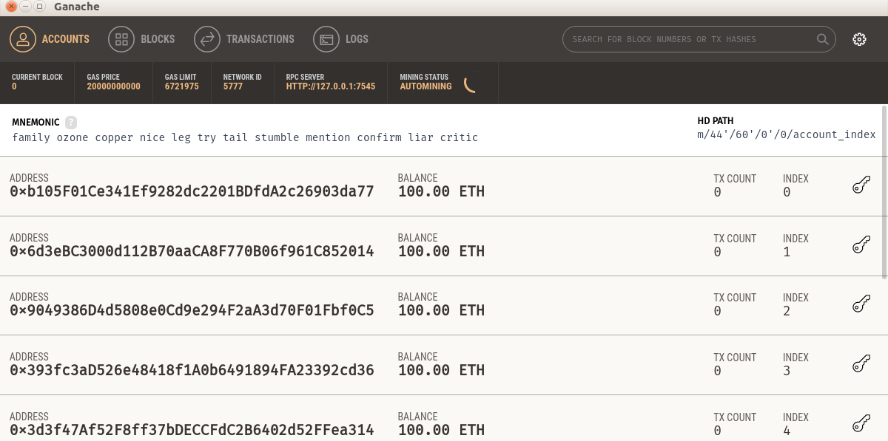

# 使用 Vyper 实现智能合约

许多正在学习如何编写智能合约的程序员将学习 Solidity 编程语言。 有大量的在线教程和书籍可以教你有关 Solidity 的知识。 当与 Truffle 框架结合时，Solidity 形成了开发智能合约的杀手级组合。 几乎所有存在于以太坊区块链上的智能合约都是用 Solidity 编程语言编写的。

在本章中，我们将探讨如何编写智能合约。 但是，我们不会为此使用 Solidity 编程语言。 相反，我们将使用 Vyper 编程语言。

本章将涵盖以下主题：

- Vyper 背后的动机
- 安装 Vyper
- 使用 Vyper 创建智能合约
- 将智能合约部署到 Ganache
- 深入理解 Vyper
- 与其他智能合约交互
- 以编程方式编译代码
- 其他技巧

## Vyper 背后的动机

编写智能合约不同于开发普通的 Web 应用程序。在开发普通的 Web 应用程序时，座右铭是快速行动并打破常规。开发 Web 应用程序的速度至关重要。如果应用程序中存在错误，你可以随时升级应用程序。或者，如果错误是灾难性的，你可以在引入修复之前在线修补它或使应用程序离线。有一个非常流行的词来描述开发普通 Web 应用程序的理想心态——敏捷。你需要灵活，以便随着需求的变化而更改软件。

然而，编写智能合约需要不同的心态。智能合约的应用范围可以从编写金融应用程序到将火箭发射到太空。一旦部署了智能合约，修复错误是非常困难的。你无法替换智能合约，因为一旦部署，它就会被部署。如果你编写一个函数来销毁智能合约，你可以销毁智能合约，但修复有缺陷的智能合约的唯一方法是部署一个新的智能合约，该智能合约可以修复新地址中的错误，然后将这种情况传达给所有相关方。但是你不能取代智能合约。

因此，理想的情况是部署在区块链上的智能合约没有错误，或者至少没有恶意错误。但是，在现实世界中发布的智能合约中仍然会出现错误。

那么，智能合约中会出现什么样的漏洞呢？第一种是会让你的钱消失的那种。假设你正在为首次代币发行 (ICO) 编写智能合约。 ICO 是通过出售你在以太坊区块链上创建的代币来积累资本。所以基本上，人们用以太币购买你的代币。你可以随意设置价格——例如，1 ETH = 100 YOURTOKEN。这意味着如果人们支付给你 1 个以太币，他们将获得你的 100 个代币。

你可以引入的第一个错误是人们可以向你的智能合约发送资金（以太币），但你无法提取它（你忘记实施提取方法或提取方法有问题）。这意味着你可以检查你的智能合约的余额，以太币余额很可能价值 100 万美元，但它会永远卡在那里，没有人能够认领它。

另一个错误可能是你忘记保护销毁智能合约的方法。在以太坊中，你会被激励从区块链中删除东西，因为存储很昂贵。因此，如果你部署智能合约，你将支付 gas 费，因为你的智能合约将被保留。你可以试验它，然后如果你对你的智能合约感到厌烦，你可以销毁它。为此，以太坊将向你的帐户返还一些 gas。这是为了阻止向以太坊区块链发送垃圾邮件。所以，回到我们的智能合约漏洞案例，假设你在你的智能合约中积累了价值 100 万美元的以太币，然后有人通过访问一个函数来销毁你的智能合约账户。在这种情况下，你的以太币余额也将被销毁。

最后一种漏洞是允许黑客窃取你的以太币余额并将其转移到他们的帐户中。这可能发生在许多不同的情况下。例如，你可能忘记在提现功能中设置正确的权限，或者提现功能中的权限太开放。

当然，所有这些bug都可以追溯到程序员的错。为了避免这些类型的错误，一种新的工作诞生了——智能合约审计员，他会审计你的智能合约以确保它没有错误。然而，Vitalik Buterin（以太坊的发明者）随后查看了该工具（在这种情况下是编程语言），并想知道是否可以通过改进工具本身来缓解这种情况。这种情况下的罪魁祸首是 Solidity 编程语言。 Vitalik 认为 Solidity 有一些强大的功能，但有可能产生错误。尽管 Solidity 的开发人员有一个提高 Solidity 安全性的计划，但 Vitalik 想要一些自由，以全新的视角进行试验。由此，Vyper 诞生了。

假设你创建了一个具有重要功能的父类。在当前类或子类中，你可以在不检查其定义的情况下使用此函数。也许父类是由你团队中的其他人编写的。程序员有时懒得检查其他文件中的函数定义；他们会在源代码文件中上下滚动以阅读代码，但程序员通常不会检查由继承功能启用的其他文件中的代码。

另一个可以真正使智能合约变得复杂和难以阅读的 Solidity 功能是修饰符，它就像一个初步功能。以下代码显示了如何在 Solidity 中使用修饰符：

```solidity
modifier onlyBy(address _account)
{
  require(msg.sender == _account, "Sender not authorized.");
  _;
}
function withdraw() public onlyBy(owner)
{
  //withdraw money;
}
```

如果我们想使用 withdraw() 方法，智能合约将首先执行 onlyBy() 修饰符方法。 require 短语用于确保 msg.sender（调用此方法）与作为参数发送的帐户变量相同。这个例子很简单。你可以在眨眼间阅读所有代码。然而，考虑到这些函数被多行分隔，甚至在另一个文件中定义的事实。程序员倾向于忽略 onlyBy() 方法的定义。

函数重载是编程语言中最强大的特性之一。这是一个特性，可以让你发送不同的参数来获得不同的功能，如下代码所示：

```js
function flexible_function(uint _in) public {
    other_balance = _in;
}

function flexible_function(uint _in, uint _in2) public {
    other_balance = _in + _in2;
}

function flexible_function(uint _in, uint _in2, uint _in3) public {
    other_balance = _in + _in2 - _in3;
}
```

但是，函数重载功能可能会误导程序员，导致他们以不同的意图执行函数。程序员可能只记得 flexible_function 函数执行此操作，但可以无辜地执行与 flexible_function 不同类型的函数。

因此，一些聪明人认为，虽然所有这些功能都可以创建一个非常复杂的程序，但这些功能应该仅限于开发智能合约。也许他们从那些在航天器上编写程序的人那里得到了这个想法，那里有关于禁止使用 C++ 的哪些特性的规则。或者，他们可能受到创建 Java 以取代 C++ 的原因的启发。在 Java 中，无法直接操作内存特性。 Bjarne Stroustoup（C++ 的创造者）说 C++ 是如此强大，以至于人们可以用 C++ 来打自己的脚。

这些聪明人决定创建一种比 Solidity 更简单的新编程语言。 Python 是他们的主要灵感来源，因为这种编程语言的语法源自 Python。这种编程语言称为 Vyper。在 Vyper 中，删除了继承、函数重载、修饰符和许多其他功能。 Vyper 编程语言的创建者认为，删除这些功能可以使智能合约的开发更容易。重要的是，它还使代码更易于阅读。代码读得比写得多。考虑到所有这些因素，他们希望程序员在使用 Vyper 编程语言创建智能合约时可以减少错误。

## 安装 Vyper

默认情况下，Ubuntu Xenial 安装了 Python 3.5。 Vyper 需要 Python 3.6 软件，所以如果你想使用 Ubuntu Xenial，你需要先安装 Python 3.6。较新版本的 Ubuntu，例如 Bionic Beaver，已经安装了 Python 3.6。

因此，如果你没有安装 Python 3.6 软件，则必须先使用以下命令安装它：

```sh
$ sudo apt-get install build-essential
$ sudo add-apt-repository ppa:deadsnakes/ppa
$ sudo apt-get update 
$ sudo apt-get install python3.6 python3.6-dev
```

Vyper 不仅需要 Python 3.6；你还需要安装开发文件 python3.6-dev。然后你可以通过以下步骤为 Python 3.6 创建虚拟环境：

1. 首先，你必须使用以下代码安装 virtualenv 工具：
    ```sh
    $ sudo apt-get install virtualenv
    ```
2. 然后，使用以下代码为 Python 3.6 创建虚拟环境：
    ```sh
    $ virtualenv -p python3.6 vyper-venv
    ```
3. 现在，执行虚拟环境脚本如下：
    ```sh
    $ source vyper-venv/bin/activate
    ```
4. 接下来，使用 pip 安装 Vyper，如下所示：
    ```sh
    (vyper-venv) $ pip install vyper
    ```
5. 如果这里没有任何错误，你就可以开始了。你可以按如下方式测试 Vyper 编译器：
    ```sh
    (vyper-venv) $ vyper --version
    0.1.0b6
    ```

然后你就可以开始下一步的旅程了。

## 使用 Vyper 创建智能合约

现在让我们用 Vyper 创建一个智能合约。首先，我们将创建一个扩展名为 .vy 的文件并将其命名为 hello.vy，如下所示：

```python
name: public(bytes[24])

@public
def __init__():
    self.name = "Satoshi Nakamoto"

@public
def change_name(new_name: bytes[24]):
    self.name = new_name

@public
def say_hello() -> bytes[32]:
    return concat("Hello, ", self.name)
```

如果你有 Solidity 或 Python 背景，你会注意到一个特点：在用 Vyper 编程编写的智能合约中没有类（如 Python 编程语言中）并且没有合约（如 Solidity 编程语言中）语。但是，有一个初始化函数。初始化函数的名称与 Python 编程语言中的名称相同，即 __init__。

使用 Python 时，你可以在一个文件中创建任意数量的类。在 Vyper 中，规则是每个文件一个智能合约。这里也没有课程或合同；文件本身是一个类。

这是你编译这个 vyper 文件的方式：

```sh
(vyper-venv) $ vyper hello.vy
```

从中，你将获得以下输出：


这是智能合约的字节码。请记住，要部署智能合约，你需要字节码，但要访问智能合约，你需要 abi。那么你如何获得abi？你可以通过运行以下命令来执行此操作：

```sh
(vyper-venv) $ vyper -f json hello.vy
```

从中，你将获得以下输出：


如果你想在一个编译过程中同时获得 abi 和字节码，你可以在编译过程中组合这两个标志，如下所示：

```sh
(vyper-venv) $ vyper -f json,bytecode hello.vy
```

这将为你提供以下输出：


## 将智能合约部署到 Ganache

那么如何将这个智能合约部署到以太坊区块链上呢？有几种方法可以做到这一点，但让我们采用一种熟悉的方式来使用 Truffle：

1. 创建一个目录并使用 truffle init 对其进行初始化，如下所示：
    ```sh
    $ mkdir hello_project
    $ cd hello_project
    $ truffle init
    ```
2. 就像你在上一章中所做的那样，将 truffle-config.js 设置为如下：
    ```js
    module.exports = {
        networks: {
            "development": {
                network_id: 5777,
                host: "localhost",
                port: 7545
            },
        }
    };
    ```
3. 创建一个build目录，如下：
    ```sh
    $ mkdir -p build/contracts
    $ cd build/contracts
    ```
4. 然后在那里创建一个 Hello.json 文件，如下：
    ```json
    {
        "abi":
        "bytecode":
    }
    ```
5. 然后用编译过程输出的 abi 或 json 填充 abi 字段，并用编译过程输出的字节码填充字节码字段。你需要用双引号引用字节码值。不要忘记在 abi 字段和字节码字段之间放置逗号。这将为你提供类似于以下内容的内容：
    ```json
    {
      "abi": [{"name": "__init__", "outputs": [], "inputs": [], "constant": false, "payable": false, "type": "constructor"}, {"name": "change_name", "outputs": [], "inputs": [{"type": "bytes", "name": "new_name"}], "constant": false, "payable": false, "type": "function", "gas": 70954}, {"name": "say_hello", "outputs": [{"type": "bytes", "name": "out"}], "inputs": [], "constant": false, "payable": false, "type": "function", "gas": 8020}, {"name": "name", "outputs": [{"type": "bytes", "name": "out"}], "inputs": [], "constant": true, "payable": false, "type": "function", "gas": 5112}],
      "bytecode": "0x600035601c52740100000000000000000000000000000000000000006020526f7fffffffffffffffffffffffffffffff6040527fffffffffffffffffffffffffffffffff8000000000000000000000000000000060605274012a05f1fffffffffffffffff...
    ...
    1600101808352811415610319575b50506020610160526040610180510160206001820306601f8201039050610160f3005b60006000fd5b61012861049703610128600039610128610497036000f3"
    }
    ```
6. 然后你可以通过在 migrations/2_deploy_hello.js 中创建一个新文件来创建一个迁移文件来部署这个智能合约，如下所示：
    ```js
    var Hello = artifacts.require("Hello");
    module.exports = function(deployer) {
      deployer.deploy(Hello);
    };
    ```
    一切就绪后，启动 Ganache！
7. 然后，在 hello_project 目录中，你可以运行迁移过程，如下所示：
    ```sh
    truffle migrate
    ```

你将看到类似于以下内容的内容：


你使用 Vyper 编写的智能合约已部署到 Ganache。你的智能合约地址如下：
```py
0x3E9417399786347B6Ab38f59d3f00829d6bba7b8
```

### 与智能合约交互

正如我们之前所做的那样，你可以使用 Truffle 控制台与你的智能合约进行交互，如下所示：

```sh
$ truffle console
```

你的智能合约总是被命名为合约。我们可以使用以下语句访问智能合约：

```sh
truffle(development)> Contract.at("0x3E9417399786347B6Ab38f59d3f00829d6bba7b8")
```

你将得到一个很长的输出，你可以在其中看到 abi、字节码等，如下面的屏幕截图所示：


让我们使用以下语句查看智能合约的 name 变量的值：你可能会注意到加密输出看起来不像中本聪。然而，它实际上是中本聪，只是用十六进制写的。让我们从神秘的输出中扔掉 0x；这只是该字符串采用十六进制形式的指示符。你现在拥有 5361746f736869204e616b616d6f746f 字符串。取前两个数字，即 53，并将它们转换为十进制数。在 Python 中，你可以按如下方式执行此操作：

```sh
truffle(development)> Contract.at("0x3E9417399786347B6Ab38f59d3f00829d6bba7b8").then(function(instance) { return instance.name.call(); });
'0x5361746f736869204e616b616d6f746f'
```

你可能会注意到神秘的输出看起来不像中本聪。 然而，它实际上是中本聪，只是用十六进制写的。 让我们从神秘的输出中扔掉 0x； 这只是该字符串采用十六进制形式的指示符。 你现在拥有 5361746f736869204e616b616d6f746f 字符串。 取前两个数字，即 53，并将它们转换为十进制数。 在 Python 中，你可以按如下方式执行此操作：

```python
>>> int(0x53)
83
```

那么，十进制数是 83。你还记得 ASCII 表吗？这是一个保存十进制数和字符之间关系的数据表。因此，十进制数 65 代表字符 A（大写 A），十进制数 66 代表字符 B（大写 B）。

那么十进制数83的字符是什么？可以使用Python查找如下：

```python
>>> chr(83)
'S'
```

如果你对所有其他十六进制字符执行此操作，其中每个十六进制字符需要两个数字字符，则会拼出中本聪。

让我们使用以下代码在这个智能合约中执行另一个方法：

```sh
truffle(development)> Contract.at("0x3E9417399786347B6Ab38f59d3f00829d6bba7b8").then(function(instance) { return instance.say_hello.call(); })
'0x48656c6c6f2c205361746f736869204e616b616d6f746f'
```

那个神秘的输出只是你好，中本聪。

让我们更改名称如下：

```sh
truffle(development)> Contract.at("0x3E9417399786347B6Ab38f59d3f00829d6bba7b8").then(function(instance) { return instance.change_name(web3.utils.fromAscii("Vitalik Buterin"), { from: "0x6d3eBC3000d112B70aaCA8F770B06f961C852014" }); });
```


你将获得以下输出：


from 字段中的值取自 Ganache 中的一个帐户。你可以查看 Ganache 窗口并选择你喜欢的任何帐户。

我们不能直接向 change_name 方法发送字符串；我们必须首先使用 web3.utils.fromAscii 方法将其转换为十六进制字符串。

现在改名了吗？让我们来了解一下。运行以下命令：

```sh
truffle(development)> Contract.at("0x3E9417399786347B6Ab38f59d3f00829d6bba7b8").then(function(instance) { return instance.name.call(); });
'0x566974616c696b204275746572696e'
```

是的，名字变了。如果你将该十六进制字符串转换为 ASCII 字符串，你将获得 Vitalik Buterin。

## 深入了解 Vyper

让我们来看看我们的智能合约：

```python
name: public(bytes[24])

@public
def __init__():
    self.name = "Satoshi Nakamoto"

@public
def change_name(new_name: bytes[24]):
    self.name = new_name

@public
def say_hello() -> bytes[32]:
    return concat("Hello, ", self.name)
```

看一下第一行：

```python
name: public(bytes[24])
```

字节数组基本上是一个字符串。名为 name 的变量具有字节或字符串数组的类型。它的可见性是公开的。如果要将其设置为私有，则只需省略 public 关键字，如下所示：

```python
name: bytes[24]
```

现在，看看下一行：

```python
@public
def __init__():
    self.name = “Satoshi Nakamoto”
```

如果你有 Python 背景，那么你会认出 Python 装饰器函数。 Vyper 中有四个：

- @public 意味着你可以以用户身份执行此方法（就像你在前一章中在 Truffle 控制台中所做的那样）。
- @private 意味着只有同一智能合约中的其他方法才能访问此方法。你不能以用户身份调用该方法（在 Truffle 控制台中）。
- @payable 意味着你可以向此方法发送一些以太币。
- @const 指示此方法不应修改智能合约的状态。这意味着执行此方法不会花费以太币。这就像读取公共变量的值。

回到 __init__() 方法，你可以像这样向这个方法传递一个参数：

```python
i: public(uint256)

@public
def __init__(int_param: uint256):
    self.i = int_param
```

部署智能合约时不要忘记发送参数。在我们的例子中，我们在 Truffle 软件中使用迁移，因此将你的迁移文件 2_deploy_hello.js 修改为如下：

```js
var Hello = artifacts.require("Hello");
module.exports = function(deployer) {
    deployer.deploy(Hello, 4);
};
```


让我们继续阅读智能合约的以下几行以了解公共方法：

```python
@public
def change_name(new_name: bytes[24]):
    self.name = new_name
```

此方法修改智能合约的状态，即名称变量。这会产生气体。

让我们继续阅读智能合约的下一行，了解如何在公共方法中返回一个值：

```python
@public
def say_hello() -> bytes[32]:
    return concat("Hello, ", self.name)
```

concat 是组合字符串的内置函数。有关内置函数的完整列表，请参阅 https://vyper.readthedocs.io/en/latest/built-in-functions.html。

你必须小心右箭头 (→) 指示的方法的返回值。你可以将其设置为长度不足的字节数组。例如，看看下面的代码：

```python
@public
def say_hello() -> bytes[28]:
    return concat("Hello, ", self.name)
```

在这种情况下，它会编译失败，尽管“你好，中本聪”肯定少于 28 个字符。该字符串的长度为 23 个字符；但是，你必须记住 self.name 被定义为 bytes[24]，并且 Hello, 的长度为 7 个字符。因为 24 + 7 是 31 个字符，所以必须将其设置为更大的数组。

由于这个方法不会改变这个智能合约的状态，你可以在这个方法之上添加@const，如下：

```python
@public
@const
def say_hello() -> bytes[32]:
    return concat("Hello, ", self.name)
```

### 数据类型

让我们创建一个更复杂的智能合约并将其命名为 donation.vy，如下所示。你可以参考以下 GitLab 链接获取完整代码：https://gitlab.com/arjunaskykok/hands-on-blockchain-for-python-developers/blob/master/chapter_03/donation.vy：

```python
struct DonaturDetail:
    sum: uint256(wei)
    name: bytes[100]
    time: timestamp

donatur_details: public(map(address, DonaturDetail))

...
...

@public
def withdraw_donation():
    assert msg.sender == self.donatee

    send(self.donatee, self.balance)
```

像以前一样编译和部署智能合约。如果你重用项目目录，请不要忘记删除 build/contracts 目录中的所有文件并重新启动 Ganache。

看看以下几行：

```python
struct DonaturDetail:
    sum: uint256(wei)
    name: bytes[100]
    time: timestamp
```

让我们一一讨论 Vyper 数据类型：

- 结构：第一个称为结构。 Vyper 中的结构体就像另一种编程语言中的结构体；它是不同数据类型的容器。你可以按如下方式访问其成员：
    ```python
    DonaturDetail.name = "marie curie"
    ```
- Wei：我们要学习的第二种数据类型是 uint256(wei)。这是指可以持有的特定数量的以太币。如你所知，1 个以太币等于 1,000,000,000,000,000,000 wei（18 个零）。要保持如此大的数量，需要特定的数据类型。
- 时间戳：第三种数据类型是时间戳数据类型。这旨在保存时间值。
- 地址：第四个是地址数据类型。这旨在保存地址值（例如 0xdCad3a6d3569DF655070DEd06cb7A1b2Ccd1D3AF）。这可能是帐户或智能合约的地址。如果你想知道地址数据类型是什么样的，你可以查看以下屏幕截图中的 Ganache。帐户地址是地址数据类型的一个示例。你可以使用以下数据类型将 ethers 发送到变量：

- 映射：第五个是映射数据类型。这就像一本字典。一个简单的映射如下所示：
    ```python
    simple_map: map(address, uint256)
    ```
    这里，键是地址，值是 uint256。以下是向该地图填充值的方法：
    ```python
    self.simple_map[0x9049386D4d5808e0Cd9e294F2aA3d70F01Fbf0C5] = 10
    ```
    如果你习惯于 Python 中的字典数据类型，则此地图数据类型有一个转折点：你无法迭代此地图。因此，不要期望在 Vyper 中迭代具有映射数据类型的变量，就像在 Python 中使用字典数据类型对变量所做的那样。你可以通过查看以下代码来了解其工作原理：
    ```python
    for key in self.simple_map:
        // do something with self.simple_map[key]
    ```
    以太坊虚拟机 (EVM) 不会跟踪具有映射数据类型的变量的所有键。在 Python 中，你可以从具有字典数据类型的变量中获取所有键，如以下代码所示：
    ```python
    self.simple_map.keys()
    ```
    但是你不能在 Vyper 中做到这一点。
    如果访问不存在的键，它将返回值数据类型的默认值。在我们的例子中，如果我们做这样的事情，我们会得到 0，如下面的代码所示：
    ```python
    self.simple_map[0x1111111111111111111111111111111111111111] => 0
    ```
    如果你从未设置 0x111111111111111111111111111111111111111 键的值或将其设置为 0 值，则没有区别。如果你想跟踪键，则需要将它们保存在单独的数组中。映射数据类型就像Python中的默认字典，如下代码所示：
    ```python
    >>> from collections import defaultdict
    >>> d = defaultdict(lambda: 0, {})
    >>> d['a']
    0
    >>> d['a'] = 0
    >>> d['a']
    0
    ```
    所以，回到我们定义的第二个变量，让我们看看下面的代码：
    ```python
    donatur_details: public(map(address, DonaturDetail))
    ```
    此代码显示了地址到包含 wei、字符串和时间戳数据类型的结构的映射。我们想用这种数据类型记录捐赠者的姓名、捐赠金额和捐赠时间。
- Array：第五种数据类型是数组数据类型，它没有无限大小。数组的大小必须在开始时设置。
    看看这些行：
    ```python
    donaturs: public(address[10])
    ```
    这是一个大小为 10 的地址数组。
    让我们看看以下几行，了解如何在智能合约中保留所有者的帐户：
    ```python
    donatee: public(address)
    ```
- 整数：第六种数据类型是整数。它类似于 uint256 或 int128。请注意，uint256 和 uint256(wei) 是不同的。 uint256 和 int128 之间的区别在于 int128 数据类型可以保存零、正数和负数。 uint256 数据类型只能容纳零和正数，但其上限高于 int128。
    以下代码将保存启动此智能合约的人的地址：
    ```python
    index: int128
    ```
    这旨在跟踪有多少捐赠者捐赠了。请注意，它没有公共修饰符。这意味着你无法从 Truffle 控制台访问该变量。
    我们来看看 __init__() 方法：
    ```python
    @public
    def __init__():
        self.donatee = msg.sender
    ```
    在每个方法中，都有特殊的对象。其中之一是 msg。你可以通过 msg.sender 访问访问此方法的帐户。你还可以使用 msg.value 找到以太币的数量（以 wei 为单位）。在下面的代码中，我们要保存这个智能合约的启动器地址：
    ```python
    @payable
    @public
    def donate(name: bytes[100]):
        assert msg.value >= as_wei_value(1, "ether")
        assert self.index < 10
    
        self.donatur_details[msg.sender] = DonaturDetail({
                                             sum: msg.value,
                                             name: name,
                                             time: block.timestamp
                                           })
    
        self.donaturs[self.index] = msg.sender
        self.index += 1
    ```
    这里，@payable 表示该方法接受以太币支付。 断言短语就像 Python 编程语言中的断言。 如果条件为假，则该方法的执行将被中止。 在断言行之后，我们只需将带有 msg.sender 键的 self.donatur_details 映射设置为 DonaturDetail 结构。 在结构体内部，你使用 block.timestamp 设置时间属性，它表示当前时间。 as_wei_value 短语是一个内置函数。 由于我们必须在这个智能合约中使用 wei 单元来处理以太币支付，因此使用这个内置函数是一个好主意。 如果不是，则必须使用很多零，如下所示：
    ```python
    assert msg.value >= 1000000000000000000
    ```

### 提取醚

智能合约的最后几行将是一个向捐赠者账户提取捐赠的方法，如下代码所示：

```python
@public
def withdraw_donation():
    assert msg.sender == self.donatee

    send(self.donatee, self.balance)
```

在这里，self.balance 代表在这个智能合约中累积的所有以太币。发送短语是一个内置函数，用于将钱转给第一个参数，在本例中为捐赠者。

那么让我们在 Truffle 控制台中测试这个智能合约。确保将方法中的地址更改为智能合约的地址。你可以使用 truffle migrate 命令获取它，如下所示：

```python
truffle(development)> Contract.at("0x3E9417399786347B6Ab38f59d3f00829d6bba7b8").then(function(instance) { return instance.donatee.call(); });
'0xb105f01ce341ef9282dc2201bdfda2c26903da77'
```

这是 Ganache 中的第一个帐户，如下图所示：



让我们从 Ganache 的第二个账户捐赠 2 个以太币，如下：

```python
truffle(development)> Contract.at("0x3E9417399786347B6Ab38f59d3f00829d6bba7b8").then(function(instance) { return instance.donate(web3.utils.fromAscii("lionel messi"), {from: "0x6d3eBC3000d112B70aaCA8F770B06f961C852014", value: 2000000000000000000}); });
```

现在从 Ganache 的第三个账户捐赠 3.5 ether，如下：

```python
truffle(development)> Contract.at("0x3E9417399786347B6Ab38f59d3f00829d6bba7b8").then(function(instance) { return instance.donate(web3.utils.fromAscii("taylor swift"), {from: "0x9049386D4d5808e0Cd9e294F2aA3d70F01Fbf0C5", value: 3500000000000000000}); });
```

现在使用以下代码查看捐赠者的捐赠：

```python
truffle(development)> Contract.at("0x3E9417399786347B6Ab38f59d3f00829d6bba7b8").then(function(instance) { return instance.donatur_details__sum.call("0x9049386D4d5808e0Cd9e294F2aA3d70F01Fbf0C5"); });
<BN: 30927f74c9de0000>
```

访问结构属性的方式是在 donatur_details 结构后使用两个下划线。你将地图的键放在调用函数中。如果你想知道 <BN: 30927f74c9de0000> 中的 30927f74c9de0000 是什么意思，那不是内存的位置——它是一个十六进制格式的数字。由于数字非常大（BN是big number的缩写），EVM不得不以16进制格式显示数字，如下：

```python
truffle(development)> web3.utils.toBN(15);
<BN: f>
truffle(development)> web3.utils.toBN(9);
<BN: 9>
truffle(development)> web3.utils.toBN(100);
<BN: 64>
truffle(development)> web3.utils.toBN(3500000000000000000);
<BN: 30927f74c9de0000>
```

如果你看Ganache，第二个和第三个账户都亏了一些钱，如下图所示：


因此，让我们使用以下代码撤回捐赠：

```python
truffle(development)> Contract.at("0x3E9417399786347B6Ab38f59d3f00829d6bba7b8").then(function(instance) { return instance.withdraw_donation({from: "0xb105F01Ce341Ef9282dc2201BDfdA2c26903da77"}); });
```

看看你的甘纳许。就我而言，第一个帐户有 105.48 ETH，如下面的屏幕截图所示：


### 其他数据类型

Vyper还有其他数据类型没有在捐赠智能合约中使用，如下表所示：

- bool：这种数据类型就像一个普通的布尔值。它保存真值或假值，如以下代码所示：
    ```python
    bull_or_bear: bool = True
    ```
- 十进制：此数据类型类似于Python中的float或double，如下代码所示：
    ```python
    half_of_my_heart: decimal = 0.5
    ```
- bytes32：此数据类型类似于 bytes32，具有特殊性。如果值的长度小于 32 字节，则将用零字节填充。因此，如果你将 messi 值（5 个字符/字节）设置为 bytes32 数据类型变量（如下面的代码所示），它将变成 messi\x00\x00\x00\x00\x00\x00\x00\x00\ x00\x00\x00\x00\x00\x00\x00\x00\x00\x00\x00\x00\x00\x00\x00\x00\x00\x00\x00：
    ```python
    goat: bytes32 = convert('messi', bytes32)
    ```
- 常量：此数据类型在声明后不能更改：
    ```python
    GOAT: constant(bytes[6]) = 'messi'
    ```

与 C++ 编程语言中未初始化的变量可能具有垃圾值不同，Vyper 编程语言中的所有未初始化变量都有默认值。默认整数数据类型值为 0。默认布尔数据类型值为 false。

### 有用的内置函数

你已经使用了内置函数，例如 send、assert、as_wei_value、concat 和 convert。 但是，还有其他有用的功能，例如：

- slice：slice 短语是字节数据类型。 它用于从字符串中获取子字符串等任务，如以下代码所示：
    ```python
    first_name: bytes[10] = slice(name, start=0, len=10)
    ```
- len：该函数用于获取值的长度，如下代码所示：
    ```python
    length_of_name: int128 = len(name)
    ```
- selfdestruct：该函数用于销毁智能合约，如下代码所示。 参数是该智能合约将其以太币发送到的地址：
    ```python
    selfdestruct(self.donatee)
    ```
- ceil：该函数用于将整数四舍五入到上限，如下代码所示：
    ```python
    round_heart: int128 = ceil(half_of_my_heart)
    ```
- floor：该函数用于将整数四舍五入到下限，如下代码所示：
    ```python
    round_heart: int128 = floor(half_of_my_heart)
    ```
- sha3：这是一个内置的哈希函数，如下代码所示：
    ```python
    secret_hash: bytes32 = sha3('messi')

### 事件

Vyper 支持事件。 你可以在你的方法中向该事件的任何订阅者广播一个事件。 例如，当人们使用智能合约捐赠以太币时，你可以广播捐赠事件。 要声明事件，你可以使用以下语句：

```python
Donate: event({_from: indexed(address),  _value: uint256(wei)})
```

然后，在我们的 donate 方法中，你可以在捐赠交易发生后广播该事件，如下代码所示：

```python
@public
def donate(name: bytes[100]):
    log.Donate(msg.sender, msg.value)
```

我们将在后面的章节中更多地讨论事件。

## 与其他智能合约交互

你知道你的智能合约不必孤单吗？你的智能合约可以与区块链上的其他智能合约进行交互。

地址数据类型不仅用于普通账户，还可以用于智能合约账户。因此，智能合约可以通过捐赠智能合约向我们的捐赠者捐赠以太币！

重启你的甘纳许；我们将重新开始我们的区块链。还记得你的 hello.vy Vyper 文件吗？我们想使用自定义名称部署我们的 Hello 智能合约。

我们的迁移文件，migrations/2_deploy_hello.js，还是一样的，如下代码所示：

```python
var Hello = artifacts.require("Hello");
module.exports = function(deployer) {
  deployer.deploy(Hello);
};
```

再次编译 hello.vy 文件以获取接口和字节码。打开我们的合约 JSON 文件，即 build/contracts/Hello.json 文件。清除所有内容并将其替换为以下代码：

```json
{
  "contractName": "Hello",
  "abi": <your Hello smart contract's interface>,
  "bytecode": "<your Hello smart contract's bytecode>"
}
```

你必须为你的智能合约命名，因为这一次，你将部署两个智能合约。如果你没有为你的智能合约命名，它将有一个默认名称，Contract。如果你只想部署一个智能合约，这不是问题。

然后，对于你的donation.vy，对其进行编辑，并将以下代码行（以粗体突出显示）添加到代码文件中（请参阅以下 GitLab 链接中的代码文件，以获取 https 上的donation.vy 的完整代码文件： //gitlab.com/arjunaskykok/hands-on-blockchain-for-python-developers/blob/master/chapter_03/donation.vy)：

```python
struct DonaturDetail:
    sum: uint256(wei)
    name: bytes[100]
    time: timestamp

contract Hello():
    def say_hello() -> bytes[32]: constant

donatur_details: public(map(address, DonaturDetail))

...
...

@public
def withdraw_donation():
    assert msg.sender == self.donatee

    send(self.donatee, self.balance)

@public
@constant
def donation_smart_contract_call_hello_smart_contract_method(smart_contract_address: address) -> bytes[32]:
    return Hello(smart_contract_address).say_hello()
```

请注意以粗体显示的更改。这些更改是你声明要与之交互的智能合约的接口的方式；你声明了合约对象和你想与之交互的方法。你不需要知道 say_hello 方法的实现，只需要知道接口（即它期望的参数和返回值）。

然后调用外部智能合约的donation_smart_contract_call_hello_smart_contract_method 方法。将地址作为合约对象的参数发送，并像往常一样调用该方法。如果你已经知道要与之交互的智能合约的地址，则可以对其进行硬编码。但是我使用了一个参数，因为我还不知道 Hello 智能合约的地址。

使用以下代码，为我们升级后的 Donation 智能合约创建另一个迁移文件，migrations/3_deploy_donation.js：

```js
var Donation = artifacts.require("Donation");
module.exports = function(deployer) {
  deployer.deploy(Donation);
};
```

编译你的donation.vy，获取智能合约的接口和字节码。

然后，使用以下代码，为我们的 Donation 智能合约创建另一个合约 JSON 文件 build/contracts/Donation.json：

```json
{
  "contractName": "Donation",
  "abi": <your Donation smart contract's interface>,
  "bytecode": "<your Donation smart contract's bytecode>"
}
```

运行迁移。你可能必须使用 --reset 标志，如下所示：

```sh
$ truffle migrate --reset
```

你将获得以下输出：


注意 Donation 智能合约的地址和 Hello 智能合约的地址。 Donation 智能合约的地址为 0x98Db4235158831BF9133faC1c4e1829021ecEB67，Hello 智能合约的地址为 0xBc932d934cfE859F9Dc903fdd5DE135F32EbC20E你的可能会有所不同。

运行 Truffle 控制台，如下所示：

```sh
$ truffle console
```

现在我们的智能合约不再孤单了，如下代码所示：

```sh
truffle(development)> Donation.at("0x98Db4235158831BF9133faC1c4e1829021ecEB67").then(function(instance) { return instance.donation_smart_contract_call_hello_smart_contract_method.call("0xBc932d934cfE859F9Dc903fdd5DE135F32EbC20E"); } );
'0x48656c6c6f2c205361746f736869204e616b616d6f746f'
```

智能合约之间交互的用例之一是创建一个去中心化的交换智能合约。假设你的祖母启动了一个名为 power grid token 的智能合约，而你的叔叔启动了一个名为 Wi-Fi access token 的智能合约。你可以创建一个与电网令牌和 Wi-Fi 访问令牌交互的智能合约。在你的智能合约中，你可以创建一个方法来启用这两个代币之间的交易；你只需要得到他们智能合约的地址和接口。当然，你还需要编写交易的逻辑。

## 以编程方式编译代码

你可以创建一个脚本来编译 Vyper 代码，而不是使用命令行实用程序。确保你位于包含 hello.vy 和donation.vy 的同一目录中。创建一个名为compiler.vy的脚本，如下：

```python
import vyper
import os, json

filename = 'hello.vy'
contract_name = 'Hello'
contract_json_file = open('Hello.json', 'w')

with open(filename, 'r') as f:
    content = f.read()

current_directory = os.curdir

smart_contract = {}
smart_contract[current_directory] = content

format = ['abi', 'bytecode']
compiled_code = vyper.compile_codes(smart_contract, format, 'dict')

smart_contract_json = {
    'contractName': contract_name,
    'abi': compiled_code[current_directory]['abi'],
    'bytecode': compiled_code[current_directory]['bytecode']
}

json.dump(smart_contract_json, contract_json_file)

contract_json_file.close()
```

如果你使用以下命令执行此脚本，你将获得一个可以与 Truffle 一起使用的 Hello.json 文件，如以下代码所示：

```sh
(vyper-venv) $ python compiler.py
```

现在，让我们一点一点地研究脚本。首先，导入 Vyper 库和一些 Python 标准库，以便我们可以编写 JSON 文件，如下所示：

```python
import vyper
import os, json
```


你需要一个 Vyper 文件、你想为智能合约指定的名称以及输出 JSON 文件。以下代码将完成此任务：

```python
filename = 'hello.vy'
contract_name = 'Hello'
contract_json_file = open('Hello.json', 'w')
```

使用以下代码行获取 Vyper 文件的内容：

```python
with open(filename, 'r') as f:
    content = f.read()
```

然后创建一个字典对象，其中键是 Vyper 文件的路径，值是 Vyper 文件的内容，如下所示：

```python
current_directory = os.curdir

smart_contract = {}
smart_contract[current_directory] = content
```

要编译 Vyper 代码，你需要做的就是使用 vyper 模块中的 compile_codes 方法，如下所示：

```python
format = ['abi', 'bytecode']
compiled_code = vyper.compile_codes(smart_contract, format, 'dict')
```

compile_codes 方法的第一个参数是一个字典，其中包含指向路径的键和表示字符串中 Vyper 代码的值。第二个参数是格式，它由接口和字节码组成。第三个参数是可选的。如果你使用'dict'，那么你会得到一本字典。如果你不给出第三个参数，那么你将得到一个数组。让我们看看下面的代码：

```python
smart_contract_json = {
    'contractName': contract_name,
    'abi': compiled_code[current_directory]['abi'],
    'bytecode': compiled_code[current_directory]['bytecode']
}
```

因为我们使用 'dict' 作为我们的第三个参数，所以我们得到了一个字典对象的结果。结果的关键是我们到 Vyper 文件的路径。从技术上讲，你可以将其设置为你喜欢的任何字符串。一些开发人员使用文件路径来区分他们的 Vyper 文件，这些文件分散在项目目录中。

最后的代码用于将结果写入输出 JSON 文件：

```python
json.dump(smart_contract_json, contract_json_file)

contract_json_file.close()
```

通过以编程方式编译 Vyper 代码，你可以在 Vyper 之上构建一个框架。在本书后面的章节中，你将使用一个名为 Populus 的框架来编译和部署 Vyper 文件。但是你可能想要构建一个更好的框架，或者你可以构建一个 Vyper 集成开发环境（IDE），比如 JetBrains IDE，但是对于 Vyper 编程语言。

## 其他技巧

Vyper 不像 Python 那样自由；你必须忍受一些限制。要克服这些限制，你需要与它们和平相处，或者需要释放你的创造力。以下是有关如何执行此操作的一些提示。

第一个限制是数组必须具有固定大小。在 Python 中，你可能非常习惯于拥有一个可以随心所欲扩展的列表，如以下代码所示：

```python
>>> flexible_list = []
>>> flexible_list.append('bitcoin')
>>> flexible_list.append('ethereum')
>>> flexible_list
['bitcoin', 'ethereum']
```

Vyper 中没有这种东西。你必须声明你的数组有多大。然后你必须使用一个整数变量来跟踪你插入到这个固定大小数组中的项目数量。你在 Donation 智能合约中使用了此策略。

如果你渴望拥有一个无限大小的数组，有一种方法可以实现这一点。你可以使用以整数作为键的映射数据类型。你仍然使用整数变量来跟踪已插入到此映射数据类型变量中的项目数，如以下代码所示：

```python
infinite_array_of_strings: map(uint256, bytes[100])
index: int128
```

但是由于infinite_array_of_strings 是一种映射数据类型，你有责任保护这个变量不受非整数键的影响。

第二个限制是映射数据类型不能接受复合数据类型作为键。所以你不能把映射数据类型或结构数据类型作为键。但它可以接受映射数据类型或结构数据类型作为值，如下代码所示：

```python
mapping_of_mapping_of_mapping: map(uint256, map(uint256, map(uint256, bytes[10])))
```

如果要将结构体用作映射数据类型变量的键，可以先将它们序列化。例如，如果你想使用两个字符串作为映射数据类型变量的键，你可以将字符串连接起来，使你的映射数据类型变量的键，如以下代码所示：

```python
friend1_str: bytes32 = convert(friend1, bytes32)
friend2_str: bytes32 = convert(friend2, bytes32)
key: bytes[100] = concat(friend1_str, friend2_str)

dating[key] = True
```

或者你可以使用嵌套数组，如下所示：

```python
dating[friend1_address][friend2_address] = True
```

哪种方法更好取决于具体情况和你的偏好。

第三个限制是 Vyper 编程语言无法访问现实世界。所以，不要在你的智能合约中想象以下类似的东西：

```python
nba_final_winner = nba.get_json_winner('2019/2020')
```

## 概括

在本章中，我们学习了如何使用 Vyper 编程语言编写智能合约。首先，我们安装了 Vyper 编译器。然后我们开发了一个智能合约。通过这样做，我们了解了 Vyper 编程语言的大部分功能，包括函数装饰器、初始化函数和函数权限修饰符。还有一些数据类型，例如地址、整数、时间戳、映射、数组和字节数组（字符串）。我们学习了如何将 Vyper 源代码编译为智能合约，然后使用 Truffle 工具将其部署到 Ganache。我们还通过 Truffle 控制台与该智能合约进行了交互。

在下一章中，我们将学习 web3.py。这是构建去中心化应用程序的第一步。
