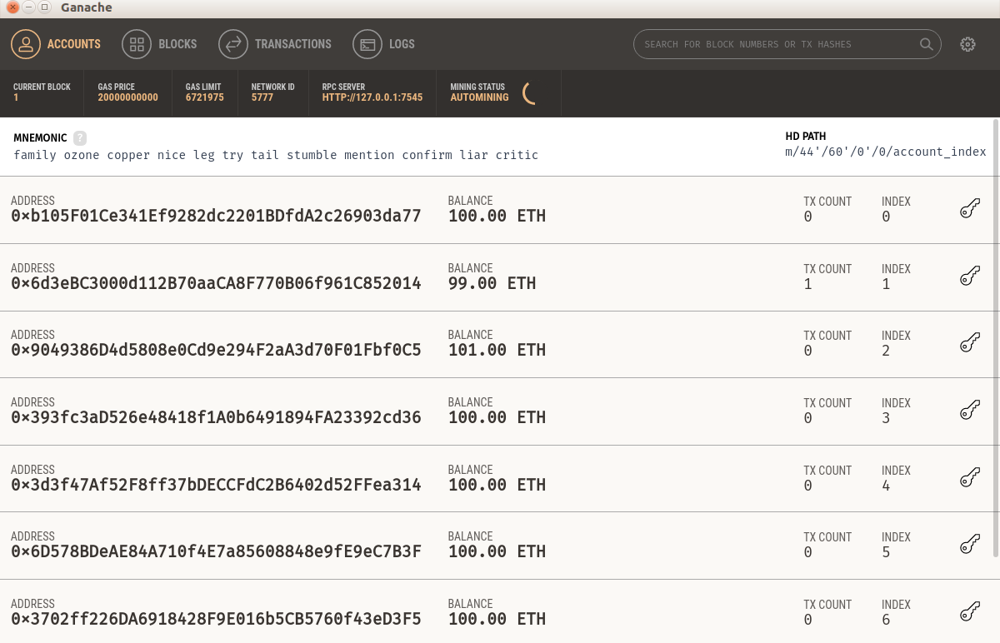
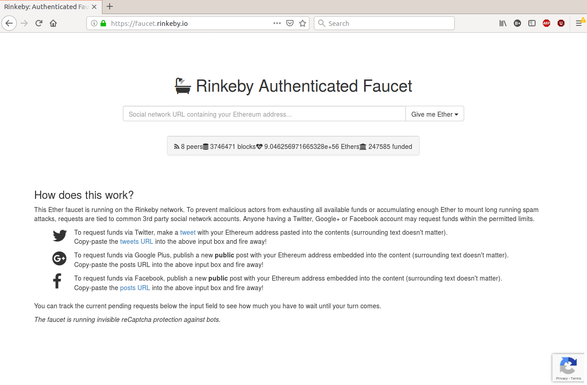

# 使用 Web3 与智能合约交互

在本章中，你将学习如何以编程方式连接到智能合约。 在这里，你将使用 Python 编程语言来执行智能合约中的方法。 为此，你将使用 web3.py 库。 在上一章中，你构建了一个智能合约并将其部署到以太坊区块链。 你还使用 Vyper 编写了智能合约。 为了与该智能合约进行交互，你启动了 Truffle 控制台并输入了许多命令。 这些命令被发送到区块链中的智能合约。 根据你输入的命令，这可以读取智能合约的状态或更改它。 在本章中，你将超越 Truffle 控制台。

本章将涵盖以下主题：

- 去中心化应用简介
- Geth
- 了解 web3.py 库
- 使用 web3.py 与智能合约交互

## 去中心化应用简介

你将使用 Python 构建一个程序，以编程方式执行智能合约中的方法，我们将此程序称为去中心化应用程序。所以，有一个智能合约，还有一个去中心化的应用程序。使用 Vyper 或 Solidity 编程语言编写的智能合约存在于以太坊区块链中。这意味着，如果你将智能合约部署到以太坊生产区块链，则智能合约的字节码将写入每个以太坊节点。因此，如果我们在这个世界上有 10,000 个以太坊节点，那么你的智能合约将被复制 10,000 次。

然而，去中心化的应用程序并不存在于以太坊区块链中。它存在于你的计算机中，存在于你邻居的计算机中，存在于云中，但它并不存在于区块链中，并且不必像智能合约一样在世界各地进行复制。人们使用各种编程语言构建分散的应用程序。以以太坊为例，最流行的用于构建去中心化应用程序的编程语言是 Node.js 环境中的 Javascript 和 Python。在我们的例子中，我们将使用 Python 来构建一个去中心化的应用程序。为此，我们需要一个库。对于 Javascript，我们需要一个 web3.js 库。在我们的例子中，它是 Python，我们需要一个 web3.py 库。所有的库名称都包含 web3 一词。

人们喜欢将 web3 视为互联网的第三个版本：去中心化的互联网。所以，如果这是第三个版本，你问第一和第二个是什么？互联网的第一个版本是你用来被动消费内容的互联网（想想静态网站）。互联网的第二个版本是社交网络，你可以在其中生成内容并共同创造体验（想想 Facebook、Twitter 或 Instagram )：


在前面的屏幕截图中，我们可以看到 Vyper 或 Solidity 字节码存在（复制）在许多以太坊节点（系统）中。 但是使用 web3 库的程序可以存在于单台计算机（例如笔记本电脑或智能手机）中。

### 安装 web3

事不宜迟，让我们安装 web3 库。 使用 Python 3.6 创建虚拟环境如下：

```sh
$ virtualenv -p python3.6 web3-venv
```

激活虚拟环境并安装Vyper如下：

```sh
$ source web3-venv/bin/activate
(web3-venv) $ pip install vyper
```

然后，使用 pip 安装 web3.py 库：

```sh
(vyper-venv) $ pip install web3
```

现在，验证它是否工作如下：

```sh
(vyper-venv) $ python
>>> import web3
>>> web3.__version__
'4.8.2'
```

如果你没有遇到任何错误，它就可以工作。 让我们用 web3 连接到 Ganache 区块链。 为此，首先启动 Ganache，然后返回到你的 Python 命令提示符：

```python
>>> from web3 import Web3, HTTPProvider
>>> w3 = Web3(HTTPProvider('http://localhost:7545'))
>>> w3.eth.blockNumber
0
>>> w3.eth.getBlock('latest')
AttributeDict({'number': 0, 'hash': HexBytes('0x0bbde277e2147d93f12852a370e70e2efe9c66f45db6e80e0cba584508d3ebac'), 'parentHash': HexBytes('0x0000000000000000000000000000000000000000000000000000000000000000'), 'mixHash': 
...
...
HexBytes('0x56e81f171bcc55a6ff8345e692c0f86e5b48e01b996cadc001622fb5e363b421'), 'stateRoot': HexBytes('0x31740a2d8b535c624aa481ba7d6d696085438037246b7501b4f24f77f94f3994'), 'receiptsRoot': HexBytes('0x56e81f171bcc55a6ff8345e692c0f86e5b48e01b996cadc001622fb5e363b421'), 'miner': '0x0000000000000000000000000000000000000000', 'difficulty': 0, 'totalDifficulty': 0, 'extraData': HexBytes('0x'), 'size': 1000, 'gasLimit': 6721975, 'gasUsed': 0, 'timestamp': 1548300279, 'transactions': [], 'uncles': []})
```

我们在这里所做的是使用 web3 库连接到 Ganache 区块链。 我们可以检索区块链上的信息，例如在这个特定的区块链上开采了多少块。 因为我们使用的是开发区块链 Ganache，所以 w3.eth.blockNumber 返回 0，因为我们没有在 Ganache 上创建任何交易。

## Geth

Go Ethereum (Geth) 是用 Go 编写的以太坊协议的实现。你可以使用 Geth 来同步一个以太坊节点，甚至构建一个私有的以太坊区块链。如果你想成为一名矿工，这是一个你会使用的软件。你的以太坊节点是一个网关，也是以太坊区块链的一部分。你使用 web3 库的程序要求以太坊节点能够与位于区块链内的智能合约进行交互。

使用 Ganache 非常好用。但 Ganache 是一个假区块链。没有矿工，所以很难模拟我们在真实的以太坊区块链上会遇到的一些情况。因此，让我们加强我们的游戏。我们现在不需要使用以太坊生产区块链，但我们可以使用介于开发和生产区块链之间的东西——Rinkeby 网络。如果以太坊生产区块链类似于生产服务器，那么 Rinkeby 网络就像一个临时服务器。在 DevOps 通用语言中，登台服务器是一种尽可能模拟生产服务器的测试服务器。

所以，Rinkeby 不是像 Ganache 那样的软件。它存在于互联网上。因此，使用 Rinkeby 网络，我们可以感受一下处理以太坊生产区块链是什么感觉。你在 Rinkeby 网络中的以太坊区块链中可能遇到的一种情况是确认交易需要时间。在 Ganache 中，确认交易只需几分之一秒。在 Rinkeby 网络中，确认一笔交易可能需要 20-30 秒，甚至一分钟，因此你需要习惯它。当然，并非以太坊生产区块链中的所有内容都可以在 Rinkeby 网络上复制。在以太坊生产区块链中特别发生的另一种情况是，它包括以太坊生产区块链有时会获得的高流量。例如，一个名为 Cryptokitties 的去中心化应用程序减慢了以太坊网络的速度，因为有很多用户与该应用程序交互，如下所示：https://techcrunch.com/2017/12/03/people-have-spent-over -1m-buying-virtual-cats-on-the-ethereum-blockchain/.

还有另一个类似于 Rinkeby 网络的以太坊测试网络——Ropsten 网络。这里的区别在于 Rinkeby 网络使用权威证明（PoA）来确认交易，而 Ropsten 网络使用工作证明（PoW）。现在，无需担心这种差异，因为使用 Rinkeby 网络类似于使用 Ropsten 网络。

有两种方法可以连接到这种以太坊区块链——自己运行以太坊节点，或者使用其他人的节点。每种方法都有自己的优点和缺点。运行以太坊节点会占用大量存储空间。连接到 Rinkeby 网络的节点需要大约 6 GB 的存储空间。至于以太坊生产网络，它需要高达 150 GB 的存储空间。根据你的互联网连接，要完全运行，你需要一个晚上或几天的时间才能使节点与所有其他节点完全同步。

另一种方法是使用别人的节点。有些人构建了一个网络服务来连接到他们的以太坊节点，所以你可以使用 API 来连接到他们的以太坊节点。 Infura 是最受欢迎的服务之一。你需要做的就是在他们的网站上注册以获取他们的 API。

要为 Rinkeby 网络运行我们自己的以太坊节点，请访问 https://geth.ethereum.org/downloads/ 下载适用于你的操作系统的软件。对于 Ubuntu Linux，这是 tar.gz 格式，因此你必须将其解压缩。然后，将二进制文件放在方便的地方（例如 /opt/bin 或 /home/yourusername/Program 或 /user/local/bin）。

这样做后，按如下方式同步节点：

```sh
$ ./geth --rinkeby
```

你可以使用不同的数据目录。默认情况下，Geth 将数据存储在 ~/.ethereum 目录中：

```sh
$ ./geth --rinkeby --datadir /opt/data/ethereumdata
```

就我而言，这需要一个晚上。根据你的互联网连接速度，你的体验可能会有所不同。

如果它是完全同步的（你知道这是输出不再经常更改的情况），那么你可以在 web3-venv 虚拟环境中运行 Python，如下所示：

```python
(web3-venv) $ python
>>> from web3 import Web3, IPCProvider
>>> w3 = Web3(IPCProvider("/home/yourusername/.ethereum/rinkeby/geth.ipc"))
```

在这里，我们使用的提供程序与我们在前一个示例中使用的提供程序不同。在 Ganache 示例中，我们使用 HTTP 提供程序。请记住 Ganache 使用 http://localhost:7545 并且你在 Truffle 配置中使用此信息。然而，在我们的例子中，当我们连接到以太坊节点时，我们使用进程间通信提供程序 (IPC)。你还可以看到 IPCProvider 的一个参数，即文件路径。因此，你的 Python 程序通过该文件与以太坊节点进行通信。在计算机科学中，该文件称为管道。你只需搜索 geth.ipc 文件在本地计算机上的位置即可。请记住，只有在运行 geth 软件时才会显示 geth.ipc。如果你停止它，geth.ipc 文件将消失。

然后，在你照常营业之前，你需要向 web3 中间件注入一些东西。应该这样做，因为以太坊生产区块链中的区块大小与 Rinkeby 区块链中的区块大小不同：

```python
>>> from web3.middleware import geth_poa_middleware
>>> w3.middleware_stack.inject(geth_poa_middleware, layer=0)
```

然后，你可以对其进行测试，如以下代码块所示：

```python
>>> w3.eth.getBlock('latest')
AttributeDict({'difficulty': 2, 'proofOfAuthorityData': HexBytes('0xd883010813846765746888676f312e31312e32856c696e7578000000000000001c62ac5af9b2ea6bf897a99fff40af6474cd5680fc8239853f03db116b2154594d2ab77a6f18c41132ee819143d2d41819237468924d29cb4b1252d2385a862400'), 'gasLimit': 7000000, 'gasUsed': 1373640, 'hash': HexBytes('0xa14b569f874eefc75fe734bc28b7457755eff1da26794d6615f15e1739204067'), 'logsBloom': 
...
...
HexBytes('0x66e75c91271b45f5271d2fe2fd0efc66f48f641632e83a086fc57646a0c0bc3f'), 'uncles': []})
```

你得到的输出是关于 Rinkeby 网络中最新区块链的信息。你可以从区块链块中学到一些东西。你可以在该区块中找到所有已确认的交易；使用的气体、气体限制等。在 Rinkeby 网络中，矿工始终是零地址（0x0000000000000000000000000000000000000000），因为 Rinkeby 网络中的区块链使用了权威证明。但是在主网（生产网络）中，你可以找出谁得到了奖励来确认区块链。你可以从 https://etherscan.io/blocks 找到主网（以太坊生产网络）中最新区块的信息。当然，如果你愿意同步节点，你可以从以太坊生产节点找到相同的信息。

### Geth控制台

在我们继续使用 web3 库之前，让我们先玩一下 Geth 软件。 Geth 软件可以像 Truffle 控制台一样工作：

```sh
$ ./geth --rinkeby --verbosity 0 console
```

该语句中的关键字是 console，但为了使它获得更愉快的体验，你应该添加另一个值为 0 的 --verbosity 标志。这将防止你因 geth 软件的大量输出而陷入困境：

```sh
Welcome to the Geth JavaScript console!
instance: Geth/v1.8.16-stable-477eb093/darwin-amd64/go1.11
modules: admin:1.0 clique:1.0 debug:1.0 eth:1.0 miner:1.0 net:1.0 personal:1.0 rpc:1.0 txpool:1.0 web3:1.0
>
```

在 Geth 控制台中，你可以执行在 Truffle 控制台中可以执行的任何操作。但是，我们现在想要创建一个以太坊帐户。当你启动 Ganache 时，你将配备 10 个可供使用的帐户。然而，在 Rinkeby 区块链中并非如此。你需要在 Rinkeby 中手动创建一个帐户：

```python
> personal.newAccount("password123")
"0x28f5b56b035da966afa609f65fd8f7d71ff68327"
```

这是创建新以太坊帐户的命令。你需要提供密码才能在 Geth 控制台中创建帐户。不要忘记此帐户的密码，因为没有恢复它的选项。此命令的输出是你帐户的公共地址。

私钥在以下目录中的文件中加密：/home/yourusername/.geth/rinkeby/keystore。

文件名是这样的：UTC—2018-10-12T09-30-20.687898000Z—28f5b56b035da966afa609f65fd8f7d71ff68327。这是时间戳和公钥的组合。你可以打开它，但你将无法在其中找到私钥：

```json
{
    "address": "28f5b56b035da966afa609f65fd8f7d71ff68327",
    "crypto": {
        "cipher": "aes-128-ctr",
        "ciphertext": "38b091f59f879369a6afdd91f21c1a82deb59374677144c94dd529d3c9069d39",
        "cipherparams": {
            "iv": "b168482d467df6e1fe4bdb5201a64a6a"
        },
        "kdf": "scrypt",
        "kdfparams": {
            "dklen": 32,
            "n": 262144,
            "p": 1,
            "r": 8,
            "salt": "bd94440d3f2bb9313a0020331bac9410ff3cdc9f32756f41f72dde1ef7bf32e1"
        },
        "mac": "3313b72603e85e73f84a47ef7ed0e931db85441e1702e0d96f2f001c54170cb6"
    },
    "id": "7a033367-92fe-42d3-bec5-970076f35d8a",
    "version": 3
}
```

要解密它，你可以使用 web3 库。将脚本命名为 extract_private_key.py：

```python
from web3 import Web3
w3 = Web3()

# Change the filepath to your keystore's filepath
with open('/opt/data/ethereumdata/keystore/UTC--2018-10-12T09-30-20.687898000Z--28f5b56b035da966afa609f65fd8f7d71ff68327') as keyfile:
    encrypted_key = keyfile.read()
    private_key = w3.eth.account.decrypt(encrypted_key, 'password123')
    print(private_key)
```

如果你执行脚本，你会看到你的私钥，可以在另一种情况下使用：

```sh
(web3-venv) $ python extract_private_key.py
b'\xa0\xe2\xa2\xf0$j\xe9L\xb3\xc0\x14Q\xb0D\xec\xa16\xa1\xca\xdd\x07.\x0f\x0f=5\xbd\xc5mb(r'
```

> 请不要再在生产环境中使用此帐号，因为私钥已公开。仅将其用于开发目的。

此私钥采用字节格式。如果要将其转换为十六进制字符串，可以这样做：

```python
(web3-venv) $ python
>>>  b'\xa0\xe2\xa2\xf0$j\xe9L\xb3\xc0\x14Q\xb0D\xec\xa16\xa1\xca\xdd\x07.\x0f\x0f=5\xbd\xc5mb(r'.hex()
'a0e2a2f0246ae94cb3c01451b044eca136a1cadd072e0f0f3d35bdc56d622872'
```

## 了解 web3.py 库

现在，让我们用这个库编写一个去中心化的应用程序。最简单的去中心化应用程序脚本是从一个账户向另一个账户汇款。将脚本命名为 send_money_ganache.py：

```python
from web3 import Web3, HTTPProvider


w3 = Web3(HTTPProvider('http://localhost:7545'))

private_key = '59e31694256f71b8d181f47fc67914798c4b96990e835fc1407bf4673ead30e2'

transaction = {
  'to': Web3.toChecksumAddress('0x9049386D4d5808e0Cd9e294F2aA3d70F01Fbf0C5'),
  'value': w3.toWei('1', 'ether'),
  'gas': 100000,
  'gasPrice': w3.toWei('1', 'gwei'),
  'nonce': 0
}

signed = w3.eth.account.signTransaction(transaction, private_key)
tx = w3.eth.sendRawTransaction(signed.rawTransaction)
```

在执行此脚本之前，请先启动 Ganache。完成后，将你喜欢的任何公共地址放入交易字典的 to 字段中。此帐户将是接收方。然后找到另一个帐户，查看其私钥，并在 private_key 变量中输入值：


在值字段中输入一个以太币。这意味着你要向另一个帐户发送 1 个以太币。这是一个简单的脚本，用于说明发送交易的工作原理。它没有显示最佳实践，因为你不应该像这样将私钥嵌入到代码中。例如，你可以从具有受限权限的文件中读取私钥，或者你可以从标准输入请求私钥。

如果你执行此脚本，你会注意到接收方的余额将增加 1 ETH，而发送方的余额将减少 1 ETH：



这是以下输出：


### Gas 和Gas 价格

如你所知，以太坊区块链不是免费的。有人必须维护它。我说的不是编写以太坊软件的开发人员，而是运行以太坊节点以确认交易的矿工。他们从以太坊软件本身获得金钱 (ETH) 奖励。最重要的是，他们会获得交易费用的奖励。这个费用是gas和gas的价格。

为什么我们需要在以太坊软件的奖励之上收取费用？这是为了防止来自用户的垃圾邮件。如果一笔交易是免费的，一个 troller 可以建立两个账户，在它们之间来回发送资金。此外，这为想要支付更多费用的用户提供了高度优先权。如果有两笔类似的交易，但第一笔交易有更多 gas 支持，那么它在矿工的待办事项列表中将具有更高的优先级。 gas 少的交易最终会被确认；它只需要等待一段时间。

所以有gas，就有gas价格。 Gas 是你愿意在此交易中分配的 Gas 量。在之前的脚本中，你分配 20,000 gas 来创建交易以发送资金。对于更复杂的交易，例如在智能合约中执行复杂的方法，可能需要更多的 gas。如果你没有分配足够的gas，你的交易就会被拒绝，你也可能会失去gas。但是如果你投入了足够多的gas，如果你的交易成功，剩余的gas会返还给你。所以，你会想：为什么不尽可能地把天然气放在一边？有一个问题。如果不知何故，你调用智能合约中的方法失败断言（例如：断言 1 == 2），你将失去在断言行之前使用的所有 gas（但剩余的 gas 将被退还）。所以你需要找到中间地带。

Gas price 是gas的价格，所以gas不是免费的。它与以太坊本身分离。你用你拥有的 ETH 购买天然气。你可以在历史交易中查看 gas 价格。在以太坊生产区块链中，你可以在 https://www.ethgasstation.info/ 中查看 gas 的价格。

你如何估算交易所需的gas？你需要学习 Solidity 或 Vyper 编程语言的所有复杂性。如果我分配一个 256 位的整数变量并将其存储在存储中，它的成本是多少？循环呢？构造一个结构体怎么样？这听起来很复杂，但幸运的是，web3 库有一种估算 gas 使用量的方法。首先，创建一个名为estimate_gas.py 的脚本：

```python
from web3 import Web3, HTTPProvider


w3 = Web3(HTTPProvider('http://localhost:7545'))

transaction = {
  'to': Web3.toChecksumAddress('0x9049386D4d5808e0Cd9e294F2aA3d70F01Fbf0C5'),
  'value': w3.toWei('1', 'ether'),
  'gas': 100000,
  'gasPrice': w3.toWei('1', 'gwei'),
  'nonce': 0
}

print("Estimating gas usage: " + str(w3.eth.estimateGas(transaction)))
print("Gas price: " + str(w3.eth.gasPrice))
```

你会得到这个输出：

```sh
Estimating gas usage: 21000
Gas price: 2000000000
```

如果你发现与 nonce 相关的错误，请将 nonce 更改为 1 或更高，直到它起作用为止。在下一节中讨论 nonce。

### 随机数

你可能已经观察到，如果你尝试多次执行汇款脚本，你会收到与 nonce 相关的错误。如果你还没有，试试吧。你必须增加 nonce 才能让它再次工作。 Nonce 就像是你使用一个帐户进行了多少交易的指标。对于第一笔交易（就在创建新帐户之后），你将 nonce 值设为零。然后，对于第二笔交易，你将值 1 放入 nonce。然后，对于第三笔交易，你将值 2 放入 nonce。

但是跟踪 nonce 值变得很愚蠢，特别是如果你想使用一个不知道 nonce 值有多高的旧帐户。幸运的是，有一种方法可以从以太坊区块链中获取最新的 nonce 值。创建一个名为 get_latest_nonce.py 的脚本：

```python
from web3 import Web3, HTTPProvider
w3 = Web3(HTTPProvider('http://localhost:7545'))
transaction_count = w3.eth.getTransactionCount("0xcc6d61988CdcF6eB510BffAeD4FC0d904f8d3e7D")
print(transaction_count)
```

尝试使用更高的随机数再次汇款，然后执行此脚本。再来一遍。这将向你显示价值统计。

有了这些新知识，你必须小心在以太坊区块链中创建交易。在现实世界中，交易可能需要时间来确认。想象一下，你使用相同的随机数并行创建两个不同的事务。如果两笔交易都有效，则以太坊区块链上只会记录其中一笔。另一个将因为 nonce 问题而被拒绝。这两者的哪笔交易会被确认？这将是非常随机的。

相反，你必须决定首先确认哪笔交易。给它一个较低的随机数。对于第二笔交易，你给予更高的随机数。但是，如果第一笔交易失败，第二笔交易将被拒绝，因为 nonce 太高（nonce 跳过一个数字）。这是你需要牢记的事情。

那么为什么所有这些 nonce 官僚主义呢？是为了防止同样的交易再次发生。想象一下，你广播了一笔交易，你向邻居发送了一个 ETH。我可以复制这个交易并再次广播它。由于此交易已通过你的签名验证，因此我可以耗尽你的帐户。

### 在 Rinkeby 上创建交易

现在你已经对 Ganache 玩得很开心，让我们尝试在 Rinkeby 网络上创建一个交易。你可能会注意到这里的一个问题——不像 Ganache，你有 10 个账户，每个账户都有 100 ETH 的余额，在这里你什么也得不到。默认情况下，你必须创建一个帐户。创建 10 个帐户很容易。但是余额呢？你使用 Geth 软件在 Rinkeby 网络上创建的每个帐户都带有 0 ETH 的余额。但是汇款需要很好的钱来支付交易费用。

在以太坊生产区块链中，你可以从加密货币交易所或挖矿中获得 ETH。但是在 Rinkeby 网络中，你通过乞讨来赚钱。这是如何做到的。

转至 https://faucet.rinkeby.io/，然后使用其中一个社交媒体平台，例如 Twitter、Google+ 或 Facebook，在 Rinkeby 网络中创建包含你的公共地址的帖子。然后，在 Rinkeby faucet 网站上以表格形式发布你的社交媒体帖子。你有三种选择：8 小时 3 个以太币、1 天 7.5 个以太币或 3 天 18.5 个以太币：



为确保你获得余额，你可以从 Geth 软件检查余额。先同步一下。正如我之前所说，这个过程可能需要很长时间，可能需要几个小时，或者在我的情况下需要一个晚上：

```sh
$ ./geth --rinkeby
```

在你的本地区块链节点与 Rinkeby 网络完全同步后，首先终止 geth 进程并再次启动 geth，但使用不同的标志：

```sh
$ ./geth --rinkeby --verbosity 0 console
```

在 geth 控制台中执行此命令：

```sh
> web3.eth.getBalance('0x28f5b56b035da966afa609f65fd8f7d71ff68327')
3000000000000000000
```

将此地址更改为你的地址。你应该从水龙头那里得到一些 ETH。

假设你已经拥有 ETH，你可以在 Rinkeby 网络中创建一个交易。这是在 Rinkeby 网络中发送以太币的脚本。完整代码可以参考以下GitLab链接上的代码文件：https://gitlab.com/arjunaskykok/hands-on-blockchain-for-python-developers/blob/master/chapter_04/send_money_rinkeby.py：

```python
rom web3 import Web3, IPCProvider
from web3.middleware import geth_poa_middleware

# Change the path of geth.ipc according to your situation.
w3 = Web3(IPCProvider('/opt/data/ethereumdata/geth.ipc'))

w3.middleware_stack.inject(geth_poa_middleware, layer=0)

...
...

nonce = w3.eth.getTransactionCount(Web3.toChecksumAddress(from_account))

transaction = {
  'to': Web3.toChecksumAddress(to_account),
  'value': w3.toWei('1', 'ether'),
  'gas': 21000,
  'gasPrice': w3.toWei('2', 'gwei'),
  'nonce': nonce
}

signed = w3.eth.account.signTransaction(transaction, private_key)
w3.eth.sendRawTransaction(signed.rawTransaction)
```

根据你的情况更改帐户接收者的地址、你的私钥加密文件位置、你的密码和 geth.ipc 文件位置。

请记住，我们的私钥是在文件中加密的。所以我们读取那个文件，然后用密码解锁它。请记住，你不应直接在代码中嵌入密码。然后，你可以在等待几分钟后在 geth 控制台中检查目标帐户的余额：

```python
> web3.eth.getBalance('0x99fb2eee85acbf878d4154de73d5fb1b7e88c328')
100000000000000000
```

你通过使用私钥对其进行签名来发送交易。这是在以太坊中创建交易的最通用的方式。但是还有另一种方法，它只涉及使用密码。

你可以像这样使用私钥：

```python
signed = w3.eth.account.signTransaction(transaction, private_key)
w3.eth.sendRawTransaction(signed.rawTransaction)
```

或者，你可以在签署交易时使用密码，如下所示：

```python
w3.personal.sendTransaction(transaction, password)
```

只有在你控制节点时才能使用密码，因为它需要一个加密的私钥文件。我在我的以太坊节点中创建了几个帐户。我只能在为这些帐户签署交易时使用密码。但是有了私钥，我可以使用任何帐户。

## 使用 web3.py 与智能合约交互

你已经使用 Python 脚本和 Ganache 中的 web3 库和 Rinkeby 网络发送了以太币。 现在，让我们创建一个脚本来与智能合约进行交互。 但在此之前，你需要学习如何使用 geth 和带有 web3 库的 Python 脚本启动智能合约。 之前，在第 3 章，使用 Vyper 实现智能合约中，你使用 Truffle 启动了一个智能合约。

### 与 Geth 启动智能合约

在下一节中，我们将使用 web3 连接到智能合约。 以下是将智能合约部署到 Rinkeby 区块链的方法：

```sh
$ ./geth --rinkeby --verbosity 0 console
```

在 geth 控制台中，列出你使用 Geth 软件的所有帐户：

```python
> eth.accounts
["0x8b55f0a88a1c53a8976953cde4f141752e847a00", "0x1db565576054af728b46ada9814b1452dd2b7e66", "0x28f5b56b035da966afa609f65fd8f7d71ff68327", "0x5b0d65b07a61c7b760bf372bbec1b3894d4b0225", "0x99fb2eee85acbf878d4154de73d5fb1b7e88c328"]
```

所有这些帐户都来自你使用以下命令创建的密钥库文件：personal.newAccount("password")。 假设你想解锁第一个账户，那么你可以使用personal.unlockAccount方法：

```python
> personal.unlockAccount(eth.accounts[0], "password123")
true
```

现在，获取字节码并将其放入变量中。 请记住，当你使用 Vyper 编译器编译源代码时，你会得到字节码：

```python
> bytecode = "smart contract bytecode"
> tx = eth.sendTransaction({from: eth.accounts[0], data: bytecode, gas: 500e3}
```

然后，检查你的智能合约是否已在区块链上得到确认：

```python
> web3.eth.getTransactionReceipt(tx)
```

如果已经确认，那么你应该得到以下输出：

```json
{
    blockHash: "0xfed7dcbd5e8c68e17bff9f42cd30d95588674497ae719a04fd6a2ff219bb001d",
    blockNumber: 2534930,
    contractAddress: "0xbd3ffb07250634ba413e782002e8f880155007c8",
    cumulativeGasUsed: 1071323,
    from: "0x1db565576054af728b46ada9814b1452dd2b7e66",
    gasUsed: 458542,
    logs: [],
    logsBloom: "0x00000...",
    status: "0x1",
    to: null,
    transactionHash: "0x1a341c613c2f03a9bba32be3c8652b2d5a1e93f612308978bbff77ce05ab02c7",
    transactionIndex: 4
}
```

### 使用 web3 启动智能合约

你还可以使用带有 web3 库的 Python 脚本启动智能合约。将此脚本命名为 deploy_smart_contract_to_ganache.py。你可以参考以下 GitLab 链接上的代码文件获取完整代码，https://gitlab.com/arjunaskykok/hands-on-blockchain-for-python-developers/blob/master/chapter_04/deploy_smart_contract_to_ganache.py：

```python
from web3 import Web3, HTTPProvider
from vyper import compile_codes


contract_source_code = '''
name: public(bytes[24])

@public
def __init__():
    self.name = "Satoshi Nakamoto"

...
...

# Change the account to your situation.
tx_hash = HelloSmartContract.constructor().transact({'from': '0xb105F01Ce341Ef9282dc2201BDfdA2c26903da77'})

tx_receipt = w3.eth.waitForTransactionReceipt(tx_hash)
print(tx_receipt)
```

运行脚本。但请确保你运行 Ganache。你应该得到以下输出：

```python
AttributeDict({'transactionHash': HexBytes('0xcfce0a28d0f8232735f99bcf871762f9780f19ab916e92c03d32fdabfd6b9e9a'), 'transactionIndex': 0, 'blockHash': HexBytes('0x84139a5c9ad050cf7be0678feb4aefc9e8b2806636245f16c790048e50347dfe'), 'blockNumber': 1, 'from': '0xb105f01ce341ef9282dc2201bdfda2c26903da77', 'to': None, 'gasUsed': 339198, 'cumulativeGasUsed': 339198, 'contractAddress': '0x9Dc44aa8d05c86388E647F954D00CaA858837804', 'logs': [], 'status': 1, 'logsBloom': HexBytes('0x00000000000000000000000000000000000000000000000000000000000000000000000000000000000000000000000000000000000000000000000000000000000000000000000000000000000000000000000000000000000000000000000000000000000000000000000000000000000000000000000000000000000000000000000000000000000000000000000000000000000000000000000000000000000000000000000000000000000000000000000000000000000000000000000000000000000000000000000000000000000000000000000000000000000000000000000000000000000000000000000000000000000000000000000000000000'), 'v': '0x1c', 'r': '0x74c63921055bd2fed65a731356b30220c6de3a28ec5fd26e296bf609d76d25ce', 's': '0x655395f422fa7b419caf87f99e2da09296b123eceb99aed4d19195e542b01bcd'})
```

首先，你使用以下语句创建一个智能合约对象：

```python
HelloSmartContract = w3.eth.contract(abi=abi, bytecode=bytecode)
```

然后，为了部署智能合约，你只需要使用构造函数方法：

```python
tx_hash = HelloSmartContract.constructor().transact({'from': '0xb105F01Ce341Ef9282dc2201BDfdA2c26903da77'})
```

最后一步相当重要，就是等待交易确认。这很重要，因为你需要在交易确认后获取智能合约的地址。

如果要将智能合约部署到 Rinkeby 网络，则需要修改此脚本。创建一个名为 deploy_smart_contract_to_rinkeby.py 的新文件。你可以参考以下 GitLab 链接上的代码文件以获取完整代码：https://gitlab.com/arjunaskykok/hands-on-blockchain-for-python-developers/blob/master/chapter_04/deploy_smart_contract_to_rinkeby.py：

```python
from web3 import Web3, IPCProvider
from vyper import compile_codes


contract_source_code = '''
name: public(bytes[24])

...
...

signed = w3.eth.account.signTransaction(transaction, private_key)
tx_hash = w3.eth.sendRawTransaction(signed.rawTransaction)

tx_receipt = w3.eth.waitForTransactionReceipt(tx_hash)
print(tx_receipt)
```

将智能合约部署到 Rinkeby 网络时的区别（除了使用 IPCProvider 而不是 HTTPProvider）是你必须设置 gas、gasPrice 和 nonce。最重要的是，你使用 buildTransaction 方法，获取交易对象，并使用私钥对其进行签名。由于此脚本在 Rinkeby 网络中运行，因此你需要确保已分配足够的 gas。在 gas 不足的情况下将智能合约部署到 Rinkeby 网络是一个常见的错误。然后，开发人员对为什么之后无法访问智能合约感到困惑。当你将此智能合约部署到 Rinkeby 网络时，你需要等待一段时间。

### 玩智能合约

在上一章中，我们使用 Vyper 开发了一个名为 hello.vy 的简单智能合约。让我们使用 web3 创建一个脚本来与这个智能合约进行交互。如果你忘记了hello.vy的内容，这里是文件的内容：

```python
name: public(bytes[24])

@public
def __init__():
    self.name = "Satoshi Nakamoto"

@public
def change_name(new_name: bytes[24]):
    self.name = new_name

@public
def say_hello() -> bytes[32]:
    return concat("Hello, ", self.name)
```

编译它并将其部署到 Ganache 或 Rinkeby 网络。现在，根据你是要连接到 Ganache 还是 Rinkeby 中的智能合约，选择以下选项之一。

第一个脚本用于与 Rinkeby 网络中的智能合约进行交互。将脚本命名为 play_with_smart_contract_in_rinkeby.py。你可以参考以下 GitLab 链接上的代码文件以获取完整代码：https://gitlab.com/arjunaskykok/hands-on-blockchain-for-python-developers/blob/master/chapter_04/play_with_smart_contract_in_rinkeby.py：

```python
from web3 import Web3, IPCProvider
from vyper import compile_codes


contract_source_code = '''
name: public(bytes[24])

...
...

signed_txn_hash = w3.eth.sendRawTransaction(signed_txn.rawTransaction)

w3.eth.waitForTransactionReceipt(signed_txn_hash)

print(Hello.functions.say_hello().call())
```

第二个脚本是与 Ganache 中的智能合约进行交互。将脚本命名为 play_with_smart_contract_in_ganache.py。你可以参考以下 GitLab 链接上的代码文件以获取完整代码：https://gitlab.com/arjunaskykok/hands-on-blockchain-for-python-developers/blob/master/chapter_04/play_with_smart_contract_in_ganache.py：

```python
from web3 import Web3, HTTPProvider
from vyper import compile_codes


contract_source_code = '''
name: public(bytes[24])

...
...

signed_txn_hash = w3.eth.sendRawTransaction(signed_txn.rawTransaction)

w3.eth.waitForTransactionReceipt(signed_txn_hash)

print(Hello.functions.say_hello().call())
```

我们将逐行讨论代码以更好地理解这个概念：

```python
from web3 import Web3, IPCProvider
from vyper import compile_codes


contract_source_code = '''
name: public(bytes[24])

...
...

smart_contract = {}
smart_contract['hello'] = contract_source_code

format = ['abi', 'bytecode']
compiled_code = compile_codes(smart_contract, format, 'dict')

abi = compiled_code['hello']['abi']
```

这部分脚本旨在获取智能合约的abi和字节码：

```python
# Change the path of geth.ipc according to your situation.
w3 = Web3(IPCProvider('/opt/data/ethereumdata/geth.ipc'))

from web3.middleware import geth_poa_middleware
w3.middleware_stack.inject(geth_poa_middleware, layer=0)

# Change the address of the smart contract, the account, the password, and the path to the keystore according to your situation,
address = "0x58705EBBc791DB917c7771FdA6175b2D9F59D51A"
password = 'password123'
w3.eth.defaultAccount = '0x28f5b56b035da966afa609f65fd8f7d71ff68327'
with open('/opt/data/ethereumdata/keystore/UTC--2018-10-12T09-30-20.687898000Z--28f5b56b035da966afa609f65fd8f7d71ff68327') as keyfile:
    encrypted_key = keyfile.read()
    private_key = w3.eth.account.decrypt(encrypted_key, password)

Hello = w3.eth.contract(address=address, abi=abi)
```

此脚本用于 Rinkeby 网络选项。你将获得 web3 连接对象和私钥。然后，根据部署智能合约脚本中的 abi 和地址初始化智能合约对象：

```python
w3 = Web3(HTTPProvider('http://localhost:7545'))

# Change the address of the smart contract, the private key, and the account according to your situation
address = "0x9Dc44aa8d05c86388E647F954D00CaA858837804"
private_key = '0x1a369cedacf0bf2f5fd16b5215527e8c8767cbd761ebefa28d9df0d389c60b6e'
w3.eth.defaultAccount = '0xb105F01Ce341Ef9282dc2201BDfdA2c26903da77'

Hello = w3.eth.contract(address=address, abi=abi)
```

此脚本用于 Ganache 选项。你获取 web3 连接对象并设置私钥。然后，根据部署智能合约脚本中的 abi 和地址初始化智能合约对象。

在两个（Ganache 和 Rinkeby）脚本中，你都将值设置为 w3.eth.defaultAccount。如果你将地址设置为 w3.eth.defaultAccount，这意味着该地址是要广播交易的帐户。它还将执行智能合约中的方法。如果你还记得你在 Truffle 控制台中所做的事情，你可以使用 from 参数指定将在智能合约中执行方法的帐户，如下所示：

```python
Donation.at("0x3e9417399786347b6ab38f59d3f00829d6bba7b8").change_useless_variable("sky is blue", {from: "0xb105F01Ce341Ef9282dc2201BDfdA2c26903da77" });
```

如果你不使用默认帐户，则在构建交易时也需要指定 from 字段：

```python
print(Hello.functions.name().call())

print(Hello.functions.say_hello().call())
```

要从不改变智能合约状态的公共变量或公共方法中获取值，你使用合约对象的functions方法，然后是公共变量和公共方法（都必须使用（）执行），然后是执行调用方法：

```python
nonce = w3.eth.getTransactionCount(w3.eth.defaultAccount)

txn = Hello.functions.change_name(b"Vitalik Buterin").buildTransaction({
  'gas': 70000,
  'gasPrice': w3.toWei('1', 'gwei'),
  'nonce': nonce
})
```

如果你还记得如何处理 nonce，则有必要获取更新的 nonce。对于将更改智能合约状态的交易，你使用 buildTransaction 而不是调用，它提供你已经识别的参数：gas、gasPrice 和 nonce。如果你不使用 w3.eth.defaultAccount，那么你需要在这里添加另一个参数：from。如果你想向智能合约发送一些以太币（例如 Donation Smart Contract 中的 donate 方法），你还需要添加另一个参数：value。

如果你注意到，Rinkeby 网络脚本中的 gas 和 gasPrice 参数要高得多：

```python
txn = Hello.functions.change_name(b"Lionel Messi").buildTransaction({
    'gas': 500000,
    'gasPrice': w3.toWei('30', 'gwei'),
    'nonce': nonce
})
```

在 Ganache 中，你可以获得 70,000 gas 和设置为 1 gwei 的 gas 价格。但是，在 Rinkeby 网络中，你必须小心。为安全起见，我在与 Rinkeby 网络中的智能合约交互时提高了 gas 和 gas 价格。如果你在 Rinkeby 网络中没有改变智能合约的状态，有时意味着你没有分配足够的 gas 并且 gas 价格不够高：

```python
signed_txn = w3.eth.account.signTransaction(txn, private_key=private_key)
```

你使用你的私钥签署此交易。但是，在 Ganache 中，你不必这样做。相反，你可以在没有私钥的情况下直接进行交易：

```python
Hello.functions.change_name(b"Vitalik Buterin").transact()
```

相比之下，对于 Rinkeby 网络或以太坊生产区块链，你必须签署你的交易：

```python
signed_txn_hash = w3.eth.sendRawTransaction(signed_txn.rawTransaction)
```

然后，你广播你的交易：

```python
w3.eth.waitForTransactionReceipt(signed_txn_hash)
```

在 Ganache 中，方法的执行会非常快，但在 Rinkeby 中，可能需要几分钟。在适当的分散式应用程序中，你将使用异步编程或线程来处理此问题：

```python
print(Hello.functions.say_hello().call())
```

最后一行是为了确保它已更改智能合约中的名称变量。

## 概括

在本章中，你学习了如何安装 web3 库。 这是旨在连接到智能合约的库。 最重要的是，你学习了如何在 Rinkeby 网络上运行以太坊节点。 你将 web3 配置为连接到 Rinkeby 网络上的以太坊区块链。 你还学习了如何告诉 web3 连接到以太坊测试网络，例如 Ganache。 此外，你创建了一个脚本来将以太币从一个账户发送到另一个账户。 最后，你创建了一个脚本来执行智能合约上的方法，以读取公共变量的值或更改智能合约的状态。

在下一章中，你将使用一个名为 Populus 的智能合约开发框架，它负责处理与智能合约相关的手动工作，例如编译代码和部署它。 此外，Populus 框架提供了一种集成的方式来测试智能合约。