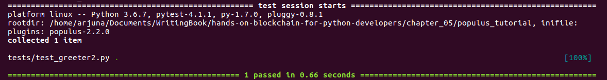

# Populus 开发框架

在本章中，你将学习如何使用 Populus，这是一个智能合约开发框架。 Populus 与 Truffle 一样，是一种旨在让你更轻松地开发智能合约的工具。 如果我们回到第 3 章，使用 Vyper 实现智能合约，你可能还记得我们必须手动创建 .json 文件，然后将控制台中的 abi 输出复制到 .json 文件。 使用 Populus，你可以避免重复之前执行过的手动作业。

本章将探讨以下主题：

- 设置Populus 
- 智能合约单元测试
- 使用 Populus 部署智能合约

## 设置 Populus

Populus 是一个智能合约开发框架，就像 Truffle 一样。那么我们为什么要使用杨树而不是松露呢？基本上，这是个人选择。 Populus 使用 Python 编写，默认支持使用 Python 进行单元测试。如果你使用 Truffle，默认情况下你会使用 JavaScript 进行单元测试。这就像选择 web3.py (Python) 或 web3.js (JavaScript) 来构建一个去中心化的应用程序。

要设置 Populus，让我们观察以下步骤：

1. 从头开始创建虚拟环境：
    ```sh
    $ virtualenv -p python3.6 populus-venv
    $ source populus-venv/bin/activate
```
2. 我们安装 web3、populus 和 vyper：
    ```sh
    (populus-venv) $ pip install eth-abi==1.2.2
    (populus-venv) $ pip install eth-typing==1.1.0
    (populus-venv) $ pip install py-evm==0.2.0a33
    (populus-venv) $ pip install web3==4.7.2
    (populus-venv) $ pip install -e git+https://github.com/ethereum/populus#egg=populus
```
    > 我们之所以要安装特定版本的web3，是因为最新版本的web3（4.8.2）破坏了Populus。
3. 安装 Solidity 编译器：
    ```python
    (populus-venv) $ python
    >>> from solc import install_solc
    >>> install_solc('v0.4.25')
    ```
4. 创建符号链接：
    ```sh
    (populus-venv) $ ln -s /home/yourusername/.py-solc/solc-v0.4.25/bin/solc populus-venv/bin/
    ```
5. 创建项目目录：
    ```sh
    (populus-venv) $ mkdir populus_tutorial
    (populus-venv) $ cd populus_tutorial
    ```
6. 用 populus 初始化这个项目目录：
    ```sh
    (populus_venv) $ populus init
    ```
    这个命令就像 truffle init。学完populus，你可能就不再需要这个命令了。此命令将在你的项目目录中放置两个目录——合同和测试。

在合约中，有一个示例 Solidity 文件：Greeter.sol。在测试目录中，有一个示例测试文件：test_greeter.py。

打开Greeter.sol，一个简单的智能合约，如下：

```python
pragma solidity ^0.4.0;

contract Greeter {
    string public greeting;

    // TODO: Populus seems to get no bytecode if `internal`
    function Greeter() public {
        greeting = 'Hello';
    }

    function setGreeting(string _greeting) public {
        greeting = _greeting;
    }

    function greet() public constant returns (string) {
        return greeting;
    }
}
```

在编译智能合约之前，你必须创建一个名为 project.json 的项目配置。必须先进入项目目录：

```sh
(populus-venv) $ cp ../populus-
   venv/src/populus/populus/assets/defaults.v9.config.json project.json
```

populus-venv 是你创建虚拟环境的地方。如果你看一看，它是一个重要的文件，包含 255 行。你可以使用以下命令编译它：

```sh
(populus-venv) $ populus compile
```

编译的结果是 build/contracts.json。你可以在该 .json 文件中找到 abi 和字节码。除了 abi 和字节码之外，你还可以在该 .json 文件中找到其他信息，例如编译器版本。

你已经熟悉智能合约开发的工作流程。编译 Solidity/Vyper 文件，这样我们就可以获得 abi 和字节码。然后，将 abi 和字节码与 web3 库结合使用。

现在，你将遇到新事物。还有一个你还没有看到的目录：tests 目录。在该目录中，有一个名为 test_greeter.py 的测试文件，它是一个单元测试。看看这里：

```python
def test_greeter(chain):
    greeter, _ = chain.provider.get_or_deploy_contract('Greeter')

    greeting = greeter.call().greet()
    assert greeting == 'Hello'


def test_custom_greeting(chain):
    greeter, _ = chain.provider.get_or_deploy_contract('Greeter')

    set_txn_hash = greeter.transact().setGreeting('Guten Tag')
    chain.wait.for_receipt(set_txn_hash)

    greeting = greeter.call().greet()
    assert greeting == 'Guten Tag'
```

你可以按如下方式执行此测试文件：

```sh
(populus-venv) $ py.test tests
```

这将为你提供以下输出：

```sh
============================= test session starts ==============================
platform linux -- Python 3.6.6, pytest-3.9.1, py-1.7.0, pluggy-0.8.0
rootdir: /tmp/pop_tut, inifile:
plugins: populus-2.2.0
collected 2 items                                                              

tests/test_greeter.py ..                                                [100%]

=============================== warnings summary ===============================

...

===================== 2 passed, 3 warnings in 0.88 seconds =====================
```

你的测试现在将通过。我们将在本章后面更深入地讨论智能合约单元测试。

### 添加对 Vyper 的支持

如你所知，我们在本书中关注的不是 Solidity，而是 Vyper。我们需要添加对 Vyper 的支持。首先，因为这是一个新的虚拟环境，安装vyper：

```sh
(populus-venv) $ pip install vyper
```

然后，在项目目录中，在合同目录中创建一个名为 Greeter.vy 的 .vy 文件：

```python
greeting: bytes[20]


@public
def __init__():
    self.greeting = "Hello"


@public
def setGreeting(x: bytes[20]):
    self.greeting = x


@public
def greet() -> bytes[20]:
    return self.greeting
```

在编译此 Vyper 代码之前，你需要更改 project.json 文件中的某些内容。

转到编译键。键的值是一个具有以下键的对象：backend、backends、contract_source_dirs 和 import_remappings。删除后端键，然后将后端键更改为以下代码：

```python
"backend": {
      "class": "populus.compilation.backends.VyperBackend"
},
```

因此，编译密钥的内容如下所示：

```python
"compilation": {
    "backend": {
      "class": "populus.compilation.backends.VyperBackend"
    },
    "contract_source_dirs": [
      "./contracts"
    ],
    "import_remappings": []
  },
```

然后，像往常一样运行编译：

```python
(populus-venv) $ populus compile
```

要确保它确实是 Vyper 编译而不是 Solidity 编译，你可以打开 build/contracts.json。在里面，你将能够看到以下内容：

```python
{
  "Greeter": {
    …
    "source_path": "contracts/Greeter.vy"
  }
}
```

> Vyper 的最新版本是 0.1.0b6，它破坏了 Populus。开发人员需要一些时间来解决这个问题。如果在你阅读本书时该错误尚未修复，你可以自己修补 Populus。

首先，使用以下命令检查错误是否已修复：

```sh
(populus-venv) $ cd populus-venv/src/populus
(populus-venv) $ grep -R "compile(" populus/compilation/backends/vyper.py
 bytecode = '0x' + compiler.compile(code).hex()
 bytecode_runtime = '0x' + compiler.compile(code, bytecode_runtime=True).hex()
```

在我们这里的例子中，该错误尚未修复。因此，让我们修补 Populus 以修复该错误。确保你仍在同一目录中（populus-venv/src/populus）：

```sh
(populus-venv) $ wget https://patch-diff.githubusercontent.com/raw/ethereum/populus/pull/484.patch
(populus-venv) $ git apply 484.patch
(populus-venv) $ cd ../../../
```

我们的 Populus 开发框架现在支持 Vyper。

## 智能合约单元测试

如果运行单元测试，由于数据类型不正确，你将收到错误消息。此处的解决方案是将所有字符串数据类型更改为字节数据类型。然后，由于出现弃用警告，你应该更改在智能合约中调用方法的方式。

最终，位于 tests/test_greeter.py 中的单元测试应如下所示：

```python
def test_greeter(chain):
    greeter, _ = chain.provider.get_or_deploy_contract('Greeter')

    greeting = greeter.functions.greet().call()
    assert greeting == b'Hello'


def test_custom_greeting(chain):
    greeter, _ = chain.provider.get_or_deploy_contract('Greeter')

    set_txn_hash = greeter.functions.setGreeting(b'Guten Tag').transact()
    chain.wait.for_receipt(set_txn_hash)

    greeting = greeter.functions.greet().call()
    assert greeting == b'Guten Tag'
```

然后，如果你再次运行单元测试，它将成功。

我们先来看第一种方法：

```python
def test_greeter(chain):
    greeter, _ = chain.provider.get_or_deploy_contract('Greeter')

    greeting = greeter.functions.greet().call()
    assert greeting == b'Hello'
```

大多数情况下，你的单元测试函数应该接受链参数。从链对象中，你可以获得一个提供者。如果你还记得，提供者是一个连接到以太坊区块链的对象，无论是通过 HTTP 还是 IPC。从那里，你可以获得合同对象。测试框架是直接从区块链中获取合约对象，还是先部署合约再获取合约，视情况而定。在我们的例子中，它是后一种选择。测试框架在内存中创建一个合约对象并与之交互。单元测试后，一切都消失了。

稍后，你将从永久区块链中获取合约对象。来自提供者对象的 get_or_deploy_contract 返回两个对象。大多数情况下，你只需要关注第一个，即合同对象。

从合约对象来看，在智能合约上执行方法你应该很熟悉。要执行公共方法或获取公共变量的值，你可以使用函数，然后是方法或公共变量添加 () 并以 call() 结尾。

执行公共方法后，你将获得返回值。在这种情况下，你将获得一个字节对象，这与 Solidity 示例中的字符串不同。在 Vyper 中，没有一流的字符串支持。字符串存储为字节对象。 Vyper 仍处于积极的开发模式，但预计未来会发生变化。

在第二个单元测试中，你将测试智能合约中的一个方法来更改变量的状态：

```python
def test_custom_greeting(chain):
    greeter, _ = chain.provider.get_or_deploy_contract('Greeter')

    set_txn_hash = greeter.functions.setGreeting(b'Guten Tag').transact()
    chain.wait.for_receipt(set_txn_hash)

    greeting = greeter.functions.greet().call()
    assert greeting == b'Guten Tag'
```

一切都与第一个单元测试相同，只是中间有两个新行：

```python
set_txn_hash = greeter.functions.setGreeting(b'Guten Tag').transact()
chain.wait.for_receipt(set_txn_hash)
```

这是使用事务的方式。请记住，交易是任何涉及更改合约状态的事情。你调用函数，然后是更改由 () 增强的合约状态的方法，以具有必要参数的 transact() 结尾。之后，使用链对象，你等待事务完成。在测试期间，这非常快。但是如果你在另一个以太坊区块链上测试这个，比如在 Rinkeby 网络中，交易可能会持续几分钟。

让我们看一个更复杂的例子。请记住你在第 3 章使用 Vyper 实现智能合约中编写的捐赠智能合约。我们为什么不测试那个智能合约呢？

让我们将捐赠智能合约保存在你在第 3 章，使用 Vyper 实现智能合约中开发的源代码文件夹中。你可以将代码保存在 contract/donation.vy 中。如果你忘记了这一点，你可以参考以下 GitLab 链接上的代码文件获取完整代码，https://gitlab.com/arjunaskykok/hands-on-blockchain-for-python-developers/blob/master/Chapter_05/populus_tutorial/contracts/Donation.vy：

```python
struct DonaturDetail:
    sum: uint256(wei)
    name: bytes[100]
    time: timestamp

donatur_details: public(map(address, DonaturDetail))

donaturs: public(address[10])

donatee: public(address)

index: int128

...
...

@public
def withdraw_donation():
    assert msg.sender == self.donatee

    send(self.donatee, self.balance)
```

我们想在这里测试许多不同的东西。

首先，让我们看一下构造函数方法：

```python
@public
def __init__():
    self.donatee = msg.sender
```

我们想测试 donatee 变量是否包含启动智能合约的账户地址。

让我们编写我们的第一个单元测试。你可以将此单元测试保存在 tests/test_donation.py 中：

```python
def test_donatee(web3, chain):
    donation, _ = chain.provider.get_or_deploy_contract('Donation')

    donatee = donation.functions.donatee().call()
    assert donatee == web3.eth.coinbase
```

在这个单元测试中，我们使用两个参数版本，因为我们想要获取 web3 对象。如果你切换参数的顺序，实际上并不重要。 def test_donatee(web3, chain): 与 def test_donatee(chain, web3): 相同。

get_or_deploy_contract 中的参数取自 .vy 文件的名称。所以要小心命名你的源代码文件名。

一件事是新的（但并不是真正的新，因为你已经在第 4 章，使用 Web3 与智能合约交互，是 web3.eth.coinbase。这是默认帐户。在这种情况下（单元测试），它意味着地址启动智能合约的帐户。

如果这个单元测试成功，让我们继续测试这个智能合约中的另一个方法：

```python
@payable
@public
def donate(name: bytes[100]):
    assert msg.value >= as_wei_value(1, "ether")
    assert self.index < 10

    self.donatur_details[msg.sender] = DonaturDetail({
        sum: msg.value,
        name: name,
        time: block.timestamp
    })

    self.donaturs[self.index] = msg.sender
    self.index += 1
```

在这种方法中，你被迫向智能合约发送至少 1 个以太币。
让我们通过编写第二个单元测试来测试失败的情况：

```python
def test_donate_less_than_1_eth(web3, chain):
    donation, _ = chain.provider.get_or_deploy_contract('Donation')

    with pytest.raises(eth_tester.exceptions.TransactionFailed):
        donation.transact({'value': web3.toWei('0.8', 'ether')}).donate(b'Taylor Swift')
```

现在，你需要添加两个导入语句：

```python
import pytest
import eth_tester
```

让我们学习如何在这个单元测试中处理异常。你可以将有问题的事务放入 with 语句中，以捕获异常。基本上，你希望事务失败。当程序中的某些内容失败时，它会返回一个特殊代码（例如，-1）或引发异常。在这种情况下，它会抛出异常。

运行测试看看它是否有效。然后，让我们测试成功案例，意味着接受捐赠（完整代码请参阅以下 GitLab 链接中的代码文件：https://gitlab.com/arjunaskykok/hands-on-blockchain-for-python-developers/blob/master/chapter_05/populus_tutorial/tests/test_donation.py）：

```python
def test_donate_1_eth(web3, chain):
    import time

    donation, _ = chain.provider.get_or_deploy_contract('Donation')

    t = eth_tester.EthereumTester()
    account2 = t.get_accounts()[1]

...
...

    assert donatur == account2
    assert donation_sum == web3.toWei('1', 'ether')
    assert donation_name == donatur_name
    assert (int(time.time()) - donation_time) < 600 # could be flaky

    assert web3.eth.getBalance(donation.address) == web3.toWei('1', 'ether')
```

这要消化的东西很多，所以让我们一步一步地讨论它。

```python
import time
```

我们将在此单元测试中稍后使用时间库来检查时间戳：

```python
donation, _ = chain.provider.get_or_deploy_contract('Donation')
```

你已经知道这个说法了。使用链对象，你可以获得提供者，然后使用该提供者的 get_or_deploy_contract 方法。结果是一个捐赠智能合约对象：

```python
t = eth_tester.EthereumTester()
account2 = t.get_accounts()[1]
```

eth_tester 是一个旨在让你更轻松地测试智能合约的库。为此，你创建了一个 EthereumTester 对象。这个库中有很多辅助函数。其中之一是为你提供一些装有大量 ETH 的帐户，有点像 Ganache。第一个帐户是经理帐户或启动智能合约的帐户。如前所述，你还可以从 web3.eth.coinbase 获取该帐户。第二个帐户等是你可以在单元测试中使用的测试帐户。

t.get_accounts() 为你提供了很多帐户。但是，不要使用第一个帐户，因为那将是经理帐户。在这里，你使用第二个帐户：

```python
donatur_name = b'Taylor Swift'
set_txn_hash = donation.functions.donate(donatur_name).transact({'from': account2, 'value': web3.toWei('1', 'ether')})
chain.wait.for_receipt(set_txn_hash)
```

你已经在前面的单元测试中看到了交易函数，它使用了greeter 智能合约。在此交易方法中，你可以指定要发送到智能合约的以太币数量。你也可以使用不同的帐户。在这些交易参数中，我们还使用了辅助函数 web3.toWei。否则，你必须使用带有很多零的数字。然后，你等待交易确认：

```python
donatur = donation.functions.donaturs(0).call()
donation_sum = donation.functions.donatur_details__sum(donatur).call()
donation_name = donation.functions.donatur_details__name(donatur).call()
donation_time = donation.functions.donatur_details__time(donatur).call()
```

执行此操作后，你可以访问公共变量以确认状态更改。

对于数组，你可以在数组方法中放置一个索引，如donation.functions.donaturs(0).call()。

对于映射，而不是整数索引，你在映射方法的参数中提供键，如 donatur.functions.donatur_details__sum(donatur).call()。

对于结构体，你可以通过附加两个下划线来访问成员，如 donatur.functions.donatur_details__sum(donatur).call()。

然后，我们通过如下声明所有这些变量来测试捐赠：

```python
assert donatur == account2
```

然后我们检查捐赠者地址是否记录正确：

```python
assert donation_sum == web3.toWei('1', 'ether')
```

然后我们检查捐赠金额是否正确记录：

```python
assert donation_name == donatur_name
```

然后我们检查捐赠者的姓名是否被正确记录：

```python
assert (int(time.time()) - donation_time) < 600 # could be flaky
```

然后我们检查捐赠发生的时间。我们这样做是因为在区块链中记录了交易确认的时间，因此你永远不知道交易何时被确认。在我们的例子中，它会很快。但是，如果你在 Rinkeby 网络中对其进行测试，则需要牢记这一点。在这里，我确保单元测试时间和智能合约中记录的时间戳之间的差异不超过 10 分钟（600 秒）。

然后我们直接从智能合约的余额中检查捐赠金额：

```python
assert web3.eth.getBalance(donation.address) == web3.toWei('1', 'ether')
```

这与之前的测试不同，之前的测试通过检查公共变量的值来测试余额。在我们的例子中，我们有很多捐款，所以它们会有所不同。

我们来看看智能合约中的最后一个方法：

```python
@public
 def withdraw_donation():
     assert msg.sender == self.donatee
 
     send(self.donatee, self.balance)
```

这是撤回捐款的方法。不要笑；有些人推出了一个智能合约，但没有办法提取其中的以太币。这些智能合约中的所有以太币都被永远锁定，这就是测试很重要的原因。它确保你不会犯这样的愚蠢错误。

在这种提款方法中，你要测试你是否可以提取智能合约中的以太币。然后，你需要确保只有某个帐户（在本例中为经理帐户）能够从智能合约中提取以太币。

让我们为此创建一个单元测试。首先，我们创建一个单元测试来确保另一个账户不能从智能合约中提取以太币：

```python
def test_other_account_could_not_withdraw_money(web3, chain):
    donation, _ = chain.provider.get_or_deploy_contract('Donation')
 
    t = eth_tester.EthereumTester()
    account2 = t.get_accounts()[1]
 
    donatur_name = b'Taylor Swift'
    set_txn_hash = donation.functions.donate(donatur_name).transact({'from': account2, 'value': web3.toWei('1', 'ether')})
    chain.wait.for_receipt(set_txn_hash)
 
    with pytest.raises(eth_tester.exceptions.TransactionFailed):
        donation.functions.withdraw_donation().transact({'from': account2})
```

现在一切都对你来说应该很熟悉了。 你将提取以太币的失败案例包装在捕获异常的 with 语句中。

现在，让我们测试经理帐户确实可以将以太币提取到其帐户的成功案例：

```python
def test_manager_account_could_withdraw_money(web3, chain):
     donation, _ = chain.provider.get_or_deploy_contract('Donation')
 
     t = eth_tester.EthereumTester()
     account2 = t.get_accounts()[1]
 
     donatur_name = b'Taylor Swift'
     set_txn_hash = donation.functions.donate(donatur_name).transact({'from': account2, 'value': web3.toWei('1', 'ether')})
     chain.wait.for_receipt(set_txn_hash)
 
     initial_balance = web3.eth.getBalance(web3.eth.coinbase)
     set_txn_hash = donation.functions.withdraw_donation().transact({'from': web3.eth.coinbase})
     chain.wait.for_receipt(set_txn_hash)
 
     after_withdraw_balance = web3.eth.getBalance(web3.eth.coinbase)
 
     assert abs((after_withdraw_balance - initial_balance) - web3.toWei('1', 'ether')) < web3.toWei('10', 'gwei')
```

除了最后一行之外，这里的一切你都会很熟悉。 提款后经理的账户余额减去 initial_balance 不会正好是 1 以太，因为经理的账户需要支付费用。 在这种情况下，我们只是使用粗略的测量来确保提款成功。 只要差异在 10 gwei 以下，那应该没问题。 Gwei 是我们用来计算发送交易费用的货币。 1 gwei 是 1,000,000,000 wei。 如果你觉得这很令人困惑，你可以使用以太币来断言它，如下所示：

```python
assert abs((after_withdraw_balance - initial_balance) - web3.toWei('1', 'ether')) < web3.toWei('0.00000001', 'ether')
```

运行测试：

```sh
(populus-venv) $ py.test tests/test_donation.py
```

你应该得到一个成功的结果：


### 在构造函数中使用参数

我们测试的两个智能合约在构造函数中都没有参数。但是如果我们编写一个在构造函数中有参数的智能合约呢？我们如何测试？

让我们编写一个在构造函数中有参数的简单智能合约。将其命名为合同/Greeter2.vy：

```python
greeting: bytes[20]


@public
def __init__(greeting_param: bytes[20]):
    self.greeting = greeting_param


@public
def setGreeting(x: bytes[20]):
    self.greeting = x


@public
def greet() -> bytes[20]:
    return self.greeting
```

然后，编写以下测试。将其命名为tests/test_greeter2.py：

```python
import pytest

@pytest.fixture()
def greeter2_contract(chain):
    Greeter2Factory = chain.provider.get_contract_factory('Greeter2')
    deploy_txn_hash = Greeter2Factory.constructor(b'Hola').transact()
    contract_address = chain.wait.for_contract_address(deploy_txn_hash)
    return Greeter2Factory(address=contract_address)

def test_greeter2(greeter2_contract):
    greeting2 = greeter2_contract.functions.greet().call()
    assert greeting2 == b'Hola'
```

在这里，你可以使用 pytest 的夹具功能自定义智能合约的部署。首先，你从链的提供者处获取合约工厂，然后将参数放入工厂对象的构造函数方法中，以 transact() 方法结尾。然后，等到它部署在区块链上。最后，你将收到地址。

在测试函数中，你将参数与夹具函数的名称完全相同。在这里，我们的夹具函数是greeter2_contract。在测试函数中，你只需将此对象用作智能合约对象，类似于由 chain.provider.get_or_deploy_contract('Donation') 返回的对象。

现在，测试如下：

```sh
(populus-venv) $ py.test tests/test_greeter2.py
```

你应该得到一个成功的结果：



还有很多东西可以测试。我们只测试一笔捐款，但我们最多可以接受 10 笔捐款。这也应该检查。你希望测试覆盖的完整程度取决于你和项目的要求。还有很多我们在这里没有讨论的单元测试方面，例如设置、拆除和测试驱动的开发。

## 使用 Populus 部署智能合约

Populus 不仅仅是一个旨在轻松开发和测试智能合约的框架。它有一个工具可以将智能合约部署到区块链，包括私有链。

私有链基本上是你的私有以太坊区块链，类似于 Ganache，不同之处在于你自己构建它。这就像 Rinkeby 网络中的区块链，但你是唯一的矿工。你可以使用 geth 软件手动创建私有区块链； populus 只是让你更轻松。

创建新私链的命令如下：

```sh
(populus-venv) $ populus chain new localblock
```

此命令将在你的项目目录中创建一些文件。所有生成的文件都位于 chains 目录中。生成的文件之一是chains/localblock/genesis.json。创世文件的目的是规定以太坊区块链的初始配置：

```json
{
    "parentHash": "0x0000000000000000000000000000000000000000000000000000000000000000",
    "coinbase": "0xcb22827ab291b3094076de25d583c49b902a5606",
    "extraData": "0x686f727365",
    "config": {
        "daoForkBlock": 0,
        "daoForSupport": true,
        "homesteadBlock": 0
    },
    "timestamp": "0x0",
    "mixhash": "0x0000000000000000000000000000000000000000000000000000000000000000",
    "nonce": "0xdeadbeefdeadbeef",
    "alloc": {
        "0xcb22827ab291b3094076de25d583c49b902a5606": {
            "balance": "1000000000000000000000000000000"
        }
    },
    "gasLimit": "0x47d5cc",
    "difficulty": "0x01"
}
```

你不需要知道这些键的所有含义。 coinbase 意味着所有的挖矿奖励都应该进入这个账户。 alloc 表示账户的初始余额。

除了创世文件，你应该得到chains/localblock/init_chain.sh。打开它，你应该有以下内容：

```sh
#!/bin/sh
geth --rpc --rpcaddr 127.0.0.1 --rpcport 8545 --rpcapi admin,debug,eth,miner,net,personal,shh,txpool,web3,ws --ws --wsaddr 127.0.0.1 --wsport 8546 --wsapi admin,debug,eth,miner,net,personal,shh,txpool,web3,ws --datadir /home/yourusername/populus_tutorial/chains/localblock/chain_data --maxpeers 0 --networkid 1234 --port 30303 --ipcpath /home/yourusername/populus_tutorial/chains/localblock/chain_data/geth.ipc --nodiscover --mine --minerthreads 1 init /home/yourusername/populus_tutorial/chains/localblock/genesis.json
```

这个脚本基本上是运行带有某些参数的geth软件。最重要的参数是 init，你可以将其提供给 genesis.json 文件。然后，运行你的私有区块链的初始化：

```sh
(populus-venv) $ ./chains/localblock/init_chain.sh
```

然后，打开chains/localblock/run_chain.sh 文件，你应该有以下内容：

```sh
#!/bin/sh
geth --rpc --rpcaddr 127.0.0.1 --rpcport 8545 --rpcapi admin,debug,eth,miner,net,personal,shh,txpool,web3,ws --ws --wsaddr 127.0.0.1 --wsport 8546 --wsapi admin,debug,eth,miner,net,personal,shh,txpool,web3,ws --datadir /home/yourusername/populus_tutorial/chains/localblock/chain_data --maxpeers 0 --networkid 1234 --port 30303 --ipcpath /home/yourusername/populus_tutorial/chains/localblock/chain_data/geth.ipc --unlock 0xcb22827ab291b3094076de25d583c49b902a5606 --password /home/yourusername/populus_tutorial/chains/localblock/password --nodiscover --mine --minerthreads 1
```

你现在需要注意的重要标志是 --mine、--password、--ipcpath、--unlock 和 --datadir。 --mine 表示你想在这个私有区块链中挖矿，--password 是密码文件的位置，--unlock 用密码文件解锁帐户，--datadir 是你的私有以太坊区块链目录的位置，以及--ipcpath 是当你运行你的私有以太坊区块链时你的 geth.ipc 所在的位置。
在运行区块链之前，编辑chains/localblock/run_chain.sh 脚本，将--ipcpath 标志的值更改为/tmp/geth.ipc，然后运行区块链：

```sh
(populus-venv) $ ./chains/localblock/run_chain.sh
```

现在，编辑 project.json 文件。 chains 键有一个对象，有四个键：tester、temp、ropsten 和 mainnet。在此对象中添加 localblock 键及其值。因此，localblock 键必须与 tester、mainnet、temp 和 ropsten 键相邻，如以下代码块所示：

```json
"localblock": {
    "chain": {
        "class": "populus.chain.ExternalChain"
    },
    "web3": {
        "provider": {
            "class": "web3.providers.ipc.IPCProvider",
            "settings": {
                "ipc_path": "/tmp/geth.ipc"
            }
        }
    },
    "contracts": {
        "backends": {
            "JSONFile": {
                "$ref": "contracts.backends.JSONFile"
            },
            "ProjectContracts": {
                "$ref": "contracts.backends.ProjectContracts"
            }
        }
    }
}
```

然后，你可以将你的智能合约部署到你的私有区块链，如下所示：

```sh
(populus_venv) $ populus deploy --chain localblock Donation
> Found 2 contract source files
  - contracts/Donation.vy
  - contracts/Greeter.vy
> Compiled 2 contracts
  - contracts/Donation.vy:Donation
  - contracts/Greeter.vy:Greeter
Beginning contract deployment. Deploying 1 total contracts (1 Specified, 0 because of library dependencies).

Donation
Deploying Donation
Deploy Transaction Sent: b'v\xc4`\x06h\x17\xf6\x10\xd7\xb2\x7f\xc6\x94\xeb\x91n\xae?]-\xf43\xb8F\xdc=}\xb33\x03|\xd4'
Waiting for confirmation...

Transaction Mined
=================
Tx Hash : b'v\xc4`\x06h\x17\xf6\x10\xd7\xb2\x7f\xc6\x94\xeb\x91n\xae?]-\xf43\xb8F\xdc=}\xb33\x03|\xd4'
Address : 0xab3B30CFeC1D50DCb0a13671D09d55e63b7cFf40
Gas Provided : 467715
Gas Used : 367715


Verified contract bytecode @ 0xab3B30CFeC1D50DCb0a13671D09d55e63b7cFf40
Deployment Successful.
```

然后，你可以像在第 4 章，使用 Web3 与智能合约交互中那样玩弄智能合约。你可以参考以下 GitLab 链接中的代码文件：https://gitlab.com/arjunaskykok/hands-on-blockchain-for-python-developers/blob/master/chapter_05/populus_tutorial/interact_smart_contract_in_private_chain.py，以获得完整的以下代码块的代码：

```python
>>> from web3 import Web3, IPCProvider
>>> w3 = Web3(IPCProvider(ipc_path="/tmp/geth.ipc"))
>>> w3.eth.coinbase
'0xcB22827aB291b3094076DE25D583C49b902a5606'
>>> w3.eth.getBalance(w3.eth.coinbase)
1000000011875000000000000000000
>>> address = "0xab3B30CFeC1D50DCb0a13671D09d55e63b7cFf40"
>>> false = False
>>> true = True
>>> abi = [
...
...
>>> donation = w3.eth.contract(address=address, abi=abi)
>>> donation.functions.donatee().call()
'0xcB22827aB291b3094076DE25D583C49b902a5606'
```

你还执着于甘纳许吗？如果是这样，我们可以部署到 Ganache 区块链。首先启动 Ganache，然后将此内容添加到projects.json 文件中的chains 键对象：

```json
"ganache": {
    "chain": {
        "class": "populus.chain.ExternalChain"
    },
    "web3": {
        "provider": {
            "class": "web3.providers.HTTPProvider",
            "settings": {
                "endpoint_uri": "http://localhost:7545"
            }
        }
    },
    "contracts": {
        "backends": {
            "JSONFile": {
                "$ref": "contracts.backends.JSONFile"
            },
            "ProjectContracts": {
                "$ref": "contracts.backends.ProjectContracts"
            }
        }
    }
}
```

运行部署如下：

```sh
(populus_venv) $ populus deploy --chain ganache Donation
> Found 2 contract source files
  - contracts/Donation.vy
  - contracts/Greeter.vy
> Compiled 2 contracts
  - contracts/Donation.vy:Donation
  - contracts/Greeter.vy:Greeter
Beginning contract deployment. Deploying 1 total contracts (1 Specified, 0 because of library dependencies).

Donation
Deploying Donation
Deploy Transaction Sent: b'\xd4\xeb,{\xa0d\n\xb2\xb0\xb2\x1b\x18\xdd \xa1A\x89\xea`\xa8b?A\x14L\x99\xd1rR4\xc7\xfa'
Waiting for confirmation...

Transaction Mined
=================
Tx Hash : b'\xd4\xeb,{\xa0d\n\xb2\xb0\xb2\x1b\x18\xdd \xa1A\x89\xea`\xa8b?A\x14L\x99\xd1rR4\xc7\xfa'
Address : 0x9Dc44aa8d05c86388E647F954D00CaA858837804
Gas Provided : 467715
Gas Used : 367715


Verified contract bytecode @ 0x9Dc44aa8d05c86388E647F954D00CaA858837804
Deployment Successful.
```

然后，当你想在 Ganache 中使用你的智能合约时，你只需要像你在第 4 章，使用 Web3 与智能合约交互中学到的那样调整提供者：

```sh
>>> from web3 import Web3, HTTPProvider
 >>> w3 = Web3(HTTPProvider('http://localhost:7545'))
```

其余代码相同。你可以将脚本命名为 interact_smart_contract_in_ganache.py。在 Ganache 中，coinbase 帐户和经理帐户是 Ganache 中的第一个帐户。有关与 Ganache 中的智能合约交互的完整代码，请参阅 GitLab 链接，https://gitlab.com/arjunaskykok/hands-on-blockchain-for-python-developers/blob/master/chapter_05/populus_tutorial/interact_smart_contract_in_ganache。比：

```python
from web3 import Web3, HTTPProvider
w3 = Web3(HTTPProvider("http://localhost:7545"))

print(w3.eth.coinbase)
print(w3.eth.getBalance(w3.eth.coinbase))

# Change this address to your smart contract address
address = "0x9Dc44aa8d05c86388E647F954D00CaA858837804"
false = False
true = True
abi = [
...
...
donation = w3.eth.contract(address=address, abi=abi)
print(donation.functions.donatee().call())
```

## 概括

在本章中，你学习了如何使用 Populus 开发框架开发智能合约。 Populus 没有配备 Vyper 支持，只有 Solidity。 因此，你需要通过安装 Vyper 并编辑 Populus 项目配置文件来添加 Vyper 支持。 你还学习了如何为智能合约创建单元测试。 在此单元测试中，你使用 web3 对象与智能合约交互并以编程方式对其进行测试。 在此之后，你学习了如何创建私有链。 最后，你为这条私有链和 Ganache 部署了一个智能合约。

在下一章中，你将在比捐赠智能合约更复杂的区块链上构建一个应用程序。 此应用程序是投票分散的应用程序。