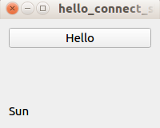

# 前端去中心化应用

在本章中，我们将学习如何编写具有 GUI 前端的去中心化应用程序。 这是一个桌面分散的应用程序。 人们可以使用按钮和文本字段与智能合约进行交互。 这是从 Truffle 控制台或 web3.py 脚本向前迈出的一步。 在编写此 GUI 前端时，我们将了解处理智能合约时的最佳实践，即如何处理延迟以及如何在去中心化应用程序中提供附加值。

我们将在本章中学习以下主题：

- 设置 Qt GUI 库
- 为 Python 安装 Qt
- Qt for Python 速成课程
- 为类似 Twitter 的应用程序编写智能合约
- 为类似 Twitter 的应用程序构建 GUI

## 设置 Qt GUI 库

Qt 库是一个 C++ 框架，旨在创建一个多平台应用程序。在 Linux 中，这个库是 KDE 桌面的基础。它的对应物是 GTK+ 库，它是 Gnome 桌面的基础。然而，Qt 库已经加强了它的游戏。您可以使用 Qt 库在 Android 和 iOS 上创建应用程序。人们有时会将 Qt 库误认为是只创建 GUI 应用程序的库。但是，Qt 库也包含非 GUI 库，例如数据存储、多媒体和网络。 Qt 库甚至包含一个线程库！过去，您可以使用 Qt 库免费创建开源应用程序。但是，如果您想使用 Qt 库创建专有应用程序，则必须支付许可证费用。现在，您可以更灵活地使用 Qt 库。

您可以免费使用 Qt 库创建专有应用程序，但前提是您为 Qt 库提供重新链接机制、提供许可证副本并明确确认 Qt 的使用等，如 https://www.qt 所述.io/下载。

### 选择 GUI 库

Python 有大量的 GUI 库可供选择。这包括 Tkinter、Phoenix (wxPython)、PyGObject、PyQt、Qt for Python (PySide2) 等。决定 Python 应用程序应该使用哪个 GUI 库有时是主观的。

Tkinter 是一个 Python GUI 库，但 UI 并不光滑和优美。如果您想在 Linux 中编写桌面应用程序，PyGObject 是一个不错的选择，因为它使用 GTK+。在 Windows 和 Mac 中支持 GTK+，但它不是原生的。

我将选择 Qt for Python (https://www.qt.io/qt-for-python) 库。这是 Qt 本身的 Qt 库的官方 Python 绑定。不过要小心；还有另一个公司的 Qt 库的另一个 Python 绑定。这个库叫PyQt，公司叫Riverbank。这些库都支持最新的 Qt 库，即 Qt 5。

这两个库之间存在差异。如果您想使用 PyQt 编写和销售专有应用程序，您必须从 Riverbank 购买许可证。但是，您不需要使用 Qt for Python 来执行此操作，尽管它有自己的一组限制。例如，您必须为 Qt 库提供重新链接机制。有一些关于 PyQt 的书籍，但在编写本书时还没有关于 Qt for Python 的书籍。

以前，Qt 的可靠 Python 绑定只能从 Riverbank 获得。然而，在今年年中，Qt 宣布了其最新 Qt 库（Qt 5.11）的 Python 绑定。 Qt 非常重视推广这种 Python 绑定。

### 为 Python 安装 Qt

首先，您必须安装 Qt 5.11。转到 https://www.qt.io/download。下载库时，您有两种类型的许可证可供选择——商业许可证和开源许可证。在这种情况下，您必须选择开源选项：

1. 如果您使用的是Linux平台，您将下载以下文件：qt-unified-linux-x64-3.0.5-online.run。
    这是一个安装程序。如果运行它，您将看到以下屏幕：
    
2. 点击下一步。然后，您将看到一个登录屏幕。如果您没有，请创建一个新帐户；免费。之后，通过以下屏幕登录：
    
3. 然后，您将看到安装程序的欢迎屏幕。从这里，单击下一步：
    
4. 指定要安装 Qt 库的位置：
    
5. 然后选择 Qt 5.11.2 或最新的稳定版本：
    
    安装程序完成其工作还需要一段时间。
6. Qt 5 安装过程完成后，您可以使用以下命令行将 Python 绑定安装到 Qt：
    ```sh
    $ python3.6 -m venv qt-venv
    $ source qt-venv/bin/activate
    (qt-venv) $ pip install PySide2
    ```
7. 我们将在这个虚拟环境中编写一个智能合约和一个去中心化的应用程序。我们需要像往常一样安装 populus、vyper 和 web3 库：
    ```sh
    (qt-venv) $ pip install eth-abi==1.2.2
    (qt-venv) $ pip install eth-typing==1.1.0
    (qt-venv) $ pip install py-evm==0.2.0a33
    (qt-venv) $ pip install web3==4.7.2
    (qt-venv) $ pip install -e git+https://github.com/ethereum/populus#egg=populus
    (qt-venv) $ pip install vyper
    (qt-venv) $ mkdir twitter_like_project
    (qt-venv) $ cd twitter_like_project
    (qt-venv) $ mkdir tests contracts
    (qt-venv) $ cp ../qt-venv/src/populus/populus/assets/defaults.v9.config.json project.json
    ```
8. 通过将“编译”键的值更改为以下内容，将 Vyper 支持添加到 project.json：
    ```sh
    "compilation": {
        "backend": {
          "class": "populus.compilation.backends.VyperBackend"
        },
        "contract_source_dirs": [
          "./contracts"
        ],
        "import_remappings": []
    },
    ```
9. Vyper 的最新版本是 0.1.0b6，它打破了 Populus。开发人员需要一些时间来修复它。如果您在阅读本书时尚未修复该错误，您可以自己修补 Populus。
    使用以下命令检查错误是否已修复：
    ```sh
    (qt-venv) $ cd qt-venv/src/populus
    (qt-venv) $ grep -R "compile(" populus/compilation/backends/vyper.py
                bytecode = '0x' + compiler.compile(code).hex()
                bytecode_runtime = '0x' + compiler.compile(code, bytecode_runtime=True).hex()
    ```
    在我们的案例中，该错误尚未修复。
10. 因此，让我们使用以下命令行修补 Populus 以修复该错误。确保您仍在同一目录中（qt-venv/src/populus）：
    ```sh
    (qt-venv) $ wget https://patch-diff.githubusercontent.com/raw/ethereum/populus/pull/484.patch
    (qt-venv) $ git apply 484.patch
    (qt-venv) $ cd ../../../

## Qt for Python 速成课程

让我们使用我们的 GUI 库编写一个简单的应用程序：

1. 创建一个名为 hello.py 的文件：
    ```python
    import sys
    from PySide2.QtWidgets import QApplication, QWidget
    
    app = QApplication(sys.argv)
    window = QWidget()
    window.resize(400, 400)
    window.show()
    sys.exit(app.exec_())
    ```
2. 然后使用以下命令运行它：
    ```sh
    (qt-venv) $ python hello.py
    ```
    您现在将看到一个空白窗口：
    

让我们通过这个文件来更好地理解 Qt for Python：

```python
import sys
from PySide2.QtWidgets import QApplication, QWidget
```

sys 导入来自标准 Python 库。这是必需的，因为我们希望在启动此 GUI 应用程序脚本时从命令行获取参数。然后我们从 PySide2.QtWidgets 导入 QApplication 和 QWidget。

什么是 PySide2？它来自 PySide，它是 Qt 4 的 Python 绑定。PySide2 是 Qt 5 的 Python 绑定。PySide 于 2009 年由诺基亚（Qt 的前所有者）发布。此前，诺基亚未能与 Riverbank 达成协议，使 PyQt 许可成为 LGPL。因此，诺基亚决定为 Qt 创建自己的 Python 绑定并将其命名为 PySide。 Qt 的所有权从诺基亚转移到 Qt 公司。 Qt 公司决定加紧努力为 Qt 开发这种 Python 绑定，尤其是在 Qt 5 发布之后。

我们从 PySide2.QtWidgets 导入了两个类，分别是 QApplication 和 QWidget：

- QApplication 是一个旨在管理 GUI 应用程序流及其设置的类。它会检查您的桌面配置，例如字体，并将其传递给 GUI。它还理解从桌面传入的对象，例如，当您从文本编辑器复制文本并将其粘贴到 GUI 应用程序时。您的 GUI 脚本中只能有一个 QApplication：
    ```python
    app = QApplication(sys.argv)
    ```
    我们创建一个 QApplication 实例并传递命令行参数。大多数情况下，您不会使用任何命令行参数。例如，如果您想告诉 GUI 应用程序使用不同的样式或从右到左显示文本以满足阿拉伯语用户的需求，则可以传递命令行参数。
- 我们从 PySide2.QtWidgets 导入的第二个类是 QWidget。这是您在创建 GUI 应用程序时将使用的任何小部件的基类，例如按钮、文本字段、滑块或标签。如果你构造基类，你会得到一个空窗口。这类似于 iOS 中的 UIView。然后我们调整窗口大小：
    ```python
    window = QWidget()
    window.resize(400, 400)
    ```
    使用 window.show() 方法，我们显示窗口对象，然后使用 app.exec_() 进入主循环。这是 QApplication 将所有事件从桌面分派到 GUI 的地方。我们将此过程包装在 sys.exit() 中，以便我们可以从 QApplication 获取返回代码：
    ```python
    window.show()
    sys.exit(app.exec_())

### 布局

在我们添加另一个小部件之前，我们必须了解布局的概念。我们将使用两种布局，即 QHBoxLayout 和 QVBoxLayout。这两种布局足以创建一个 GUI 应用程序。还有其他布局，例如 QGridLayout 和 QFormLayout 等，但我们不需要它们。 QHBoxLayout 和 QVBoxLayout 就像 CSS 中的 flexbox。您将小部件放在使用 QHBoxLayout 的容器中，然后所有小部件都将放在一条水平线上。让我们看一个例子。将此脚本命名为 hello_horizontal_layout.py：

```python
import sys
from PySide2.QtWidgets import QApplication, QWidget, QHBoxLayout, QPushButton, QLabel

app = QApplication(sys.argv)

hello_button = QPushButton('Hello')
very_label = QLabel('Very Very')
beautiful_button = QPushButton('Beautiful')
world_label = QLabel('World')

layout = QHBoxLayout()
layout.addWidget(hello_button)
layout.addWidget(very_label)
layout.addWidget(beautiful_button)
layout.addWidget(world_label)

window = QWidget()
window.setLayout(layout)
window.resize(200, 200)
window.show()

sys.exit(app.exec_())
```

我将逐行解释代码。我们首先导入库：

```python
import sys
from PySide2.QtWidgets import QApplication, QWidget, QHBoxLayout, QPushButton, Qlabel
```

除了我们在前面的脚本中导入的类之外，我们还导入了 QHBoxLayout（水平布局）和两个小部件（QPushButton 和 QLabel）：

```python
app = QApplication(sys.argv)

hello_button = QPushButton('Hello')
very_label = QLabel('Very Very')
beautiful_button = QPushButton('Beautiful')
world_label = Qlabel('World')
```

我们初始化 QApplication 后跟四个小部件（两个按钮和两个标签）。 QPushButton 和 QLabel 接收一个字符串作为它们标签的第一个参数。在这里，我们只构建了四个小部件，但我们还没有显示它们：

```python
layout = QHBoxLayout()
layout.addWidget(hello_button)
layout.addWidget(very_label)
layout.addWidget(beautiful_button)
layout.addWidget(world_label)
```


前面的代码使用 QHBoxLayout 类构造水平布局。然后我们将用我们之前构建的四个小部件填充布局。在这种情况下，hello_button 将是布局中最左侧的小部件，而 world_label 将是最右侧的小部件。然后，我们构造一个 window 对象并告诉它使用我们的水平布局：

```python
window = QWidget()
window.setLayout(layout)
window.resize(200, 200)
```

这个语句会将我们的小部件放在窗口中：

```python
window.show()

sys.exit(app.exec_())
```

然后，我们显示窗口，执行 QApplication 实例，并使用以下命令运行它：

```sh
(qt-venv) $ python hello_horizontal_layout.py
```

然后您将看到以下结果，从左到右显示四个小部件：


要获得垂直布局，请创建另一个脚本并将其命名为 hello_vertical_layout.py：

```python
import sys
from PySide2.QtWidgets import QApplication, QWidget, QVBoxLayout, QPushButton, QLabel

app = QApplication(sys.argv)

hello_button = QPushButton('Hello')
very_label = QLabel('Very Very')
beautiful_button = QPushButton('Beautiful')
world_label = QLabel('World')

layout = QVBoxLayout()
layout.addWidget(hello_button)
layout.addWidget(very_label)
layout.addWidget(beautiful_button)
layout.addWidget(world_label)

window = QWidget()
window.setLayout(layout)
window.resize(200, 200)
window.show()

sys.exit(app.exec_())
```

在这里，您使用 QVBoxLayout 而不是 HBoxLayout 来获得垂直布局。使用以下命令运行脚本：

```sh
(qt_venv) $ python hello_vertical_layout.py
```

然后，您将在窗口中从上到下看到四个小部件：


如果要合并横竖布局，可以在竖排内嵌入横排，反之亦然。为此，请创建一个名为 hello_vertical_horizontal_layout.py 的脚本。有关完整代码，请参阅以下 GitLab 链接中的代码文件：https://gitlab.com/arjunaskykok/hands-on-blockchain-for-python-developers/blob/master/chapter_07/crash_course_qt_for_python/hello_vertical_horizontal_layout.py：

```python
import sys
from PySide2.QtWidgets import QApplication, QWidget, QVBoxLayout, QHBoxLayout, QPushButton, QLabel

app = QApplication(sys.argv)

hello_button = QPushButton('Hello')
very_label = QLabel('Very Very')
beautiful_button = QPushButton('Beautiful')
world_label = QLabel('World')

...
...

window = QWidget()
window.setLayout(horizontal_layout)
window.resize(200, 200)
window.show()

sys.exit(app.exec_())
```

这里需要注意的是，您需要使用布局中的 addLayout 方法添加嵌套布局：

```python
vertical_layout = QVBoxLayout()
vertical_layout.addWidget(vertical_hello_button)
vertical_layout.addWidget(vertical_very_label)
vertical_layout.addWidget(vertical_beautiful_button)
vertical_layout.addWidget(vertical_world_label)

horizontal_layout = QHBoxLayout()
horizontal_layout.addWidget(hello_button)
horizontal_layout.addWidget(very_label)
horizontal_layout.addLayout(vertical_layout)
```

这里要小心！您使用 addLayout 方法而不是 addWidget 将布局嵌入到另一个布局中。

运行以下脚本以查看嵌套布局：

```sh
(qt-venv) $ python hello_vertical_horizontal_layout.py
```

这样做将为您提供以下屏幕：


### 其他小部件

让我们创建一个脚本来显示更多种类的小部件。首先，将脚本命名为 hello_varieties.py。有关完整代码，请参阅以下 GitLab 链接中的代码文件：https://gitlab.com/arjunaskykok/hands-on-blockchain-for-python-developers/blob/master/chapter_07/crash_course_qt_for_python/hello_varieties.py。

脚本内容可以在以下代码块中查看：

```python
import sys
from PySide2.QtWidgets import (
    QApplication,
    QWidget,
    QVBoxLayout,
    QHBoxLayout,
    QGroupBox,
    QPushButton,
    QLabel,
    QSpinBox,
    QLineEdit,
    QRadioButton,
    QComboBox
)

...
...

window = QWidget()
window.setLayout(layout)
window.show()

sys.exit(app.exec_())
```

让我们一行一行地剖析代码。我们首先使用以下几行导入库：

```python
import sys
from PySide2.QtWidgets import (
    QApplication,
    QWidget,
    QVBoxLayout,
    QHBoxLayout,
    QGroupBox,
    QPushButton,
    QLabel,
    QSpinBox,
    QLineEdit,
    QRadioButton,
    QComboBox
)
```

在这里，我们导入了许多新类型的小部件，例如 QGroupBox、QSpinBox、QLineEdit、QRadioButton 和 QComboBox。 Qt 中有很多小部件，我们只是没有时间讨论所有这些小部件。然后，我们初始化所有小部件：

```python
button = QPushButton('Button')
label = QLabel('Label')
spinbox = QSpinBox()
lineedit = QLineEdit()
radio_button1 = QRadioButton('Option 1')
radio_button2 = QRadioButton('Option 2')
radio_button3 = QRadioButton('Option 3')
combo_box = QComboBox()
combo_box.addItems(["Bitcoin", "Ethereum", "Monero", "Ripple"])
```

这些是新型小部件。让我们讨论这些新的小部件及其独特的属性。 QSpinBox 是一个用于选择数字的框。您可以通过单击顶部或底部箭头来旋转此小部件。 QLineEdit 是一个文本字段，而 QRadioButton 是一个单选按钮，而 QComboBox 是一个选择框。然后，我们初始化水平布局和垂直布局：

```python
vlayout = QVBoxLayout()
vlayout.addWidget(button)
vlayout.addWidget(radio_button1)
vlayout.addWidget(radio_button2)
vlayout.addWidget(radio_button3)
vlayout.addWidget(spinbox)

hlayout = QHBoxLayout()
hlayout.addWidget(lineedit)
hlayout.addWidget(label)
hlayout.addWidget(combo_box)
```

我们将一些小部件放入垂直布局，并将一些其他小部件放入水平布局。然后，我们需要将这些布局放在一个更大的容器中：

```python
top_groupbox = QGroupBox('Top')
top_groupbox.setLayout(vlayout)
bottom_groupbox = QGroupBox('Bottom')
bottom_groupbox.setLayout(hlayout)
```

我们现在使用 QGroupBox 类创建两个分组框。第一个分组框采用垂直布局，而另一个分组框采用水平布局。分组框就像一个带有边框的容器。这类似于 HTML 中的 <div>：

```python
layout = QVBoxLayout()
layout.addWidget(top_groupbox)
layout.addWidget(bottom_groupbox)

window = QWidget()
window.setLayout(layout)
window.show()

sys.exit(app.exec_())
```


为了包含这两个分组框，我们需要另一种布局。在这里，我们使用垂直布局。其余的和往常一样。我们构造一个窗口，给它一个布局，然后在启动 QApplication 实例之前显示它。

运行以下脚本以查看许多不同类型的小部件：

```sh
(qt_venv) $ python hello_varieties.py
```

然后你会看到一个看起来像这样的屏幕：


### 回调

此时，我们已经创建了许多小部件和布局。现在我们需要给一个小部件一个工作，我的意思是我们想要一个按钮在被点击时做的事情。当前，如果单击按钮，则它不会执行任何操作。

让我们创建一个简单的脚本来解释我们如何为点击事件的按钮提供回调。将其命名为 hello_connect_simple.py。

该脚本包含以下代码行：

```python
import sys
from PySide2.QtWidgets import QApplication, QWidget, QVBoxLayout, QPushButton, QLabel
from PySide2 import QtCore

app = QApplication(sys.argv)

hello_button = QPushButton("Hello")
world_label = QLabel("Sun")

layout = QVBoxLayout()
layout.addWidget(hello_button)
layout.addWidget(world_label)

def set_text_in_world_label():
    world_label.setText("World")

hello_button.connect(QtCore.SIGNAL('clicked()'), set_text_in_world_label)

window = QWidget()
window.setLayout(layout)
window.resize(200, 200)
window.show()

sys.exit(app.exec_())
```

让我们一行一行地浏览这段代码：

```python
import sys
from PySide2.QtWidgets import QApplication, QWidget, QVBoxLayout, QPushButton, QLabel
from PySide2 import QtCore
```

除了您导入的常用库之外，您还必须导入 QtCore。 QtCore 为小部件提供了一种通信方式。所以，如果你想让一个按钮与一个标签通信，比如“在我被点击后，请将你的标签设置为这个字符串”，你需要导入 QtCore。然后创建小部件并将小部件放在布局中：

```python
app = QApplication(sys.argv)

hello_button = QPushButton("Hello")
world_label = QLabel("Sun")

layout = QVBoxLayout()
layout.addWidget(hello_button)
layout.addWidget(world_label)
```

您实例化 QApplication 类，创建一个按钮和一个标签，然后将小部件放在垂直布局中。

```python
def set_text_in_world_label():
    world_label.setText("World")
    hello_button.connect(QtCore.SIGNAL('clicked()'), set_text_in_world_label)
```

在前面的代码行中，我们创建了一个函数来设置标签中的文本。 setText 是 QLabel 的一种改变标签的方法。在下一行中，我们将按钮的点击信号连接到此函数。这意味着如果我们点击 QPushButton，set_text_in_world_label 将被执行。 QPushButton 具有除点击之外的信号，例如按下和释放。然后，我们创建一个窗口小部件，并使用以下代码行显示它：

```python
window = QWidget()
window.setLayout(layout)
window.resize(200, 200)
window.show()

sys.exit(app.exec_())
```

运行脚本来测试我们创建的回调：

```sh
(qt-venv) $ python hello_connect.py
```

运行脚本后，您将看到以下屏幕：



如果然后单击该按钮，标签小部件将更改文本：


该按钮没有要发送到回调函数的参数。但是另一个小部件可能有参数要发送到回调函数。

让我们创建一个脚本来说明这个选项。将脚本命名为 hello_connect_param.py。脚本内容可以在以下代码块中查看：

```python
import sys
from PySide2.QtWidgets import QApplication, QWidget, QVBoxLayout, QLineEdit, QLabel
from PySide2 import QtCore

app = QApplication(sys.argv)

hello_line_edit = QLineEdit()
world_label = QLabel("")

layout = QVBoxLayout()
layout.addWidget(hello_line_edit)
layout.addWidget(world_label)

def set_world_label(text):
    world_label.setText(text.upper())
    hello_line_edit.textChanged.connect(set_world_label)

window = QWidget()
window.setLayout(layout)
window.resize(200, 200)
window.show()

sys.exit(app.exec_())
```

关注这些行，看看我们如何在小部件具有的回调中使用参数：

```python
def set_world_label(text):
    world_label.setText(text.upper())
    hello_line_edit.textChanged.connect(set_world_label)
```

我们的回调函数有一个参数。行编辑小部件的 textChanged 信号有一个参数。当我们更改行编辑小部件中的文本时，文本将被发送到回调函数。

这行 hello_line_edit.textChanged.connect(set_world_label) 等效于 hello_line_edit.connect(QtCore.SIGNAL('textChanged(QString)'), set_world_label)。

运行脚本以测试具有参数的回调：

```sh
(qt_venv) $ python hello_connect_param.py
```

当您输入行编辑时，标签小部件中的文本也会发生变化：


我们使用回调是因为我们想在将文本设置为标签小部件之前对其进行操作。但是，如果您想将文本参数从行编辑小部件直接发送到标签小部件，则不必创建专用函数，您可以使用信号和插槽。

为此，请删除回调，然后将此行 hello_line_edit.textChanged.connect(set_world_label) 更改为 hello_line_edit.connect(QtCore.SIGNAL('textChanged(QString)'), world_label, QtCore.SLOT('setText(QString)') ）。

当您在行编辑中键入文本时，您的文本将直接显示在标签中。

您还可以将该行更改为 QtCore.QObject.connect(hello_line_edit, QtCore.SIGNAL('textChanged(QString)'), world_label, QtCore.SLOT('setText(QString)'))。

我希望你看到这里的模式。如果widget A想要和widget B通信，widget A会使用signal连接widget B的slot。当然，您可以使用自定义回调交换插槽部分，您可以在该回调上调用小部件 B 的 API。

这种信号和槽概念是通用的，不限于 GUI 小部件。这意味着您可以定义自定义信号和自定义槽。

让我们创建一个脚本来说明这个新概念：

```python
import sys
from PySide2 import QtCore

@QtCore.Slot(str)
def slot_func(param):
    print(param)

class Simple(QtCore.QObject):
    signal = QtCore.Signal(str)

simple = Simple()
simple.signal.connect(slot_func)
simple.signal.emit("Hello World")
```

让我们剖析一下这个脚本。我们导入库：

```python
import sys
from PySide2 import QtCore
```

插槽和信号功能来自 QtCore 类。您可以使用 Slot 装饰器创建一个槽函数：

```python
@QtCore.Slot(str)
def slot_func(param):
    print(param)
```

您还可以创建一个作为 QObject 子类的类来创建信号对象：

```python
class Simple(QtCore.QObject):
    signal = QtCore.Signal(str)

simple = Simple()
simple.signal.connect(slot_func)
```

您必须实例化此类。信号必须是实例的一部分，而不是类。然后，您可以将其与插槽功能连接，如下所示：

```python
simple.signal.emit("Hello World")
```

最后一部分是将参数从信号发送到插槽。

运行脚本以测试回调是否仍然有效：

```sh
(qt-venv) $ python hello_custom_signal_slot.py
Hello World
```

## 线程

要在 Qt 中使用线程，我们可以使用 QtCore 中的 QThread 类。希望你能在这里看到一个模式。除了创建小部件之外，QtCore 还具有许多功能。线程很重要，因为在构建去中心化应用程序时，我们将不得不等待很长时间才能确认交易。根据您对以太坊的天然气和流量的慷慨程度，等待时间可能从几分钟到半小时不等。我们不希望 GUI 应用程序冻结一分钟，更不用说半小时了。

让我们创建一个简单的脚本来演示我们如何使用 QThread 创建线程。将脚本命名为 hello_thread.py：

```python
from PySide2 import QtCore
import time

class SimpleThread(QtCore.QThread):
    def __init__(self, parent=None):
        super(SimpleThread, self).__init__(parent)

    def run(self):
        time.sleep(2) # simulating latency in network
        print("world")

simple_thread = SimpleThread()
simple_thread.start()

print("hello")
simple_thread.wait()
```

然后，您将在类中子类化 QThread，在该类中您可以在 run 方法中编写您想要执行的操作。要利用这个线程类，您需要实例化该类，然后调用 start 方法。然后你可以在主应用程序中做所有你想做的事情，同时等待线程类完成它的工作。如果你想等待线程类完成工作，你可以从线程类调用它的wait方法。

线程是一个庞大的主题。我们还没有讨论互斥或线程安全，但我们不需要为我们的分散应用程序。

有些人一想到在他们的应用程序中使用线程就感到害怕。另一种方法是使用使用 asyncio 库的单线程并发代码。这很好，但在这种情况下，我们将使用线程。

我们拥有有关如何使用 Qt 库构建 Python 桌面应用程序所需的一切知识。在我们编写 GUI 去中心化应用程序之前，我们需要编写一个智能合约，因为没有这个，就没有去中心化应用程序。

## 为类似 Twitter 的应用程序编写智能合约

我们现在将构建一个抗审查的、类似 Twitter 的应用程序。这意味着即使是智能合约的所有者也无法删除智能合约用户的推文。这个类似 Twitter 的应用程序非常简单；无法选择关注、喜欢或转发；它只是由推文组成。另外，用户不能删除他们的推文，并且必须小于32字节，这比Twitter中原来的推文限制还要短！

我们现在回到我们的 Populus 项目来修改我们的 project.json 文件。将此添加到 project.json：

```json
"ganache": {
    "chain": {
        "class": "populus.chain.ExternalChain"
    },
    "web3": {
        "provider": {
            "class": "web3.providers.HTTPProvider",
            "settings": {
                "endpoint_uri": "http://localhost:7545"
            }
        }
    },
    "contracts": {
        "backends": {
            "JSONFile": {
                "$ref": "contracts.backends.JSONFile"
            },
            "ProjectContracts": {
                "$ref": "contracts.backends.ProjectContracts"
            }
        }
    }
}
```

这就是智能合约。在 twitter_like_projects/contracts 目录中创建一个 TwitterOnBlockchain.vy 文件：

```python
struct Tweet:
    messages: bytes32[10]
    index: int128

tweets: public(map(address, Tweet))

@public
def write_a_tweet(tweet: bytes32):
    assert self.tweets[msg.sender].index < 10

    index: int128 = self.tweets[msg.sender].index
    self.tweets[msg.sender].messages[index] = tweet
    self.tweets[msg.sender].index += 1
```

这是一个非常简短的智能合约。

我们从struct数据类型变量的声明和地址到这个struct数据类型变量的映射开始：

```python
struct Tweet:
    messages: bytes32[10]
    index: int128

tweets: public(map(address, Tweet))
```

tweets 变量是一种从地址到消息和索引数组的映射数据类型。消息数组的长度为 10 字节 32 数据类型变量，这意味着在此智能合约中每个帐户或地址最多可以有 10 条推文。 index 是指向消息数组的指针。每次我们创建一条推文时，索引都会增加 1，以便它可以指向消息数组中的下一个槽。

```python
@public
def write_a_tweet(tweet: bytes32):
    assert self.tweets[msg.sender].index < 10
    index: int128 = self.tweets[msg.sender].index
    self.tweets[msg.sender].messages[index] = tweet
    self.tweets[msg.sender].index += 1
```

write_a_tweet 函数是一种创建推文的方法。这只是包括在带有一些保护措施的消息数组中插入一条推文，以避免出现越界错误。

### 测试

这是对这个智能合约的测试。您可以将测试文件保存在 tests/test_twitter_on_blockchain.py 中。有关完整代码，请参阅以下 GitLab 链接中的代码文件：https://gitlab.com/arjunaskykok/hands-on-blockchain-for-python-developers/blob/master/chapter_07/twitter_on_blockchain/tests/test_twitter_on_blockchain.py .

以下代码块显示了代码：

```python
import pytest
import eth_tester

def test_initial_condition(web3, chain):
    twitter_on_blockchain, _ = chain.provider.get_or_deploy_contract('TwitterOnBlockchain')
    assert twitter_on_blockchain.functions.tweets__index(web3.eth.coinbase).call() == 0

...
...

twitter_on_blockchain.functions.tweets__messages(web3.eth.coinbase,0).call()[:len(tweet)] == tweet
    assert twitter_on_blockchain.functions.tweets__messages(web3.eth.coinbase,1).call()[:len(tweet2)] == tweet2
```

此测试确保索引从零开始，并在用户在此智能合约中发推后增加 1。它还检查推文是否保存在消息数组中。

让我们考虑一下。如果您查看智能合约，则所有者无法审查任何人的推文。所有者甚至无法删除智能合约，因此政府和黑手党都无法向智能合约的所有者施加压力以审查推文。将此情况与应用程序所有者使用传统 Web 应用程序的情况进行比较。应用程序的所有者可以通过从数据库中删除条目来审查推文。或者，政府或黑手党可以向应用程序的所有者施加压力以审查推文，或者政府或黑手党可以关闭托管服务器。在区块链的情况下，这意味着人们需要删除 10,000 个节点中的一半才能破坏以太坊区块链以破坏智能合约。

这是使区块链与众不同的原因之一——抗审查。这并不意味着它不能被审查，但它很难被审查。为了关闭这个智能合约，政府必须禁止以太坊网络本身。或者，他们可以在所有公民的计算机中安装间谍软件，并确保他们不会访问此智能合约。最重要的是，抗审查并不意味着它可以保护隐私。政府仍然可以弄清楚谁写了什么。

要部署智能合约，请运行 Ganache，编译智能合约，然后使用以下命令将智能合约部署到 Ganache：

```sh
(qt-venv) $ populus deploy --chain ganache TwitterOnBlockchain
```

### 夹具

在我们开发去中心化的 GUI 应用程序之前，让我们编写一个脚本来将一些设备放入智能合约中。 Fixtures 就像样本数据。这使得开发应用程序成为一种更愉快的体验。调用脚本fixtures.py。完整代码请参考以下 GitLab 中的代码文件：https://gitlab.com/arjunaskykok/hands-on-blockchain-for-python-developers/blob/master/chapter_07/dapp/fixtures.py：

```python
from web3 import Web3, HTTPProvider
from populus.utils.wait import wait_for_transaction_receipt
w3 = Web3(HTTPProvider('http://localhost:7545'))

private_keys = [
    'dummy',
    '59e31694256f71b8d181f47fc67914798c4b96990e835fc1407bf4673ead30e2',
    'ac1e6abbe002699fbef756a2cbc2bf8c03cfac97adee84ce32f198219be94788'
]

...
...
        txhash = w3.eth.sendRawTransaction(signed.rawTransaction)
        wait_for_transaction_receipt(w3, txhash)
```

让我们一行一行地剖析这个脚本。我们从 web3 导入 Web3 类和 HTTPProvider 类。我们使用 HTTPProvider 是因为我们想使用 Ganache。然后我们从 populus 库中导入 wait_for_transaction_receipt：

```python
from web3 import Web3, HTTPProvider
from populus.utils.wait import wait_for_transaction_receipt

w3 = Web3(HTTPProvider('http://localhost:7545'))
```


然后我们有前三个账户的私钥：

```python
private_keys = [
    'dummy',
    '59e31694256f71b8d181f47fc67914798c4b96990e835fc1407bf4673ead30e2',
    'ac1e6abbe002699fbef756a2cbc2bf8c03cfac97adee84ce32f198219be94788'
]
```

我们不需要第一个账户或启动智能合约的账户的私钥；我们只需要第二个和第三个帐户：

```python
true = True
false = False
abi = [
    {
        "constant": false,
        "gas": 71987,
        "inputs": [
            {
                "name": "tweet",
                "type": "bytes32"
            }
        ],
        "name": "write_a_tweet",
        "outputs": [],
        "payable": false,
        "type": "function"
	},
    ...
    ...
    "payable": false,
    "type": "function"
    }
]
```

这是你可以从智能合约的编译中得到的abi：

```python
with open('address.txt', 'r') as f:
    address = f.read().rstrip("\n")

TwitterOnBlockchain = w3.eth.contract(address=address, abi=abi)
```

您将智能合约的地址放在 address.txt 文件中。您在通过 Populus 部署智能合约时收到了地址。

然后你根据智能合约的地址和 abi 构造一个智能合约对象：

```python
for i in range(1, 3):
    for j in range(1, 11):
        nonce = w3.eth.getTransactionCount(Web3.toChecksumAddress(w3.eth.accounts[i]))
        txn = TwitterOnBlockchain.functions.write_a_tweet(b'Tweet ' + str(j).encode('utf-8')).buildTransaction({'gas': 70000, 'gasPrice': w3.toWei('1', 'gwei'), 'nonce': nonce })
        signed = w3.eth.account.signTransaction(txn, private_key=private_keys[i])
        txhash = w3.eth.sendRawTransaction(signed.rawTransaction)
        wait_for_transaction_receipt(w3, txhash)
```

对于每个帐户，您创建 10 条推文。每条推文类似于“推文 1”、“推文 2”等。这些装置使我们无需先创建推文即可检查推文。检查应用程序的功能是有益的。

## 为类似 Twitter 的应用程序构建 GUI 前端

现在让我们构建一个分散的 GUI 应用程序。将脚本命名为 twitter_dapp.py。有关完整代码，请参阅以下 GitLab 链接中的代码文件：https://gitlab.com/arjunaskykok/hands-on-blockchain-for-python-developers/blob/master/chapter_07/dapp/twitter_dapp.py：

```python
from PySide2 import QtCore, QtWidgets
import web3
from web3 import Web3, HTTPProvider
from populus.utils.wait import wait_for_transaction_receipt

w3 = Web3(HTTPProvider('http://localhost:7545'))

...
...

if __name__ == '__main__':
    import sys
    app = QtWidgets.QApplication(sys.argv)
    twitter_dapp = TwitterDapp()
    twitter_dapp.show()
    sys.exit(app.exec_())
```

让我们一行一行地剖析这个脚本。在这里，我们导入必要的类并将我们的 web3 对象设置为 Ganache，它在 localhost 的端口 7545 中为智能合约提供服务：

```python
from PySide2 import QtCore, QtWidgets
import web3
from web3 import Web3, HTTPProvider
from populus.utils.wait import wait_for_transaction_receipt

w3 = Web3(HTTPProvider('http://localhost:7545'))
true = True
false = False

abi = [{
         "constant": false,
         "gas": 71987,
         "inputs": [{
                      "name": "tweet",
                      "type": "bytes32"
                   }],
         "name": "write_a_tweet",
         "outputs": [],
         "payable": false,
         "type": "function"
       },
...
...
         "payable": false,
         "type": "function"
       }]
```

然后，我们像往常一样定义 abi：

```python
with open('address.txt', 'r') as f:
    address = f.read().rstrip("\n")

TwitterOnBlockchain = w3.eth.contract(address=address, abi=abi)
```

然后我们通过提供智能合约的地址和 abi 来创建一个智能合约对象。

这是一个从字符串中删除 '\x00' 的辅助函数：

```python
def strip_x00_from_tweet(tweet):
    null_index = tweet.find(b'\x00')
    return tweet[:null_index]
```

请记住，我们在智能合约中的推文数据类型是 bytes32，它将附加 \x00 直到达到 32 个字节。因此，如果您将此 bytes32 变量设置为具有 5 个字节的 'messi' 字符串，它将是 'messi\x00\x00\x00\x00...\x00'。此实用程序函数将从字符串中删除 \x00，以便我们可以取回 'messi'。然后，我们进入线程类定义：

```python
class Web3ReadTweetsThread(QtCore.QThread):
    fetched_posts = QtCore.Signal(list)
    account = ''

    def __init__(self, parent=None):
        super(Web3ReadTweetsThread, self).__init__(parent)

    def setAccount(self, account):
        self.account = account

    def run(self):
        try:
            index = TwitterOnBlockchain.functions.tweets__index(self.account).call()
        except web3.exceptions.ValidationError:
            return
        tweets = []
        for i in range(index):
            tweet = TwitterOnBlockchain.functions.tweets__messages(self.account, i).call()
            tweets.append(tweet.decode('utf-8'))
        self.fetched_posts.emit(tweets)
```

这是一个线程类，旨在从区块链中读取数据。但是读取数据不是应该很快，因为我们使用的是 Ganache 并且不需要矿工参与？如果您的区块链节点与您的 GUI 前端脚本在同一台计算机上，则不需要此线程类。但是，如果您将区块链节点放在云中会怎样？也许您的本地计算机中没有足够的空间，这使您不得不这样做。这种设置会在您的程序中引入延迟，因此最好使用线程等待云中区块链的结果。

fetched_posts 是一个信号，它将推文列表发送到我们稍后定义的插槽。在 run 方法中，我们首先获取索引，以便我们知道推特发布了多少条推文。由于我们从智能合约中得到的是一个字节，我们在将推文发送到槽函数之前先对其进行解码。

以下代码是我们用于在智能合约中创建交易的线程类。要使用这个线程类，我们需要一个私钥。请记住，我们需要使用私钥签署交易。但是，我们还需要地址，以便我们可以获取随机数。我们也可以要求用户输入地址，但这将是多余的。我们可以使用 account = w3.eth.account.privateKeyToAccount('0x'+self.private_key) 方法从私钥导出地址：

```python
class Web3WriteATweetThread(QtCore.QThread):
    write_a_tweet = QtCore.Signal()
    private_key = ''
    tweet = ''

...
...

w3.eth.sendRawTransaction(signed.rawTransaction)
        wait_for_transaction_receipt(w3, txhash)
        self.write_a_tweet.emit()
```

得到地址后，我们用这一行得到 nonce：

```python
nonce = w3.eth.getTransactionCount(Web3.toChecksumAddress(account.address))
```

像往常一样，我们然后构建交易，签署交易，并将交易发送到区块链。然后我们等待交易被确认。之后，我们将信号发送到槽函数，我们将在后面定义。

```python
class TwitterDapp(QtWidgets.QWidget):
    private_key = '0x0'
    account = ''
    bookmark_file = 'bookmark.txt'
    addresses = []

    def __init__(self):
        super(TwitterDapp, self).__init__()

...
...
        self.web3_write_a_tweet_thread.write_a_tweet.connect(self.successfullyWriteATweet)
```

现在，是时候创建 GUI 了。我们设置窗口标题，子类化 QWidget，并设置我们将从用户那里请求私钥的私有组框。我们将添加一个写作按钮小部件并配置一个分组框来显示推文。然后我们准备一个分组框来显示书签并将它们全部添加到垂直布局中。此外，我们创建了两个线程实例。对于每个线程实例，我们将它们的信号连接到槽函数：

```python
def createPrivateKeyGroupBox(self):
    self.private_key_group_box = QtWidgets.QGroupBox("Account")
    self.private_key_field = QtWidgets.QLineEdit()
    self.welcome_message = QtWidgets.QLabel()

    layout = QtWidgets.QFormLayout()
    layout.addRow(QtWidgets.QLabel("Private key:"), self.private_key_field)
    button_box = QtWidgets.QDialogButtonBox(QtWidgets.QDialogButtonBox.Ok)
    button_box.button(QtWidgets.QDialogButtonBox.Ok).clicked.connect(self.checkPrivateKey)
    layout.addRow(button_box)
    layout.addRow(self.welcome_message)

    self.private_key_group_box.setLayout(layout)
```

在此方法中，我们创建了一个组框，在该组框上放置行编辑以接收私钥。我们还放置了一个标签，以在输入的私钥有效时显示通知。在这里，我们使用 QFormLayout，而不是 QHBoxLayout 或 QVBoxLayout。 QFormLayout 对于创建两列布局非常有用。第一列通常用作标签的容器，而第二列通常用作输入的容器，例如行编辑。所以对于这个布局，我们使用 addRow 方法，它接受一两个参数。如果参数的数量是两个，则参数将是左列的小部件和右列的小部件。然后我们添加一个私钥标签和一个行编辑，然后是一个确定对话框按钮和一个通知标签。对于对话框按钮，我们将单击的信号连接到名为 checkPrivateKey 的方法。

在下面的方法中，我们在水平布局中创建一个按钮。我们将点击信号连接到一个名为 writeANewTweet 的方法：

```python
def createWritingTweetGroupBox(self):
        self.tweet_button = QtWidgets.QPushButton("Write a new tweet")
        self.tweet_button.setMaximumSize(200,40)
        self.write_button_layout = QtWidgets.QHBoxLayout()
        self.write_button_layout.addWidget(self.tweet_button)
        self.connect(self.tweet_button, QtCore.SIGNAL('clicked()'), self.writeANewTweet)
```

在下面的方法中，我们创建了一个分组框来显示推文。首先，有一行编辑来接受高音扬声器的地址。这伴随着一个用于获取推文和为地址添加书签的按钮。回调将在稍后定义。我们还在布局里面放了一个布局来显示所有的推文：

```python
def createTweetsGroupBox(self):
    self.tweets_group_box = QtWidgets.QGroupBox("Tweets")
    self.account_address = QtWidgets.QLineEdit()
    self.fetch_button = QtWidgets.QPushButton("Fetch")
    self.add_to_bookmark_button = QtWidgets.QPushButton("Bookmark it!")

    ...
    ...
    self.tweets_main_layout.addLayout(account_address_layout)
    self.tweets_main_layout.addSpacing(20)
    self.tweets_main_layout.addLayout(self.tweets_layout)
    self.tweets_group_box.setLayout(self.tweets_main_layout)
```

在下面的方法中，我们创建了一个分组框来显示书签。这个书签布局只是一个普通的垂直布局。我们从文本文件中读取书签，然后处理这些行。基本上，该过程是从文本行中删除新行：

```python
def createBookmarkGroupBox(self):
    self.bookmark_group_box = QtWidgets.QGroupBox("Bookmark")
    self.bookmark_layout = QtWidgets.QVBoxLayout()
    self.bookmark_group_box.setLayout(self.bookmark_layout)

    with open(self.bookmark_file) as f:
        addresses = f.readlines()
    self.addresses = list(
        map(
            lambda x: x.rstrip(),
            filter(lambda x: len(x) > 1, addresses)
        )
    )
    self.fillBookmark()
```

这是用于获取推文的槽函数。它使用线程来完成这项工作：

```python
@QtCore.Slot()
def fetchTweets(self):
    account = self.account_address.displayText()
    self.web3_read_tweets_thread.setAccount(account)
    self.web3_read_tweets_thread.start()
```

这是将高音扬声器的地址添加到书签文本文件的槽函数。将书签添加到文本文件的书签后，它会更新书签布局：

```python
@QtCore.Slot()
def bookmarkAddress(self):
    account = self.account_address.displayText()
    if account:
        self.addresses.append(account)
        self.addresses = list(set(addresses))
    with open(self.bookmark_file, 'w') as f:
        for address in self.addresses:
            f.write(address)
    self.fillBookmark()
```


在这种方法中，我们启动一个只有一行编辑的输入对话框。获得输入后，我们在运行之前将输入发送到线程类：

```python
def checkPrivateKey(self):
    self.private_key = self.private_key_field.displayText()
    try:
        self.account = w3.eth.account.privateKeyToAccount('0x'+self.private_key)
    except ValueError:
        QtWidgets.QMessageBox.warning(self, 'Error', 'Private key is invalid.')
        return
    self.welcome_message.setText('Welcome, ' + self.account.address + '!')
    self.private_key_field.clear()
```

这是一个回调函数，用于检查私钥是否有效。如果有效（地址可以从私钥导出），我们将通知标签设置为成功：

```python
def checkPrivateKey(self):
    self.private_key = self.private_key_field.displayText()
    try:
        self.account = w3.eth.account.privateKeyToAccount('0x'+self.private_key)
    except ValueError:
        QtWidgets.QMessageBox.warning(self, 'Error', 'Private key is invalid.')
        return
    self.welcome_message.setText('Welcome, ' + self.account.address + '!')
    self.private_key_field.clear()
```

这两种方法用于在推文布局中填充推文。首先，我们清除垂直布局中的推文。我们可以使用 takeAt 方法从布局中获取每个小部件。没有方法可以删除布局的所有子小部件；我们必须一一迭代它们。如果小部件存在，我们可以将其删除。从布局中清除所有推文后，我们使用 addWidget 方法用新推文填充布局。处理书签时使用相同的策略：

```python
def clearTweetsField(self):
    while True:
        label_item = self.tweets_layout.takeAt(0)
        if label_item is None:
            break
            else:
                label_item.widget().close()

def fillPosts(self, posts):
    self.clearTweetsField()
    for post in posts:
        label_field = QtWidgets.QLabel(post)
        self.tweets_layout.addWidget(label_field)
```

以下两种方法使用相同的策略。我们通过一一迭代并删除小部件来从书签布局中清除书签小部件。然后我们通过 addWidget 方法填充书签布局内的书签。处理推文和书签的区别之一是我们在书签部分配置标签，以便可以使用鼠标选择它。对此负责的方法是 setTextInteractionFlags 方法。

该参数是使用 Qt.TextSelectableByMouse 标志屏蔽的标签的当前标志。如果您使用此代码而不使用之前的值 label_field.setTextInteractionFlags(QtCore.Qt.TextSelectableByMouse) 对其进行屏蔽，则可以删除标签小部件具有的所有当前标签选择配置标志。大多数时候，您不想这样做：

```python
def clearBookmarkField(self):
    while True:
        label_item = self.bookmark_layout.takeAt(0)
        if label_item is None:
            break
            else:
                label_item.widget().close()

                def fillBookmark(self, addresses):
                    self.clearBookmarkField()
                    for address in addresses:
                        label_field = QtWidgets.QLabel(address)
                    	label_field.setTextInteractionFlags(
                            label_field.textInteractionFlags() | QtCore.Qt.TextSelectableByMouse)
                        self.bookmark_layout.addWidget(label_field)
```

这是在标签小部件中设置成功消息的回调：

```python
def successfullyWriteATweet(self):
    self.welcome_message.setText('You have successfully written a new tweet!')
```

然后，最后我们启动 GUI 前端：

```python
if __name__ == '__main__':
    import sys
    app = QtWidgets.QApplication(sys.argv)
    twitter_dapp = TwitterDapp()
    twitter_dapp.show()
    sys.exit(app.exec_())
```

在 Ganache 中输入第二个地址以获取我们在执行 fixtures 脚本时设置的推文：


键入私钥并单击确定：


点击“写一条新推文”按钮。它将启动一个对话框。然后输入您的推文并单击“确定”：


输入新推文并确认后，您将收到一条成功消息。然后你可以点击按钮（书签它！）将地址保存到书签文本文件中：


如果您想为智能合约或去中心化应用程序构建前端，则需要牢记两件事。首先，使用线程或单线程协程（使用 asyncio 库）优雅地处理阻塞功能（将事务发送到区块链并等待它们）。其次，虽然智能合约处理核心事物（审查阻力消息），但您可以为分散式应用程序增加更多价值。我们示例应用程序中的附加值是书签实用程序。您可以在智能合约中添加书签功能吗？当然可以。但是如果你把功能放在智能合约中，你就会失去隐私，因为每个人都可以阅读你的书签。

简而言之，由于智能合约的局限性，您无法将所有功能都放在智能合约中。因此，如果您想使用机器学习添加情感分析，最好在智能合约之外进行。

## 概括

在本章中，我们学习了如何为智能合约构建 GUI 前端，以及如何使用 Qt for Python 或使用 Qt 5 库的 PySide2 库。我们留出时间学习如何使用 Qt for Python 构建 GUI 应用程序。从一个简单的应用程序开始，我们研究了布局、各种小部件、信号和插槽以及线程，最终我们了解了如何使用 PySide2 库。我们构建了我们的智能合约，以一种简单的方式模拟 Twitter，对这种类似 Twitter 的应用程序的审查阻力感到高兴。接下来，我们构建了 GUI 前端。此 GUI 应用程序使用了您迄今为止所学的所有概念。我们使用线程连接到区块链，这样 GUI 就不会冻结。我们还通过在 GUI 应用程序中添加书签的能力增加了额外的价值。

在下一章中，您将学习如何创建 ERC20 代币。这就是以太坊在开发人员中受欢迎的原因。在某些环境中，代币可以用作货币的替代品。