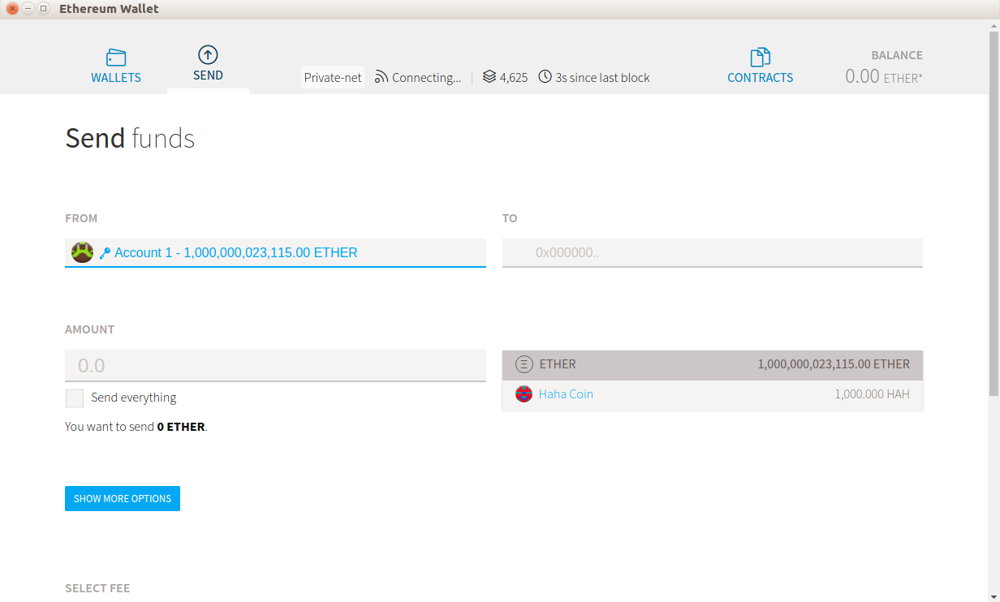

# 在以太坊中创建令牌

在本章中，你将学习如何在以太坊之上创建代币。 代币有多种用途； 它可能是当地社区的当地货币，可能代表一种实物商品，可能是游戏中的虚拟货币，也可能是忠诚度积分。 使用此令牌，你可以构建新的加密货币。 虽然以太坊本身就是一种加密货币，但你可以在它之上构建一种新的加密货币。 以太坊使创建新令牌变得更加容易，这推动了 2017 年许多新加密货币的创建。

本章将涵盖以下主题：

- 如何创建一个简单的代币智能合约
- ERC 20（以太坊代币标准）
- 如何出售你的代币
- 如何自定义你的令牌

## 代币智能合约

使用 Vyper 在以太坊上创建代币很容易。在构建令牌之前，让我们按照初始步骤来准备我们的开发环境。

首先确保你已安装 geth 并且 geth 程序位于 $PATH 环境变量中（这意味着你可以在没有完整路径的情况下调用 geth）：

```sh
$ virtualenv -p python3.6 token-venv
$ source token-venv/bin/activate
(token-venv) $ pip install eth-abi==1.2.2
(token-venv) $ pip install eth-typing==1.1.0
(token-venv) $ pip install py-evm==0.2.0a33
(token-venv) $ pip install web3==4.7.2
(token-venv) $ pip install -e git+https://github.com/ethereum/populus#egg=populus
(token-venv) $ pip install vyper
(token-venv) $ mkdir token_project
(token-venv) $ cd token_project
(token-venv) $ mkdir tests contracts
(token-venv) $ cp ../token-venv/src/populus/populus/assets/defaults.v9.config.json project.json
```

通过将编译键的值更改为以下内容，将 Vyper 支持添加到 project.json：

```python
"compilation": {
    "backend": {
      "class": "populus.compilation.backends.VyperBackend"
    },
    "contract_source_dirs": [
      "./contracts"
    ],
    "import_remappings": []
},
```

Vyper 的最新版本是 0.1.0b6，它破坏了 Populus。开发人员需要一些时间来解决这个问题。如果在你阅读本书时该错误仍未修复，你可以自己修补 Populus。
首先，使用以下命令检查错误是否已修复：

```sh
(token-venv) $ cd voting-venv/src/populus
(token-venv) $ grep -R "compile(" populus/compilation/backends/vyper.py
 bytecode = '0x' + compiler.compile(code).hex()
 bytecode_runtime = '0x' + compiler.compile(code, bytecode_runtime=True).hex()
```

在我们这里的例子中，该错误尚未修复。因此，让我们修补 Populus 以修复该错误。确保你仍在同一目录中（token-venv/src/populus）：

```sh
(token-venv) $ wget https://patch-diff.githubusercontent.com/raw/ethereum/populus/pull/484.patch
(token-venv) $ git apply 484.patch
(token-venv) $ cd ../../../
```

在 token_project 目录中，运行以下命令：

```sh
(token-venv) $ populus chain new localblock
```

然后，使用 init_chain.sh 脚本初始化私有链：

```sh
(token-venv) $ ./chains/localblock/init_chain.sh
```

编辑chains/localblock/run_chain.sh 并将--ipcpath 的值更改为/tmp/geth.ipc。

然后，运行区块链：

```sh
(voting-venv) $ ./chains/localblock/run_chain.sh
```

现在，编辑 project.json 文件。 chains 有一个对象有四个键：tester、temp、ropsten 和 mainnet。向该对象添加一个名为 localblock 的键及其值：

```json
"localblock": {
      "chain": {
        "class": "populus.chain.ExternalChain"
      },
      "web3": {
        "provider": {
          "class": "web3.providers.ipc.IPCProvider",
        "settings": {
          "ipc_path":"/tmp/geth.ipc"
        }
       }
      },
      "contracts": {
        "backends": {
          "JSONFile": {"$ref": "contracts.backends.JSONFile"},
          "ProjectContracts": {
            "$ref": "contracts.backends.ProjectContracts"
          }
        }
      }
    }
```

### Mist

在第 2 章智能合约基础知识和第 3 章使用 Vyper 实现智能合约中，你使用了 Truffle 控制台与智能合约进行交互。现在，我们将使用另一个软件与智能合约进行交互。我们将使用的软件是以太坊钱包 Mist。

为此，请访问 https://github.com/ethereum/mist/releases。如果你使用 Linux Ubuntu，请下载 Mist-linux64-0-11-1.deb 文件。

确保已经安装了 geth 并且 geth 的路径在 $PATH 环境变量中，以便你可以从任何地方调用 geth。
然后你可以安装 Mist，如下所示：

```sh
$ dpkg -i Mist-linux64-0-11-1.deb
```

接下来，运行应用程序，如下所示：

```sh
$ ethereumwallet --rpc /tmp/geth.ipc
```

注意 --rpc /tmp/geth.ipc 标志。我们使用这个标志是因为我们使用 /tmp/geth.ipc 中定义的套接字文件运行私有区块链。

运行应用程序后，你将看到此屏幕。你可以通过单击“添加帐户”按钮来创建以太坊区块链帐户：


就像你在 geth 控制台中所做的那样，你需要提供一个密码来创建一个新帐户：


创建钱包帐户后，你可以通过点击“发送”标签从第一个帐户向这个新帐户发送一些钱：


然后，你可以在收件人字段中插入新帐户的地址。不要忘记包括你要发送的以太币数量，然后单击窗口底部的发送按钮：


你必须填写密码才能创建交易。默认帐户的密码可以在 chains/localblock/password 文件中找到：


很快，你的交易将在区块链中得到确认：


让我们在 token_project/contracts 目录中创建一个简单的代币智能合约：

```python
balances: public(map(address, uint256))

@public
def __init__():
    self.balances[msg.sender] = 10000

@public
def transfer(_to: address, _amount: uint256) -> bool:
    assert self.balances[msg.sender] >= _amount

    self.balances[msg.sender] -= _amount
    self.balances[_to] += _amount

    return True
```

该智能合约以数字方式创建了 10,000 个代币，并将它们全部交给智能合约的所有者。然后，所有者可以使用转移方法将硬币转发到其他帐户。

与创建简单的代币传统 Web 应用程序相比，这个简单的智能合约是特别的，因为一旦部署了这个智能合约，所有者就无法更改代币数量，无论他们多么绝望。如果所有者刚刚执行转移方法将一些硬币转移到另一个帐户的地址，他们就无法再次取回。其他人可以在与其交互之前验证智能合约中的游戏规则。

将此与我们在传统 Web 应用程序中创建的简单令牌进行比较。在此处创建 10,000 个硬币后，你可以通过更新数据库中的硬币数量来更改令牌数量。你可以随意更改规则，这会使其他想要与此应用程序交互的人处于不利地位。

你还可以添加一种方法来增加智能合约中的代币数量：

```python
balances: public(map(address, uint256))
owner: address


@public
def __init__():
    self.balances[msg.sender] = 10000
    self.owner = msg.sender


@public
def transfer(_to: address, _amount: uint256) -> bool:
    assert self.balances[msg.sender] >= _amount

    self.balances[msg.sender] -= _amount
    self.balances[_to] += _amount

    return True

@public
def mint(_new_supply: uint256):
    assert msg.sender == self.owner
    self.balances[msg.sender] = _new_supply
```

看看薄荷方法。这可用于增加所有者余额中的代币。

不同的是，在部署智能合约后，你无法更改游戏规则。如果你部署此版本的智能合约，人们可能会要求提供源代码和编译器的版本来验证代码。如果你不提供源代码，人们可能会拒绝使用你的智能合约。如果你确实提供了源代码，人们可以检查并查看你是否有一种可以随时增加硬币的方法。他们是否接受这条规则取决于他们，但至少在智能合约中，是透明的。

下面的代码块是对这个简单的代币智能合约的测试；这个测试并不详尽，但它为你提供了一个良好的开端。令牌智能合约测试的重要性至关重要。首先，将测试命名为 test_simple_token.py 并将其放入 token_project/tests 目录中。有关完整代码，请参阅以下 GitLab 链接中的代码文件：https://gitlab.com/arjunaskykok/hands-on-blockchain-for-python-developers/blob/master/chapter_08/token_project/tests/test_simple_token.py ：

```python
import pytest
import eth_tester


def test_balance(web3, chain):
    simple_token, _ = chain.provider.get_or_deploy_contract('SimpleToken')

...
...

    with pytest.raises(eth_tester.exceptions.TransactionFailed):
        simple_token.functions.transfer(web3.eth.coinbase, 10).transact({'from': account2})
```

让我们使用 Mist 将我们的简单令牌智能合约（第一个，没有 mint 功能）部署到区块链。

为此，请单击“合同”选项卡，然后单击“部署新合同”按钮：


在 Deploy contract 屏幕中，选择要从中部署的帐户，然后单击 CONTRACT BYTE CODE 选项卡。在那里插入我们的简单令牌智能合约的字节码。当然，你可以先编译智能合约的源代码，然后从 token_project/build/contracts.json 中获取我们的简单令牌的字节码。找到带有字节码键的值，然后复制不带双引号的值，将其粘贴到合同字节码选项卡中。执行此操作后，单击“部署”按钮（在以下屏幕截图中不可见；你必须向下滚动）并像往常一样在密码对话框中填写密码：


很快，你的智能合约创建将在区块链中得到确认。
然后，要与智能合约进行交互，请单击 CONTRACTS 选项卡，然后单击 WATCH CONTRACT 按钮。然后会出现一个对话框。填写智能合约的地址，然后填写智能合约本身的名称。你可以在此处应用任何你喜欢的名称。接下来，在 JSON INTERFACE 字段内填写智能合约的 json 接口。你可以从 token_project/build/contracts.json 获取 json 接口（在 contracts.json 文件中，找到 abi 键的值）。观看智能合约的表单如下所示：


现在，你的简单代币智能合约将出现在屏幕上。点击 SIMPLE TOKEN 标签进入此智能合约的屏幕：


你可以使用 Balances 方法（Mist 喜欢资本化方法）读取智能合约所有者的余额。在 Arg 0 - 地址字段中插入所有者帐户的地址，然后按 Enter。由此，你将获得 10,000 作为输出。
现在，让我们转移一些代币。选择一个函数。目前，只有一个函数：Transfer（transfer 方法的大写版本）。在 Execute from 字段中选择 Account 1，选择 Account 2 address in to，然后在金额字段中插入 20。最后，点击 EXECUTE 按钮：


等待确认后再检查目标账户的余额。在余额字段中输入目标地址，然后按 Enter。这将为你提供 20 作为输出：


## ERC20

你很有可能听说过 ERC20。当一种新的加密货币问世时，通常出现的第一个问题是——它是 ERC20 代币吗？人们对 ERC20 代币的假设是错误的；他们认为这是一种基于以太坊的加密货币。嗯，从技术上讲，这是真的，但它并没有说明整个故事。 ERC20 是以太坊中用于创建代币的标准。我们刚刚创建的简单代币不符合 ERC20 标准。是的，它是一个数字代币智能合约，但它不是 ERC20 代币。 ERC20 是我们看到 2017 年新加密货币数量增加的众多原因之一。然而，ERC20 并不是在以太坊之上创建代币的必要条件。

要创建 ERC20 代币，你必须实现以下方法：

```python
function totalSupply() public view returns (uint256)
function balanceOf(address _owner) public view returns (uint256 balance)
function transfer(address _to, uint256 _value) public returns (bool success)
function transferFrom(address _from, address _to, uint256 _value) public returns (bool success)
function approve(address _spender, uint256 _value) public returns (bool success)
function allowance(address _owner, address _spender) public view returns (uint256 remaining)
event Transfer(address indexed _from, address indexed _to, uint256 _value)
event Approval(address indexed _owner, address indexed _spender, uint256 _value)
```

这些方法使用 Solidity 语法。以下代码块中给出了一些可选方法，你也可以实现：

```python
function name() public view returns (string)
function symbol() public view returns (string)
function decimals() public view returns (uint8)
```

那么这个 ERC20 代币有什么特别之处呢？这是创建令牌智能合约时的义务吗？为什么我们不能在不满足 ERC20 标准的情况下创建数字代币？

实际上，你不必遵循此标准；没有法律强制你创建 ERC20 代币。例如，ERC20 标准要求你在 totalSupply 方法中告诉用户令牌的总量。但是，你可以创建一个名为 taylorSwiftIsTheBest 的方法来返回令牌的总供应量，然后你可以创建一个文档来解释此方法。

但是，如果你遵循 ERC20 代币标准，则有一些优势：

- 首先，它使用户更容易审核你的智能合约。
- 其次，你的 ERC20 代币将被以太坊钱包自动识别，例如 Mist（我们刚刚使用的钱包）和 Metamask（以太坊钱包是一个 Firefox/Opera/Chrome 插件）。
- 第三，加密货币交易所更容易列出你的代币。基本上，它使每个人的生活更轻松。

但是，你应该将 ERC20 标准视为指导，而不是严格的法律。你不必 100% 地遵循 ERC20 标准。并非所有建立在以太坊之上的流行代币都 100% 符合 ERC20。其中一个例子是 Golem 代币智能合约。这不会实现批准方法等。你可以通过以下链接阅读 Golem 代币智能合约的源代码：https://etherscan.io/token/0xa74476443119A942dE498590Fe1f2454d7D4aC0d#readContract。

话虽如此，让我们创建一个 ERC20 代币。此代码已从 Vyper 项目中包含的官方示例 (https://github.com/ethereum/vyper/blob/master/examples/tokens/ERC20.vy) 中修改而来。有关完整修改后的代码，请参阅以下 GitLab 链接中的代码文件：https://gitlab.com/arjunaskykok/hands-on-blockchain-for-python-developers/blob/master/chapter_08/token_project/contracts/ERC20Token。维：

```python
Transfer: event({_from: indexed(address), _to: indexed(address), _value: uint256})
Approval: event({_owner: indexed(address), _spender: indexed(address), _value: uint256})

...
...

@public
@constant
def allowance(_owner: address, _spender: address) -> uint256:
    return self.allowed[_owner][_spender]
```

让我们一行一行地描述这个智能合约：

```python
Transfer: event({_from: indexed(address), _to: indexed(address), _value: uint256})
Approval: event({_owner: indexed(address), _spender: indexed(address), _value: uint256})
```

你必须定义两种事件，传输和批准。如果你愿意，你可以定义更多事件。发生转移硬币时使用 Transfer 事件，因此智能合约的用户可以订阅此事件。当你批准为帐户花费的金额时，将使用批准事件：

```python
name: public(bytes[10])
symbol: public(bytes[3])
totalSupply: public(uint256)
decimals: public(uint256)
balances: map(address, uint256)
allowed: map(address, map(address, uint256))
```

有六个变量。第一个变量是令牌的名称。我使用 bytes[10] 作为数据类型，因为我的令牌名称少于 10 个字节。随意改变长度。第二个变量是代币的符号；名称和符号不同。例如，以太坊加密货币的名称是 Ethereum，但符号是 ETH。通常，符号的字符长度为3。第三个变量是totalSupply，即token总数，第四个变量是小数。你知道 1 个比特币是 100,000,000 satoshis，因此在比特币算法中总共将创建 21,000,000 个比特币。因此，我们可以说比特币算法中的总供应量为 2,100,000,000,000,000。小数点是 8（因为 1 个比特币是 100,000,000 或 108）。此外，第五个变量是余额。这是跟踪帐户地址余额的变量。允许使用 final 变量，这是一个嵌套映射。这旨在跟踪已被批准从另一个账户的余额中花费一定数量的以太币的账户。如果这还不清楚，我们稍后会深入讨论。现在，我们将继续介绍这个 ERC20 代币智能合约的初始化方法，如以下代码块所示：

```python
@public
def __init__():
    _initialSupply: uint256 = 1000
    _decimals: uint256 = 3
    self.totalSupply = _initialSupply * 10 ** _decimals
    self.balances[msg.sender] = self.totalSupply
    self.name = 'Haha Coin'
    self.symbol = 'HAH'
    self.decimals = _decimals
    log.Transfer(ZERO_ADDRESS, msg.sender, self.totalSupply)
```

这就是我们在智能合约中初始化代币的方式。我们在空中创建代币，然后将代币的所有硬币交给所有者。然后，我们设置令牌的名称和符号以及十进制数。最后，我们发出传输事件。地址是 ZERO_ADDRESS 是 0x000000000000000000000000000000000000000。这是智能合约所有者从无处转移硬币的指标：

```python
@public
@constant
def balanceOf(_owner: address) -> uint256:
    return self.balances[_owner]
```

此方法用于返回特定帐户的余额：

```python
@public
def transfer(_to: address, _amount: uint256) -> bool:
    assert self.balances[msg.sender] >= _amount
    self.balances[msg.sender] -= _amount
    self.balances[_to] += _amount
    log.Transfer(msg.sender, _to, _amount)
 
    return True
```

这是转移硬币的方法。首先，你要确保发件人的余额有足够的硬币可以花费。然后，你只需从传输进程数中减去发送方的余额，并将该金额添加到目的地的余额中。不要忘记用事件记录此事务：

```python
@public
def transferFrom(_from: address, _to: address, _value: uint256) -> bool:
    assert _value <= self.allowed[_from][msg.sender]
    assert _value <= self.balances[_from]

    self.balances[_from] -= _value
    self.allowed[_from][msg.sender] -= _value
    self.balances[_to] += _value
    log.Transfer(_from, _to, _value)

    return True

@public
def approve(_spender: address, _amount: uint256) -> bool:
    self.allowed[msg.sender][_spender] = _amount
    log.Approval(msg.sender, _spender, _amount)

    return True
```

我们先来看看批准方法。所以每个账户都有一个叫做 allowed 的映射，但是这个映射是做什么用的呢？这是每个帐户可以让其他帐户花钱的方式。例如，假设有 5 个账户——账户 A、账户 B、账户 C、账户 D 和账户 E。

账户 A 有 50 个硬币的余额和一个名为 allowed 的映射变量，该变量具有账户 B、账户 C、账户 D 和账户 E 密钥。此映射的值如下：

```
Account B → 3 coins
Account C → 7 coins
Account D → 2 coins
Account E → 3 coins
```

这意味着账户B最多可以从账户A的余额中支出3个币，账户C最多可以从账户A的余额中支出7个币，账户D最多可以从账户A的余额中支出2个币，并且账户 E 最多可以从账户 A 的余额中花费 3 个币。

在批准方法中，我们有以下行：

```python
self.allowed[msg.sender][_spender] = _amount
```

为了保证账户B可以从账户A的余额中消费3个币，账户A调用approve方法，_spender设置为账户B的地址，_amount设置为3个币。不要忘记记录此批准。

然后，如果账户 B 想要花费部分或全部 3 个硬币，账户 B 可以调用 transferFrom 方法，如下所示：

```python
assert _value <= self.allowed[_from][msg.sender]
```

transferFrom 方法中的第一个断言是确保账户 B 花费的币不超过 3 个：

```python
assert _value <= self.balances[_from]
```

我们确保账户 A 的余额中至少有 3 个硬币，如下所示：

```python
self.balances[_from] -= _value
self.allowed[_from][msg.sender] -= _value
self.balances[_to] += _value
log.Transfer(_from, _to, _value)
```

然后，我们从账户 A 的余额中减去支出金额，以及账户 A 对账户 B 的津贴。在此之后，我们增加目标账户的余额。不要忘记将此交易记录为转移事件。

最后一种方法是检查这个津贴的映射：

```python
@public
@constant
def allowance(_owner: address, _spender: address) -> uint256:
    return self.allowed[_owner][_spender]
```

这用于确定账户 B 可以从账户 A 的余额中支出多少。

说到这里，你可能会问这个方法的意义何在。如果我们想让账户 B 以账户 A 的名义花费一些以太币，为什么不直接将数量的硬币转移到账户 B？例如，如果账户 A 允许账户 B 从账户 A 的余额中花费 5 个币，这意味着账户 A 让账户 B 从账户 A 的余额中直接将 5 个币发送到账户 B 的地址。那么，为什么账户A不直接向账户B的地址发送5个币来省事呢？如果账户 B 改变主意，他们可以将代币金额退还给账户 A。

通常，我们不会允许普通帐户代表我们消费。但是，我们确实允许智能合约执行此操作。我们希望允许智能合约花费我们的钱有很多正当理由。其中一个原因是去中心化交易所智能合约案例，在这种情况下，你希望让去中心化交易所智能合约出售你的代币。假设你创建了 1,000 个 HHH 硬币，然后你想在去中心化交易所出售其中的一些。因此，你允许这个去中心化交易所代表你花费一些硬币。也许你批准去中心化交易所花费 30 个 HHH 币。这个去中心化交易所可以尝试代表你出售 30 个 HHH 币。你不会因为你只想出售 30 个 HHH 代币而允许去中心化交易智能合约访问你余额中的所有代币。虽然你可以审计智能合约以确保智能合约不会试图窃取你的硬币，但最好有另一层安全保护。批准方法就是这样一个层。

编译你的代币智能合约并部署它，就像以前一样。

执行此操作后，转到“合同”选项卡，然后单击“手表令牌”按钮。在添加代币窗口中，插入你的 ERC20 智能合约地址。然后，其他字段（例如令牌名称、令牌符号和最小单位的小数位）将自动填写。这就是我们应该实施 ERC20 标准的原因之一：


添加令牌后，你应该会在合同屏幕上看到 HAHA COIN 标签：


然后，在 SEND 选项卡中，选择 ERC20 智能合约的所有者，然后选择 Haha Coin 而不是 ether。向账户2发送1000个哈哈币，然后等待确认：



现在，在同一选项卡中选择帐户 2；你会看到账户 2 现在有 1,000 个哈哈币：


所有兼容 ERC20 的钱包，例如 Mist 和 MetaMask，都可以轻松识别你的代币并与之交互。加密货币交易背后的人在将你的 ERC20 代币集成到他们的交易中时也不会有任何技术困难。想象一下，你不遵循 ERC20 标准，并且你将一种转移硬币的方法命名为tailorSwiftTransferCoin。在这种情况下，你必须先为用户构建自定义钱包，然后他们才能与你的令牌进行交互。

这是对这个 ERC20 代币的测试。请记住，此测试并不全面。有关完整代码，请参阅以下 GitLab 链接中的代码文件：https://gitlab.com/arjunaskykok/hands-on-blockchain-for-python-developers/blob/master/chapter_08/token_project/tests/test_erc20_token.py ：

```python
import pytest
import eth_tester

def test_balance(web3, chain):
    erc20_token, _ = chain.provider.get_or_deploy_contract('ERC20Token')

    token_name = erc20_token.functions.name().call()
    token_symbol = erc20_token.functions.symbol().call()
    decimals = erc20_token.functions.decimals().call()
    total_supply = erc20_token.functions.totalSupply().call()
    balance = erc20_token.functions.balanceOf(web3.eth.coinbase).call()

...
...

    assert balance_account1 == 999990
    assert balance_account2 == 0
    assert balance_account3 == 10
    assert allowance == 90
```

除了转移硬币方法外，该测试还测试了批准和转移方法。

## 出售代币

现在我们有了代币，是时候出售代币了。我们想出售我们的以太币定制代币。与比特币平台相比，在以太坊平台上创建众包令牌非常容易。你已经知道如何在智能合约中创建一种方法来接受以太币。你还知道如何增加某些帐户的代币余额。要出售代币，你必须将这两件事结合起来。就这样。

这是初始硬币产品 (ICO) 的核心。以太坊的货币是有价值的。虽然以太币的价格会波动，但 1 个以太币的价值在 100 美元左右。人们会为一些以太币支付真钱，但不会为我们的定制代币支付真钱。为了让我们的自定义令牌有价值，我们必须首先让它有用，或者至少让它看起来有用。但要做到这一点，我们需要资本。那么为什么不向早期采用者出售我们的一些代币（比如 60%）呢？然后他们可以用以太币购买我们的自定义代币。然后，我们可以在将其转换为法定货币之前提取以太币，这样我们就可以雇用更多的程序员并租用办公室来开发我们的新加密货币。这是基本思想。当然，由于ICO涉及大量资金，因此也吸引了掠夺者。

这是众筹代币智能合约。这与我们之前的 ERC20 代币智能合约的源代码相同，但略有不同。将此智能合约命名为 CrowdSaleToken.vy 并将其保存在 token_project/contracts 目录中。有关完整代码，请参阅以下 GitLab 链接中的代码文件：https://gitlab.com/arjunaskykok/hands-on-blockchain-for-python-developers/blob/master/chapter_08/token_project/contracts/CrowdSaleToken.vy ：

```python
Transfer: event({_from: indexed(address), _to: indexed(address), _value: uint256})
Approval: event({_owner: indexed(address), _spender: indexed(address), _value: uint256})
Payment: event({_buyer: indexed(address), _value: uint256(wei)})

name: public(bytes[10])
symbol: public(bytes[3])
totalSupply: public(uint256)
decimals: public(uint256)
balances: map(address, uint256)
ethBalances: public(map(address, uint256(wei)))
allowed: map(address, map(address, uint256))

...
...

@public
@constant
def allowance(_owner: address, _spender: address) -> uint256:
    return self.allowed[_owner][_spender]
```

让我们逐行讨论这个智能合约：

```python
Transfer: event({_from: indexed(address), _to: indexed(address), _value: uint256})
Approval: event({_owner: indexed(address), _spender: indexed(address), _value: uint256})
Payment: event({_buyer: indexed(address), _value: uint256(wei)})
```

我们在另外两个事件之上添加了一个名为 Payment 的事件。当有人用以太币支付代币时，将调用此事件：

```python
name: public(bytes[10])
symbol: public(bytes[3])
totalSupply: public(uint256)
decimals: public(uint256)
balances: map(address, uint256)
ethBalances: public(map(address, uint256(wei)))
allowed: map(address, map(address, uint256))

beneficiary: public(address)
minFundingGoal: public(uint256(wei))
maxFundingGoal: public(uint256(wei))
amountRaised: public(uint256(wei))
deadline: public(timestamp)
price: public(uint256(wei))
fundingGoalReached: public(bool)
crowdsaleClosed: public(bool)
```

我们添加了几个新变量，即 ethBalances、beneficiary、minFundingGoal、maxFundingGoal、amountRaised、deadline、price、fundingGoalReached 和 crowdsaleClosed。

ethBalances 是一个变量，旨在跟踪买家在此智能合约中花费了多少以太币。我们想跟踪这个数字，因为如果我们不能筹集到必要的数量，我们想退还以太币。 beneficiary 是一个变量，用于跟踪谁启动了这个智能合约。该受益人变量是唯一能够提取 ethers.

minFundingGoal 和 maxFundingGoal 的帐户，这些变量旨在确保筹集的金额大于最低融资目标并低于最高融资目标。

amountRaised 是一个变量，旨在跟踪我们在此智能合约中筹集了多少以太币。

截止日期是一个变量，用于跟踪此众筹过程的截止日期。

价格是我们想用以太币来评估我们的数字代币的方式。此变量旨在回答买家可以用 1 个以太币获得多少代币。

FundingGoalReached 是一个布尔变量，表示我们的智能合约是否达到了我们的目标。

crowdsaleClosed 是一个布尔变量，说明我们的智能合约是否仍然接收购买过程。我们将从初始化方法开始：

```python
@public
def __init__():
    _initialSupply: uint256 = 100
    _decimals: uint256 = 2
    self.totalSupply = _initialSupply * 10 ** _decimals
    self.name = 'Haha Coin'
    self.symbol = 'HAH'
    self.decimals = _decimals
    self.beneficiary = msg.sender
    self.balances[msg.sender] = self.totalSupply
    self.minFundingGoal = as_wei_value(30, "ether")
    self.maxFundingGoal = as_wei_value(50, "ether")
    self.amountRaised = 0
    self.deadline = block.timestamp + 3600 * 24 * 100 # 100 days
    self.price = as_wei_value(1, "ether") / 100
    self.fundingGoalReached = False
    self.crowdsaleClosed = False
```

该智能合约的总代币供应量为 10,000。我们希望筹集至少 30 个以太币，最多筹集 50 个以太币。

截止日期设置为从智能合约部署到区块链之日起 100 天。 block.timestamp 大约是当前时间，或包含此智能合约代码的块被确认的时间。

1 枚硬币的价格设置为 0.01 以太币。这意味着 1 以太币可以购买 100 枚我们的代币。然后，我们进入智能合约中的默认函数：

```python
@public
@payable
def __default__():
    assert msg.sender != self.beneficiary
    assert self.crowdsaleClosed == False
    assert self.amountRaised + msg.value < self.maxFundingGoal
    assert msg.value >= as_wei_value(0.01, "ether")
    self.ethBalances[msg.sender] += msg.value
    self.amountRaised += msg.value
    tokenAmount: uint256 = msg.value / self.price
    self.balances[msg.sender] += tokenAmount
    self.balances[self.beneficiary] -= tokenAmount
    log.Payment(msg.sender, msg.value)
```

这是用户可以用来购买代币的方法。 \_\_default\_\_ 是一个默认的后备函数。如果有人没有在智能合约上执行一个方法并支付以太币，这个函数就会被执行。实际上，我们不必使用默认功能来接受付款。你可以使用标准方法，就像你在之前的智能合约中所做的那样。我们简单地使用默认函数来解释这个概念。

在这种付款方式中，我们确保买方不是受益人，众筹仍在进行，并且通过发送到这种方式的以太币筹集的金额不超过 50 以太币的最大融资目标。最后，每次购买行为必须至少为 0.01 以太币。然后，我们增加该买家的以太币余额，并增加筹集的以太币数量。然后我们通过将以太币的数量除以 1 个硬币的价格来检查他们购买的硬币数量。

最后，我们必须为这个买家增加代币余额，并减少智能合约所有者的代币余额。不要忘记记录此事件。然后，我们转到可以检查是否达到目标的方法：

```python
@public
def checkGoalReached():
    assert block.timestamp > self.deadline
    if self.amountRaised >= self.minFundingGoal:
        self.fundingGoalReached = True
    self.crowdsaleClosed = True
```

首先，我们确保只有在截止日期过去后才能成功执行此方法。如果筹集的金额超过最低融资目标，我们会将 fundingGoalReached 变量设置为 true。然后，最后，我们将 crowdsaleClosed 变量设置为 true。

为简单起见，我们只检查 block.timestamp 变量是否大于截止日期。但是，区块中的时间戳可以填充矿工喜欢的任何内容；区块被确认的时间不一定是当前时间。但是，当然，如果矿工将过去的时间戳作为 block.timestamp 的值，所有其他矿工都会拒绝它。类似地，如果矿工将未来的时间戳（例如，提前一年）作为 block.timestamp 的值，那么所有其他矿工也会拒绝它。为了使检查截止日期过程更安全，你必须将其与 block.number 结合使用以检查自此智能合约启动以来已确认的块数。然后，我们进入智能合约经理可以提取智能合约中累积的以太币的方法：

```python
@public
def safeWithdrawal():
    assert self.crowdsaleClosed == True
    if self.fundingGoalReached == False:
        if msg.sender != self.beneficiary:
            if self.ethBalances[msg.sender] > 0:
                self.ethBalances[msg.sender] = 0
                self.balances[self.beneficiary] += self.balances[msg.sender]
                self.balances[msg.sender] = 0
                send(msg.sender, self.ethBalances[msg.sender])
    if self.fundingGoalReached == True:
        if msg.sender == self.beneficiary:
            if self.balance > 0:
                send(msg.sender, self.balance)
```

safeWithdrawal 方法的运行方式不同，具体取决于是否实现了融资目标。在前面的方法中，我们确保众筹已经结束。如果没有达到融资目标，我们会确保每个买家都能拿回他们的以太币。如果达到融资目标，那么我们确保受益人可以提取智能合约中的所有以太币。其余方法与之前的智能合约相同。但是，我们添加了许多断言以确保这些方法只能在众筹结束后才能执行。

以下代码块是对该众筹智能合约的测试。有关完整代码文件，请参阅以下 GitLab 链接中的代码文件：https://gitlab.com/arjunaskykok/hands-on-blockchain-for-python-developers/blob/master/chapter_08/token_project/tests/test_crowd_sale_token。比：

```python
import pytest
import eth_tester
import time

def test_initialization(web3, chain):
    crowd_sale_token, _ = chain.provider.get_or_deploy_contract('CrowdSaleToken')

...
...

    assert abs(beforeCrowdsaleEthBalanceAccount2 - afterCrowdsaleEthBalanceAccount2 - web3.toWei('40', 'ether')) < web3.toWei('1', 'gwei')
    assert abs(afterCrowdsaleEthBalanceAccount1 - beforeCrowdsaleEthBalanceAccount1 - web3.toWei('40', 'ether')) < web3.toWei('1', 'gwei')
```

看看 test_withdrawal 和 test_refund，尤其是这些行：

```python
# move forward 101 days
web3.testing.timeTravel(int(time.time()) + 3600 * 24 * 101)
web3.testing.mine(1)
```

我们不想等待 100 天，而是想操纵测试中的时钟，使其相信截止日期已到（从现在起 101 天）。因此，我们假装已经过了 101 天，然后我们确认了 1 个区块。因此，智能合约中的 block.timestamp 变量将是 101 天后。

## 稳定币

你已经创建了一个可以自主销售的数字代币。但是，你不应将自己限制在通用令牌上。通过添加更多方法来丰富你的智能合约，你可以在你的代币智能合约中更具创意。你应该添加哪些方法取决于你的智能合约的目的。在游戏中用作货币的代币智能合约与在供应链跟踪系统中使用的代币智能合约有不同的方法。

让我们创建一个稳定币智能合约。这是一种与法定货币（例如美元）挂钩的代币智能合约。我们还希望这个智能合约成为一家银行，作为所有者，我们可以在其中冻结账户。

我们的工作可以基于 ERC 20 代币智能合约。我们只需要添加三个方法——一个冻结账户的方法，一个添加一些硬币的方法，一个扔掉一些硬币的方法。

这就是智能合约。你可以参考以下 GitLab 链接中的代码文件以获取完整代码文件：https://gitlab.com/arjunaskykok/hands-on-blockchain-for-python-developers/blob/master/chapter_08/token_project/contracts/StableCoin.vy：

```python
Transfer: event({_from: indexed(address), _to: indexed(address), _value: uint256})
Approval: event({_owner: indexed(address), _spender: indexed(address), _value: uint256})
Freeze: event({_account: indexed(address), _freeze: bool})

name: public(bytes[10])
symbol: public(bytes[3])
totalSupply: public(uint256)
decimals: public(uint256)
balances: map(address, uint256)
allowed: map(address, map(address, uint256))
frozenBalances: public(map(address, bool))
owner: public(address)

...
...

@public
@constant
def allowance(_owner: address, _spender: address) -> uint256:
    return self.allowed[_owner][_spender]
```

让我们逐行讨论智能合约：

```python
Transfer: event({_from: indexed(address), _to: indexed(address), _value: uint256})
Approval: event({_owner: indexed(address), _spender: indexed(address), _value: uint256})
Freeze: event({_account: indexed(address), _freeze: bool})
```

我们需要在前面的代码中添加另一个用于冻结帐户操作的事件。

我们在 ERC20 代币智能合约的变量之上添加了两个新变量，即frozenBalances 和 owner：

```python
name: public(bytes[10])
symbol: public(bytes[3])
totalSupply: public(uint256)
decimals: public(uint256)
balances: map(address, uint256)
allowed: map(address, map(address, uint256))
frozenBalances: public(map(address, bool))
owner: public(address)
```

frozenBalances 是一个映射变量，用于跟踪哪些帐户已被冻结。 owner 是一个变量，用于跟踪智能合约的所有者。

在这个初始化方法中，我们将 owner 变量设置为启动这个智能合约的账户：

```python
@public
def __init__():
    _initialSupply: uint256 = 1000
    _decimals: uint256 = 3
    self.totalSupply = _initialSupply * 10 ** _decimals
    self.balances[msg.sender] = self.totalSupply
    self.name = 'Haha Coin'
    self.symbol = 'HAH'
    self.decimals = _decimals
    self.owner = msg.sender
    log.Transfer(ZERO_ADDRESS, msg.sender, self.totalSupply)
```

在以下方法中，我们确保只有所有者才能调用此方法：

```python
@public
def freezeBalance(_target: address, _freeze: bool) -> bool:
    assert msg.sender == self.owner
    self.frozenBalances[_target] = _freeze
    log.Freeze(_target, _freeze)

    return True
```

然后，我们设置frozenBalances 映射变量的值。真值表示账户被冻结。不要忘记调用 Freeze 事件。

下一个方法是增加硬币：

```python
@public
def mintToken(_mintedAmount: uint256) -> bool:
    assert msg.sender == self.owner
    self.totalSupply += _mintedAmount
    self.balances[msg.sender] += _mintedAmount
    log.Transfer(ZERO_ADDRESS, msg.sender, _mintedAmount)

    return True
```

我们也增加了总供应量和所有者账户的余额。

以下方法旨在燃烧硬币：

```python
@public
def burn(_burntAmount: uint256) -> bool:
    assert msg.sender == self.owner
    assert self.balances[msg.sender] >= _burntAmount
    self.totalSupply -= _burntAmount
    self.balances[msg.sender] -= _burntAmount
    log.Transfer(msg.sender, ZERO_ADDRESS, _burntAmount)

    return True
```

这与之前的方法类似，但其目的是减少总供应量中的硬币数量。为什么要消灭硬币？这有很多正当的理由。假设你正在使用此智能合约跟踪美元。假设你的口袋里有 10,000 美元。因此，智能合约中的总供应量为 10,000（1 个硬币与 1 美元挂钩），但有一天，你的 10,000 美元中有 2,000 美元被小偷偷走了。为确保智能合约的一致性，你使用此方法销毁 2,000 个硬币。

其余方法与 ERC20 代币智能合约下完全相同，但有两个例外：transfer 和 transferFrom。我们在这些方法中有额外的断言：

```python
assert self.frozenBalances[msg.sender] == False
```

下面的代码块是对这个智能合约的测试。你可以参考以下 GitLab 链接中的代码文件以获取完整代码：https://gitlab.com/arjunaskykok/hands-on-blockchain-for-python-developers/blob/master/chapter_08/token_project/tests/test_stable_token.py:

```python
import pytest
import eth_tester
import time

def test_initialization(web3, chain):
    stable_coin, _ = chain.provider.get_or_deploy_contract('StableCoin')

...
...

    new_total_supply = stable_coin.functions.totalSupply().call()
    assert new_total_supply == 999900
```

## 概括

在本章中，你学习了如何在以太坊上创建代币。 你使用了以太坊钱包 Mist 来部署合约并与代币智能合约进行交互。 然后，你通过创建某些方法的实现来实现 ERC 20 标准来创建令牌智能合约。 你还看到了这些标准方法如何帮助 Mist 识别你的令牌。 然后，你创建了一种以以太币出售代币的方法。 你在这个智能合约中设置了截止日期，然后你在智能合约的测试中使用了时间旅行的方法来模拟过期的截止日期。 最后，你添加了其他方法来冻结和解冻其他帐户。 你使用的示例是一种稳定币，它将币与现实世界的资产（例如法定资产）挂钩。

在下一章中，你将创建一个可以处理以太币和 ERC20 代币的加密货币钱包。

## 进一步阅读

- https://github.com/ethereum/EIPs/blob/master/EIPS/eip-20.md
- https://ethereum.org/token