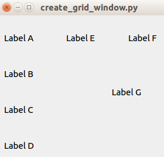
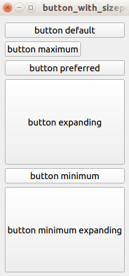

# 加密货币钱包

在本章中，你将学习如何构建桌面加密货币钱包。 你仍将使用相同的 GUI 库、Qt for Python 或 PySide2 来创建桌面应用程序。 这个加密货币钱包可以发送以太币和 ERC20 代币。 在构建此加密货币钱包之前，你将学习 PySide2 库的高级功能，例如选项卡、组合框、大小策略以及添加拉伸以控制布局中小部件的分布。 最重要的是，你将测试集成到应用程序中。

在本章中，我们将讨论以下主题：

- PySide2 库的高级功能
- Pytest Qt，一个用于测试 Python 应用程序 Qt 的库
- 如何建立一个加密货币钱包
- 构建加密货币钱包时的一些注意事项

## PySide2 库的高级功能

本章要求读者对 PySide2 库有一定的了解。如果你还没有读过，你应该先阅读第 7 章，前端去中心化应用程序，因为本章是基于那一章。如果你熟悉使用 PySide2 构建 GUI，那么你就具备构建桌面加密货币钱包的必要技能，至少从用户界面 (UI) 的角度来看是这样。但是，你构建的应用程序会让用户感到不适。例如，如果你在水平布局中合并了一个按钮，并且该按钮是水平布局中唯一的小部件，则当你调整具有水平布局的窗口的大小时，该按钮将被左右拉伸。如果这不是你想要发生的，你需要一种方法来告诉按钮保持其宽度。

因此，让我们从 PySide2 库中学习其他功能，例如选项卡、大小策略和网格布局，以便我们掌握使应用程序的 UI 更具吸引力的技能。我们的应用程序不会赢得 Apple 最佳设计奖，但至少对用户来说不会那么刺耳。

此外，在第 7 章，前端去中心化应用程序中，我们忽略了测试。由于加密货币钱包应用程序是一种处理人们资金的应用程序，因此出错的代价是高昂的。因此，我们需要在用户之前捕获任何错误。因此，我们应该为我们的加密货币钱包编写适当的测试。但是，我们将专注于测试加密货币钱包的 UI 部分。我们不会专注于测试内部方法。换句话说，我们的测试将是集成测试。

> 如果你还没有安装 Qt 库，请安装。请阅读第 7 章，前端去中心化应用程序，以获取有关如何执行此操作的指导。执行此操作后，使用以下命令为你的项目创建虚拟环境：

```sh
$ virtualenv -p python3.6 wallet-venv
$ source wallet-venv/bin/activate
(wallet-venv) $ pip install PySide2
(wallet-venv) $ pip install web3==4.7.2
```

我们还想安装一个测试库来测试我们的应用程序，这可以通过以下命令来完成：

```sh
(wallet-venv) $ pip install pytest-qt
```

现在所有的库都已经设置好了，让我们编写一个简单的应用程序来测试它。

### 测试应用

创建一个名为 advanced_course_qt 的目录。我们可以把所有的教程文件放在这里。将第一个脚本命名为 button_and_label.py 并使用以下代码为该按钮创建按钮和标签（请参阅以下 GitLab 链接上的代码文件以获取完整代码：https://gitlab.com/arjunaskykok/hands-on-blockchain-for-python-developers/blob/master/chapter_09/advanced_course_qt/button_and_label.py）：

```python
from PySide2.QtWidgets import QWidget, QApplication, QLabel, QPushButton, QVBoxLayout
from PySide2.QtCore import Qt
import sys

class ButtonAndLabel(QWidget):

...
...

if __name__ == "__main__":

    app = QApplication(sys.argv)
    button_and_label = ButtonAndLabel()
    button_and_label.show()
    sys.exit(app.exec_())
```

运行前面的代码来查看这个应用程序是关于什么的。该应用程序由一个按钮和一个标签组成：


如果你点击该按钮，标签上的文字将发生变化，如下面的屏幕截图所示：


所以让我们测试这个应用程序。将测试命名为 test_button_and_label.py 并将其放在同一目录中。将以下代码块用于测试应用程序：

```python
from button_and_label import ButtonAndLabel
from PySide2 import QtCore


def test_button_and_label(qtbot):
    widget = ButtonAndLabel()
    qtbot.addWidget(widget)

    assert widget.label.text() == "label: before clicked"

    qtbot.mouseClick(widget.button, QtCore.Qt.LeftButton)

    assert widget.label.text() == "label: after clicked
```

使用以下命令运行测试：

```sh
(wallet-venv) $ pytest test_button_and_label.py
```

> 请注意，```(wallet-venv) $ python test_button_and_label.py``` 命令是一个通常用于运行测试的可忽略的错误。不要上当！

在这个测试脚本中，我们导入了我们的小部件类。然后，我们创建一个名称以 test_ 开头的测试方法。该方法有一个名为 qtbot 的参数。不要改变它的名字。 qtbot 是一个特殊名称，不得更改。在此方法中，qtbot 可用于与小部件类进行交互。

首先，我们实例化一个我们想要测试的小部件类。然后，我们使用 qtbot 的 addWidget 方法添加该小部件实例：

```python
qtbot.addWidget(widget)
```

然后，我们在点击按钮之前测试标签变量上的文本：

```python
assert widget.label.text() == "label: before clicked"
```

如你所见，我们可以从小部件访问标签。这是因为我们使用以下代码在 button_and_label.py 中声明了标签变量：

```python
self.label = QLabel("label: before clicked")
```

如果你在 button_and_label.py 中使用以下代码声明标签：

```python
label = QLabel("label: before clicked")
```

那么你将无法从测试中的小部件实例访问标签。当然，你可以通过创建一个变量来保存标签文本来规避这种情况。但是，使标签成为小部件实例属性是测试标签文本最简单的方法。你将在所有进一步的测试中使用此策略。简而言之，如果你想测试小部件（例如标签、按钮或组合框），请将该小部件作为其父小部件实例的属性。然后，我们继续讨论如何单击按钮小部件：

```python
qtbot.mouseClick(widget.button, QtCore.Qt.LeftButton)
```

要在测试期间单击按钮，请使用 qtbot 中的 mouseClick 方法。 qtbot 的 mouseClick 方法的第一个参数是一个按钮小部件，或者是接受点击事件的东西。第二个参数是检测鼠标点击事件性质的选项。这种情况下的测试只接受左键点击。

下面的代码是测试并显示一个标签的文本点击按钮后：

```python
assert widget.label.text() == "label: after clicked"
```

在构建 GUI 应用程序时，有时我们必须显示对象列表。在我们的加密货币钱包中，该列表可以包含帐户。因此，让我们为该场景编写一个测试。但是，首先，我们必须创建一个脚本来显示对象列表。将脚本命名为 button_and_list.py 并为脚本使用以下代码块（有关完整代码，请参阅以下 GitLab 链接上的代码文件：https://gitlab.com/arjunaskykok/hands-on-blockchain-for-python-developers/blob/master/chapter_09/advanced_course_qt/button_and_list.py）：

```python
from PySide2.QtWidgets import QWidget, QApplication, QLabel, QPushButton, QVBoxLayout
from PySide2.QtCore import Qt
import sys


class ButtonAndList(QWidget):
    
...
...

if __name__ == "__main__":

    app = QApplication(sys.argv)
    button_and_list = ButtonAndList()
    button_and_list.show()
    sys.exit(app.exec_())
```

运行脚本以查看应用程序的显示方式。以下显示了单击按钮之前的屏幕截图：


以下显示了单击按钮的结果：


你在这里有一个按钮，如果你点击它，应该会出现一个新标签，其中的文字仅为 1。如果你第二次点击该按钮，则会在底部出现一个新标签，其中的文字为 2，依此类推在。

单击按钮后显示的新标签是垂直框布局的一部分。这意味着我们需要使垂直框布局成为小部件实例的属性，以便我们可以在测试中访问它。

让我们为这个 GUI 脚本编写一个测试，如以下代码块所示，并将其命名为 test_button_and_list.py：

```python
from button_and_list import ButtonAndList
from PySide2 import QtCore


def test_button_and_list(qtbot):
    widget = ButtonAndList()
    qtbot.addWidget(widget)

    qtbot.mouseClick(widget.button, QtCore.Qt.LeftButton)
    qtbot.mouseClick(widget.button, QtCore.Qt.LeftButton)
    qtbot.mouseClick(widget.button, QtCore.Qt.LeftButton)

    label_item = widget.v_layout.takeAt(2)
    assert label_item.widget().text() == "3"

    label_item = widget.v_layout.takeAt(1)
    assert label_item.widget().text() == "2"

    label_item = widget.v_layout.takeAt(0)
    assert label_item.widget().text() == "1"
```

正如我们在前面的代码块中看到的，在第三次执行 qtbot 的 mouseClick 方法后，我们使用以下代码从垂直框布局中获取标签：

```python
label_item = widget.v_layout.takeAt(2)
```

我们通过 takeAt 方法获取小部件的子小部件。我们在这种情况下使用的参数是 2。这意味着我们要抓取第三个孩子，最后一个。然后，我们使用以下代码测试小部件的文本：

```python
assert label_item.widget().text() == "3"
```

让我们创建一个更复杂的场景。 迄今为止，我们测试的所有内容都在一个窗口内，但是如果我们有一个输入对话框呢？ 我们如何测试对话框？

让我们创建一个带有对话框的 GUI 脚本并将其命名为 button_and_dialog.py:（请参阅以下 GitLab 链接上的代码文件以获取完整代码：https://gitlab.com/arjunaskykok/hands-on-blockchain-for-python-developers/blob/master/chapter_09/advanced_course_qt/button_and_dialog.py）：

```python
from PySide2.QtWidgets import QWidget, QApplication, QLabel, QPushButton, QVBoxLayout, QInputDialog, QLineEdit
from PySide2.QtCore import Qt
import sys


class ButtonAndDialog(QWidget):

...
...

if __name__ == "__main__":

    app = QApplication(sys.argv)
    button_and_dialog = ButtonAndDialog()
    button_and_dialog.show()
    sys.exit(app.exec_())
```

运行代码以查看应用程序。它下面有一个按钮和空白区域：


单击按钮，将出现一个对话框，之后你应该在输入对话框中输入任何文本，然后单击确定：


你输入的文本将出现在按钮下方：


让我们看一下以下代码块中的另一个测试脚本，以了解如何处理涉及两个不同窗口的流程。在这个测试方法中，除了 qtbot 之外，我们还有另一个参数，称为 monkeypatch。将测试文件命名为 test_button_and_dialog.py：

```python
from button_and_dialog import ButtonAndDialog
from PySide2.QtWidgets import QInputDialog
from PySide2 import QtCore


def test_button_and_dialog(qtbot, monkeypatch):
    widget = ButtonAndDialog()
    qtbot.addWidget(widget)

    monkeypatch.setattr(QInputDialog, 'getText', lambda *args: ("New Text", True))
    qtbot.mouseClick(widget.button, QtCore.Qt.LeftButton)

    assert widget.label.text() == "New Text"
```

monkeypatch 用于覆盖对话框输入。这意味着当我们在测试中启动对话框时， QInputDialog 的 getText 方法将返回一个 ("New Text", True) 元组。还记得 QInputDialog 的 API 吗？这将返回一个元组。这个元组包含两个参数——我们在对话框中输入的文本，以及我们是点击确定还是取消按钮。

QInputDialog 的 getText 方法接受四个参数：此对话框所基于的窗口实例、标题、输入字段前的标签以及输入字段的类型。当你键入文本时，例如 To the moon!在输入字段中，然后单击“确定”按钮，它会返回一个包含字符串 To the moon! 的元组！以及是否单击“确定”按钮的布尔值：

```python
new_text, ok = QInputDialog.getText(self, "Write A Text", "New Text:", QlineEdit.Normal)
```

但是，monkeypatch 修补了此方法，因此在测试中不会启动任何对话框。我们绕过他们。就好像启动对话框行被替换为以下代码行：

```python
new_text, ok = ("New Text", True)
```

对于所有这些测试，我们总是使用按钮类型的小部件来启动某些操作（更改标签上的文本）。让我们使用另一种类型的小部件来更改标签，如下面的代码块所示，并将脚本命名为 combobox_and_label.py：

```python
from PySide2.QtWidgets import QWidget, QApplication, QLabel, QComboBox, QVBoxLayout
from PySide2.QtCore import Qt
import sys


class ComboBoxAndLabel(QWidget):

    def __init__(self):
        super(ComboBoxAndLabel, self).__init__()

        self.combobox = QComboBox()
        self.combobox.addItems(["Orange", "Apple", "Grape"])
        self.combobox.currentTextChanged.connect(self.comboboxSelected)

        self.label = QLabel("label: before selecting combobox")

        layout = QVBoxLayout()
        layout.addWidget(self.combobox)
        layout.addWidget(self.label)

        self.setLayout(layout)

    def comboboxSelected(self, value):
        self.label.setText(value)


if __name__ == "__main__":

    app = QApplication(sys.argv)
    combobox_and_label = ComboBoxAndLabel()
    combobox_and_label.show()
    sys.exit(app.exec_())
```

此 GUI 脚本使用组合框来更改标签上的文本。它使用标签的选定选项中的文本设置标签上的文本。运行脚本以查看它的显示方式：


现在，让我们创建一个测试脚本来测试这个组合框小部件并将其命名为 test_combobox_and_label.py：

```python
from combobox_and_label import ComboBoxAndLabel
from PySide2 import QtCore


def test_combobox_and_label(qtbot):
    widget = ComboBoxAndLabel()
    qtbot.addWidget(widget)

    assert widget.label.text() == "label: before selecting combobox"

    qtbot.keyClicks(widget.combobox, "Grape")

    assert widget.label.text() == "Grape"
```

我们在这里可以采取的关键点是我们使用qtbot更改combobox的选定选项的方式：

```python
qtbot.keyClicks(widget.combobox, "Grape")
```

方法的名称不直观；它接受两个参数。第一个是小部件，或者在这种情况下是组合框。第二个是组合框中的选项文本。这个 keyClicks 方法不仅仅用于在组合框中选择一个选项。它还可以用于在行编辑中键入文本。只需将行编辑小部件放在第一个参数中即可。

这些测试知识足以测试我们的加密货币钱包。在开始构建我们的加密货币钱包之前，让我们了解一下 PySide2 的一些其他功能，包括网格布局、标签和大小策略。

### Qt for Python 或 PySide2 的高级特性

我们想在这里学习的第一件事是拉伸。我们知道如何将小部件添加到框布局（垂直或水平）。但是，我们可以在某种程度上配置如何分发我们添加到框布局中的这些小部件。我们是否应该拉伸小部件，将小部件放在顶部进行水平布局，然后让空间吞噬其余部分？

让我们创建一个脚本来解释框布局中小部件分布的这种配置，并将脚本命名为 add_stretch.py（请参阅以下 GitLab 链接上的代码文件以获取完整代码：https://gitlab.com/arjunaskykok/hands-on-blockchain-for-python-developers/blob/master/chapter_09/advanced_course_qt/add_stretch.py）：

```python
from PySide2.QtWidgets import (
    QFrame, QLabel, QWidget, QApplication,
    QPushButton, QHBoxLayout, QVBoxLayout,
    QSizePolicy, QSizePolicy
)
from PySide2.QtCore import Qt
import sys


class AddStretch(QWidget):

...
...

if __name__ == "__main__":

    app = QApplication(sys.argv)
    widget = AddStretch()
    widget.resize(500, 500)
    widget.show()
    sys.exit(app.exec_())
```


运行脚本以查看它的外观：


如果你在垂直容器的末尾添加拉伸，它会将小部件推到垂直容器的开头，让其余部分成为空白空间。如果在开始时添加拉伸，它会将小部件推到垂直容器的末端，让其余部分成为空白空间。如果不添加任何拉伸，小部件将在整个布局中平均分布。

就应用程序的功能而言，它没有任何区别。但是，如果你选择正确的选项，它可以使 UI 更具吸引力。

我们总是使用盒子布局（垂直盒子布局或水平盒子布局）。在大多数情况下，框布局就足够了。但是，有时你想使用更复杂的布局。 Qt 的网格布局比盒子布局更强大。

让我们创建一个脚本来探索网格布局的强大功能并将脚本命名为 create_grid_window.py（请参阅以下 GitLab 链接上的代码文件以获取完整代码：https://gitlab.com/arjunaskykok/hands-on-blockchain-for-python-developers/blob/master/chapter_09/advanced_course_qt/create_grid_window.py）：

```python
from PySide2.QtWidgets import QWidget, QApplication, QLabel, QGridLayout
from PySide2.QtCore import Qt
import sys


class GridWindow(QWidget):

...
...

if __name__ == "__main__":

    app = QApplication(sys.argv)
    gridWindow = GridWindow()
    gridWindow.show()
    sys.exit(app.exec_())
```


运行脚本以查看网格布局如何管理其子窗口：


网格就像表格或电子表格。你不是将小部件添加到具有水平布局的行或具有垂直布局的列，而是将小部件添加到由行和列组成的表中。

如果要将小部件添加到第一行和第一列，请使用以下语句：

```python
layout.addWidget(label, 0, 0)
```

第一个参数表示一行。第二个参数表示一列。因此，如果要将小部件添加到第二行和第一列，请使用以下语句：

```python
layout.addWidget(label, 1, 0)
```

网格布局的 addWidget 方法接受可选的第三和第四个参数。第三个参数指示你希望此小部件扩展到多少行。第四个参数指示你希望此小部件扩展到多少列：

```python
layout.addWidget(label, 1, 1, 2, 2)
```

如果你拉伸窗口，你将看到类似于以下屏幕截图的内容：



看看标签 G。它最多延伸到两行两列。

现在，让我们谈谈如果我们增加包含小部件的父窗口的大小，小部件会发生什么。小部件是否应该随之调整大小？小部件是否应该保持静止，并允许边距变宽？你可以使用大小策略决定调整大小配置。让我们创建一个名为 button_with_sizepolicy.py 的脚本来演示配置此策略的大小（有关完整代码，请参阅以下 GitLab 链接上的代码文件：https://gitlab.com/arjunaskykok/hands-on-blockchain-for-python-developers/blob/master/chapter_09/advanced_course_qt/button_with_sizepolicy.py）：

```python
from PySide2.QtWidgets import QWidget, QApplication, QPushButton, QVBoxLayout, QSizePolicy
from PySide2.QtCore import Qt
import sys


class ButtonWithSizePolicy(QWidget):

...
...

if __name__ == "__main__":

    app = QApplication(sys.argv)
    button_with_size_policy_widget = ButtonWithSizePolicy()
    button_with_size_policy_widget.resize(500, 200)
    button_with_size_policy_widget.show()
    sys.exit(app.exec_())
```

运行脚本以查看每个按钮在不同大小策略下的显示方式：



然后，尝试调整窗口大小以了解大小策略配置：


QSizePolicy.Maximum 表示小部件不能大于大小提示，或者在这种情况下按钮的内容。如果你希望按钮保持其原始大小，请使用此大小策略。 QSizePolicy.Preferred 表示它更喜欢大小提示，但它可以更大或更小。 QSizePolicy.Expanding 指示小部件应尽可能扩展。 QSizePolicy.Minimum 表示widget 可以展开，但不能小于尺寸提示。 QSizePolicy.MinimumExpanding 表示小部件不能小于尺寸提示，但它会尽可能扩展。

> 在创建 GUI 应用程序时，大多数情况下你不会将所有功能/小部件放在一个窗口中。否则，窗口将大于显示器的屏幕分辨率。

你可以启动一个带有按钮的对话框来保存更多功能/小部件。那当然有效。但你真正想要的是控制器之类的东西。在 Qt 中，你有 StackView。 StackView 可以包含多个窗口，但一次最多显示一个窗口。

我们不会直接使用 StackView。相反，我们使用选项卡式视图。选项卡式视图在幕后使用 StackView。让我们创建一个脚本来使用选项卡式视图并将其命名为 tabbed_window.py：

```python
from PySide2.QtWidgets import QTabWidget, QApplication, QWidget
import sys
from button_and_label import ButtonAndLabel


class TabbedWindow(QTabWidget):

    def __init__(self, parent=None):
        super(TabbedWindow, self).__init__(parent)
        widget1 = QWidget()
        self.widget2 = ButtonAndLabel()
        widget3 = QWidget()
        self.addTab(widget1, "Tab 1")
        self.addTab(self.widget2, "Tab 2")
        self.addTab(widget3, "Tab 3")


if __name__ == "__main__":

    app = QApplication(sys.argv)
    tabbedWindow = TabbedWindow()
    tabbedWindow.show()
    sys.exit(app.exec_())
```

此选项卡式窗口具有三个选项卡。 每个选项卡都包含一个小部件。 第二个选项卡甚至包含我们在单独的脚本 button_and_label.py 中创建的小部件。 这个小部件位于第二个选项卡中，有一个按钮和一个标签。 要将选项卡添加到选项卡式窗口，请使用 addTab 方法。 第一个参数是小部件，第二个参数是选项卡的标题。

运行脚本以查看选项卡式视图的工作原理。 在下面的屏幕截图中，我们看到了 Tab 1：


在下面的屏幕截图中，我们看到了 Tab 2 和 button_and_label.py 中的小部件：


## 建立一个加密货币钱包

现在你已经了解了 Qt for Python 库的其他功能，让我们开始构建桌面加密货币钱包。由于这是一个复杂的应用程序，我们不应将所有内容都放在一个文件中；相反，我们将把它分成许多文件。我们甚至将许多文件分成不同的目录。我们还希望让这个应用程序足够基本，以达到教程的目的。因此，我们不会在此应用程序中放置很多功能。这个加密货币钱包可以创建新账户，将以太币发送到另一个账户，并观察 ERC20 代币，以便我们以后可以将一些代币发送到另一个账户。但是，它不会具有你期望从适当的加密货币钱包中获得的完整功能。

首先，让我们使用以下命令创建一个项目目录及其内部目录：

```sh
$ mkdir wallet
$ mkdir wallet/icons
$ mkdir wallet/images
$ mkdir wallet/tests
$ mkdir wallet/tools
$ mkdir wallet/wallet_threads
$ mkdir wallet/wallet_widgets
```

主应用程序、主库及其配置文件放在主目录中，即钱包目录。一些用于为应用程序的 UI 增添趣味的图标被放置在图标目录中。头像图像放在图像目录中。测试文件放在测试目录中。与区块链和 UI 无关的库文件放在工具目录中。线程类放在 wallet_threads 目录中。最后，主小部件的子小部件放在 wallet_widgets 目录中。

### 区块链类

让我们在钱包中创建一个区块链接口代码并将脚本命名为 blockchain.py。该文件负责连接到区块链。它的职责包括检查账户余额、获取本地账户、发送交易和获取令牌信息。通过将所有区块链功能放在一个类或文件中，我们可以更轻松地调试问题、测试实现和开发功能。转到 https://gitlab.com/arjunaskykok/hands-on-blockchain-for-python-developers/tree/master/chapter_09/wallet 并参考本部分的 blockchain.py 代码文件。

这个区块链类有 10 种与区块链交互的方法。此外，它还具有ERC20令牌的通用json接口。

让我们逐行讨论这个区块链类文件：

```python
from web3 import Web3, IPCProvider
from web3.exceptions import ValidationError
from populus.utils.wait import wait_for_transaction_receipt
from collections import namedtuple
from os.path import exists
import json


SendTransaction = namedtuple("SendTransaction", "sender password destination amount fee")
TokenInformation = namedtuple("TokenInformation", "name symbol totalSupply address")
```

导入所需的库后，我们创建两个命名元组。那么，我们为什么要创建这些命名元组？基本上，我们这样做是为了避免错误。在加密货币钱包中出错是很昂贵的。

假设你有以下功能：

```python
def send_transaction(sender, password, destination, amount, fee):
    // the code to create transaction
```

你按如下方式执行该函数：

```python
send_transaction(
    "427af7b53b8f56adf6f13932bb17c42ed2a53d04",
    "password",
    "6ad2ffd2e08bd73f5c50db60fdc82a58b0590b99",
    3,
    2
)
```

如果交换发件人和目的地，在最坏的情况下，你会得到一个未处理的异常并且程序停止，因为私钥与发件人不匹配。但是，如果你交换金额和费用怎么办？在这种情况下，你将小额款项发送给收取高额费用的人。有很多方法可以避免这个错误。例如，你可以使用以下代码块中给出的关键字参数，或者你可以使用命名元组：

```python
send_transaction(
    SendTransaction(
        sender="0xaksdfkas",
        password="password",
        destination="0xkkkkkk",
        amount=3,
        fee=2
    )
)
```

现在，让我们转到 ERC20 代币智能合约的 json 接口。当我们想要发送以太币时，这不是必需的：只有当我们想要发送代币时才需要：

```python
true = True
false = False
erc20_token_interface = [
    {
        "anonymous": false,
        "inputs": [
            {
                "indexed": true,
                "name": "_from",
                "type": "address"
            },
            {
                "indexed": true,
                "name": "_to",
                "type": "address"
            },
            {
                "indexed": false,
                "name": "_value",
                "type": "uint256"
            }
        ],
        "name": "Transfer",
        "type": "event"
    },
...
```

如你所知，为了与智能合约交互，你需要智能合约的 json 接口 (abi)。你可能想知道我们是如何得到这个 json 接口的。这是通过 ERC20 代币智能合约的编译输出来实现的。名称、十进制数和符号是什么都没有关系。只要接口来自符合 ERC20 标准的智能合约，我们就应该得到正确的接口。我决定将接口与 Blockchain 类放在同一个文件中以简化问题。但是，你可以将接口放在 json 文件中，然后将 json 文件加载到 Blockchain 类文件中。然后，我们继续定义区块链类：

```python
class Blockchain:

    tokens_file = 'tokens.json'

    def __init__(self):
        self.w3 = Web3(IPCProvider('/tmp/geth.ipc'))
```

在这里，我们开始区块链课程。在其初始化方法中，我们构造了一个 w3 变量来连接到区块链。我们通过 IPC 提供商硬编码到区块链的连接。例如，如果使用 HTTPProvider 或使用不同的 IPC 文件路径，则可以更改此配置。 tokens_file 变量是保存我们观察到的所有令牌的文件。

我们来看看以下几行代码：

```python
def get_accounts(self):
    return map(
        lambda account: (
            account,
            self.w3.fromWei(
                self.w3.eth.getBalance(account),
                'ether'
            )
        ),
        self.w3.eth.accounts
    )
```

我们使用 w3.eth.accounts 获取所有本地帐户，然后使用 w3.eth.getBalance 从每个帐户中获取余额。本地帐户是你在本地节点中创建的帐户。通常，文件保存在密钥库目录中。

以下代码用于在本地区块链节点中创建一个新帐户：

```python
def create_new_account(self, password):
    return self.w3.personal.newAccount(password)
```

帐户文件将使用我们提供的密码进行加密。要查看私钥，我们需要使用密码解密帐户文件。但是，这不是必需的，除非是出于备份目的。

使用以下代码从地址获取余额：

```python
def get_balance(self, address):
    return self.w3.fromWei(self.w3.eth.getBalance(address), 'ether')
```

余额在wei。然后，我们将 wei 中的余额转换为 ethers 中的余额。

以下代码块旨在获取 ERC20 代币的余额，但不是以太币的余额：

```python
def get_token_balance(self, account_address, token_information):
    try:
        token_contract = self.w3.eth.contract(
            address=token_information.address,
            abi=erc20_token_interface
        )
        balance = token_contract.functions.balanceOf(account_address).call()
    except ValidationError:
        return None
    return balance

```

首先，我们获取接受两个参数的合约对象——智能合约的地址和json接口。如果你还记得你在第 8 章，在以太坊中创建代币中学到的东西，ERC20 代币需要有一个 balanceOf 方法。这个方法的目的是从账户地址中获取token的余额。

以下代码块用于创建发送以太币的交易：

```python
def create_send_transaction(self, tx):
    nonce = self.w3.eth.getTransactionCount(tx.sender)
    transaction = {
        'from': tx.sender,
        'to': Web3.toChecksumAddress(tx.destination),
        'value': self.w3.toWei(str(tx.amount), 'ether'),
        'gas': 21000,
        'gasPrice': self.w3.toWei(str(tx.fee), 'gwei'),
        'nonce': nonce
    }

    tx_hash = self.w3.personal.sendTransaction(transaction, tx.password)
    wait_for_transaction_receipt(self.w3, tx_hash)
```

首先，你获得nonce，然后你构造一个事务对象。要使用密码而不是私钥发送此交易，你需要使用 w3.personal 对象中的 sendTransaction 方法。然后，你等到交易确认。

在了解了涉及发送以太币的交易后，让我们继续下面的代码块，这是一种创建交易的方法，通过该方法发送 ERC20 代币：

```python
def create_send_token_transaction(self, tx, token_information):
    nonce = self.w3.eth.getTransactionCount(tx.sender)
    token_contract = self.w3.eth.contract(
        address=token_information.address,
        abi=erc20_token_interface
    )
    transaction = token_contract.functions.transfer(
        tx.destination,
        int(tx.amount)).buildTransaction(
        {
            'from': tx.sender,
            'gas': 70000,
            'gasPrice': self.w3.toWei(str(tx.fee), 'gwei'),
            'nonce': nonce
        }
    )

    tx_hash = self.w3.personal.sendTransaction(transaction, tx.password)
    wait_for_transaction_receipt(self.w3, tx_hash)

```

首先，你获取 nonce，然后构造一个合约对象。然后，你调用此智能合约对象的 transfer 方法。请记住，ERC20 代币需要有一种转移方法来转移代币，该方法接受两个参数——目的地和代币数量。然后，你通过从该方法构建事务来执行该方法，然后再将它从 w3.personal 对象传递给 sendTransaction 方法。最后，我们等待这笔交易得到确认。

以下代码块用于从令牌智能合约中获取信息：

```python
def get_information_of_token(self, address):
    try:
        token_contract = self.w3.eth.contract(
            address=address,
            abi=erc20_token_interface
        )
        name = token_contract.functions.name().call()
        symbol = token_contract.functions.symbol().call()
        total_supply = token_contract.functions.totalSupply().call()
    except ValidationError:
        return None
    token_information = TokenInformation(
        name=name.decode('utf-8'),
        symbol=symbol.decode('utf-8'),
        totalSupply=total_supply,
        address=address
    )
    return token_information
```

首先，我们创建一个合约对象。然后，为了获取名称、符号和总供应量，我们从智能合约中访问名称、符号和 totalSupply 方法。因为名称和符号是字节对象，所以我们需要将其解码为字符串。我们将此信息包装在名为 TokenInformation 的元组中。

以下代码是一种将令牌信息字典包装在命名元组中的便捷方式：

```python
def get_token_named_tuple(self, token_dict, address):
    return TokenInformation(
        name=token_dict['name'],
        totalSupply=token_dict['total_supply'],
        symbol=token_dict['symbol'],
        address=address
    )
```

以下代码用于从配置文件中获取我们正在观察的所有令牌：

```python
def get_tokens(self):
    tokens = {}
    if exists(self.tokens_file):
        with open(self.tokens_file) as json_data:
            tokens = json.load(json_data)
    return tokens
```

市面上有很多代币智能合约，但我们只想使用其中的一些。因此，我们将与这些代币智能合约相关的信息保存到一个 json 文件中。然后，我们转到文件的最后一行，它正在构建一个区块链类实例：

```python
blockchain = Blockchain()
```

我们这样做是为了让任何导入此模块的文件都可以立即获得区块链对象，而两个不同的文件将获得相同的对象。这类似于单例模式。

### 线程类

现在，让我们编写线程对象以访问区块链。在区块链中创建交易时，你通常希望使用线程或非阻塞函数。因此，每次我们想要广播一个事务时，我们都会使用这些线程类。这些线程类将使用我们之前描述的区块链对象。

使用以下代码块在 wallet_threads 目录中创建 balance_thread.py 文件：

```python
from PySide2.QtCore import QThread, Signal
from time import sleep
from blockchain import blockchain


class BalanceThread(QThread):

    get_balance_transaction = Signal(map)

    def __init__(self, parent=None):
        super(BalanceThread, self).__init__(parent)
        self.quit = False

    def kill(self):
        self.quit = True

    def run(self):
        while True:
            sleep(2)
            if self.quit:
                break
            accounts = blockchain.get_accounts()
            self.get_balance_transaction.emit(accounts)
```

该线程类不在区块链中创建任何交易；它的目的是读取每个账户中的以太币余额。那么，为什么我们需要一个线程来读取余额？读取天平应该很快吗？想象一下，你启动了你的加密货币钱包，你看到你的余额是 10 个以太币。然后，有人向你发送一些以太币。你希望尽快反映你的余额，对吗？这就是这个线程的目的；它将每 2 秒检查一次每个帐户的余额。 kill 方法旨在关闭应用程序并停止线程工作。这不是强制性的，但如果你不这样做，你会收到一条烦人的警告，指出当你关闭应用程序时，该应用程序已被销毁，而线程仍在运行。

现在，让我们在 wallet_threads 目录中创建另一个线程类并将其命名为 send_thread.py：

```python
from PySide2.QtCore import QThread, Signal
from blockchain import blockchain


class SendThread(QThread):

    send_transaction = Signal()

    def __init__(self, parent=None):
        super(SendThread, self).__init__(parent)

    def prepareTransaction(self, tx):
        self.tx = tx

    def run(self):
        blockchain.create_send_transaction(self.tx)
        self.send_transaction.emit()
```

该线程类的目的是调用区块链对象的 create_send_transaction 方法。在运行线程之前，我们需要使用名为 SendTransaction 的元组参数调用该线程类的prepareTransaction 方法。

现在，让我们在 wallet_threads 目录中创建另一个线程类并将其命名为 send_token_thread.py：

```python
from PySide2.QtCore import QThread, Signal
from blockchain import blockchain


class SendTokenThread(QThread):

    send_token_transaction = Signal()

    def __init__(self, parent=None):
        super(SendTokenThread, self).__init__(parent)

    def prepareTransaction(self, tx, token_information):
        self.tx = tx
        self.token_information = token_information

    def run(self):
        blockchain.create_send_token_transaction(self.tx, self.token_information)
        self.send_token_transaction.emit()
```

这类似于 SendThread 类。该线程的目的是调用 create_send_token_transaction 方法，该方法这次接受两个参数，一个名为 SendTransaction 的元组，另一个名为 TokenInformation 的元组。

### 标识和图标

现在，让我们了解一下 identicon 库是什么。 identicon 库的目的是根据特定字符串的哈希生成自定义头像图像（例如分形）。如果你登录 StackOverflow 并且没有设置你的个人资料图片，你的头像将由 identicon 库生成。

屏幕截图将如下所示：


或者它会显示如下：


这是可选的。我们的加密货币钱包可以在没有这些头像的情况下正常运行。这只是为了给 UI 增添趣味。

从 https://gitlab.com/arjunaskykok/hands-on-blockchain-for-python-developers/blob/master/chapter_09/wallet/tools/identicon.py 将文件下载到工具目录中。这对 Shin Adachi 来说是一项很好的工作。我已经修改了它，以便它可以与 Python 3 一起使用。你不必理解这个文件；将其视为第三方库。

然后，在工具目录中创建一个文件，使用以下代码块来利用这个库，并将其命名为 util.py：

```python
from os.path import isdir, exists
from os import mkdir
from tools.identicon import render_identicon


def render_avatar(code):
    code = int(code, 16)
    img_filename = 'images/%08x.png' % code
    if exists(img_filename):
        return img_filename
    img = render_identicon(code, 24)
    if not isdir('images'):
        mkdir('images')
    img.save(img_filename, 'PNG')
    return img_filename
```

基本上，这种方法可以使用帐户地址渲染头像。这有助于使应用程序更具吸引力。因此，当你创建帐户时，你将获得一个根据你的地址而独一无二的头像。

然后，在图标文件夹中下载一些图标。你需要其中的两个：ajax-loader.gif 和 copy.svg。你可以从免费图标网站下载 copy.svg。任何显示复制操作的图标都应该很好。然后，你可以从 http://ajaxload.info/ 下载 ajax-loader.gif。

### 构建小部件

让我们使用以下代码块创建我们的主应用程序。这是我们加密货币钱包的主要入口。将其命名为 wallet.py：

```python
from PySide2.QtWidgets import QTabWidget, QApplication
import sys

from wallet_widgets.account_widget import AccountWidget
from wallet_widgets.send_widget import SendWidget
from wallet_widgets.token_widget import TokenWidget


class WalletWidget(QTabWidget):

    def __init__(self, parent=None):
        super(WalletWidget, self).__init__(parent)
        self.account_widget = AccountWidget()
        self.send_widget = SendWidget()
        self.token_widget = TokenWidget()
        self.addTab(self.account_widget, "Account")
        self.addTab(self.send_widget, "Send")
        self.addTab(self.token_widget, "Token")

    def killThreads(self):
        self.account_widget.kill()


if __name__ == "__main__":

    app = QApplication(sys.argv)
    wallet_widget = WalletWidget()
    wallet_widget.show()
    return_app = app.exec_()
    wallet_widget.killThreads()
    sys.exit(return_app)
```

WalletWidget 是一个选项卡式窗口。共有三个选项卡：

- 第一个选项卡用于保存帐户小部件。此小部件负责管理帐户（列出帐户和创建新帐户）。
- 第二个选项卡旨在保存一个小部件，用户可以使用它来创建交易以发送以太币或 ERC20 代币。与发送以太币或代币有关的任何事情都在此小部件中完成。
- 第三个选项卡用于保存令牌小部件。这个小部件负责观察 ERC20 代币。观看 ERC20 代币意味着从 ERC20 自定义代币智能合约中获取信息，并使这些代币能够在发送交易小部件中使用。

这三个小部件将在稍后讨论的其他文件中定义。

killThreads 方法是可选的。如果不使用此方法，则关闭应用程序后会收到警报，因为应用程序创建的线程尚未完成其业务。

#### 帐户小部件

现在，让我们在此选项卡式窗口的第一个选项卡中创建第一个小部件。将文件放在 wallet_widgets 目录中，并将其命名为 account_widget.py。然后，你将从以下链接获取完整的代码文件：https://gitlab.com/arjunaskykok/hands-on-blockchain-for-python-developers/tree/master/chapter_09/wallet/wallet_widgets。

如前所述，此小部件将显示在钱包选项卡窗口的第一个选项卡中。在此选项卡中，你将获得列出帐户并创建新的帐户功能。

使用以下代码从 PySide2 导入多种类型的小部件和类：

```python
from PySide2.QtWidgets import (
    QWidget,
    QGridLayout,
    QVBoxLayout,
    QHBoxLayout,
    QPushButton,
    QLabel,
    QInputDialog,
    QLineEdit,
    QToolTip,
    QApplication,
    QSizePolicy
)
from PySide2.QtCore import Slot, SIGNAL, QSize
from PySide2.QtGui import QPixmap, QIcon, QCursor, QClipboard
from time import sleep
from blockchain import blockchain
from tools.util import render_avatar
from wallet_threads.balance_thread import BalanceThread
```

我们还导入了区块链对象和 render_avatar 方法等。此外，我们将使用 balance_thread 实例，它是一个线程来更新我们帐户的余额。

使用以下代码块创建一个按钮，允许我们在小部件中创建一个帐户：

```python
class AccountWidget(QWidget):

    balance_widgets = {}

    def __init__(self, parent=None):
        super(AccountWidget, self).__init__(parent)

        self.create_account_button = QPushButton("Create Account")
        self.create_account_button.setSizePolicy(QSizePolicy.Maximum, QSizePolicy.Maximum)
        self.connect(self.create_account_button, SIGNAL('clicked()'), self.createNewAccount)

        self.accounts_layout = QVBoxLayout()

        accounts = blockchain.get_accounts()

        for account, balance in accounts:
            self._addAccountToWindow(account, balance)

        layout = QGridLayout()

        layout.addWidget(self.create_account_button, 0, 0)
        layout.addLayout(self.accounts_layout, 1, 0)

        self.setLayout(layout)

        self.balance_thread = BalanceThread()
        self.balance_thread.get_balance_transaction.connect(self._updateBalances)
        self.balance_thread.start()
```

所有这些帐户都将放在accounts_layout 垂直框布局中。我们从区块链对象中获取所有本地帐户，然后我们使用 addAccountToWindow 方法将此帐户放入帐户布局中。在此之后，我们将按钮和accounts_layout 放在主布局中。最后，我们将 BalanceThread 线程实例的插槽连接到 _updateBalances 方法并运行该线程。

使用以下代码启动输入对话框并请求密码：

```python
@Slot()
def createNewAccount(self):
    password, ok = QInputDialog.getText(
        self,
        "Create A New Account",
        "Password:",
        QLineEdit.Normal
    )
    if ok and password != '':
        new_account = blockchain.create_new_account(password)
        self._addAccountToWindow(new_account, 0, resize_parent=True)
```

在这里，我们调用区块链对象的 create_new_account 方法。新帐户的地址将发送到 _addAccountToWindow 方法，该方法将在垂直框布局中包含新帐户信息。

接下来，我们使用以下代码块将帐户地址复制到剪贴板：

```python
def copyAddress(self, address):
    QToolTip.showText(QCursor.pos(), "Address %s has been copied to clipboard!" % address)
    clipboard = QApplication.clipboard()
    clipboard.setText(address)
```

在这里，我们获取剪贴板对象并将内容复制到其中。因此，在每条帐户信息中，都会有一个按钮与此方法相关联。但是，首先，我们将在工具提示中显示此复制操作的信息。 Qcursor.pos() 是我们鼠标的位置。 QtoolTip 的 showText 方法用于显示工具提示。

有四个主要小部件——帐户的地址标签、复制帐户地址的按钮、此帐户标签的余额和头像图像。为了显示头像图像，我们可以使用标签。但我们使用 setPixmap 方法代替 setText 方法，如以下代码块中所提供：

```python
def _addAccountToWindow(self, account, balance, resize_parent=False):
    wrapper_layout = QVBoxLayout()
    account_layout = QHBoxLayout()
    rows_layout = QVBoxLayout()
    address_layout = QHBoxLayout()
    account_label = QLabel(account)
    ...
    ...
    avatar.setPixmap(pixmap)
    account_layout.addWidget(avatar)
    account_layout.addLayout(rows_layout)
    wrapper_layout.addLayout(account_layout)
    wrapper_layout.addSpacing(20)
    self.accounts_layout.addLayout(wrapper_layout)

    if resize_parent:
        sizeHint = self.sizeHint()
        self.parentWidget().parentWidget().resize(
            QSize(
                sizeHint.width(),
                sizeHint.height() + 40
            )
        )
```

setPixmap 接受 Qpixmap 对象。如果 resize_parent 为真，那么我们将增加窗口的高度。我们使用名为 parentWidget 的方法访问主窗口，即选项卡式窗口。这必须链接并调用两次，例如 self.parentWidget().parentWidget()。第一个父小部件是堆栈视图。使用堆栈视图构建选项卡式小部件。

使用以下代码调用 BalanceThread 实例的 kill() 方法：

```python
def kill(self):
    self.balance_thread.kill()
    sleep(2)
```

这将告诉线程停止其任务。

线程实例使用 next 方法更新余额：

```python
@Slot()
def _updateBalances(self, accounts):
    for account, balance in accounts:
        self.balance_widgets[account].setText('Balance: %.5f ethers' % balance)
```

balance_widgets[account] 持有特定账户的余额标签。

#### 发送交易小部件

第二个小部件是 SendWidget。在 wallet_widgets 目录中创建一个名为 send_widget.py 的文件。这个小部件负责从 ERC20 代币发送以太币或硬币。有关本节中的完整代码，请转到以下 GitLab 链接：https://gitlab.com/arjunaskykok/hands-on-blockchain-for-python-developers/tree/master/chapter_09/wallet/wallet_widgets。

这个小部件是选项卡式窗口中最复杂的。在这个小部件中，我们需要选择发件人的账户，然后，基于该账户，我们需要显示该账户相对于 ERC20 代币的以太或硬币余额。余额是否以以太币或 ERC20 代币显示取决于此小部件的另一部分是否选择了以太坊或 ERC20 代币。我们还需要添加一个行编辑，以便人们可以填写目标地址。此外，我们需要一种选择费用的方法，因为有时人们不介意支付更高的费用，以便更快地处理他们的交易。然后，有一个按钮可以启动一个输入对话框，要求输入密码，以便我们可以创建交易。

要从 PySide2 库导入小部件和类，请使用以下代码块：

```python
from PySide2.QtWidgets import (
    QWidget,
    QGridLayout,
    QVBoxLayout,
    QHBoxLayout,
    QPushButton,
    QLabel,
    QInputDialog,
    QLineEdit,
    QToolTip,
    QComboBox,
    QApplication,
    QSlider,
    QSizePolicy
)
from PySide2.QtCore import Slot, SIGNAL, QSize, Qt
from PySide2.QtGui import QPixmap, QMovie, QPalette, QColor
from os.path import isdir, exists
from os import mkdir
from tools.util import render_avatar
from blockchain import blockchain, SendTransaction
from wallet_threads.send_thread import SendThread
from wallet_threads.send_token_thread import SendTokenThread
```

我们还导入了其他东西，例如渲染头像的工具、与区块链交互的方法以及创建交易和检索有关令牌的信息的线程类。

使用以下代码初始化 SendWidget 类：

```python
class SendWidget(QWidget):

    tokens_file = 'tokens.json'

    def __init__(self, parent=None):
        super(SendWidget, self).__init__(parent)

        self.token_name = 'Ethereum'

        self.setupSenderSection()
        self.setupDestinationSection()
        self.setupTokenSection()
        self.setupProgressSection()
        self.setupSendButtonSection()
        self.setupFeeSection()

        self.send_thread = SendThread()
        self.send_thread.send_transaction.connect(self.sendTransactionFinished)
        self.send_token_thread = SendTokenThread()
        self.send_token_thread.send_token_transaction.connect(
            self.sendTransactionFinished)

        layout = QGridLayout()

        layout.addLayout(self.sender_layout, 0, 0)
        layout.addLayout(self.destination_layout, 0, 1)
        layout.addLayout(self.progress_layout, 1, 0, 1, 2, Qt.AlignCenter)
        layout.addLayout(self.token_layout, 2, 0)
        layout.addLayout(self.send_layout, 2, 1)
        layout.addLayout(self.slider_layout, 3, 0)

        self.setLayout(layout)
```

tokens_file 保存着 token.json 文件。这个配置文件是包含我们观察到的所有 ERC20 代币的文件。 token_name 最初设置为 Ethereum，因为默认情况下，我们的加密货币钱包应该处理 Ethereum 交易，而不是 ERC20 代币。在这个小部件中，我们可以发送以太币或自定义令牌。然后，我们调用六个方法来建立六个内部布局。这个小部件由六个布局组成。发件人布局用于选择发件人的帐户。目的地布局是一个字段，旨在保存交易的目的地账户。进度布局，默认隐藏，用于显示刚刚发送交易后，交易仍在确认中。代币布局用于选择你要发送 ERC20 代币还是以太币。另外，send布局用来按住send按钮，slider布局用来按住slider选择交易费用。我们还创建了两个线程实例——第一个用于发送以太币，而第二个用于发送 ERC20 代币。对于主要布局，我们使用网格布局。使用这种布局是因为它更容易布置我们的小部件。

以下代码块是一种可用于设置发送方布局部分以创建交易小部件的方法：

```python
def setupSenderSection(self):
    accounts = blockchain.get_accounts()

    sender_label = QLabel("Sender")
    sender_label.setSizePolicy(QSizePolicy.Maximum, QSizePolicy.Maximum)

    self.balance_label = QLabel("Balance: ")
    self.balance_label.setSizePolicy(QSizePolicy.Maximum, QSizePolicy.Maximum)

    self.avatar = QLabel()

    self.sender_combo_box = QComboBox()
    self.sender_items = []
    for account, balance in accounts:
        self.sender_items.append(account)
    self.sender_combo_box.addItems(self.sender_items)
    self.sender_combo_box.setSizePolicy(QSizePolicy.Maximum, QSizePolicy.Maximum)
    self.sender_combo_box.currentTextChanged.connect(self.filterSender)

    first_account = self.sender_items[0]
    self.filterSender(first_account)
    self.setAvatar(first_account, self.avatar)

    self.sender_layout = QVBoxLayout()
    sender_wrapper_layout = QHBoxLayout()
    sender_right_layout = QVBoxLayout()
    sender_right_layout.addWidget(sender_label)
    sender_right_layout.addWidget(self.sender_combo_box)
    sender_right_layout.addWidget(self.balance_label)
    sender_wrapper_layout.addWidget(self.avatar)
    sender_wrapper_layout.addLayout(sender_right_layout)
    sender_wrapper_layout.addStretch()

    self.sender_layout.addLayout(sender_wrapper_layout)
    self.sender_layout.addStretch()
```

在这里，你有一个用于选择本地帐户、头像和余额标签的组合框。如果你更改组合框的值，这将自动更改余额标签和头像图像上的文本。

以下代码块是用于设置目标布局部分的方法：

```python
def setupDestinationSection(self):
    self.destination_layout = QVBoxLayout()

    destination_label = QLabel("Destination")
    destination_label.setSizePolicy(QSizePolicy.Maximum, QSizePolicy.Maximum)

    self.destination_line_edit = QLineEdit()
    self.destination_line_edit.setFixedWidth(380);
    self.destination_line_edit.setSizePolicy(QSizePolicy.Maximum, QSizePolicy.Maximum)

    self.destination_layout.addWidget(destination_label)
    self.destination_layout.addWidget(self.destination_line_edit)
    self.destination_layout.addStretch()
```

此方法主要包含行编辑。你在此行编辑中粘贴或键入目的地的地址。

以下代码块是设置令牌布局部分的方法：

```python
def setupTokenSection(self):
    token_label = QLabel("Token")
    token_label.setSizePolicy(QSizePolicy.Maximum, QSizePolicy.Maximum)

    token_combo_box = QComboBox()

    tokens = blockchain.get_tokens()
    first_token = 'Ethereum'
    items = [first_token]
    self.token_address = {'Ethereum': '0xcccccccccccccccccccccccccccccccccccccccc'}
    self.token_informations = {}

    for address, token_from_json in tokens.items():
        token_information = blockchain.get_token_named_tuple(token_from_json, address)
        self.token_informations[token_information.name] = token_information
        self.token_address[token_information.name] = token_information.address
        items.append(token_information.name)

    self.amount_label = QLabel("Amount (in ethers)")

    token_combo_box.addItems(items)
    token_combo_box.setSizePolicy(QSizePolicy.Maximum, QSizePolicy.Maximum)
    token_combo_box.currentTextChanged.connect(self.filterToken)

    self.token_avatar = QLabel()

    self.filterToken(first_token)
    token_address = self.token_address[first_token]
    self.setAvatar(token_address, self.token_avatar)

    self.token_layout = QVBoxLayout()
    token_wrapper_layout = QHBoxLayout()
    token_right_layout = QVBoxLayout()
    token_right_layout.addWidget(token_label)
    token_right_layout.addWidget(token_combo_box)
    token_wrapper_layout.addWidget(self.token_avatar)
    token_wrapper_layout.addLayout(token_right_layout)
    token_wrapper_layout.addStretch()
    self.token_layout.addLayout(token_wrapper_layout)
```


此部分有一个代币头像，选择以太坊或其他 ERC20 代币的组合框，以及 ERC20 代币的总供应量。如果我们更改组合框的值，它将更改头像和总供应标签。代币的头像来源于代币智能合约的地址。但是，以太坊没有地址，因为它是平台本身。因此，对于以太坊，我们使用以下虚拟地址：0xcccccccccccccccccccccccccccccccccccccc。

以下代码块是用于设置进度布局部分的方法：

```python
def setupProgressSection(self):
    self.progress_layout = QHBoxLayout()
    progress_vertical_layout = QVBoxLayout()
    progress_wrapper_layout = QHBoxLayout()
    self.progress_label = QLabel()
    movie = QMovie('icons/ajax-loader.gif')
    self.progress_label.setMovie(movie)
    movie.start()
    self.progress_label.setSizePolicy(QSizePolicy.Maximum, QSizePolicy.Maximum)
    self.progress_description_label = QLabel()
    self.progress_description_label.setText("Transaction is being confirmed. Please wait!")
    self.progress_description_label.setSizePolicy(QSizePolicy.Maximum, QSizePolicy.Maximum)
    progress_wrapper_layout.addWidget(self.progress_label)
    progress_wrapper_layout.addWidget(self.progress_description_label)
    progress_vertical_layout.addLayout(progress_wrapper_layout, 1)
    self.progress_layout.addLayout(progress_vertical_layout)
    self.sendTransactionFinished()
```

基本上，这是一个用于显示交易正在被确认的标签。在本节中，有一个标签用于显示加载活动指示器。首先，我们初始化接受 gif 文件的 QMovie 对象。然后，你可以通过调用该标签的 setMovie 方法将此 Qmovie 设置为标签。

以下代码块是一种设置小部件的发送布局部分以创建交易的方法：

```python
def setupSendButtonSection(self):
    self.send_layout = QVBoxLayout()
    self.amount_line_edit = QLineEdit()
    self.send_button = QPushButton("Send")
    self.send_button.setSizePolicy(QSizePolicy.Maximum, QSizePolicy.Maximum)
    self.send_button.clicked.connect(self.sendButtonClicked)
    pal = self.send_button.palette()
    pal.setColor(QPalette.Button, QColor(Qt.green))
    self.send_button.setAutoFillBackground(True)
    self.send_button.setPalette(pal)
    self.send_button.update()
    self.send_layout.addWidget(self.amount_label)
    self.send_layout.addWidget(self.amount_line_edit)
    self.send_layout.addWidget(self.send_button)
```

此部分用于保存连接到回调的发送按钮。此发送按钮经过自定义，通过使用背景颜色使其看起来更具吸引力。更改按钮颜色的方法很简单：

```python
pal = self.send_button.palette()
pal.setColor(QPalette.Button, QColor(Qt.green))
```

此部分用于保存连接到回调的发送按钮。此发送按钮经过自定义，通过使用背景颜色使其看起来更具吸引力。更改按钮颜色的方法很简单：
使用以下代码从按钮获取调色板对象，然后将颜色设置为该调色板对象：

```python
def setupFeeSection(self):
    self.slider_layout = QVBoxLayout()
    fee_label = QLabel("Fee")
    self.fee_slider = QSlider(Qt.Horizontal)
    self.fee_slider.setRange(1, 10)
    self.fee_slider.setValue(3)
    self.fee_slider.valueChanged.connect(self.feeSliderChanged)
    self.gwei_label = QLabel()
    self.feeSliderChanged(3)
    self.slider_layout.addWidget(fee_label)
    self.slider_layout.addWidget(self.fee_slider)
    self.slider_layout.addWidget(self.gwei_label)
```

在这里，我们使用预定义的颜色。

以下代码块用于创建一个滑块和一个标签，指示我们在滑块中选择的值：

```python
def filterToken(self, token_name):
    address = self.token_address[token_name]
    token_information = None
    if token_name != 'Ethereum':
        token_information = self.token_informations[token_name]
        self.amount_label.setText("Amount")
    else:
        self.amount_label.setText("Amount (in ethers)")
    self.updateBalanceLabel(token_name, self.sender_account, token_information)
    self.setAvatar(address, self.token_avatar)
    self.token_name = token_name
```

滑块的目的是选择交易的费用。如果你选择更高的费用，交易将得到更快的处理。

以下代码块用于选择以太坊或 ERC20 代币：

```python
def filterSender(self, account_address):
    self.sender_account = account_address
    token_information = None
    if self.token_name != 'Ethereum':
        token_information = self.token_informations[self.token_name]
    self.updateBalanceLabel(self.token_name, account_address, token_information)
    self.setAvatar(account_address, self.avatar)
```

这是如果我们更改令牌组合框的值将执行的回调。我们在这里更新以太币的余额或账户的代币。这样做之后，我们更改令牌的头像。我们还更新了代币的总供应量。

以下代码块用于选择发件人帐户：

```python
def updateBalanceLabel(self, token_name, account_address, token_information=None):
    if token_name == 'Ethereum':
        self.balance_label.setText(
            "Balance: %.5f ethers" % blockchain.get_balance(account_address))
    else:
        self.balance_label.setText(
            "Balance: %d coins" % blockchain.get_token_balance(
                account_address,
                token_information
            )
        )
```

这是如果我们更改发送方组合框的值将执行的回调。在这里，我们更新帐户的以太币或代币余额，然后根据地址更改帐户的头像。

下面的代码块是用来设置账户余额到标签的方法：

```python
def setAvatar(self, code, avatar):
    img_filename = render_avatar(code)
    pixmap = QPixmap(img_filename)
    avatar.setPixmap(pixmap)
```

在这个 updateBalanceLabel 方法中，如果我们正在使用以太坊，我们会使用来自区块链对象的 get_balance 方法设置 balance_label 的文本。如果我们使用 ERC20 代币，我们会使用区块链中的 get_token_balance 方法。

以下代码块是用于设置头像的方法：

```python
def feeSliderChanged(self, value):
    self.gwei_label.setText("%d GWei" % value)
    self.fee = value
```

此方法用于设置令牌和帐户的头像。

以下代码块是我们更改费用滑块值时将执行的回调：

```python
def feeSliderChanged(self, value):
    self.gwei_label.setText("%d GWei" % value)
    self.fee = value
```

以下代码块是当我们单击“发送”按钮时将执行的方法：

```python
def sendButtonClicked(self):
    password, ok = QInputDialog.getText(
        self,
        "Create A New Transaction",
        "Password:",
        QLineEdit.Password
    )
    if ok and password != '':
        self.progress_label.setVisible(True)
        self.progress_description_label.setVisible(True)
        tx = SendTransaction(sender=self.sender_account,
                             password=password,
                             destination=self.destination_line_edit.text(),
                             amount=self.amount_line_edit.text(),
                             fee=self.fee)
        token_information = None
        if self.token_name != 'Ethereum':
            token_information = self.token_informations[self.token_name]
            self.send_token_thread.prepareTransaction(tx, token_information)
            self.send_token_thread.start()
        else:
            self.send_thread.prepareTransaction(tx)
            self.send_thread.start()
```

在这里，我们将被要求在输入对话框中提供密码。如果我们点击 Ok，那么我们会将进度标签和加载活动指示器设置为可见。我们构造一个名为 SendTransaction 的元组，然后将其发送到线程类对象，该对象处理发送以太坊或 ERC20 令牌的交易。最后，我们运行线程。

以下代码块用于在事务完成时隐藏进度标签（加载指示器）：

```python
def sendTransactionFinished(self):
    self.progress_label.setVisible(False)
    self.progress_description_label.setVisible(False)
```

该方法将在完成工作后由线程实例调用（通过发送以太币或硬币作为 ERC20 代币）。

#### 令牌小部件

最后一个小部件是令牌小部件。这个小部件负责观察 ERC20 代币。在 wallet_widgets 目录中创建 token_widget.py。转到本节中为完整代码文件提供的以下 GitLab 链接：https://gitlab.com/arjunaskykok/hands-on-blockchain-for-python-developers/tree/master/chapter_09/wallet/wallet_widgets。

最后一个小部件位于主小部件的第三个选项卡中。这里的目的是观看 ERC20 代币并列出所有已观看的 ERC20 代币。有一个启动输入对话框的按钮，一个询问 ERC20 智能合约代币地址的按钮，然后是一个垂直布局，显示所有 ERC20 代币：

```python
from PySide2.QtWidgets import (
    QWidget,
    QGridLayout,
    QVBoxLayout,
    QHBoxLayout,
    QPushButton,
    QLabel,
    QInputDialog,
    QLineEdit,
    QToolTip,
    QComboBox,
    QApplication,
    QSlider,
    QSizePolicy
)
from PySide2.QtCore import Slot, SIGNAL, QSize, Qt
from PySide2.QtGui import QPixmap, QMovie, QPalette, QColor
from os.path import isdir, exists
from os import mkdir
from time import sleep
import json
from tools.util import render_avatar
from blockchain import blockchain, SendTransaction, TokenInformation
```

像往常一样，我们导入了很多东西，比如渲染头像工具、区块链对象以从区块链建立有关令牌的信息，以及一些处理文件系统的库。最重要的是，我们还从 PySide2 导入了 UI 类，例如许多类型的小部件，以及将回调附加到小部件的类。除了 UI 类，我们从 PySide2 导入非 UI 类，例如槽和信号。

使用以下代码块作为初始化方法：

```python
class TokenWidget(QWidget):

    tokens_file = 'tokens.json'

    def __init__(self, parent=None):
        super(TokenWidget, self).__init__(parent)

        self.watch_token_button = QPushButton("Watch Token")

        tokens = blockchain.get_tokens()

...
...

        self.watch_token_button.setSizePolicy(QSizePolicy.Maximum, QSizePolicy.Maximum)
        self.connect(self.watch_token_button, SIGNAL('clicked()'), self.watchNewToken)

        layout.addWidget(self.watch_token_button, 0, 0)
        layout.addLayout(self.tokens_layout, 1, 0)

        self.setLayout(layout)
```

在这个初始化方法中，我们创建了一个链接到 watchNewToken 方法的按钮，然后是一个垂直的框布局来保存所有令牌信息。我们还声明了 tokens_file 对象，该对象保存了 token.json 配置文件。该文件跟踪所有与 ERC20 令牌相关的信息。

使用以下代码块为每条令牌信息创建头像图像、令牌名称标签、令牌符号标签和令牌总供应标签：

```python
def _addTokenToWindow(self, token_information, resize_parent=False):
    wrapper_layout = QVBoxLayout()
    token_layout = QHBoxLayout()
    rows_layout = QVBoxLayout()
    token_label = QLabel(token_information.name)
    ...
    ...
    if resize_parent:
        sizeHint = self.size()
        self.parentWidget().parentWidget().resize(
            QSize(sizeHint.width(), sizeHint.height() + 100))
```

如果 resize_parent 为真，这意味着我们通过对话框添加令牌信息。换句话说，我们要求父窗口增加其高度。如果 resize_parent 为 false，则表示从一开始就调用此方法。

以下代码块是一种用于通过对话框请求智能合约地址的方法：

```python
@Slot()
def watchNewToken(self):
    address, ok = QInputDialog.getText(
        self,
        "Watch A New Token",
        "Token Smart Contract:",
        QLineEdit.Normal
    )
    if ok and address != '':
        token_information = blockchain.get_information_of_token(address)
        self._addTokenToWindow(token_information, resize_parent=True)
        token_data = {}
        if exists(self.tokens_file):
            with open(self.tokens_file) as json_data:
                token_data = json.load(json_data)
        token_data[token_information.address] = {
            'name': token_information.name,
            'symbol': token_information.symbol,
            'total_supply': token_information.totalSupply
        }
        with open(self.tokens_file, 'w') as outfile:
            json.dump(token_data, outfile)
```

如果用户确认智能合约的地址，我们使用区块链对象的 get_information_of_token 方法获取代币信息。然后将此令牌的信息放入垂直框布局中。稍后，我们将令牌的信息保存在 json 文件中。这样做是为了我们可以在重新启动应用程序时加载此令牌信息。

在启动加密货币钱包之前，请确保先运行一条私有链，然后在该私有链中部署一两个 ERC20 智能合约。你可以使用第 8 章在以太坊中创建代币中的 ERC20 智能合约源代码。执行此操作后，使用以下命令运行桌面加密货币钱包：

```sh
(wallet-venv) $ python wallet.py
```

你将获得以下屏幕截图中显示的最终输出：


在前面的屏幕截图中，我们看到“帐户”选项卡显示了每个帐户的余额。确保你至少拥有两个帐户。如果没有，请通过单击“创建帐户”按钮从该选项卡创建一个。

以下屏幕截图显示了“发送”选项卡，我们可以在其中将以太币发送到我们选择的任何帐户：


在第二个选项卡中，尝试发送以太币。交易确认需要一些时间。因此，尝试将 ERC20 代币发送到另一个帐户（但你必须首先在第三个选项卡中添加 ERC20 代币），如下面的屏幕截图所示：


最后，在第三个选项卡中，尝试观看代币智能合约。当你点击 Watch Token 按钮时，将智能合约地址的地址放入对话框中：


你的令牌将反映在第二个选项卡中。

#### 测试

让我们为这个 GUI 应用程序编写测试。这些测试不应详尽无遗。我们将创建三个测试，每个选项卡一个。我们不会为应用程序的非 UI 部分创建测试。本节仅用于演示如何测试 UI 应用程序。

第一个选项卡的第一个测试是帐户小部件测试。将测试命名为 test_account.py 并将其保存在测试目录中。以下代码块是测试脚本：

```python
import sys, os
sys.path.append(os.path.realpath(os.path.dirname(__file__)+"/.."))

from wallet import WalletWidget
from PySide2.QtWidgets import QInputDialog
from PySide2 import QtCore


def test_account(qtbot, monkeypatch):
    wallet = WalletWidget()
    qtbot.addWidget(wallet)

    old_accounts_amount = wallet.account_widget.accounts_layout.count()

    monkeypatch.setattr(QInputDialog, 'getText', lambda *args: ("password", True))
    qtbot.mouseClick(wallet.account_widget.create_account_button, QtCore.Qt.LeftButton)

    accounts_amount = wallet.account_widget.accounts_layout.count()
    assert accounts_amount == old_accounts_amount + 1

    wallet.killThreads()
```

在此测试中，我们在单击按钮、启动对话框、填写密码，然后单击确定之前测试帐户布局有多少个子级。然后，我们在创建新帐户后再次检查孩子的数量。数量应该增加一。对于此测试，我们修补对话框以使其更易于测试。

这个测试并不全面。我们没有测试失败案例。我将把它留给读者作为练习。
第二个选项卡的测试是发送交易小部件测试。将测试文件命名为 test_send.py 并将其保存在测试目录中。测试脚本在以下代码块中给出（请参阅以下 GitLab 链接中的代码文件以获取完整代码：https://gitlab.com/arjunaskykok/hands-on-blockchain-for-python-developers/blob/master/chapter_09/wallet/tests/test_send.py）：

```python
import sys, os
sys.path.append(os.path.realpath(os.path.dirname(__file__)+"/.."))
from time import sleep

from wallet import WalletWidget
from PySide2.QtWidgets import QInputDialog
from PySide2 import QtCore

...
...

    qtbot.keyClicks(wallet.send_widget.sender_combo_box, second_account)
    balance_of_second_account = int(float(wallet.send_widget.balance_label.text().split()[1]))

    assert balance_of_second_account - old_balance_of_second_account == 10

    wallet.killThreads()
```

在这个测试中，我们检查组合框中第二个帐户的余额。这第二个帐户将是目标帐户。在这里，我们从标签中读取余额，然后将组合框的值更改回第一个帐户，即发送方。之后，我们将目标帐户的地址设置为目标行编辑。然后我们在数量行编辑中设置以太的数量并单击发送按钮，但请记住，我们需要修补输入对话框。最后，我们等待大约 20 秒，然后再次将帐户组合框的值更改为第二个帐户。我们从标签中检索余额，然后比较旧值和新值之间的差异，新值应该是 10 个以太币。

第三个选项卡的测试用于测试令牌小部件。将此命名为 test_token.py 并将其保存在测试目录中。此测试的测试脚本在以下代码块中给出：

```python
import sys, os
sys.path.append(os.path.realpath(os.path.dirname(__file__)+"/.."))

from wallet import WalletWidget
from PySide2.QtWidgets import QInputDialog
from PySide2 import QtCore


def test_token(qtbot, monkeypatch):
    wallet = WalletWidget()
    qtbot.addWidget(wallet)

    old_tokens_amount = wallet.token_widget.tokens_layout.count()

    address = None
    with open('address.txt') as f:
        address = f.readline().rstrip()

    monkeypatch.setattr(QInputDialog, 'getText', lambda *args: (address, True))
    qtbot.mouseClick(wallet.token_widget.watch_token_button, QtCore.Qt.LeftButton)

    tokens_amount = wallet.token_widget.tokens_layout.count()
    assert tokens_amount == old_tokens_amount + 1

    wallet.killThreads()
```

首先，我们在 address.txt 文件中加载令牌智能合约的地址，因为我们不想在测试文件中对其进行硬编码。该策略与帐户小部件的测试相同。我们检查垂直框布局有多少个孩子。完成后，我们单击按钮，启动对话框，填写智能合约的地址，然后单击确定。接下来，我们再次检查垂直框布局有多少个孩子。该数字应该再次增加 1。

> 就像我说的，这个测试实际上并不完整。我们也应该测试令牌信息。然而，这个测试是一个好的开始。

你可以使用以下命令运行上述测试：

```sh
(wallet-venv) $ pytest tests
```

## 构建加密货币钱包时的注意事项

你现在已经创建了一个桌面加密货币钱包。然而，这个钱包还没有完成。加密货币钱包是一个庞大的主题，它经常变化，以至于可以单独就这个主题写一本书。你还可以在加密货币钱包应用程序中实现其他功能，例如此交易已确认的区块数量。在我们的应用程序中，我们只等待一个交易，但有些用户可能想先确认几个区块。如果交易仅通过一个区块确认，则有可能被更长的区块取代。然而，在 12 个区块之后，区块中的交易非常安全且不可逆转，如以下链接所述：https://ethereum.stackexchange.com/questions/319/what-number-of-confirmations-is-considered-secure-in-ethereum。

我们的加密货币钱包是一个纯粹的加密货币钱包。但是，你也可以向我们的加密货币钱包添加与钱包功能无关的其他功能。例如，Mist 加密货币钱包不仅仅是一个钱包；它也是一个分散的应用程序浏览器。它还可以编译智能合约的源代码并将其部署到区块链。

如果你想制作一个成熟的加密货币钱包，你应该实现许多功能。许多想法包括生成二维码、导出加密私钥的选项、导入私钥、使用种子短语生成帐户、输入验证以及在短时间内记住密码。

在这里，我们正在构建一个桌面加密货币钱包。桌面应用程序可以拥有大量内存和存储空间。但是，如果你正在构建移动加密货币钱包，情况就不同了。例如，比特币桌面加密货币钱包可以在本地访问完整节点。但是，你不能将完整的比特币节点放在手机上，因为它太大了。当然，你可以将完整的比特币节点放在云端，让移动加密货币钱包应用程序访问它。但是，大多数人不想在云上设置完整节点。因此，比特币移动加密货币钱包的任何开发人员通常都使用简化支付验证 (SPV)。通过这种方式，比特币移动加密货币钱包不需要在手机上存储完整的比特币节点。

如果你想构建一个加密货币钱包或为现有的加密货币钱包做出贡献，你需要牢记两件事：安全性和用户体验 (UX)。

### 安全

加密货币钱包处理金钱，因此你需要确保其安全。安全是一个复杂的话题，我们将在这里简要讨论。

不要因为可以安装第三方库；每个库都是另一个向量攻击。在你的应用程序中捆绑第三方库时要保守。我们的加密货币钱包使用来自 Ethereum GitHub 的库，例如 web3.py 和 Populus。那应该没问题，因为它们是核心库。我们还使用了 Qt 公司的 PySide2 库。这个库是必须的，因为没有 GUI 库，就不可能有 GUI 应用程序。我们还使用第三方库来生成 identicon avatar 图像。我们在这里需要小心。该库是单个文件，我已完整阅读以确保没有隐藏的恶意软件。因此，我可以自信地将它集成到我们的应用程序中。

在宣布交易完成之前使用最少数量的确认。多少确认足够好取决于你的威胁和风险建模。通常，12 次确认会使反向交易变得不切实际。 Mist 钱包使用 12 个确认，而 ZCash 钱包使用 10 个确认。

在加密货币钱包中创建帐户时，你还可以强制用户创建一个好的密码，因为大多数用户倾向于创建一个密码错误的帐户。但在这里要小心；你不想惹他们太多。

### 用户体验

如果一个应用程序非常安全但很难使用，它是没有用的。因此，我们需要让它对用户不那么令人生畏。比特币的创造者中本聪（Satoshi Nakamoto）在构建软件时对用户体验进行了大量考虑。以前，人们使用 base64 格式将二进制转换为文本。但是，Satoshi 使用 base58 来表示比特币地址。 Base58 与 base64 类似，但没有在打印时引起混淆的字符，例如 I（大写 i）和 l（小写 L）。

Zcash 发布了设计加密货币钱包的 UX 指南，可在以下链接中找到：https://zcash.readthedocs.io/en/latest/rtd_pages/ux_wallet_checklist.html。并非一切都可以在这里实现，因为 Zcash 有一个以太坊没有的私人交易。但是，可以实施其他建议；例如，市场信息。不管喜欢与否，人们将加密货币的价格与法定货币挂钩，向人们展示 1 以太的市场价格是一个好主意。如果网络拥塞，你也应该通知用户。你可以建议用户等待或增加交易费用。

如果你构建 iOS 加密货币钱包，则应遵循 Apple Human Interface Guideline。如果你正在构建 Android 加密货币钱包，则应遵循 Material Design 指南。选择排版和要使用的颜色时要小心。在设计加密货币钱包时，你应该进行用户访谈。用户体验是一个广泛的主题。平衡用户体验和安全是一门微妙的艺术。在构建加密货币钱包时，你不应忽略用户体验。

## 概括

在本章中，我们已经熟悉了 PySide2 的选项卡式视图、大小策略和网格布局。然后，我们还学习了如何测试 Qt 应用程序。接下来，我们开始构建桌面加密货币钱包。我们将应用程序分为很多部分：区块链、线程、小部件、identicon 工具和测试。加密货币钱包的区块链部分基于 web3 和 Populus 库，其目的是在区块链中读取和创建交易。线程是创建交易时 UI 部分和区块链对象之间的中间人。 identicon 工具用于根据特定字符串（通常是账户地址或代币智能合约的地址）创建头像图像。小部件部分是具有三个选项卡的选项卡式小部件。第一个选项卡是帐户小部件，第二个选项卡是发送交易小部件，第三个选项卡是令牌小部件。最后，我们为此应用程序创建了测试。

在下一章中，我们将开始学习一个超出区块链技术范围的话题。这项技术称为 IPFS。它仍然是去中心化技术的一部分，但该技术将克服与区块链技术相关的弱点；换句话说，它的存储是昂贵的。