# InterPlanetary - 一个勇敢的新文件系统

在本章中，我们将了解星际文件系统 (IPFS)。 IPFS 实际上不是区块链技术的一部分； 相反，它补充了它。 IPFS 与区块链是天作之合。 正如你在前几章中了解到的，区块链中的存储是昂贵的。 通常，人们将文件链接保存在区块链中，并将实际文件保存在普通存储中，例如云存储。 但这种策略遭受了中心化的命运。 IPFS 为区块链开发人员提供了一种避免这种情况的方法。

在本章中，你将了解以下内容：

- IPFS 背后的动机
- 默克尔 DAG
- 点对点网络

## IPFS 背后的动机

IPFS 不是普通的文件系统，例如 fat32、ntfs 或 ext3。它更类似于 Dropbox。它是一个跨设备的文件系统。你可以在此文件系统中保存文件，世界各地的人都可以轻松访问它，就像文件在他们自己的计算机上一样。如果以太坊可以被认为是世界上的单例操作系统，那么IPFS可以被认为是世界上的单例存储！

IPFS 网站的口号是 IPFS 是分布式网络。 IPFS 试图取代或至少补充 HTTP。 HTTP 协议已经为我们服务了很长时间，超过 20 年，但它被认为不足以应对即将到来的挑战，例如不断增加的带宽需求或文件冗余。 HTTP 使用客户端-服务器模型。你只能选择以下两种角色之一：作为服务器或客户端。

这种架构有几个问题：

- 第一个问题是，要接起服务器角色，我们必须有足够的资源。否则，如果服务器被大量请求淹没，它可能会迅速宕机。每分钟处理一百万个请求所需的资源对于许多普通人来说是遥不可及的。
- 第二个问题是服务器和客户端架构在某些情况下效率不高。想象一下，你坐在公园里的一位奶奶旁边，你们正在观看来自同一个 URL（类似于 https://example.com/cute_panda.mp4）的可爱熊猫的同一个视频。假设此视频的大小为 20 MB。这意味着服务器必须向两个不同的位置发送两次 20 MB 的文件，即使这两个不同的位置靠得很近，相距一米。换句话说，服务器使用 40 MB 的带宽。但是，想象一下，如果你可以不从服务器中提取文件，而是从坐在你旁边的祖母那里提取文件（在这种情况下，假设祖母在你之前两分钟观看了可爱的熊猫视频）。这不是更有效率吗？

Juan Benet 在 2013 年底受到启发构建 IPFS。当时，他正在研究知识工具，这个术语指的是可用于有效地从论文中收集知识的软件。例如，假设一位科学家阅读了大量论文。如果那个科学家能更快地获得这些知识会更好。 Benet 遇到了数据集需要付出太多努力才能分发的问题。没有简单的方法来处理数据集的版本控制。他查看了各种工具，例如 Git 和 BitTorrent，想知道是否可以将它们结合起来解决这个问题。于是，IPFS 诞生了。 BitTorrent 在节点之间分发文件和查找文件方面启发了 IPFS。 Git 在保持文件完整性和将保存的文件转换为存储方面启发了 IPFS。

IPFS 是一种点对点超媒体协议，可让网络更快、更安全、更开放。 IPFS 的目标是务实和理想主义的。除了节省带宽之外，它的另一个目标是增加文件的寿命。将文件在服务器中保存很长时间（例如十年）需要大量资源。我们可能希望文件保持活动状态的原因通常是因为它对服务器所有者有某种经济利益；例如，如果它是一篇博客文章，则可以通过广告获利。否则，存储服务器的所有者可能会破坏该文件。这发生在 Geocities 关闭时。

> Geocities 是一个允许人们创建自己的个人网站的网站。它类似于 wordpress.com 和 medium.com。一些服务器所有者即使没有广告也会使文件保持活动状态，例如维基百科，这要归功于捐赠。然而，除此之外，这些文件就没那么幸运了。

IPFS 的其他目标更加理想化，涉及使我们提供内容的方式民主化。目前，内容高度集中。我们通常只访问少数几个网站，例如 Facebook、Instagram、Reddit、Medium、Netflix、亚马逊、谷歌、维基百科等。这种信息寡头垄断阻碍了互联网的创新，因为信息实际上是由少数公司控制的。除了维基百科，大多数（如果不是全部）公司都受惠于富有的股东。这种情况与 10 年前形成鲜明对比，当时互联网被认为是财富和信息的重要均衡器，类似于印刷技术。

这种高度集中化的另一个缺点是所提供的信息容易受到审查。例如，Google 是一家位于加利福尼亚州山景城的公司，因此受美国法律的约束。大多数有权做出决定的人（高级管理人员和 C 级）都是美国人，因此在他们对世界的看法上有美国人的偏见。在欧洲大多数国家都很好的事情可能会以美国道德的名义进行审查。这可能包括国家不喜欢的内容，因为它被认为是亵渎神灵或危险的。 IPFS 项目的创始人将这种情况比作被国家或强大机构认为危险的焚书案例。 IPFS 项目的目标之一是增加文件对审查的抵抗力。 IPFS 使人们更容易镜像和提供危险文档。我们将在本章的后面部分讨论 IPFS 如何实现这一目标。

IPFS 的最终目标更加务实，涉及我们脆弱的互联网基础设施，它由计算机网络和通过光纤电缆连接的核心路由器组成。如果连接电缆意外或故意损坏，则块或区域可能会离线。 2011 年，一名拿着铁锹的妇女在挖掘要出售的金属时损坏了将互联网连接到亚美尼亚的电缆。 IPFS 项目并没有完全解决这个问题，但可以在一定程度上减轻损害。

> 你可以在此处找到有关该妇女和她的铲子的事件：https://web.archive.org/web/20141225063937/http://www.wsj.com/articles/SB1000142405274870463000457624901308460334

## 默克尔 DAG

如果你了解 Git 的内部结构，Merkle 有向无环图 (DAG) 应该不会太陌生。 作为一个版本控制系统软件，Git 需要保存一个文件的多个版本，并轻松地将它们分发给其他人。 它还需要能够非常快速地检查文件的完整性。

Merkle DAG 由两个词组成：Merkle 和 DAG。 让我们先讨论默克尔。 实际上，在这种情况下，Merkle 的完整词是 Merkle 树。 Merkle 树是检查部分数据是否被篡改的快速方法。

### 默克尔树

让我们看一个 Merkle 树的例子来理解它。假设你有八条数据。在这种情况下，我们将为我们的数据使用动物的名称，但在使用默克尔树的比特币中，数据片段通常是交易。回到 Merkle 树：将数据按顺序排列，所以在这种情况下，cat 是第一条数据，dog 是第二条数据，ant 是第三条数据，依此类推：

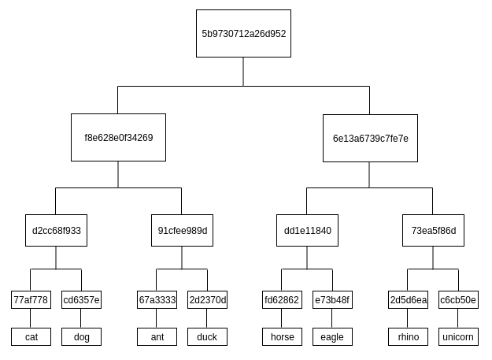

我们取每条数据的哈希值，在本例中为猫、狗、蚂蚁等。在本演示中，我们使用哈希函数 SHA256。由于篇幅有限，我们在图中截断了完整的哈希结果。现在，我们将从左到右对数据进行排序，因此“cat”字符串的哈希值为Data 1，“dog”字符串的哈希值为Data 2，“ant”字符串的哈希值为Data 3，等等。

有趣的部分来了。对于数据 1 和数据 2，我们组合散列并对结果进行散列。组合散列意味着连接它。对数据 3 和数据 4、数据 5 和数据 6、数据 7 和数据 8 也执行此操作。

这可能会让你想起淘汰赛。我们现在处于半决赛阶段。我们现在有哈希 1（来自数据 1 和数据 2）、哈希 2（来自数据 3 和数据 4）、哈希 3（来自数据 5 和数据 6）和哈希 4（来自数据 7 和数据 8）。

然后我们连接散列 1 和散列 2，对结果进行散列，并将这个散列命名为 5。然后我们对散列 3 和散列 4 做同样的事情。将结果命名为散列 6。

我们现在处于最后阶段。组合哈希 5 和哈希 6，然后对结果进行哈希处理。结果是根哈希。这个 Root Hash 可以保证所有数据块（从数据 1 到数据 8）的完整性。如果你更改任何数据，Root Hash 将有所不同。

你可能会问为什么我们不从头开始连接所有数据（从数据 1 到数据 8），然后对结果进行散列。然而，事实证明，Merkle 树比将所有数据连接在一起然后对其进行散列有一些好处（这种技术称为散列列表，它在某些情况下使用）。好处之一是当我们使用默克尔树时，检查部分数据的完整性更容易、更便宜。

在Merkle树中，检查Data 5的完整性，只需要下载Data 5、Data 6、Hash 4、Hash 5和Root Hash，如下图所示。你不需要下载所有数据：

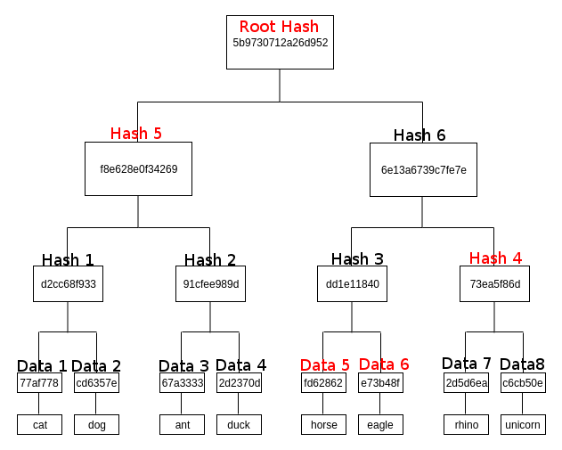

如果使用简单的方法，则需要下载数据的所有哈希（数据 1 到数据 8）和根哈希。在这个例子中，我们只有八条数据。想象一下，如果我们有 100 个并且你必须下载整个数据集。 Merkle 树使这个过程更加高效，因为我们不需要下载完整的数据集。

如果我们有奇数个节点，比如七个，一般规则（比特币实现的那个）是克隆最后一个节点，所以数据 8 是数据 7 的副本。但是，你可以使用另一个规则；我见过一个 Merkle 树的实现，其中一条数据（在我们的示例中为数据 7）被简单地提升到顶部。在这种情况下，哈希 4 只是数据 7。

当人们使用简化支付验证时，这就是比特币所做的。使用移动应用程序，下载完整节点很困难。为了发送比特币交易，用户只下载节点的重要部分而不是完整节点。 Merkle 树启用了这个过程。

在下一节中，我们将继续了解 DAG。

### 指示性丙烯酸图 (DAG)

Directive Acrylic Graphs (DAG)，顾名思义，是其中每个顶点（或节点）可以有指向其他顶点的边的图表，如下图所示：

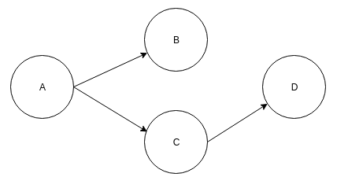

箭头的方向无所谓，只要你让它一致：

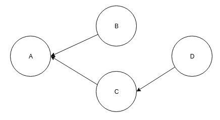

规则是这些边不应形成循环。 在下图中，我们可以看到顶点 A、C 和 D 形成一个循环，这违反了 DAG 的规则：

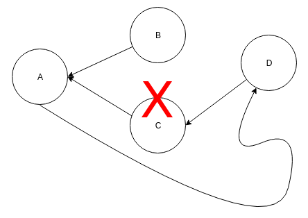

现在，如果你将 Merkle 树和 DAG 结合起来，你就会得到一个 Merkle DAG。 这是 Git 和 IPFS 使用的数据结构。

在 Merkle 树中，只有叶节点保存数据。 然而，在 Merkle DAG 中，任何节点都可以保存数据。 在 Merkle 树中，树必须是平衡的，但在 Merkle DAG 中没有这样的限制。

在我们进入 Merkle DAG 之前，让我们先了解一下内容寻址，因为 Merkle DAG 依赖于这个特性。

### 内容寻址

在链表中，你使用指针将节点（或块）链接在一起。指针是一种指向内存的数据类型。例如，假设我们有两个节点，节点 A 和节点 B。节点 A 是头部，节点 B 是尾部。节点的结构有两个重要组成部分。第一个组件是存储数据的数据组件。在 Git 中，这些数据可能是文件的内容。第二个组件是到另一个节点的链接。在链表中，这是指向节点地址的指针。

但是对于内容寻址，我们还添加了目标（在本例中为节点 B）的哈希值，而不仅仅是一个指针。你可能认识这个概念；这正是区块链中发生的事情。然而，Merkle DAG 不是在一条直线上线性跨越的链表。 Merkle DAG 是一棵可以有分支的树。

这是一个链表。它用于区块链的数据结构：

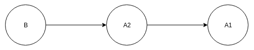

现在，考虑这个案例。我们有三个节点：节点 A1 和 A2 都是指向节点 B 的头。我们没有将指针放在节点 A1 和节点 A2 上，而是将指针放在节点 B 上。节点 B 现在有两个指针。节点 B 对节点 A1 和 A2 进行散列，然后在再次散列结果之前连接两个散列。这样，节点B就可以保持节点A1和节点A2内容的完整性。如果有人更改了节点 A1 的内容或节点 A2 的内容，则节点 B 保存的哈希将无效：

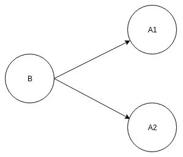

IPFS 在获取文档的方式方面与 HTTP 不同。 HTTP 使用链接，其工作方式类似于指针。例如，假设我们有以下链接：https://example.com/cute_panda.png。这使用一个位置来获取一个名为 cute_panda.png 的文档。只有一个提供商可以提供此文档，即 example.com。然而，IPFS 不使用 URL 链接。相反，它使用哈希链接，例如 ipfs://QmYeAiiK1UfB8MGLRefok1N7vBTyX8hGPuMXZ4Xq1DPyt7。当你访问此哈希链接时，IPFS 软件将找到该文档，该文档在进行哈希处理后会为你提供相同的哈希输出。因为散列是一种单向函数，IPFS 必须有一些其他信息来定位文档。基本上，它将请求广播到具有此散列输出的文档附近的节点。如果附近的节点没有这些文件，它们会将请求转发到附近的节点。这种对等查找请求非常复杂。 IPFS 使用 S/Kademlia 分布式哈希表，我们将在本章的后面部分讨论。

有趣的是，当你使用内容寻址时，可能有多个提供商可以提供此文档。对于cute_panda.png 文档，可能有四个以上的节点可以为该文档提供服务。我们可以选择最近的节点，使下载过程更有效率。这一特性也使审查变得更加困难。在 HTTP 的情况下，参与者可以禁止服务器 https://example.com。然而，在 IPFS 的情况下，任何人都可以启动一个新节点并提供文档。现在，IPFS 是透明的，也许太过分了。请求文档的节点可以看到为文档提供服务的节点的 IP 地址，反之亦然。攻击者可以禁止 IP 地址以禁止传播此文件。然而，使 IPFS 与 Tor（允许用户匿名浏览网站的软件）一起工作的开发仍处于早期阶段。
如果你从 https://example.com/cute_panda.png 下载文档，你当时得到的文档可能与你朋友昨天从同一 URL 下载的文档不同。可能是服务器管理员在你今天下载之前更改了文档。

但是，对于内容寻址系统，你从 IPFS 哈希链接获得的文档 ipfs://QmYeAiiK1UfB8MGLRefok1N7vBTyX8hGPuMXZ4Xq1DPyt7 将始终相同，无论你何时何地下载它。这个哈希链接保证没有人可以篡改文档。如果你更改文档并将其上传到 IPFS，则 IPFS URL 或哈希值会有所不同。

我们可以创建一个简单的 Python 脚本来说明这种情况。创建一个名为 ipfs_tutorial 的目录。在此目录中创建三个示例文件。第一个示例文件是 hello.txt，其中包含 I am a good boy 的内容。\n。第二个示例文件是 hello2.txt，其中包含 I am a good girl 的内容。\n。第三个示例文件是hello3.txt，里面有我是一匹好马的内容。\n。第四个示例文件是hello4.txt，里面有我是个好女孩的内容。\n。第二个和第四个文件具有相同内容的事实是故意的。如果你愿意，你可以创建不同的文件，但请确保其中至少两个文件具有相同的内容。

创建一个 Python 脚本，如以下代码块所示，并将其命名为 create_hash_from_content.py：

```python
from os import listdir
from hashlib import sha256


files = [f for f in listdir('.') if 'hello' in f]

hashes = {}

for file in files:
    with open(file) as f:
        content = f.read().encode('utf-8')
        hash_of_content = sha256(content).hexdigest()
        hashes[hash_of_content] = content

content = hashes['20c38a7a55fc8a8e7f45fde7247a0436d97826c20c5e7f8c978e6d59fa895fd2']
print(content.decode('utf-8'))

print(len(hashes))
```

此脚本列出了同一目录中名称以 hello 开头的所有文件。如果你的示例文件不以 hello 开头，你可以修改此部分。 long hash是hello2.txt内容的hash。

当你运行脚本时，你会得到以下结果：

```sh
I am a good girl.

3
```

如你所见，有四个文件，但最终输出的是三个，而不是四个。这是因为有三个具有独特内容的文件，而不是四个。这就是内容寻址的工作原理。它不关心文件名，它只关心内容。文件名为 hello1.txt 还是 hello2.txt 或 hello4.txt 并不重要，重要的是内容，我是个好女孩。\n，是一样的。从技术上讲，这是善意的谎言；有一种情况，IPFS 必须考虑文件名而不能忽略它。我将在本章后面解释这件事的真相。

我们在前面的例子中看到的是正常的散列。没有 Markle DAG，甚至没有 Merkle 树。现在让我们用一个大文件创建一个更复杂的场景。散列大文件效率不高。通常，我们将文件拆分为多个相同大小的较小部分。例如，一个 900 KB 的文件会变成四个文件。第一个、第二个和第三个文件的大小为 250 KB。第四个文件的大小为 150 KB。然后，我们散列每个较小的文件并将其与 Merkle 树组合。

出于说明目的，我们不会使用大文件，但会做出一些想象的限制。我们不想散列跨越多行的内容。如果文本文件有四行，我们会将它们分成四个较小的文件。

在你的项目目录中，创建一个名为 hello_big.txt 的文件并输入以下几行：

```sh
I am a big boy.
I am a tall girl.
I am a fast horse.
I am a slow dragon.
```


在我们创建一个脚本来散列这个大文件之前，让我们创建一个非常简单的 Merkle 树库并将其命名为 merkle_tree.py。有关完整代码文件，请参阅 GitLab 链接：https://gitlab.com/arjunaskykok/hands-on-blockchain-for-python-developers/tree/master/chapter_10。

让我们从它的初始化开始讨论这个 Merkle 树库：

```python
def __init__(self, leaf_nodes : List[str]):
    self.hash_nodes : List[str] = []
    self.leaf_nodes : List[str] = leaf_nodes
    self._turn_leaf_nodes_to_hash_nodes()
    if len(leaf_nodes) < 4:
        self.root_hash = self._hash_list()
    else:
        self.root_hash = self._build_root_hash()
```

我们确保至少有四个节点。如果没有，我们不妨使用哈希列表技术。 Leaf_nodes 是原始数据节点。它们是字符串列表，例如 ['cat', 'dog', 'unicorn', 'elephant']。 hash_nodes 是数据节点的哈希列表，例如['cat'的哈希，'dog'的哈希，'unicorn'的哈希，'elephant'的哈希]或['77af778...'，'cd6357e。 ..'、'c6cb50e...'、'cd08c4c...']。

如果节点少于四个，我们使用 _hash_list() 方法对数据进行哈希列表。我们在散列它们之前连接所有数据：

```python
def _hash_list(self):
    long_node = "".join(self.hash_nodes)
    return self._hash(long_node.encode('utf-8'))
```

在 _turn_leaf_nodes_to_hash_nodes() 方法中，我们根据leaf_nodes 填充hash_nodes。这是一对一的映射：

```python
def _turn_leaf_nodes_to_hash_nodes(self):
    for node in self.leaf_nodes:
        self.hash_nodes.append(self._hash(node.encode('utf-8')))
```

在 _hash() 方法中，我们包装了 sha256 散列函数。这是为了使类的定制更容易，因为我们可能想要使用不同的散列函数：

```python
def _hash(self, data : bytes) > bytes:
    return sha256(data).hexdigest()
```

以下代码块显示了我们如何从哈希节点中获取根节点：

```python
def _build_root_hash(self) > bytes:
    parent_amount = ceil(len(self.hash_nodes) / 2)
    nodes : List[str] = self.hash_nodes
    while parent_amount > 1:
        parents : List[bytes] = []
        i = 0
        while i < len(nodes):
            node1 = nodes[i]
            if i + 1 >= len(nodes):
                node2 = None
            else:
                node2 = nodes[i+1]
            parents.append(self._convert_parent_from_two_nodes(node1, node2))
            i += 2
        parent_amount = len(parents)
        nodes = parents

    return parents[0]
```

在这里，我们在哈希节点上进行多次迭代。它在每次迭代中跳跃两步。对于每次迭代，它在两个节点上工作。它连接这两个节点的散列，然后散列结果。结果哈希是这两个节点的父节点。该父节点成为将再次迭代的哈希节点的一部分。这个父节点和它的邻居将在散列之前再次连接，依此类推。如果散列节点数为奇数，则最后一个节点将在散列之前与其自身连接。如果只有一个父级，我们返回它的哈希值，即根哈希值：

```python
def _convert_parent_from_two_nodes(self, node1 : bytes, node2) -> bytes:
    if node2 == None:
        return self._hash((node1 + node1).encode('utf-8'))
    return self._hash((node1 + node2).encode('utf-8'))
```

_convert_parent_from_two_nodes() 方法允许我们从两个子节点获取父哈希。我们连接两个节点并散列它们。如果第二个节点是 None ，这意味着有奇数个节点或者我们正在处理最后一个节点，我们只需在散列之前将节点与其自身连接起来。

现在 Merkle 树库已准备就绪，我们将创建一个 Python 脚本来对 hello_big.txt 文件进行哈希处理并将其命名为 hash_big_file.py：

```python
from os import listdir
from hashlib import sha256
from merkle_tree import MerkleTree


hashes = {}

file = 'hello_big.txt'
with open(file) as f:
    lines = f.read().split('\n')
    hash = []
    hash_of_hash = []
    merkle_tree = MerkleTree(lines)
    root_hash = merkle_tree.root_hash

hashes[root_hash] = []
for line in lines:
    hashes[root_hash].append(line)

print(hashes)
```

如果你执行此 Python 脚本，你将获得以下输出：

```python
{'ba7a7738a34a0e60ef9663c669a7fac406ae9f84441df2b5ade3de1067c41808': ['I am a big boy.', 'I am a tall girl.', 'I am a fast horse.', 'I am a slow dragon.', '']}
```

如果文件很大，则不会直接对其进行哈希处理，因为这可能会导致内存不足。相反，你拆分文件。在这里，我们根据新行拆分文本文件。如果你处理二进制文件，你可以逐块读取文件并将该块保存到一个较小的文件中。当然，在将它们馈入 Merkle 树之前，你需要将二进制数据序列化为文本数据。完成此操作后，你可以将数据片段输入到 Merkle 树中。你将获得根哈希，这将保护原始文件的完整性。如果你更改一段数据中的单个位，则根哈希将不同。

### Merkle DAG 数据结构

我们已经使用内容寻址来处理文件。如果文件很大，我们可以拆分它并使用 Merkle 树获取根哈希。在这种情况下，我们只关心文件的内容；我们甚至不保存它的名字。

但是，在某些情况下，文件名确实很重要。例如，假设你要保存一个包含 100 张可爱熊猫图像的文件目录。在这种情况下文件的名称无关紧要；我们关心的是内容，可爱的熊猫图片！但是，如果这是一个编程项目的目录，则文件的名称很重要。如果一个 Python 文件试图导入包含在不同文件中的另一个 Python 库，我们必须保留该文件的名称。假设我们有一个名为 main.py 的 Python 文件，其中包含以下内容：

```python
from secret_algorithm import SuperSecretAlgorithm

# execute it
SuperSecretAlgorithm()
```

main.py 文件依赖于同一目录中名为 secret_algorithm.py 的另一个文件。重要的不仅是 secret_algorithm.py 文件的内容，还有它的名称。如果文件名更改，main.py 将无法导入库。

为了保存内容和文件名，我们需要使用 Merkle DAG 数据结构。如前所述，Merkle DAG 和 Merkle 树之间的区别之一是 Merkle DAG 中的任何节点都可以保存数据，而不仅仅是像 Merkle 树中的叶节点那样。

让我们创建一个包含示例文件的示例目录和一个也包含文件的嵌套目录：

```sh
$ mkdir sample_directory
$ cd sample_directory
$ // Create some files
$ mkdir inner_directory
$ cd inner_directory
$ // Create some files
```

然后，创建一个 Python 脚本来解释这个新的数据结构。在你的项目目录中创建一个名为 Merkle_dag.py 的文件。完整代码文件请参考 GitLab 链接：https://gitlab.com/arjunaskykok/hands-on-blockchain-for-python-developers/tree/master/chapter_10。

让我们从其初始化方法开始讨论 MerkleDAGNode 类：

```python
    def __init__(self, filepath : str):
        self.pointers = {}
        self.dirtype = isdir(filepath)
        self.filename = Path(filepath).name
        if not self.dirtype:
            with open(filepath) as f:
                self.content = f.read()
            self.hash = self._hash((self.filename + self.content).encode('utf-8'))
        else:
            self.content = self._iterate_directory_contents(filepath)
            nodes_in_str_array = list(map(lambda x: str(x), self.content))
            if nodes_in_str_array:
                self.hash = self._hash((self.filename + MerkleTree(nodes_in_str_array).root_hash).encode('utf-8'))
            else:
                self.hash = self._hash(self.filename.encode('utf-8'))
```

_init_() 方法接受文件路径作为参数。这可以是文件或目录的路径。我们假设这是一个有效的路径而不是一个符号链接。 self.pointers 将在后面的 _iterate_directory_contents() 方法部分进行解释。 self.dirtype 用于区分目录或文件。 self.filename 用于保存文件名或目录名。

如果参数是文件的路径（不是目录），我们将内容读入 self.content。出于演示目的，我们假设文件的内容很小，我们不会像以前那样尝试拆分文件。然后，我们根据文件名和内容计算哈希。

如果参数是目录的路径，则内容将是该目录中内部文件的 MerkleDAGNode 对象数组。为了计算哈希，我们使用默克尔树来获取其子节点的根哈希。但是，在再次散列之前，我们需要将其与目录名称连接起来：

```python
def _hash(self, data : bytes) -> bytes:
    return sha256(data).hexdigest()
```

_hash() 是 sha256 散列函数的包装方法。

_iterate_directory_contents() 方法用于迭代目录的内部子级。我们将此目录中的每个文件或目录转换为 MerkleDAGNode 对象。 self.pointers 对象用于根据文件名更轻松地访问 MerkleDAGNode。基本上，它就像一个递归函数，尤其是当我们点击一个目录时：

```python
    def _iterate_directory_contents(self, directory : str):
        nodes = []
        for f in listdir(directory):
            merkle_dag_node = MerkleDAGNode(directory + '/' + f)
            nodes.append(merkle_dag_node)
            self.pointers[f] = merkle_dag_node
        return nodes
```

\_repr\_() 方法用于更轻松地打印对象以进行调试：

```python
def __repr__(self):
    return 'MerkleDAGNode: ' + self.hash + ' || ' + self.filename
```

\_eq\_() 方法是必需的，以便我们可以将 MerkleDAGNode 对象与其他 MerkleDAGNode 对象进行比较。这在测试过程中很有用：

```python
    def __eq__(self, other):
        if isinstance(other, MerkleDAGNode):
            return self.hash == other.hash
        return False
```

让我们创建一个 hash_directory.py 文件来展示这个数据结构的强大功能：

```python
from merkle_dag import MerkleDAGNode


outer_directory = 'sample_directory'

node = MerkleDAGNode(outer_directory)
print(node)
print(node.content)
```

如果执行脚本，你将得到以下结果：

```python
MerkleDAGNode: ec618189b9de0dae250ab5fa0fd9bf1abc158935c66ff8595446f5f9b929e037 || sample_directory
[MerkleDAGNode: 97b97507c37bd205aa15073fb65367b45eb11a975fe78cd548916f5a3da9692a || hello2.txt, MerkleDAGNode: 8ced218a323755a7d4969187449177bb2338658c354c7174e21285b579ae2bca || hello.txt, MerkleDAGNode: c075280aef64223bd38b1bed1017599852180a37baa0eacce28bb92ac5492eb9 || inner_directory, MerkleDAGNode: bc908dfb86941536321338ff8dab1698db0e65f6b967a89bb79f5101d56e1d51 || hello3.txt]
```

输出是 Merkle DAG 节点的架构。

这就是 Git 保存文件的方式。我们的实施仅用于教育目的，不适用于生产目的。在现实世界中，你应该有很多优化。你可以实现的优化之一是使用数据引用，就像 Git 一样。如果有两个不同的文件具有相同的内容（但文件名不同），则内容将只保存一次。另一个优化是 Git 使用压缩。下图说明了 Git 的概念，其中我们有两个文件，文件 B 和文件 D。它们都有相同的内容，内容 xxx。文件 B 仅在目录 A 中保存一次。文件 D 与文件 E 一起保存在目录 C 中，文件 E 具有不同的内容，内容 yyy。目录 C 也保存在目录 A 中。 但是文件 B 和文件 D 的内容，即内容 xxx，只保存一次：

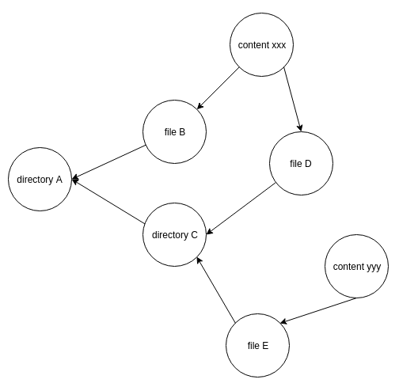

现在我们知道如何使用 Merkle DAG 保存文件目录，如果我们想更改文件的内容怎么办？ 我们应该放弃这个 Merkle DAG 节点并创建一个全新的节点吗？ 解决此问题的更有效方法是使用版本控制系统。 一个文件可以有版本 1、版本 2、版本 3 等等。 实现版本控制的最简单方法是使用链表，如下图所示：

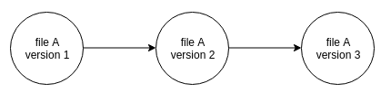

## 点对点网络

我们了解如何在 IPFS 中保存文件。关键是哈希。该值是文件或目录的名称以及文件或目录的内容。如果我们正在构建一个中心化的系统，我们的故事就结束了。我们只需要添加一些其他东西来创建一个软件来保存文件并根据哈希搜索它们。该软件类似于数据库，例如 SQLite 或 LevelDB。 IPFS 两者都不是；它是一个点对点文件系统，就像一个数据库，但遍布各处。换句话说，它是一个分布式哈希表。

IPFS 使用 Kademlia 的扩展版本 S/Kademlia 作为分布式哈希表。在讨论 Kademlia 之前，让我们先讨论一下它的前身。

首先想象一个哈希表，它就像Python中的字典，如下表所示：

| Key  | Value       |
| ---- | ----------- |
| 2    | Cat         |
| 5    | Unicorn     |
| 9    | Elephant    |
| 11   | Horse       |
| 4    | Rhino       |
| 101  | Blue Parrot |
| 33   | Dragon      |

在 IPFS 中，密钥是哈希值，而不是数字。但出于演示目的，让我们将其设为一个简单的整数。该值只是一个简单的动物名称，而不是文件的内容或目录中文件的内容。

现在，假设你有四个节点。节点可以是与其余节点位于不同大陆的计算机。

让我们定义哪个节点保存哪些键：

| Node | Keys     |
| ---- | -------- |
| A    | 2, 9, 11 |
| B    | 5        |
| C    | 4, 33    |
| D    | 101      |

你将此表保存在中央服务器中。其中一个节点将是中心节点。这意味着如果有人想要访问密钥 5，他们必须在收到答案之前询问中央服务器节点 B。之后，可以将请求定向到节点 B。节点 B 将“独角兽”返回给数据请求者。

这种方法非常有效；没有时间浪费。点对点音乐共享系统 Napster 使用这种方法。缺点是中央服务器是单点故障。对手（不喜欢传播此信息的人；在 Napster 的情况下，这可能是一个大的唱片公司）可能会攻击中央服务器。

一种解决方案是询问所有节点哪个节点持有密钥，而不是将此信息保存在中央节点中。这就是 Gnutella 所做的。这种设置对来自对手的审查和攻击具有弹性，但它使请求数据的节点和人员的生活变得艰难。节点在收到很多请求时必须努力工作。这种设置称为泛洪。它适用于比特币，但不适用于 IPFS。

这就是创建分布式哈希表技术的原因。有几种分布式哈希表算法，其中之一是 Kademlia。该算法由Petar Maymounkov 和David Mazières 在2002 年创建，后来被eDonkey 文件共享平台使用。

### 数据和节点的接近度的概念

在分布式哈希表中，我们不会将数据放在每个节点中。我们根据接近度的概念将数据放在某些节点中。我们想将数据放在附近的节点中。这意味着我们不仅有节点之间的距离概念，还有数据和节点之间的距离概念。

想象一下，在这个分布式哈希表中启动或创建的每个节点都被赋予一个介于 1 到 1000 之间的 ID。每个节点 ID 都是唯一的，因此最多可以有 1,000 个节点。在实际环境中可能有 1,000 多个节点，但这可以作为示例。假设我们有 10 个节点：

| Node ID |
| ------- |
| 5       |
| 13      |
| 45      |
| 48      |
| 53      |
| 60      |
| 102     |
| 120     |
| 160     |
| 220     |

我们也有一些数据。为简单起见，本例中的数据只是一些字符串：

| Data    |
| ------- |
| Unicorn |
| Pegasus |
| Cat     |
| Donkey  |
| Horse   |

为了能够判断这些数据是靠近还是远离某些节点，我们需要将这些数据转换为 1 到 1000 之间的数字。在现实世界中，你可以对数据进行哈希处理。但是为了我们的实际演示，我们将只分配一个随机数：

| Key  | Data    |
| ---- | ------- |
| 54   | Unicorn |
| 2    | Pegasus |
| 100  | Cat     |
| 900  | Donkey  |
| 255  | Horse   |

如果我们想将 Unicorn 数据存储在最近的四个节点中（四个只是一个配置编号），可以按如下方式完成。首先，你检查键，即 54。然后，我们希望获得与 54 最接近的四个节点。如果你检查节点 ID 列表，则最近的四个节点是 45、48、53 和 60。因此，我们存储这四个节点中的 Unicorn 数据。如果我们要存储 Cat 数据，与其键 100 的最近邻居是 53、60、102 和 120，因此我们将 Cat 数据存储在这四个节点中。

我们在计算距离时将数据视为一个节点。这就是我们在分布式哈希表中查找数据的方式。数据和节点共享相同的空间。

### 异或距离

但是，在 Kademlia 中，我们不通过十进制减法来测量距离。说清楚一点，十进制减法只是普通的减法。 45和50之间的距离是5。53和63之间的距离是10。

在 Kademlia 中，测量距离是通过 XOR 距离完成的。 3 和 6 之间的异或距离是 5，而不是 3。 下面是如何计算它：

3 的二进制版本是 011。6 的二进制版本是 110。我所说的二进制版本是基数为 2 的数字。XOR 表示异或。使用异或运算，1 XOR 0 为1，1 XOR 1 为0，0 XOR 0 为0，0 XOR 1 为1。如果两个操作数相同，则结果为0。如果两个操作数不同，则结果为1.

```
011
110
---xor
101
```

101 是 5 的二进制版本。

XOR 距离有几个有用的特性，促使 Kademlia 论文的作者选择 XOR 距离来衡量节点之间的距离。

第一个属性是节点与自身的异或距离为 0。离 ID 为 5 的节点最近的节点是另一个 ID 为 5 的节点，或它自己。 5 的二进制版本是 0101：

```
0101
0101
----xor
0000
```

0 距离只有在我们测量节点与其自身之间的距离时才有可能。

第二个特性是不同节点之间的距离是对称的。 4 和 8 之间的异或距离与 8 和 4 之间的异或距离相同。4 的二进制版本是 0100，8 的二进制版本是 1000。所以，如果我们使用它们的二进制值计算它们之间的距离，我们得到相同的值。 4和8之间的异或距离如下：

```
0100
1000
----xor
1100
```

8和4的异或距离如下：

```
1000
0100
----xor
1100
```

如果你习惯于使用十进制减法距离，这对你来说会很直观。

最后一个有用的属性是节点 X 和节点 Z 之间的距离小于或等于节点 X 和节点 Y 之间的距离加上节点 Y 和 Z 之间的距离。 最后一个属性很重要，因为 Kademlia 分布式哈希中的节点table 不保存所有其他节点的地址。它只保存一些节点的地址。但是一个节点可以通过中间节点到达另一个节点。节点X知道节点Y的地址，但不知道节点Z的地址。节点Y知道节点Z的地址。节点X可以从节点Y查询节点Y的邻居节点，然后节点X可以到达节点Z 知道到节点 Z 的距离小于或等于节点 X 和节点 Y 的距离加上节点 Y 和节点 Z 的距离。

如果此属性不为真，节点 X 搜索节点的时间越长，特定节点的距离就越远，这不是我们想要的。但是有了这个属性，来自其他节点的邻居节点的地址可能会小于，如果不相同的话，组合的距离。

当你考虑使用 XOR 距离时，你应该认为两个数字共享的前缀越多，这两个数字之间的距离就越短。例如，如果数字共享三个公共前缀，例如 5 和 4，则距离为 1：

```
0101
0100
----xor
0001
```

同样，对于数字 14 和 15，距离也是 1：

```
1110
1111
----xor
0001
```

但是，如果位差在左侧，例如 5 和 13 的情况，则距离可能很大，在这种情况下为 8：

```
0101
1101
----xor
1000
```

4 和 5 之间的 XOR 距离是 1，但 5 和 6 之间的 XOR 距离是 3。如果你习惯于十进制减法距离，这与直觉相反。为了让这个概念更容易解释，让我们创建一个由 1 到 15 的数字组成的二叉树：

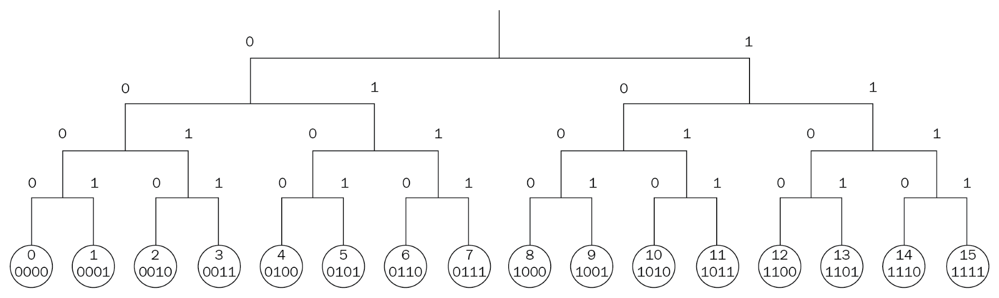

仔细看看这棵树。 4和5的异或距离是1，而5和6的异或距离是3。看图，4和5在一个直接分支下，而5和6在一个更大的分支下，这意味着更大的距离。立即分支对应于右边的位。该直接分支的父分支对应于第二个最右边的位。顶部分支对应于左侧的位。所以，如果数字被一个顶部分支隔开，那么距离至少是8。8的二进制版本是1000。

这只是为了理解目的；它不是一个严格的数学定义。如果你看看从 5 到 11 和 5 到 13 的旅程，你应该得到大致相同的距离，但事实并非如此。 5 和 13 的异或距离是 8，而 5 和 11 的异或距离是 14。

在 Python 中，你可以使用 ^ 运算符对两个数字进行异或：

```python
>> 5 ^ 11
14
```

你可以使用 bin 函数将任何十进制数转换为其二进制版本：

```python
>>> bin(5)
'0b101'
```

然后，如果要将二进制数转换回十进制数，请使用 int 函数：

```python
>>> int('0b101', 2)
5
```

int 函数的第二个参数表示第一个参数的基数。二进制是基数 2。

### 桶

既然我们已经经历了异或距离，我们将看看一个节点如何保存其他节点的地址。一个节点不会将所有其他节点保存在分布式哈希表中。节点可以保存的节点数取决于节点中的位数和 k 配置数。让我们一一讨论这些。

还记得我们之前看到的树图片吗？它有16片叶子。现在想象最小的树：

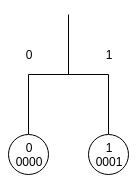

它有两片叶子。让我们把树加倍：

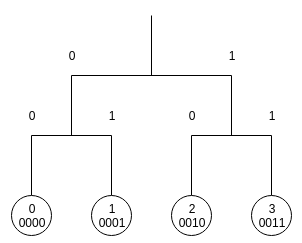

这棵树现在有四片叶子。让我们再次加倍：

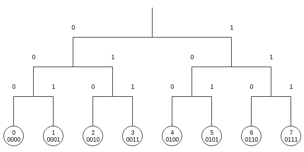

这棵树现在有八片叶子。如果再次加倍，你将得到一棵树，就像我们之前的树一样，有 16 片叶子。

我们可以看到的进展是 2、4、8、16。如果我们继续旅程，数字将是 32、64、128 等等。这可以写成 21, 22, 23, 24, 25 ... 2n。

让我们关注一棵有 16 片叶子的树。我们在表示叶子数的时候，一定要用4位的二进制数，比如0001或者0101，因为最大的数是15，或者1111。如果用64片叶子的树，就必须用6位的数，例如 000001, 010101 因为最大可能的数字是 63 或 111111。位数越大，节点必须在其地址簿中保存的节点数量越多。

然后，我们有 k 配置编号。 k 决定了一个节点可以保存在一个桶中的最大节点数。桶的数量与分布式哈希表中使用的位数相同。在16片叶子的树中，桶的数量是4。在64片叶子的树中，桶的数量是6。每个桶对应一个比特。假设我们有一棵树有 16 个叶子，所以每个数字有 4 位，例如 0101 或 1100。这意味着节点有四个桶。

第一个桶对应于左边的第一位。第二个桶对应于左边的第二位。第三个桶对应于左边的第三位。第四个桶对应于左起第四位。

让我们看一下在具有 16 个叶子的树中 ID 为 3 的节点的示例。现在，我们假设在具有 16 个叶子的树中有 16 个节点。在现实世界中，树会很稀疏，很多树枝都是空的。

在描述 Kademlia 的论文中，作者使用了 160 个桶或一个 160 位地址。这棵树的叶子很多。为了比较，278是可见宇宙中的原子数。本文中 k 配置编号选择为 20，因此一个节点在其地址簿中最多可以有 3,200 个节点。

在此示例中，假设 k 数为 2。这意味着对于每个存储桶，该节点保存另外两个节点。第一个桶，对应第一位，对应树的另一半，节点不驻留。我们在树的这一半中有八个节点，但我们只能保存其中两个，因为 k 数是 2。让我们为这个存储桶选择节点 11 和 14。我们如何选择哪些节点进入哪些桶将在后面描述。

然后，让我们将节点所在的树的一半进行划分，这样我们就有了两个分支。第一个分支由 ID 为 0 的节点、ID 为 1 的节点、ID 为 2 的节点和 ID 为 3 的节点组成。 第二个分支由 ID 为 4 的节点、ID 为 5 的节点和ID 6，以及一个 ID 为 7 的节点。第二个分支是第二个存储桶。这个分支有四个节点，但是我们只能保存两个节点。让我们选择 ID 为 4 的节点和 ID 为 5 的节点。

然后，让我们划分我们的节点（ID 为 3 的节点）所在的分支，这样我们就有两个小分支。第一个小分支由一个 ID 为 0 的节点和一个 ID 为 1 的节点组成。第二个小分支由一个 ID 为 2 的节点和一个 ID 为 3 的节点组成。所以第三个桶是第一个小分支。只有两个节点，一个是 ID 为 0 的节点，一个是 ID 为 1 的节点，所以我们都保存了。

最后，让我们划分节点（ID 为 3 的节点）所在的小分支，这样我们就有两个小分支。第一个分支由 ID 为 2 的节点组成，第二个分支由 ID 为 3 的节点组成。第四个桶，或最后一个桶，将是由节点 3 组成的分支。

我们保存这一个节点，因为它小于 k 配置数：

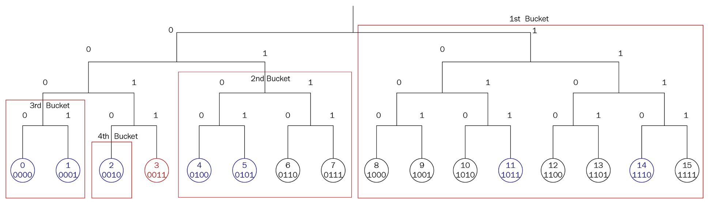

下图显示了完整的四个存储桶。每个桶是源节点不驻留的分支的一半。不同节点的bucket配置不同。 ID 为 11 的节点可能具有如下所示的存储桶配置：

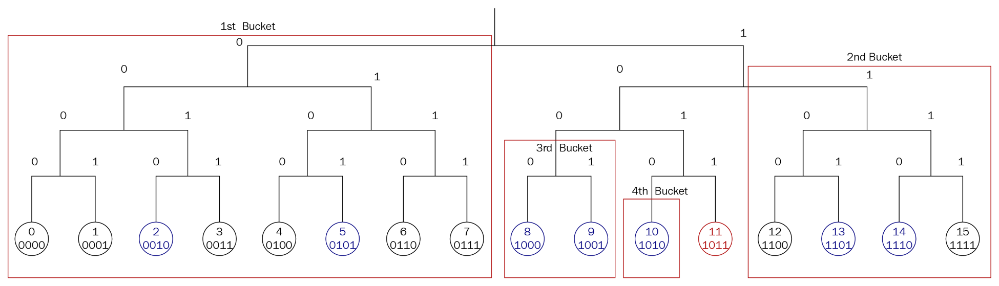

让我们看一下某个节点如何找到另一个不在其地址簿中的节点的示例。假设 k 配置编号为 1。源节点是具有 16 个叶子的树中 ID 为 3 的节点。对于第一个bucket（由ID 8到ID 15的节点组成的最大分支），ID为3的节点保存了ID为10的节点，但ID为3的节点想要找到ID为13的节点。 ID 为 3 的节点通过请求联系 ID 为 10 的节点，“你能帮我找到 ID 为 13 的节点吗？”。 ID 为 10 的节点已将 ID 为 14 的节点保存在其对应的桶中（由 ID 为 12、13、14 和 15 的节点组成的分支）。 ID 10 的节点将ID 14 的节点交给ID 3 的节点。ID 3 的节点向ID 14 的节点提出同样的问题，“你能帮我找到ID 13 的节点吗？”。 ID 为 14 的节点没有它，但它的桶中有 ID 为 12 的节点（由 ID 为 12 的节点和 ID 为 13 的节点组成的分支）。 ID 为 14 的节点将 ID 为 12 的节点交给 ID 为 3 的节点。 ID 为 3 的节点再次向 ID 为 12 的节点提出同样的问题。这一次，ID 为 12 的节点可以给出目的节点或ID 为 13 的节点到 ID 为 3 的节点。一个圆满的结局！

下图显示了节点：

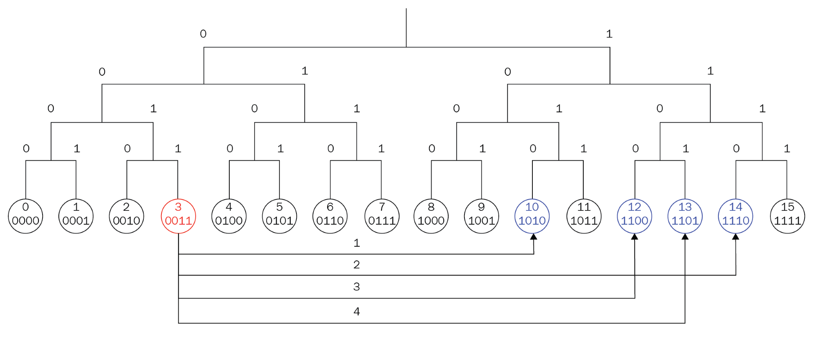

你是否注意到节点 ID 3 必须重复请求多少次？四次。如果这个数字听起来很熟悉，那是因为这棵树有 16 片叶子，也就是 24。在计算机科学中，到达目的地之前所需的跳跃量的最坏情况是 2 log n + c。 n 是树有多少叶子，c 是常数。

你刚刚看到的树有完整的节点；没有空的叶子或空的树枝。然而，在现实世界中，有空的树枝和空的叶子。假设你有一棵树有 1,024 (210) 个叶子，k 数为 3。你启动 ID 为 0 的第一个节点。该节点将成为源节点。我们将从 ID 为 0 的节点的镜头中看到这棵树：

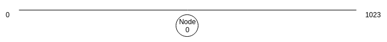

然后，你启动 ID 为 800 的节点：

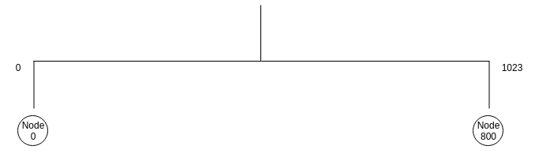

这棵树将被分成两个桶。然后，启动 ID 为 900 的节点和 ID 为 754 的节点：

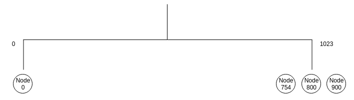

如果我们向桶中添加另一个节点会怎样？让我们启动 ID 为 1011 的节点。 ID 为 0 的节点将 ping 最近最少使用的节点，即 ID 为 800 的节点，看看它是否还活着。如果是，它将检查其他节点。如果 ID 为 754 的节点不活跃，那么这个节点将被 ID 为 1011 的节点替换。如果所有节点都还活着，那么 ID 为 1011 的节点将从桶中拒绝。这样做的原因是为了避免新节点淹没系统。我们假设正常运行时间较长的节点是值得信赖的，并且我们更喜欢这些节点而不是新节点。假设我们拒绝了 ID 为 1011 的节点。

首先，我们启动 ID 为 490 的节点。然后，我们拆分 ID 为 0 的节点所在的分支：

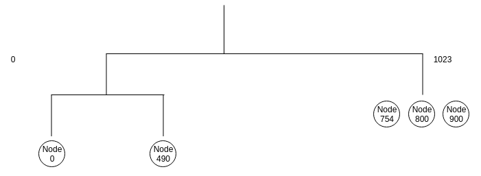

现在，让我们添加 ID 为 230 的节点：

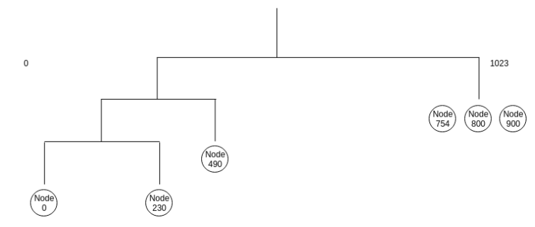

让我们添加 ID 为 60 的节点：

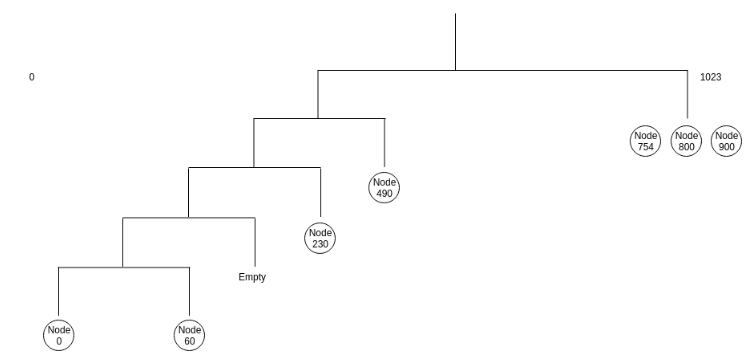

...等等。每次我们在源节点所在的分支中添加一个节点时，它都会将桶一分为二，直到达到最低级别。如果我们在源节点不存在的其他分支中添加节点，我们会添加节点直到达到 k 数。

你现在对 Kademlia 的工作原理有了基本的了解。然而，这并不是故事的全部。如果插入了一个节点，一个节点需要告诉旧节点它的存在。该节点还需要从旧节点获取联系人。我提到当一个节点插入到源节点所在的分支时，分支会被拆分，但也有一种情况，即使源节点不在那里，分支也会被拆分。发生这种情况是因为如果必须拆分源节点所在的分支，则节点需要将所有有效节点保留在至少具有 k 个节点的分支中。

除了路由算法之外，Kademlia 还有其他重要的方面。一个节点需要每小时重新发布密钥和值（数据）。这是为了预测旧节点离开和新节点加入系统。这些节点更近，因此更适合保存数据。还有一个加速查找算法，这样当一个节点寻找另一个节点时，我们可以使用更少的步骤。

> 你可以参考 Kademlia 论文以获得完整的规范。 https://pdos.csail.mit.edu/~petar/papers/maymounkov-kademlia-lncs.pdf。

IPFS 使用 S/Kademlia，这是 Kademlia 的扩展版本。它与原始 Kademlia 算法的不同之处在于 S/Kademlia 有一些安全要求。并非所有节点都出于崇高的目的加入 Kademlia 分布式哈希表。所以，在S/Kademlia中，要生成一个节点的ID，需要该节点生成一个密码学密钥对，所以很难篡改节点之间的通信。其他要求包括在节点能够生成其 ID 之前使用工作量证明（如在比特币和以太坊中）这一事实。路由算法也有一些调整，以确保一个节点可以与对手中间的其他节点进行通信，例如向网络发送垃圾邮件的节点。

## 概括

在本章中，我们研究了 IPFS。我们首先研究了 IPFS 项目的动机及其历史。虽然 IPFS 不是区块链技术的一部分，但它类似于区块链，因为它是对区块链技术的补充。然后我们了解了保存在 IPFS 文件系统中的内容的数据结构。该数据结构是基于默克尔树的默克尔有向无环图 (DAG)。我们创建了简单的 Merkle 树和 Merkle DAG 库来了解这些数据结构的独特性。 Merkle 树提供了一种简单的方法来检查部分数据的完整性，而 Merkle DAG 用于当我们想要保存包含文件的目录并希望保留文件名时。然后，我们了解了 Kademlia 分布式哈希表的点对点网络方面。节点之间的距离基于异或距离。节点也保存在桶中，这对应于位寻址。最后，我们展示了一个节点如何通过在桶中跳跃来找到其他节点。

在下一章中，我们将使用 IPFS 软件并以编程方式与之交互。