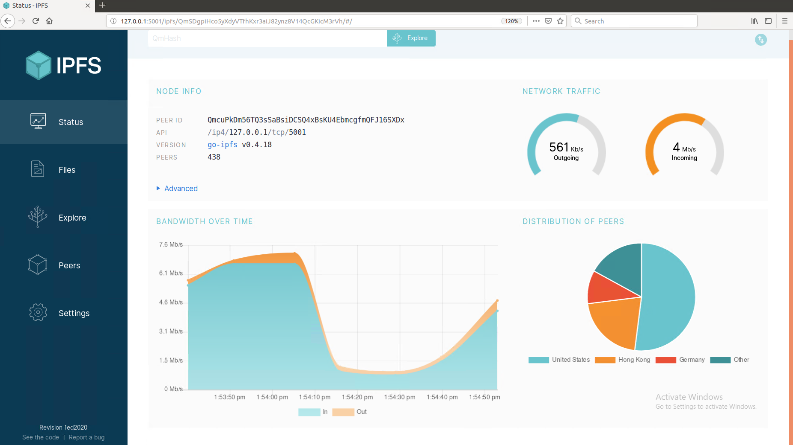
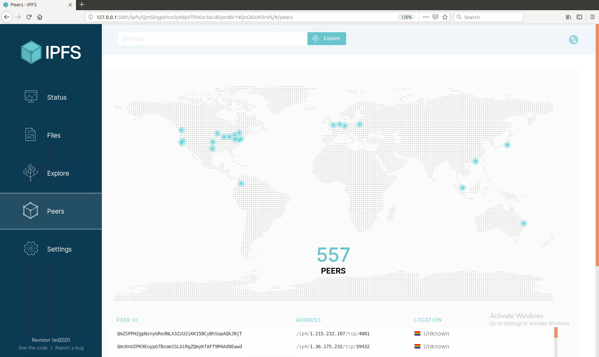
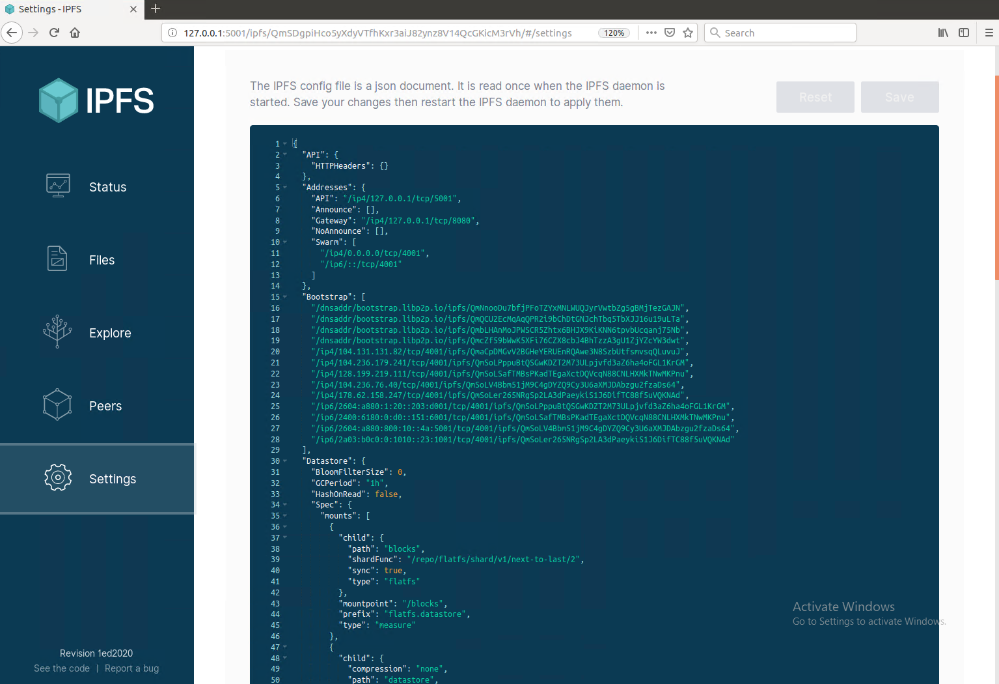
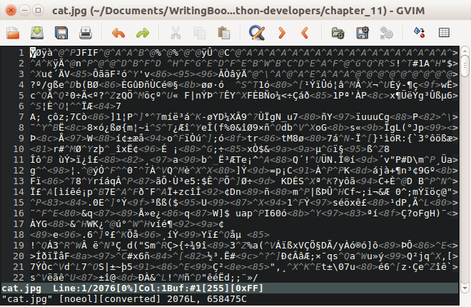
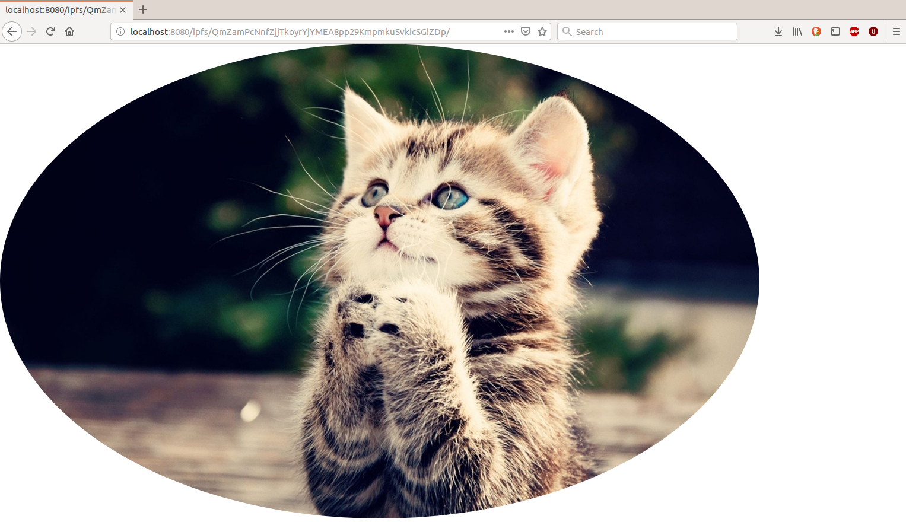

# 使用 ipfsapi 与 IPFS 交互

在本章中，我们将学习如何使用 Python 以编程方式与 IPFS 交互。 我们可以在这里进行一些交互，例如添加文件、检索文件、托管可变文件、订阅主题、发布主题以及将文件复制到可变文件系统 (MFS)。 首先，我们必须安装 IPFS 软件并启动它。 然后，我们将学习如何安装 IPFS Python 库并了解其大部分 API。

在本章中，我们将讨论以下主题：

- 安装 IPFS 软件及其库
- 内容散列
- ipfsapi API

## 安装 IPFS 软件及其库

在撰写本文时，只有两种 IPFS 实现：go-ipfs（用 Go 语言编写）和 js-ipfs（用 JavaScript 编写）。目前还没有用 Python 编写的 IPFS 实现。 Go 实现是更流行的实现，因此我们将使用它。

转至 https://dist.ipfs.io/#go-ipfs，并下载适用于你平台的软件。对于 Ubuntu Linux，该文件名为 go-ipfs_v0.4.18_linux-amd64.tar.gz。

使用以下命令行提取它：

```sh
$ tar xvfz go-ipfs_v0.4.18_linux-amd64.tar.gz
```

然后，使用以下命令安装二进制文件：

```sh
$ cd go-ipfs
$ sudo ./install.sh
```

此步骤是可选的。在这里，我们将 IPFS_PATH 环境变量导出到我们的 shell：

```sh
$ export IPFS_PATH=/path/to/ipfsrepo
```

这是 ipfs 存储文件的地方。你可以将此语句存储在 ~/.bashrc 中。默认情况下（没有这个环境变量），ipfs 将使用 ~/.ipfs（主目录中的 .ipfs 目录）作为存储数据的地方。

设置好环境变量后，初始化ipfs本地仓库。你只需执行一次此步骤：

```sh
$ ipfs init
```

如果你在云中运行 ipfs（例如 Amazon Web Services、Google Cloud Platform、Digital Ocean 或 Azure），你应该使用服务器配置文件标志：

```sh
$ ipfs init --profile server
```

如果没有，你将收到来自云提供商的令人讨厌的警告信，因为默认情况下 IPFS 守护程序（没有服务器配置文件标志）会执行类似于端口扫描的操作。

然后，启动守护进程，如下：

```sh
$ ipfs daemon
```

默认情况下，API 服务器正在侦听端口 5001。我们将通过此端口以编程方式与 IPFS 交互。默认情况下，它只侦听本地主机。如果你想向外界开放此端口，请务必小心。 IPFS 中没有访问控制列表 (ACL)。任何有权访问此端口的人都可以将数据上传到 IPFS。

默认情况下，网关服务器侦听端口 8080。我们使用此端口从 IPFS 对等文件系统下载文件。默认情况下，Swarm 侦听端口 4001。这就是其他节点从我们的存储下载文件的方式。所有这些端口都可以更改。

IPFS 有一个仪表板，可以通过以下链接访问：http://localhost:5001/webui。以下是仪表板的屏幕截图：



如你所见，大多数 IPFS 节点位于美国、中国和德国。

点击 Peers 选项卡可以查看 IPFS 节点根据 IP 地址的分布情况，如下图所示：



可以在此选项卡中看到节点，包括它们的 IP 地址。 如果你担心节点的隐私，请记住隐私功能的开发仍处于起步阶段。

你可以在“设置”选项卡中配置 IPFS 设置，如下面的屏幕截图所示：



现在我们的 IPFS 守护进程已经启动，让我们安装我们的 ipfs Python 库。

打开一个新终端，因为我们不想打扰我们的守护进程。 然后，运行以下命令：

```sh
$ virtualenv -p python3.6 ipfs-venv
$ source ipfs-venv/bin/activate
(ipfs-venv) $ pip install ipfsapi
```

以前，ipfs Python 库被称为 py-ipfs-api，但后来更名为 ipfsapi。

## 内容 hashing

在IPFS快速入门文档（https://docs.ipfs.io/introduction/usage）中，他们教你的第一件事就是下载可爱的猫图。使用以下代码执行此操作：

```sh
$ ipfs cat /ipfs/QmW2WQi7j6c7UgJTarActp7tDNikE4B2qXtFCfLPdsgaTQ/cat.jpg >cat.jpg
$ eog cat.jpg
```

当你运行上述代码时，将下载猫图片，你将获得以下输出：


> eog 是 Ubuntu 中的图像查看器。

为了尊重传统，让我们创建一个 Python 脚本，用 Python 以编程方式下载前面的图像，并将脚本命名为 download_cute_cat_picture.py：

```python
import ipfsapi


c = ipfsapi.connect()
cute_cat_picture = 'QmW2WQi7j6c7UgJTarActp7tDNikE4B2qXtFCfLPdsgaTQ/cat.jpg'
c.get(cute_cat_picture)
```

执行此脚本后，图像将在你的目录中命名为 cat.jpg。

你可能已经注意到，长哈希后面有一个 cat.jpg 文件名。从技术上讲，我们在这里所做的是在包含可爱猫图片的目录中下载一个文件。如果你愿意，你可以试试这个。为此，创建另一个脚本并将其命名为 download_a_directory_of_cute_cat_picture.py，然后运行以下代码：

```python
import ipfsapi


c = ipfsapi.connect()
directory = 'QmW2WQi7j6c7UgJTarActp7tDNikE4B2qXtFCfLPdsgaTQ'
c.get(directory)
```

执行此脚本后，你将在包含此脚本的目录中获得名为 QmW2WQi7j6c7UgJTarActp7tDnikE4B2qXtFCfLPdsgaTQ 的目录。如果你偷看这个目录，你会发现猫的图片文件。

让我们逐行查看脚本以了解 ipfsapi 库的用法。你可以使用以下代码导入库：

```python
import ipfsapi
```

以下代码用于获取 IPFS 守护程序的连接对象：

```python
c = ipfsapi.connect()
```

connect 方法接受几个参数。两个最重要的参数是主机和端口：

```python
c = ipfsapi.connect(host="ipfshost.net", port=5001)
```

默认情况下，我们使用端口 5001 连接到 localhost：

```python
c.get(cute_cat_picture)
```

然后，我们使用来自 c 对象的 IPFS HTTP API 的方法。 get 是用于与 IPFS 守护进程交互的方法之一。对于这种方法，ipfs 客户端软件通常有一个等效的参数：

```sh
$ ipfs get QmW2WQi7j6c7UgJTarActp7tDNikE4B2qXtFCfLPdsgaTQ/cat.jpg
```

你可能会注意到，在创建第一个 Python 脚本之前，我们在命令行界面中使用了 ipfs cat 命令。但是，在脚本中，我们使用了 get 方法。 ipfsapi 库中还有一个 cat 方法。

get 方法用于下载文件，而 cat 方法用于获取文件的内容。

让我们创建一个使用 cat 方法的脚本并将其命名为 cat_cute_cat.py：

```python
import ipfsapi


c = ipfsapi.connect()
result = c.cat('QmW2WQi7j6c7UgJTarActp7tDNikE4B2qXtFCfLPdsgaTQ/cat.jpg')
with open('cat.jpg', 'wb') as f:
    f.write(result)
```

cat 方法返回文件内容的字节对象。它接受两个可选参数，偏移量和长度。偏移量是文件中要开始获取内容的起始位置。 length 是你想要从偏移位置开始的内容的长度。如果你想构建下载管理器（具有暂停和恢复功能）或视频流播放器，这些参数很重要。你可能并不总是想要下载整个文件。

现在，让我们向 IPFS 添加一个文件。为此，请创建一个简单的文件并将其命名为 hello.txt。这是文件的内容：

```sh
I am a good unicorn.
```

确保在字符串后有一个新行：

```sh
$ cat hello.txt
I am a good unicorn.
$
```

如果命令提示符出现在字符串行之后，则一切正常。你可以继续。

但是，假设命令提示符出现在字符串的右侧，如以下代码块所示：

```sh
$ cat hello.txt
I am a good unicorn.$
```

这意味着你没有新行，你需要在字符串之后添加它。

现在，让我们创建一个脚本来将此文件添加到 IPFS 并将其命名为 add_file.py：

```python
import ipfsapi


c = ipfsapi.connect()
result = c.add('hello.txt')
print(result)
```

执行此代码将为你提供以下输出：

```sh
(ipfs-venv) $ python add_file.py
{'Name': 'hello.txt', 'Hash': 'QmY7MiYeySnsed1Z3KxqDVYuM8pfiT5gGTqprNaNhUpZgR', 'Size': '29'}
```

我们可以通过使用 cat 或 get 方法来检索文件的内容，这就是我是一个好独角兽。\n。让我们在名为 get_unicorn.py 的脚本中使用 cat 方法，如以下代码块所示：

```python
import ipfsapi


c = ipfsapi.connect()
result = c.cat('QmY7MiYeySnsed1Z3KxqDVYuM8pfiT5gGTqprNaNhUpZgR')
print(result)
```

运行此命令将为你提供以下输出：

```sh
(ipfs-venv) $ python get_unicorn.py
b'I am a good unicorn.\n'
```

正如我们在第 10 章 InterPlanetary – A Brave New File System 中提到的，我们通过哈希获取文件的内容。通过这个，我们只检索内容，而不是文件的名称。

但是你如何将 b'I am a good unicorn.\n' 变成 'QmY7MiYeySnsed1Z3KxqDVYuM8pfiT5gGTqprNaNhUpZgR'？只是通过散列内容吗？例如，要对文件内容进行散列，你可以使用 SHA-256 散列函数：

```python
import hashlib
the_hash = hashlib.sha256(b'I am a good unicorn.\n').hexdigest()
```


没那么快！事实证明，你需要先了解 protobuf、multihash 和 base58 才能了解该过程。让我们在以下各节中讨论这些。

### Protobuf

如果你尝试安装 Google 开源软件，例如 Tensorflow，你会遇到 protobuf，因为它被 Tensorflow 使用。 Protobuf 是一个序列化库。如果你从官方文档中了解了 Python，你就会知道 Pickle 是一种序列化数据的方式。如果你了解 Web 开发编程，很可能会使用 .json 或 .xml 作为数据序列化。

在我们将 b'I am a good unicorn.\n' 传递给 IPFS 之前，我们将数据包装在一个数据结构中。让我们创建一个脚本来证明我的主张并将脚本命名为 get_unicorn_block.py：

```python
import ipfsapi


c = ipfsapi.connect()
result = c.block_get('QmY7MiYeySnsed1Z3KxqDVYuM8pfiT5gGTqprNaNhUpZgR')
print(result)
```

运行脚本可以让你看到文件的内容被其他东西包裹了：

```sh
(ipfs-venv) $ python get_unicorn_block.py
b'\n\x1b\x08\x02\x12\x15I am a good unicorn.\n\x18\x15'
```

我们可以看到文件的内容仍然完好无损，b'I am a good unicorn.\n'，在神秘的字符串之间。左边和右边的垃圾字符是什么？这是IPFS中一个数据节点的数据结构。

在我们对这个序列化数据进行反序列化之前，让我们快速学习一下如何使用protobuf：

1. 使用以下命令安装 protobuf 编译器：
    ```sh
    $ sudo apt-get install protobuf-compiler
    ```
    你的 protobuf 编译器是 protoc：
    ```python
    $ protoc --version
    libprotoc 2.6.1
    ```
2. 然后，让我们使用以下命令安装 Python protobuf 库：
    ```python
    (ipfs-venv) $ pip install protobuf
    ```
3. 在用protobuf序列化数据之前，需要先创建一个数据结构格式。格式必须保存在文件中。让我们将格式文件命名为 crypto.proto 并使用以下脚本：
    ```protobuf
    syntax = "proto2";
    
    package crypto;
    
    message CryptoCurrency {
     required string name = 1;
     optional int32 total_supply = 2;
    
     enum CryptoType {
     BITCOIN = 0;
     ERC20 = 1;
     PRIVATE = 2;
     } required CryptoType type = 3 [default = ERC20];
    }
    ```
    当你查看此数据结构时，它就像一个没有方法的结构或类。在声明你使用的语法后，你可以声明包以避免名称冲突。 message 就像另一种主流编程语言中的 class 或 struct 关键字。该消息是对多种数据类型的封装。在我们的例子中，它们是字符串、int32 和枚举。
4. 在 Python 中使用 protobuf 序列化数据之前，我们需要将这个 .proto 文件转换为 Python 模块文件：
    ```python
    $ protoc crypto.proto --python_out=.
    ```

python_out 参数用于指示要在哪个目录中输出此 Python 文件。

你应该会获得为你生成的 crypto_pb2.py 文件。有关脚本，请参阅 GitLab 链接中的代码文件：https://gitlab.com/arjunaskykok/hands-on-blockchain-for-python-developers/tree/master/chapter_11。

如果你没有阅读文件顶部的评论，让我为你阅读：不要直接编辑文件。如果要在序列化过程中更改数据结构，请修改 .proto 文件，然后对其进行编译。现在你已经为你生成了这个 Python 库文件，你可以扔掉 .proto 文件。但是，最好将其保留为文档。

现在，让我们用 Python 脚本测试序列化和反序列化过程。将脚本命名为 serialize_crypto_data.py：

```python
import crypto_pb2

cryptocurrency = crypto_pb2.CryptoCurrency()
cryptocurrency.name = 'Bitcoin Cash'
cryptocurrency.total_supply = 21000000
cryptocurrency.type = crypto_pb2.CryptoCurrency.BITCOIN

serialized_data = cryptocurrency.SerializeToString()
print(serialized_data)

cryptocurrency2 = crypto_pb2.CryptoCurrency()
cryptocurrency2.ParseFromString(serialized_data)
print(cryptocurrency2)
```


如果执行该脚本，你将获得以下输出：

```sh
(ipfs-venv) $ python serialize_crypto_data.py
b'\n\x0cBitcoin Cash\x10\xc0\xde\x81\n\x18\x00'
name: "Bitcoin Cash"
total_supply: 21000000
type: BITCOIN
```


序列化的输出 b'\n\x0cBitcoin Cash\x10\xc0\xde\x81\n\x18\x00'，类似于我们在 IPFS 中的独角兽数据块。如果你解析这个二进制数据，你应该得到原始的 Python 对象。

了解了protobuf的基本用法后，让我们回到我们在IPFS中的区块数据：

```sh
(ipfs-venv) $ python get_unicorn_block.py
b'\n\x1b\x08\x02\x12\x15I am a good unicorn.\n\x18\x15'
```


这是protobuf中的序列化数据。在反序列化之前，我们需要获取相关的 .proto 文件。显然，我们需要两个 .proto 文件，unixfs.proto 和 merkledag.proto。

unixfs.proto 可以从 https://github.com/ipfs/go-unixfs/blob/master/pb/unixfs.proto 下载，而 merkeldag.proto 可以从 https://github.com/ipfs/go 下载-merkledag/blob/master/pb/merkledag.proto。

以下代码块是 unixfs.proto 文件的内容：

```protobuf
syntax = "proto2";

package unixfs.pb;

message Data {
    enum DataType {
        Raw = 0;
        Directory = 1;
        File = 2;
        Metadata = 3;
        Symlink = 4;
        HAMTShard = 5;
    }

    required DataType Type = 1;
    optional bytes Data = 2;
    optional uint64 filesize = 3;
    repeated uint64 blocksizes = 4;

    optional uint64 hashType = 5;
    optional uint64 fanout = 6;
}

message Metadata {
    optional string MimeType = 1;
}
```


以下代码块是merkledag.proto文件的内容：

```protobuf
package merkledag.pb;

import "code.google.com/p/gogoprotobuf/gogoproto/gogo.proto";

option (gogoproto.gostring_all) = true;
option (gogoproto.equal_all) = true;
option (gogoproto.verbose_equal_all) = true;
option (gogoproto.goproto_stringer_all) = false;
option (gogoproto.stringer_all) =  true;
option (gogoproto.populate_all) = true;
option (gogoproto.testgen_all) = true;
option (gogoproto.benchgen_all) = true;
option (gogoproto.marshaler_all) = true;
option (gogoproto.sizer_all) = true;
option (gogoproto.unmarshaler_all) = true;

...
...

// An IPFS MerkleDAG Node
message PBNode {

  // refs to other objects
  repeated PBLink Links = 2;

  // opaque user data
  optional bytes Data = 1;
}
```

为简化流程，你应该删除 merkledag.proto 文件中的以下几行：

```protobuf
import "code.google.com/p/gogoprotobuf/gogoproto/gogo.proto";

option (gogoproto.gostring_all) = true;
option (gogoproto.equal_all) = true;
option (gogoproto.verbose_equal_all) = true;
option (gogoproto.goproto_stringer_all) = false;
option (gogoproto.stringer_all) =  true;
option (gogoproto.populate_all) = true;
option (gogoproto.testgen_all) = true;
option (gogoproto.benchgen_all) = true;
option (gogoproto.marshaler_all) = true;
option (gogoproto.sizer_all) = true;
option (gogoproto.unmarshaler_all) = true
```

然后，使用以下命令编译两个 .proto 文件：

```sh
$ protoc unixfs.proto merkledag.proto --python_out=.
```

执行此操作后，你将获得作为输出生成的 unixfs_pb2.py 和 merkledag_pb2.py 文件。

让我们创建一个脚本来解码我们的块数据，b'\n\x1b\x08\x02\x12\x15I am a good unicorn.\n\x18\x15'，并将脚本命名为 unserialize_unicorn.py：

```python
import unixfs_pb2
import merkledag_pb2

outer_node = merkledag_pb2.PBNode()
outer_node.ParseFromString(b'\n\x1b\x08\x02\x12\x15I am a good unicorn.\n\x18\x15')
print(outer_node)

unicorn = unixfs_pb2.Data()
unicorn.ParseFromString(outer_node.Data)
print(unicorn)
```


运行脚本。这将为你提供以下输出：

```sh
(ipfs-venv) $ python unserialize_unicorn.py
Data: "\010\002\022\025I am a good unicorn.\n\030\025"

Type: File
Data: "I am a good unicorn.\n"
filesize: 21
```

让我们剖析一下这里发生了什么。我们的原始数据 b'I am a good unicorn.\n' 被封装在来自 unixfs proto 模块的 Data 中，然后再次封装在来自 Merkledag proto 模块的 PBNode 中。这就是我们首先使用 PBNode 对脚本中的序列化数据进行反序列化的原因。然后，我们使用 Data 对结果进行反序列化。

### Multihash

现在，让我们散列序列化的数据。 IPFS 使用 multihash 来散列数据。这意味着它不仅输出散列输出，而且还输出它使用的散列函数、该散列函数的散列输出的长度以及该散列函数的散列输出。

我们来看一个multihash的用法示例。假设我们要散列的数据是“我爱你”。我们选择sha256作为hash函数，如下：

```python
>>> from hashlib import sha256
>>> sha256(b'i love you').hexdigest()
'1c5863cd55b5a4413fd59f054af57ba3c75c0698b3851d70f99b8de2d5c7338f
```

让我们看看这个哈希输出的长度：

```python
>>> len('1c5863cd55b5a4413fd59f054af57ba3c75c0698b3851d70f99b8de2d5c7338f')
64
```

由于十六进制格式的数字总是需要两个字符，因此哈希输出的长度为 32 (64 / 2)。但是，我们想要 32 的十六进制版本，即 0x20 或 20。

> 有一个哈希函数表，列出了 multihash 支持的所有哈希函数（sha1、shake、blake、keccak 等）。这可以在这里看到：https://github.com/multiformats/multicodec/blob/master/table.csv。

如你所见，sha256 的编号为 12。

现在，我们使用以下命令将它们组合起来：

```sh
Hash function + the length of hash output from hash function + hash output from hash function
12 + 20 + 1c5863cd55b5a4413fd59f054af57ba3c75c0698b3851d70f99b8de2d5c7338f
```

或者，我们可以使用以下命令：

```sh
12201c5863cd55b5a4413fd59f054af57ba3c75c0698b3851d70f99b8de2d5c7338f
```

让我们再次执行此操作，但使用另一个函数，即 sha1：

```python
>>> from hashlib import sha1
>>> sha1(b'i love you').hexdigest()
'bb7b1901d99e8b26bb91d2debdb7d7f24b3158cf'
>>> len('bb7b1901d99e8b26bb91d2debdb7d7f24b3158cf')
40
```

20 (40 / 2) 的十六进制版本是 0x14，即 14。

sha1 散列函数从散列函数表中获得数字 0x11 或 11。因此，输出如下：

```sh
11 + 14 + bb7b1901d99e8b26bb91d2debdb7d7f24b3158cf
1114bb7b1901d99e8b26bb91d2debdb7d7f24b3158cf
```

那么，为什么要使用 multihash 而不仅仅是普通的哈希函数，例如 sha1、sha256 或 keccak256？争论有时是散列函数被破坏，这意味着有人可以在合理的时间内找到具有相同散列输出的两个不同输入。如果发生这种情况，是非常危险的。散列用于完整性检查。想象一下，我向你发送了一份秘密文件，以创建治愈癌症的方法。为了确保它不被篡改，我们对这个文档进行散列，然后广播散列输出。因此，任何想要学习该文档的人都需要在阅读和执行该文档之前先验证该文档的哈希值。但是，想象一下我的敌人可以创建不同的文档。现在，该文档不是治愈癌症的方法，而是创建病毒的指南，但它仍然具有相同的哈希输出。如果你散列错误的文档，你将无辜地执行该文件并创建病毒。

如果散列函数被破坏（并且发生了，sha1 散列函数已经被破坏），程序员需要升级他们的系统。但是，他们会遇到困难，因为通常他们会对哈希函数做出假设。例如，如果他们使用 sha1 函数，他们会期望哈希函数的输出长度为 20 个数字。如果他们选择将hash函数升级到sha256，那么在处理旧hash函数时，需要把预计长度为20个字符的代码全部替换掉，比较麻烦。

使用 multihash，我们期望简化升级过程，因为函数和哈希函数的输出长度嵌入在 multihash 函数的输出中。我们不再对散列输出的长度做出假设。

如果你仍然无法理解 multihash 的动机，让我们使用以下代码对其进行试验：

```python
(ipfs-venv) $ pip install pymultihash
(ipfs-venv) $ python
>>> import multihash
>>> the_universal_hash = multihash.digest(b'i love you', 'sha1')
>>> the_universal_hash.verify(b'i love you')
True
```

你是否注意到，当我们想要检查 b'i love you' 数据的完整性时，我们不会对哈希输出的长度做出假设？然后我们发现了 sha1 哈希函数被破坏的坏消息。要升级我们的系统，我们需要做的只是将 'sha1' 字符串替换为 'sha2_256' 字符串：

```python
>>> the_universal_hash = multihash.digest(b'i love you', 'sha2_256')
>>> the_universal_hash.verify(b'i love you')
True
```

通过使用 multihash，升级 IPFS 软件中的哈希函数变得轻而易举。散列函数只是一个配置问题。

### Base58

我们需要学习的最后一件事是base58。 Base58 是 base64 的修改版本。这通常用于将二进制数据编码为 ASCII 字符串。以下代码块用于将 b'i love you' 编码为 ASCII 字符串：

```python
>>> import base64
>>> base64.b64encode(b'i love you')
b'aSBsb3ZlIHlvdQ=='
```

base64 模块是 Python 标准库的一部分。

通常，你不会使用 base64 对另一个 ASCII 字符串进行编码。相反，你将对二进制数据进行编码，例如图像文件。如果你使用文本编辑器打开 cat.jpg，你会看到类似于以下屏幕截图中显示的文本的乱码：



这是使用 base64 编码的完美示例。为什么要使用 base64 对二进制数据进行编码？一个用例是，如果你想在电子邮件中附上一张可爱的猫图片给你的朋友。电子邮件协议不允许二进制数据。下面的代码块显示了如果我们附上图片的结果：

```python
>>> c = None
>>> with open('cat.jpg', 'rb') as f:
...     c = f.read()
... 
>>> import base64
>>> base64.b64encode(c)
b'/9j/4AAQSkZJRgABAQIAJQAlAAD/2wBDAAEBAQEBAQEBAQEBAQEBAQEBAQEBAQEBAQEBAQEBAQEBAQEBAQEBAQEBAQEBAQEBAQEBAQEBAQEBAQEBAQEBAQH/2wBDAQEBAQEBAQEBAQEBAQEBAQEBAQEBAQEBAQEBAQEBAQEBAQEBAQEBAQEBAQEBAQEBAQEBAQEBAQEBAQEBAQEBAQH/wAARCAMgBQADASIAAhEBAxEB/8QAHwAAAAYDAQEBAAAAAAAAAAAAAAQFBgcIAgMJCgEL/8QAbhAAAAQCBgQJCAYHBQQGBQIXAgMEBQEGAAcREhMhFCMxQQgiJDNRYXGB8BUyNEORobHBQkRT0eHxCRYlUlRjczViZHSDF3KEkyZFgpSjszZVZZKkw9MKGHWitMRWhdTj5Eay8xkndoaVlsLS4v/EABwBAAEFAQEBAAAAAAAAAAAAAAACAwQFBgcBCP/EAEwRAAAEBAIIBAUDAgQFAgUCBwECAxEABCExQVEFEhNhcYGR8KGxwdEGFCIj4TIz8SRDBxVCUzREUmJjFnNUco……………...s0fQyVCRRbpSWOyyylf5pKJGnOLTlixICLAcYL6fZ25/hSCW3hIrDGFOwjWKFEvluXlXQ8MosvyoeVg4umYFuP8AV4psrOiyiO8V8M5xBw1BwcG8WAJeNhmW5/du25QypGNKzQKJcAEXxthvCtWiuBRPVVA9twcApcfLHKP/2Q=='
```

使用 base64 编码的过程（如何将 b'i love you' 变成 b'aSBsb3ZlIHlvdQ=='）超出了本书的范围。如果你足够好奇，可以查看 base64 规范。

既然你已经熟悉了 base64，base58 就会很简单了。在 base58 编码中，打印时有歧义的字母，例如 0、O、I 和 l，将被删除。 +（加号）和 /（斜线）字符也被删除。这种 base58 编码是由中本聪设计的，用于编码大整数。简而言之，比特币地址只是一个非常大的整数。如果你曾经以加密货币（不一定是比特币）转账过任何金额，你很可能会仔细检查地址以确保地址正确。比如你想转1个比特币到你奶奶的比特币地址，她的地址是1BvBMSEYstWetqTFn5Au4m4GFg7xJaNVN2。如果你和大多数人一样，你会多次验证地址的正确性，以确保地址没有错误。通过删除 0、O、I 和 l 等不明确的字符，你会发现更容易确保该地址符合预期。 Base58 是用于解决此问题的软件中良好的 UX 设计之一。

因此，base58 并非旨在对可爱的猫图片进行编码。为此，你将使用 base64 编码。

让我们安装 base58 库来试验它：

```python
>>> import base58
>>> base58.b58encode(b'i love you')
b'6uZUjTpoUEryQ8'
```

通过使用 base58，我们可以创建一个很长的十六进制字符串，可以用我们自己的眼睛轻松检查和验证。

### 结合 protobuf、multihash 和 base58

现在你已经了解了 protobuf、multihash 和 base58，我们终于可以理解 b'I am a good unicorn.\n' 文件的内容如何变成了 'QmY7MiYeySnsed1Z3KxqDVYuM8pfiT5gGTqprNaNhUpZgR' 的难题。

b'I am a good unicorn.\n' 数据包裹在IPFS节点中，用protobuf序列化成b'\n\x1b\x08\x02\x12\x15I am a good unicorn.\n\x18\x15' .以下是如何在 Python 中执行此操作。

创建一个脚本并将其命名为 serialize_unicorn.py：

```python
import unixfs_pb2
import merkledag_pb2

precious_data = b'I am a good unicorn.\n'

unicorn = unixfs_pb2.Data()
unicorn.Type = unixfs_pb2.Data.File
unicorn.Data = precious_data
unicorn.filesize = len(precious_data)

serialized_unicorn_node = unicorn.SerializeToString()

outer_node = merkledag_pb2.PBNode()
outer_node.Data = serialized_unicorn_node
print(outer_node.SerializeToString())
```

运行。你应该得到以下输出：

```sh
(ipfs-venv) $ python serialize_unicorn.py
b'\n\x1b\x08\x02\x12\x15I am a good unicorn.\n\x18\x15'
```

然后，这个 protobuf 序列化的数据用 sha256（IPFS 中的多重哈希默认使用 sha256 哈希函数）散列到 '912d1af8f0013cd12a514859d20e9a196eb2845981408a84cf365435

以下是在 Python 中执行此操作的方法：

```python
>>> import hashlib
>>> hashlib.sha256(b'\n\x1b\x08\x02\x12\x15I am a good unicorn.\n\x18\x15').hexdigest()
'912d1af8f0013cd12a514859d20e9a196eb2845981408a84cf3543bb359a4536'
```

IPFS 使用的 multihash 表中 sha256 函数的数量是 12。该表可以在这里看到：https://github.com/multiformats/multicodec/blob/master/table.csv。

哈希输出的长度为 32，即十六进制的 0x20。一个十六进制数占用两个字符：

```python
>>> len('912d1af8f0013cd12a514859d20e9a196eb2845981408a84cf3543bb359a4536') // 2
32
>>> hex(32)
'0x20'
```

让我们连接它们：

```sh
12 + 20 + 912d1af8f0013cd12a514859d20e9a196eb2845981408a84cf3543bb359a4536
1220912d1af8f0013cd12a514859d20e9a196eb2845981408a84cf3543bb359a4536
```

如果你使用 base58 编码对此输出进行编码，你应该得到“QmY7MiYeySnsed1Z3KxqDVYuM8pfiT5gGTqprNaNhUpZgR”。

下面是你如何在 Python 中做到这一点。 b58encode() 方法只接受字节对象，不接受十六进制对象，因此你必须先将十六进制字符串转换为字节对象：

```python
>>> import codecs
>>> codecs.decode('1220912d1af8f0013cd12a514859d20e9a196eb2845981408a84cf3543bb359a4536', 'hex')
b'\x12 \x91-\x1a\xf8\xf0\x01<\xd1*QHY\xd2\x0e\x9a\x19n\xb2\x84Y\x81@\x8a\x84\xcf5C\xbb5\x9aE6'
```

codecs 是 Python 标准库的一部分。

执行代码后，你将获得以下输出：

```python
>>> base58.b58encode(b'\x12 \x91-\x1a\xf8\xf0\x01<\xd1*QHY\xd2\x0e\x9a\x19n\xb2\x84Y\x81@\x8a\x84\xcf5C\xbb5\x9aE6')
b'QmY7MiYeySnsed1Z3KxqDVYuM8pfiT5gGTqprNaNhUpZgR'
```

瞧！谜题终于解开了。

## ipfsapi API

让我们回到ipfsapi的API。我们添加了一个带有 IPFS API 的文件，并收到了我们用来引用文件内容的哈希值。但是如果我们添加一个大文件，这将被分成许多块。这是为了提高效率。

让我们从 Unsplash 下载一个相当大的图像文件。转到 https://unsplash.com/photos/UBtUB4Qc-_4 下载图像文件。下载的文件名为 milada-vigerova-1284157-unsplash.jpg。将它放在与 IPFS Python 脚本文件相同的目录中。你可以为此使用任何图像文件，但请确保其大小至少为 1 MB。但是，如果你使用另一个图像文件，你应该获得不同的哈希值。

使用以下代码块创建名为 add_image_file.py 的脚本：

```python
import ipfsapi


c = ipfsapi.connect()
result = c.add('dose-juice-1184429-unsplash.jpg')
print(result)
```

运行。你应该得到以下输出：

```sh
(ipfs-venv) $ python add_image_file.py
{'Name': 'milada-vigerova-1284157-unsplash.jpg', 'Hash': 'QmV5KPoHHqbq2NsALniERnaYjCJPi3UxLnpwdTkV1EbNZM', 'Size': '2604826'}
```

接下来，创建另一个脚本以列出该块中的所有块并将脚本命名为 list_blocks.py：

```python
import ipfsapi
import pprint


c = ipfsapi.connect()
blocks = c.ls('QmV5KPoHHqbq2NsALniERnaYjCJPi3UxLnpwdTkV1EbNZM')
pp = pprint.PrettyPrinter(indent=2)
pp.pprint(blocks)
```

pprint 是 Python 标准库的一部分。

运行脚本。你应该得到以下输出：

```sh
(ipfs-venv) $ python list_blocks.py
{ 'Objects': [ { 'Hash': 'QmV5KPoHHqbq2NsALniERnaYjCJPi3UxLnpwdTkV1EbNZM',
 'Links': [ { 'Hash': 'Qmahxa3MABVtHWh7b2cbQb9hEfiuvwKeYceaqrW8pZjemV',
 'Name': '',
 'Size': 262158,
 'Type': 2},
 { 'Hash': 
...
...
'QmbSa1vj3c1edyKFdTCaT88pYGTLS9n2mpRuL2B2NLUygv',
 'Name': '',
 'Size': 244915,
 'Type': 2}]}]}
```

正如我在第 10 章 InterPlanetary – 一个勇敢的新文件系统中所解释的那样，由于内存问题，大文件不会立即散列。相反，它将被分成许多块。除了最后一个块外，每个块的大小为 262,158 字节。但是，你可以配置块的大小。每个块将单独散列。那么，文件内容的根哈希就是这些哈希的组合。 IPFS 使用 Merkle 树来计算根哈希。当然，但是，在使用 protobuf 序列化之前，你必须将每个块包装在 IPFS 节点中。然后，将有包含指向这些块的所有链接的容器节点。

你可以在没有 .proto 文件的情况下对以下 IPFS 块进行逆向工程：

```protobuf
{'Name': 'milada-vigerova-1284157-unsplash.jpg', 'Hash': 'QmV5KPoHHqbq2NsALniERnaYjCJPi3UxLnpwdTkV1EbNZM', 'Size': '2604826'}
```


记住这个图像文件的哈希值。获取此文件内容的 IPFS 块。你可以使用 Python 脚本或 IPFS 命令行实用程序来执行此操作：

```sh
$ ipfs block get QmV5KPoHHqbq2NsALniERnaYjCJPi3UxLnpwdTkV1EbNZM > block.raw
```

我们将二进制格式的块保存到二进制文件中。然后，我们可以使用 protoc 编译器解码这个二进制文件。

```protobuf
$ protoc --decode_raw < block.raw
```

你应该得到以下结果：

```
2 {
  1 {
    2: "\267\301\242\262\250qw\216+\237\301\273\'\360%\"\2022\201#R\364h\262$\357\227\2355\244>x"
  }
  2: ""
  3: 262158
}
...
...
1 {
  1: 2
  3: 2604197
  4: 262144
  4: 262144
...
...
  4: 262144
  4: 244901
}
```

你可能熟悉这种结构。当你在没有proto文件的情况下解码protobuf中的序列化数据时，问题是你必须猜测某个块内的1、2、3和4是什么意思。如果你有 proto 文件，这一行 3:2604197 将变成文件大小：2604197。因此，在 protobuf 中解码序列化数据之前获取 proto 文件是个好主意。

我们可以从这些块重建原始文件。让我们创建脚本并将其命名为 construct_image_from_blocks.py：

```python
import ipfsapi


c = ipfsapi.connect()

images_bytes = []

blocks = c.ls('QmV5KPoHHqbq2NsALniERnaYjCJPi3UxLnpwdTkV1EbNZM')
for block in blocks['Objects'][0]['Links']:
    bytes = c.cat(block['Hash'])
    images_bytes.append(bytes)

images = b''.join(images_bytes)
with open('image_from_blocks.jpg', 'wb') as f:
    f.write(images)
```

运行脚本后，如果打开image_from_blocks.jpg，就会看到原图文件。

我们添加了一个文件。现在，让我们尝试添加一个文件目录。

创建一个名为 mysite 的目录。在此目录中，创建一个名为 img 的目录。将 cat.jpg 图像文件放在此 img 目录中。然后，在 img 目录旁边，创建一个名为 index.html 的文件。

以下代码块是 index.html 的内容：

```html
<html>
  <head>
    <link href="https://stackpath.bootstrapcdn.com/bootstrap/4.2.1/css/bootstrap.min.css" rel="stylesheet" integrity="sha384-GJzZqFGwb1QTTN6wy59ffF1BuGJpLSa9DkKMp0DgiMDm4iYMj70gZWKYbI706tWS" crossorigin="anonymous">
  </head>
  <body>
    
  </body>
</html>
```

然后，在 img 目录旁边创建一个 README.md 文件。以下代码块是 README.md 文件的内容：

```
This is Readme file.
```

现在，创建一个 Python 脚本以将此目录添加到 IPFS 并将脚本命名为 add_directory.py：

```python
import ipfsapi
import pprint


c = ipfsapi.connect()
result = c.add('mysite', True)

pp = pprint.PrettyPrinter(indent=2)
pp.pprint(result)
```

运行，脚本将为你提供以下输出：

```sh
(ipfs-venv) $ python add_directory.py
[ { 'Hash': 'QmWhZDjrm1ncLLRZ421towkyYescK3SUZdWEM5GxApfxJe',
    'Name': 'mysite/README.md',
    'Size': '29'},
  { 'Hash': 'QmUni2ApnGhZ89JEbmPZQ1QU9wcinnCoujjrYAy9TCQQjj',
    'Name': 'mysite/index.html',
    'Size': '333'},
  { 'Hash': 'Qmd286K6pohQcTKYqnS1YhWrCiS4gz7Xi34sdwMe9USZ7u',
    'Name': 'mysite/img/cat.jpg',
    'Size': '443362'},
  { 'Hash': 'QmW2WQi7j6c7UgJTarActp7tDNikE4B2qXtFCfLPdsgaTQ',
    'Name': 'mysite/img',
    'Size': '443417'},
  { 'Hash': 'QmZamPcNnfZjjTkoyrYjYMEA8pp29KmpmkuSvkicSGiZDp',
    'Name': 'mysite',
    'Size': '443934'}]
```

add 方法的第二个参数涉及递归参数。 IPFS 使用 Merkle DAG 数据结构来保存这个文件目录。

我们可以使用以下 URL 在浏览器中打开我们的网站：http://localhost:8080/ipfs/QmZamPcNnfZjjTkoyrYjYMEA8pp29KmpmkuSvkicSGiZDp/。以下屏幕截图是网站在浏览器中的显示方式：



你还可以使用以下 URL 从另一个网关（使用另一个节点）访问 IPFS 路径：https://ipfs.io/ipfs/QmZamPcNnfZjjTkoyrYjYMEA8pp29KmpmkuSvkicSGiZDp/。根据你的互联网连接，这可能需要一些时间，因为 ipfs.io 服务器中的一个节点需要定位你计算机中的内容。

### IPNS

能够发布一个文件或一个文件目录，其中的完整性由散列值保护，这很棒。但是，有时你可能希望能够发布具有相同链接的动态文件。我在这里的意思是哈希链接会在不同的时间生成不同的内容。用例之一是你想要发布新闻。根据情况，新闻可能每分钟或每小时都在变化。

你这样做的方法是使用星际名称系统 (IPNS)。哈希链接源自我们 IPFS 节点中的加密密钥。当我们启动 IPFS 守护进程时，我们成为 IPFS 对等网络中众多节点中的一个。我们的身份基于加密密钥。

让我们创建两个星座预测。这里的预测应该随着时间的推移而改变。第一个文件名为 horoscope1.txt，该文件的内容在以下代码块中给出：

```
You will meet the love of your life today!
```

第二个文件名为 horoscope2.txt，该文件的内容在以下代码块中给出：

```
You need to be careful when going outside!
```

让我们使用这个名为 add_horoscope_predictions.py 的 Python 脚本添加这两个文件：

```python
import ipfsapi


c = ipfsapi.connect()
result = c.add('horoscope1.txt')
print(result)
result = c.add('horoscope2.txt')
print(result)
```

运行此命令将为你提供以下输出：

```sh
(ipfs-venv) $ python add_horoscope_predictions.py
{'Name': 'horoscope1.txt', 'Hash': 'QmTG4eE6ruUDhSKxqwofJXXqDFAmNzQiGdo4Z7WvVdLZuS', 'Size': '51'}
{'Name': 'horoscope2.txt', 'Hash': 'Qme1FUeEhA1myqQ8C1sCSXo4dDJzZApGD6StE26S72ZqyU', 'Size': '51'}
```

请注意我们在输出中获得的这两个哈希值。

现在，创建一个脚本来列出我们所有的键并将脚本命名为 keys_list.py：

```python
import ipfsapi


c = ipfsapi.connect()
print(c.key_list())
```

运行前面的脚本将为你提供以下输出：

```sh
(ipfs-venv) $ python keys_list.py
{'Keys': [{'Name': 'self', 'Id': 'QmVPUMd7mFG54zKDNNzPRgENsr5VTbBxWJThfVd6j9V4U8'}]}
```

现在，让我们发布我们的第一个星座预测。使用以下代码块创建名为 publish_horoscope1.py 的 Python 脚本：

```python
import ipfsapi

c = ipfsapi.connect()
peer_id = c.key_list()['Keys'][0]['Id']
c.name_publish('QmY7MiYeySnsed1Z3KxqDVYuM8pfiT5gGTqprNaNhUpZgR')
result = ipfs.cat('/ipns/' + peer_id)
print(result)
```

运行这可能需要一段时间。在 IPNS 中发布文件有点慢。如果你足够耐心，你会得到以下输出：

```sh
(ipfs-venv) $ python publish_horoscope1.py
b'You will meet the love of your life today!\n'
```

你使用 name_publish() 方法发布内容。它接受内容的哈希链接（IPFS 路径，而不是文件名）作为第一个参数。

然后，要从 IPFS 访问内容，你可以使用 cat 或 get 方法。在这里，我们使用 cat 方法。 cat 方法的参数不是哈希链接或 IPFS 路径，而是 IPNS 路径，它只是你可以从 keys_list.py 脚本中获取的键。你必须使用“/ipns/”字符串作为前缀。因此，IPNS 路径是“/ipns/QmVPUMd7mFG54zKDNNzPRgENsr5VTbBxWJThfVd6j9V4U8”。

现在，让我们发布更多数据。使用以下代码块创建一个名为 publish_horoscope2.py 的脚本：

```python
import ipfsapi

c = ipfsapi.connect()
peer_id = c.key_list()['Keys'][0]['Id']
c.name_publish('Qme1FUeEhA1myqQ8C1sCSXo4dDJzZApGD6StE26S72ZqyU')
result = ipfs.cat('/ipns/' + peer_id)
print(result)
```

运行这个会给你一个与上一个不同的结果：

```sh
(ipfs-venv) $ python publish_horoscope2.py
b'You need to be careful when going outside!\n'
```

IPNS 路径，即“ipns/QmVPUMd7mFG54zKDNNzPRgENsr5VTbBxWJThfVd6j9V4U8”，仍然相同，但我们得到了不同的结果。

这很有趣，但是我们是否仅限于单个 IPNS 路径？不。你可以生成另一个密钥，以便你可以拥有另一个 IPNS 路径。

使用以下代码块创建名为 generate_another_key.py 的 Python 脚本：

```python
import ipfsapi

c = ipfsapi.connect()
print(c.key_list())
c.key_gen('another_key', 'rsa')
print(c.key_list())
```

运行前面的脚本将为你提供以下输出：

```sh
(ipfs-venv) $ python generate_another_key.py
{'Keys': [{'Name': 'self', 'Id': 'QmVPUMd7mFG54zKDNNzPRgENsr5VTbBxWJThfVd6j9V4U8'}]}
{'Keys': [{'Name': 'self', 'Id': 'QmVPUMd7mFG54zKDNNzPRgENsr5VTbBxWJThfVd6j9V4U8'}, {'Name': 'another_key', 'Id': 'QmcU8u2Koy4fdrSjnSEjrMRYZVPLKP5YXQhLVePfUmjmkv'}]}
```

你来自“another_key”的新 IPNS 路径是“/ipns/QmcU8u2Koy4fdrSjnSEjrMRYZVPLKP5YXQhLVePfUmjmkv”。

然后，当你想在 IPNS 路径上发布内容时，只需使用 name_publish() 中的 key 参数。使用以下代码块创建一个名为 publish_horoscope1_in_another_ipns.py 的脚本：

```python
import ipfsapi


c = ipfsapi.connect()
peer_id = c.key_list()['Keys'][1]['Id']
c.name_publish('QmTG4eE6ruUDhSKxqwofJXXqDFAmNzQiGdo4Z7WvVdLZuS', key='another_key')
result = c.cat('/ipns/' + peer_id)
print(result)
```

运行。你应该得到第一个星座预测。你可能已经观察到，我们使用另一个对等 ID。注意 peer_id = c.key_list()['Keys'][1]['Id'] 中的索引 1。以前，我们使用索引 0。

在 IPNS 中发布不会永远存储它。默认情况下，它将 IPFS 文件存储 24 小时。你可以在 name_publish() 中使用 lifetime 关键字来更改持续时间。例如，如果你想在 IPNS 中发布 IPFS 文件 5 小时，你可以这样做：

```python
c.name_publish('QmTG4eE6ruUDhSKxqwofJXXqDFAmNzQiGdo4Z7WvVdLZuS', key='another_key', lifetime='5h')
```

### Pinning

如果要删除 IPFS 上的文件怎么办？假设你不小心使用 ipfs add 命令添加了自己的原始图片：

```
$ ipfs add nude_picture.jpg
added QmWgMcTdPY9Rv7SCBusK1gWBRJcBi2MxNkC1yC6uvLYPwK nude_picture.jpg
2.64 MiB / 2.64 MiB [==================================================] 100.00%
```

你如何删除你的原始图片？没有 ipfs rm QmPCqvJHUs517pdcFNZ7EJMKcjEtbUBUDYxZcwsSijRtBx 这样的东西，因为这个命令没有任何意义。它应该做什么？告诉每个持有你原始图片的节点删除照片？这将违背 IPFS 的崇高目的。你可以做的是删除 IPFS 本地存储上的图片。在 IPFS 中移除本地文件的术语称为移除 pin。去掉你的原始图片文件的pin后，内容还在IPFS本地存储中。但是当IPFS的垃圾收集器清理对象时，它会删除你的原始图片文件的内容。希望没有人有机会在他们的节点上固定（下载）这个敏感文件！

让我们创建一个脚本来移除 pin 并让垃圾收集器完成它的工作。将脚本命名为removing_nude_picture.py：

```python
import ipfsapi


c = ipfsapi.connect()
c.pin_rm('QmWgMcTdPY9Rv7SCBusK1gWBRJcBi2MxNkC1yC6uvLYPwK')
c.repo_gc()
```

运行脚本。然后，如果你尝试获取原始图片的内容，则会失败：

```sh
(ipfs-venv) $ ipfs get QmWgMcTdPY9Rv7SCBusK1gWBRJcBi2MxNkC1yC6uvLYPwK
```

当然，如果有人已经把你的原始图片固定在另一个节点上，那么你仍然会得到你的原始图片内容。

本例中的原始图片基本上是熊猫的原始图片，可以从Unsplash网站下载：https://unsplash.com/photos/IgdVdJCmzf4。如果你在此示例中使用此图片，请准备好其他人也会使用它。要测试删除 pin 是否真的有效，你可以使用世界上没有人拥有的真正独特的文件。有一种方法可以通过剖析 IPFS 存储路径中的 LevelDB 文件来检查本地存储上的文件是否已被删除。然而，这超出了本书的范围。

### 发布订阅

IPFS 有一个实验性功能，即发布-订阅或发布订阅。基本上，IPFS 中的一个节点可以订阅一个主题。假设这个话题是一个比特币话题。 IPFS 中的一个节点可以发布一个 To the moon！发送到比特币主题的消息。然后，订阅“比特币”主题的任何节点都可以获得该消息。

由于 pubsub 是一项实验性功能，你需要使用特定标志运行 IPFS 守护程序。使用以下命令运行带有 --enable-pubsub-experiment 标志的 IPFS 守护进程：

```sh
$ ipfs daemon --enable-pubsub-experiment
```

订阅者和发布者都需要使用此特定标志运行守护程序。

让我们创建一个脚本来订阅某个主题并将脚本命名为 subscribe_topic.py：

```python
import ipfsapi
from base64 import b64decode


c = ipfsapi.connect()
with c.pubsub_sub('bitcoin') as sub:
    for message in sub:
        string = b64decode(message['data'])
        print(string)
        break
```

订阅主题的方法是 pubsub_sub。第一个参数是我们要订阅的主题。当我们从订阅中接收数据时，我们还将获得有关发件人的信息。但是，就目前而言，我们只关心消息。此消息采用 base64 编码，因此我们必须先对其进行解码。

运行脚本。这将等待，直到在退出之前收到任何消息。

让我们创建一个脚本来发布到这个主题并将脚本命名为 publish_topic.py：

```python
import ipfsapi


c = ipfsapi.connect()
c.pubsub_pub('bitcoin', 'To the moon!')
```

> 如果你在另一台计算机上运行这个脚本会更好，这样你就可以惊叹分散技术的奇迹。不要忘记你必须使用特定标志运行 IPFS 守护程序。但是如果你很懒惰，你可以在同一台计算机上运行这个脚本。

在订阅脚本运行时，运行发布脚本。

然后，在运行订阅脚本的终端中，你应该得到以下输出：

```sh
(ipfs-venv) $ python subscribe_topic.py
b'To the moon!'
```

那么，pubsub 有什么用呢？首先，你可以构建一个通知系统。想象一下，你为家人运行一个家庭文件共享系统。当你添加女儿的照片时，你希望通知所有家庭成员。不仅仅是通知；你可以构建一个去中心化的聊天系统（比如 IRC 或 Slack）。当与其他技术（例如无内容复制数据类型）结合时，你甚至可以在 IPFS 之上构建去中心化的在线结对编程系统！

请注意，pubsub 仍然是实验性功能。 IPFS 的开发人员有许多有趣的计划正在筹备中。其中最有趣的是计划在基于加密密钥的 pubsub 系统顶部添加一个身份验证系统。现在，每个人都可以发布和订阅主题。

### 可变文件系统

IPFS 有一个称为可变文件系统 (MFS) 的功能。 MFS 与你的操作系统文件系统不同。让我们创建一个脚本来探索此功能并将脚本命名为 explore_mfs.py：

```python
import ipfsapi
import io


c = ipfsapi.connect()

print("By default our MFS is empty.")
print(c.files_ls('/')) # root is / just like Unix filesystem

print("We can create a directory in our MFS.")
c.files_mkdir('/classical_movies')

print("We can create a file in our MFS.")
c.files_write('/classical_movies/titanic',
              io.BytesIO(b"The ship crashed. The end."),
              create=True)

print("We can copy a file in our MFS.")
c.files_cp('/classical_movies/titanic',
           '/classical_movies/copy_of_titanic')

print("We can read the file.")
print(c.files_read('/classical_movies/titanic'))

print("We can remove the file.")
print(c.files_rm('/classical_movies/copy_of_titanic'))

print("Now our MFS is not empty anymore.")
print(c.files_ls('/'))
print(c.files_ls('/classical_movies'))

print("You can get the hash of a path in MFS.")
print(c.files_stat('/classical_movies'))

print("Then you can publish this hash into IPNS.")
```

运行此命令将为你提供以下输出：

```sh
(ipfs-venv) $ python exploring_mfs.py
By default our MFS is empty.
{'Entries': None}
We can create a directory in our MFS.
We can create a file in our MFS.
We can copy a file in our MFS.
We can read the file.
b'The ship crashed. The end.'
We can remove the file.
[]
Now our MFS is not empty anymore.
{'Entries': [{'Name': 'classical_movies', 'Type': 0, 'Size': 0, 'Hash': ''}]}
{'Entries': [{'Name': 'titanic', 'Type': 0, 'Size': 0, 'Hash': ''}]}
You can get the hash of a path in MFS.
{'Hash': 'QmNUrujevkYqRtYmpaj2Af1DvgR8rt9a7ApyiyXHnF5wym', 'Size': 0, 'CumulativeSize': 137, 'Blocks': 1, 'Type': 'directory'}
Then you can publish this hash into IPNS
```

你可能想知道此功能的意义何在。你在 MFS 中可以做的任何事情都不能在你的 OS 文件系统中完成。就这个特定示例而言，是的，你认为此功能毫无意义是对的。但是，在复制文件时，MFS 和你的操作系统文件系统之间存在一个细微差别。让我们创建一个脚本来证明这个断言并将脚本命名为 copy_in_mfs.py：

```python
import ipfsapi


c = ipfsapi.connect()
c.files_cp('/ipfs/QmY8zTocoVNDJWUr33nhksBiZ3hxugFPhb6qSzpE761bVN', '/46MB_cute_bear.mp4')

print(c.files_ls('/'))
```

运行脚本将为你提供以下输出：

```sh
(ipfs-venv) $ python copy_in_mfs.py 
{'Entries': [{'Name': '46MB_cute_bear.mp4', 'Type': 0, 'Size': 0, 'Hash': ''}, {'Name': 'classical_movies', 'Type': 0, 'Size': 0, 'Hash': ''}]}
```

带有哈希链接 QmY8zTocoVNDJWUr33nhksBiZ3hxugFPhb6qSzpE761bVN 的文件是一个可爱的熊视频，可以从以下网址下载：https://videos.pexels.com/videos/bear-in-a-forest-855113。你可以使用以下命令下载它：ipfs get QmY8zTocoVNDJWUr33nhksBiZ3hxugFPhb6qSzpE761bVN（假设我的 IPFS 节点在线，你可以从该 URL 下载视频并将视频自己固定在另一台计算机上以测试脚本，如果没有固定此视频的其他 IPFS 节点在线）。文件大小为 46 MB，但脚本执行速度非常快。考虑到我们必须下载视频文件，脚本的运行时间太快了。发生这种情况是因为我们没有将视频下载到我们的存储中。在我们的 MFS 中 /46MB_cute_bear.mp4 的路径不是一个真正的传统文件，就像在我们的操作系统文件系统中一样。你可以说它就像一个指向 IPFS 中真实文件的符号链接，由 IPFS 生态系统中的一些节点固定。

这意味着你可以将 100 TB 文件从 IPFS 路径复制到你的 MFS，并且不会占用任何存储空间（某些元数据除外）。

如果你像计算机科学家一样思考，IPFS 文件系统就像一个巨大的图形数据库。

### 其他 API

还有其他 IPFS HTTP API 的方法，我们在这里没有讨论的余地。完整的参考可以在 https://docs.ipfs.io/reference/api/http/ 中找到。有一些 API 可以引导你的节点（如果你想根据某些现有节点构建你的节点列表，这很有用），从节点中查找附近的节点，连接到特定节点，配置 IPFS，关闭 IPFS 守护进程， 等等。

## 概括

在本章中，你学习了使用 Python 通过 HTTP API 与 IPFS 进行交互。首先，你安装了 IPFS 软件并运行了守护进程。你通过向 IPFS 添加文件开始，并研究了如何获取文件内容的哈希值，该哈希值基于 protobuf、multihash 和 base58。然后，你看到如果将一个大文件添加到 IPFS 中，它会被分成许多块。你还可以将文件目录添加到 IPFS。基于这种能力，你可以在 IPFS 上托管一个静态网站。然后，你了解了如何在可以拥有动态内容的 IPNS 中发布 IPFS 文件。在此之后，你了解了 MFS，你可以在其中从 IPFS 复制大文件，而不会在本地存储中产生任何重大成本。

在下一章中，你将结合 IPFS 和智能合约来构建一个去中心化的应用程序。

## 进一步阅读

以下是与本章相关的各种站点的参考：

- https://github.com/ipfs/py-ipfs-api
- https://docs.ipfs.io/