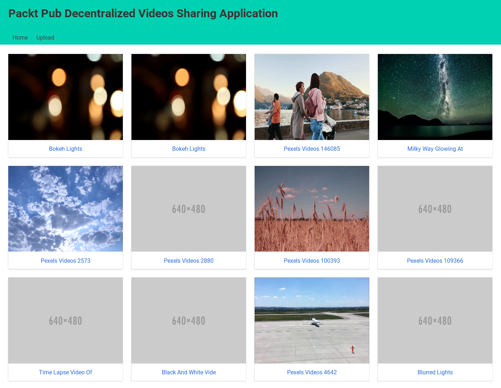
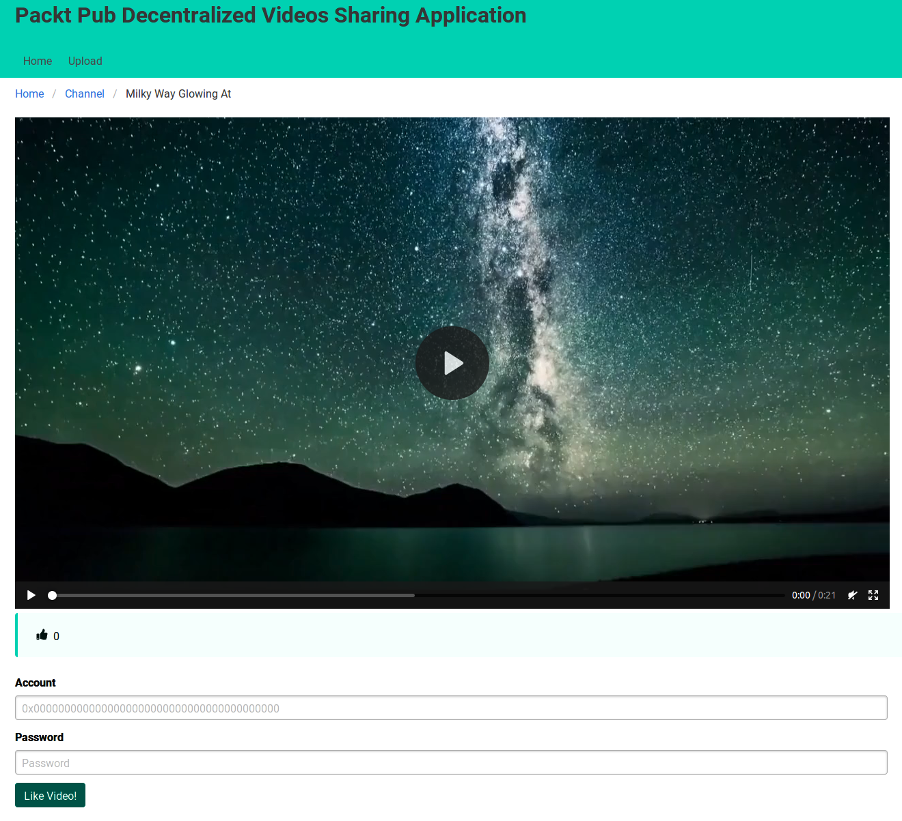
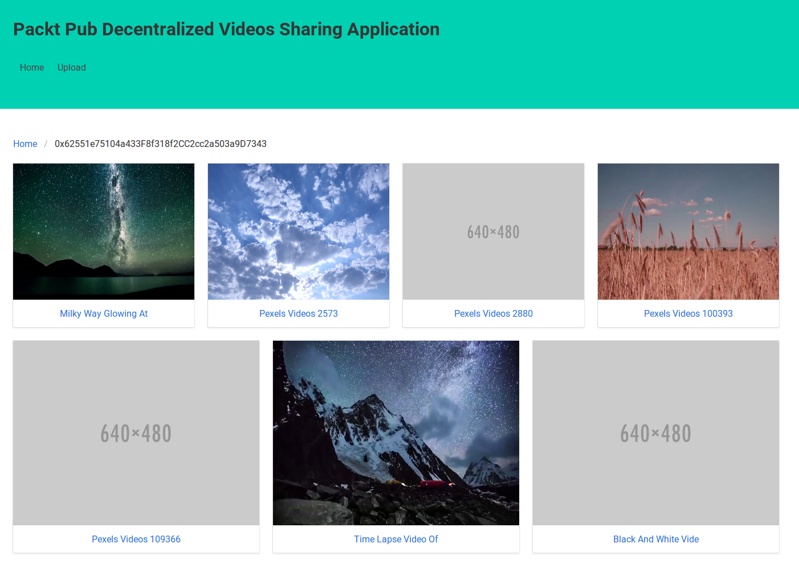
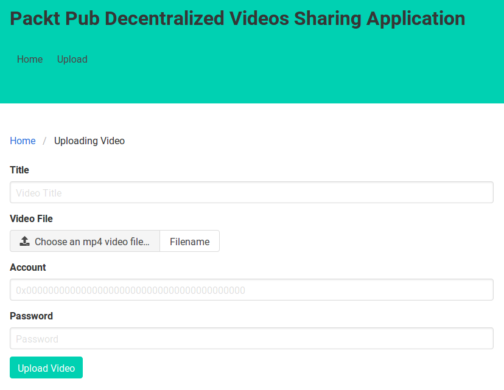

# 使用 IPFS 实现去中心化应用

在本章中，我们将结合智能合约和星际文件系统（IPFS）来构建一个去中心化的视频共享应用程序（类似于 YouTube 但去中心化）。 我们将使用 Web 应用程序作为区块链和 IPFS 的前端。 如前所述，IPFS 不是区块链技术。 IPFS 是一种去中心化的技术。 但是，在区块链论坛、聚会或教程中，你可能会经常听到 IPFS 被提及。 造成这种情况的主要原因之一是 IPFS 克服了区块链的弱点，即其存储非常昂贵。

在本章中，我们将涵盖以下主题：

- 去中心化视频分享应用架构
- 编写视频共享智能合约
- 构建视频共享 Web 应用程序

## 去中心化视频分享应用架构

这就是我们的应用程序在完成后的样子——首先，你访问一个网站，在那里你将看到一个视频列表（就像 YouTube 一样）。在这里，你可以在浏览器中播放视频，将视频上传到你的浏览器，以便人们可以观看你的可爱猫视频，还可以为其他人的视频点赞。

从表面上看，这就像一个正常的应用程序。你可以使用自己喜欢的 Python Web 框架（例如 Django、Flask 或 Pyramid）构建它。然后使用 MySQL 或 PostgreSQL 作为数据库。你可以选择 NGINX 或 Apache 作为 Gunicorn Web 服务器前面的 Web 服务器。对于缓存，你可以使用 Varnish 进行整页缓存，使用 Redis 进行模板缓存。你还将在云上托管 Web 应用程序和视频，例如 Amazon Web Service (AWS) 或 Google Cloud Platform (GCP)、Azure。然后你将使用内容交付网络使其在全球范围内可扩展。对于前端，你可以使用 JavaScript 框架以及 React.js、Angular.js、Vue.js 或 Ember。如果你是高级用户，则可以使用机器学习进行视频推荐。

但是，这里的重点是，我们要构建的是一个去中心化的区块链视频分享应用，而不是一个中心化的应用。

让我们讨论一下使用区块链技术构建去中心化视频共享应用程序的含义。

我们无法在以太坊区块链上存储视频文件，因为它非常昂贵；在以太坊区块链上，即使存储图片文件也需要一条胳膊和一条腿。有人在以下链接中为我们做了数学计算：https://ethereum.stackexchange.com/questions/872/what-is-the-cost-to-store-1kb-10kb-100kb-worth-of-数据进入以太坊区块。

存储 1 KB 的成本约为 0.032 ETH。一个体面的图像文件大约是 2 MB。如果你询问硬盘驱动器制造商，则 1 MB 为 1,000 KB，如果你询问操作系统，则为 1,024 KB。我们只是将其四舍五入到 1,000，因为它对我们的计算没有任何影响。因此，在以太坊上存储 2 MB 文件的成本约为 2,000 乘以 0.032 ETH，即 64 ETH。 ETH 的价格一直在变化。在撰写本文时，1 ETH 的成本约为 120 美元。这意味着要存储一个 2 MB 的图片文件（Unsplash 网站上的正常大小的库存图片文件）你需要花费 7,680 美元。 MP4 格式的一分半视频文件大约为 46 MB。因此，你需要花费 176,640 美元才能将此视频文件存储在以太坊上。

区块链开发人员通常不会支付这笔费用，而是将视频文件的引用存储在区块链上，并将视频文件本身存储在普通存储中，例如 AWS 上。在 Vyper 智能合约中，你可以使用字节数据类型：

```
cute_panda_video: bytes[128]
```

然后，你可以将你存储在 AWS S3 (https://aws.amazon.com/s3/) 中的视频链接存储在智能合约中：

```
cute_panda_video = "http://abucket.s3-website-us-west-2.amazonaws.com/cute_panda_video.mp4"
```

这种方法很好，很花哨，但问题是你依赖于 AWS。如果公司不喜欢你的可爱熊猫视频，他们可以删除它，并且智能合约中存在的 URL 将失效。你当然可以更改智能合约上 cute_panda_video 变量的值（除非你禁止这样做）。但是，这种情况给我们的应用带来了不便。如果你使用中心化公司的服务，你的信心取决于该公司的心血来潮。

我们可以通过使用去中心化存储（例如 IPFS）来缓解这个问题。我们可以将 IPFS 路径（或 IPFS 哈希）存储为 cut_panda_video 变量的值，而不是 URL，类似于以下示例：

```
cute_panda_video = "/ipfs/QmWgMcTdPY9Rv7SCBusK1gWBRJcBi2MxNkC1yC6uvLYPwK"
```

然后，我们可以在 AWS 和其他地方（例如 GCP）上启动我们的 IPFS 守护程序。因此，如果 AWS 审查我们的可爱熊猫视频，我们可爱熊猫视频的 IPFS 路径仍然有效。我们可以提供来自其他地方的视频，例如 GCP。你甚至可以在奶奶家的计算机上托管视频。沉迷于可爱熊猫视频的人甚至可以将视频置顶，并帮助我们为可爱熊猫视频提供服务。

除了以去中心化的方式托管可爱的熊猫视频之外，去中心化视频共享应用程序还有其他价值。该值与区块链技术有关。假设我们想要构建一个喜欢（竖起大拇指）的视频功能。我们可以在区块链上存储类似的价值。这可以防止腐败。想象一下，我们要为最可爱的熊猫视频建立一个投票竞赛，奖金为 10 BTC。如果我们的竞赛应用程序以集中方式完成（使用表将类似值保存在 MySQL 或 PostgreSQL 等 SQL 数据库上），作为集中管理员，我们可以使用以下代码劫持获胜者：

```
UPDATE thumbs_up_table SET aggregate_voting_count = 1000000 WHERE video_id = 234;
```

当然，作弊没那么容易。你需要通过确保聚合计数与单个计数匹配来使用数据库日志覆盖你的跟踪。这需要巧妙地完成。你可以在一小时内将总计数添加到 100 到 1,000 之间的随机数，而不是添加大量的选票，例如一次 100 万。这并不是说你欺骗用户，我只是想表达我的意思。

使用区块链，我们可以通过集中管理来防止数据完整性的破坏。喜欢的值保存在智能合约中，你让人们审计智能合约的源代码。我们在分散式视频共享应用程序上的点赞功能通过诚实的过程增加了视频的点赞数。

除了数据的完整性，我们还可以建立一个加密经济。我的意思是，我们可以在我们的智能合约中进行经济活动（例如销售、购买、投标等）。我们可以在同一个智能合约中构建代币。这个代币的币可以花在点赞视频上，让点赞不再是免费的。视频的所有者可以像钱一样将其兑现到他们的口袋里。这种动态可以激励人们上传更好的视频。

最重要的是，分散的应用程序保证了 API 的独立性。应用程序去中心化的性质可以防止 API 以类似于 Twitter API 惨败的方式受到干扰或骚扰。很久以前，开发人员可以自由地在 Twitter API 之上开发一个有趣的应用程序，但随后 Twitter 对开发人员如何使用他们的 API 施加了严格的限制。一个这样的例子是 Twitter 曾经关闭了对 Politwoops 的 API 访问，这保留了政客删除的推文。不过，访问已被重新激活。通过使我们的应用程序去中心化，我们可以增加 API 的民主性。

出于教育目的，我们的应用程序有两个主要功能。首先，你可以查看视频列表、播放视频和上传视频。这些是你在 YouTube 上所做的正常事情。其次，你可以喜欢视频，但只能使用硬币或代币。

在我们开始构建应用程序之前，让我们设计智能合约的架构和 Web 应用程序的架构。

### 视频共享智能合约的架构

我们的应用程序从智能合约开始。我们的智能合约需要在这里做一些事情，它们如下：

跟踪用户上传的视频
利用代币及其标准操作 (ERC20)
为用户提供一种使用硬币或代币点赞视频的方式
用于喜欢视频的硬币将转移给视频所有者
而已。我们始终努力使智能合约尽可能短。代码行数越多，出现错误的可能性就越大。并且无法修复智能合约中的错误。

在编写这个智能合约之前，让我们考虑一下我们想要如何构建我们的智能合约。智能合约的结构包括数据结构。让我们看一个示例，说明我们要使用什么数据结构来跟踪用户的视频。

我们肯定想使用一个以地址数据类型为键的映射变量。这里的困难部分是选择我们要使用的数据类型作为此映射数据类型的值。正如我们在第 3 章，使用 Vyper 实现智能合约中学到的，Vyper 中没有无限大小的数组。如果我们使用 bytes32 数组，我们将被限制为特定大小的数组作为此映射的值。这意味着用户可以拥有最大尺寸的视频。我们可以使用 bytes32 数组来保存非常大的视频列表，例如 100 万个视频。有人上传超过 100 万个视频的机会有多大？如果你每天上传一个视频，你十年只能上传 3650 个视频。但是，bytes32 数组的问题在于，它不能接受大小超过 32 字节的数据。 IPFS 路径，例如 QmWgMcTdPY9Rv7SCBusK1gWBRJcBi2MxNkC1yC6uvLYPwK，长度为 44 个字符。因此，你必须至少使用字节 [44] 数据类型，但我们会将其四舍五入为字节 [50]。

相反，我们希望有另一个映射数据类型变量（我们称之为映射 z）作为这个映射数据类型变量的值，这在上一段中已经描述过。映射 z 有一个整数作为键和一个包含字节 [50] 数据类型变量以保留 IPFS 路径和字节 [20] 数据类型变量以保留视频标题作为值的结构。有一个整数跟踪器来启动映射 z 中的键的值。这个整数跟踪器用值 0 初始化。每次我们将视频（IPFS 路径和视频标题）添加到映射 z 时，我们将这个整数跟踪器增加 1。所以下次我们添加另一个视频时，映射z的键不再是0，而是1。这个整数跟踪器对于每个帐户都是唯一的。我们可以创建帐户到此整数跟踪器的另一个映射。

在处理视频之后，我们专注于喜欢。我们如何存储用户 A 喜欢视频 Z 的事实？我们需要确保用户不能多次喜欢同一个视频。最简单的方法是创建一个以字节 [100] 数据类型为键、布尔数据类型为值的映射。 bytes[100] 数据类型变量是使用视频点赞者地址、视频上传者地址和视频索引的组合。布尔数据类型变量用于指示用户是否已经喜欢该视频。

最重要的是，我们需要一个整数数据类型来保持视频点赞数的总数。聚合 likes 是一个映射，以字节 [100] 数据类型为键，以整数数据类型为值。 bytes[100] 数据类型变量是视频上传者地址和视频索引的组合。

这种方法的缺点是很难跟踪哪些用户喜欢智能合约中的特定视频。我们可以创建另一个映射来跟踪哪些用户喜欢某个视频。然而，这会使我们的智能合约复杂化。以前，我们加倍努力创建了一个专门用于跟踪用户上传的所有视频的映射。这是必要的，因为我们想要获取用户视频的列表。这就是我们所说的核心功能。但是，跟踪哪些用户喜欢某个视频并不是我所说的核心功能。

只要我们能让视频点赞过程诚实，我们就不需要跟踪哪些用户点赞了某个视频。如果我们真的很想跟踪这些用户，我们可以在智能合约中使用事件。每次用户喜欢一个视频，就会触发一个事件。然后，在使用 web3.py 库的客户端，我们可以过滤这些事件以获得喜欢特定视频的所有用户。这将是一个昂贵的过程，应该与主应用程序分开完成。我们可以使用 Celery 使用后台作业，此时结果可以存储在数据库中，例如 SQLite、PostgreSQL 或 MySQL。构建去中心化应用程序并不意味着完全否定中心化方法。

> 第 8 章“在以太坊中创建令牌”中已详细讨论了令牌主题。

### 视频共享 Web 应用程序的架构

我们将开发一个 Python Web 应用程序作为我们智能合约的前端。这意味着我们需要一个合适的服务器来成为 Python Web 应用程序的主机。为此，我们至少需要一个 Gunicorn Web 服务器。换句话说，我们需要将 Python Web 应用程序托管在集中式服务器中，例如 AWS、GCP 或 Azure。这对于观看视频来说实际上很好，但是当用户想要上传视频时就会出现问题，因为这需要访问私钥。用户可能会担心我们在中央服务器上的 Python Web 应用程序会窃取他们的私钥。

因此，解决方案是在 GitHub 或 GitLab 上发布我们的 Python Web 应用程序的源代码，然后告诉用户下载、安装并在他们的计算机上运行它。他们可以审核我们的 Python Web 应用程序的源代码，以确保没有讨厌的代码试图窃取他们的私钥。但是，如果他们每次都需要审核源代码，那么我们会在我们的 Git 存储库中添加另一个提交。

或者更好的是，我们可以将 Python Web 应用程序的源代码存储在 IPFS 上。他们可以从 IPFS 下载这个，并确保我们的应用程序的源代码不会被篡改。他们只需要在使用源代码之前审核一次。

然而，虽然我们可以在 IPFS 上托管静态网站，但我们无法对动态网页（例如 Python、PHP、Ruby 或 Perl Web 应用程序）执行相同的操作。这样的动态网站需要一个合适的网络服务器。因此，任何下载我们 Python Web 应用程序源代码的人都需要在执行我们的应用程序之前安装正确的软件。他们需要安装 Python 解释器、Web 服务器（Gunicorn、Apache 或 NGINX）以及所有必要的库。

但是，只有桌面用户可以这样做。移动用户无法执行我们的应用程序，因为在 Android 或 iOS 平台上没有合适的 Python 解释器或 Web 服务器。

这就是 JavaScript 闪耀的地方。你可以创建一个动态的静态网站，以便你可以在网页中进行交互。你还可以使用 React.js、Angular.js、Ember.js 或 Vue.js 创建一个复杂的 JavaScript Web 应用程序，并将其部署在 IPFS 上。桌面用户和移动用户可以执行 JavaScript Web 应用程序。因为这是一本关于 Python 的书，我们仍将着眼于创建 Python Web 应用程序。但是，你应该牢记 JavaScript 与 Python 相比的优势。

再好的 JavaScript 也无法挽救移动用户的困境。移动平台的计算能力仍然不如桌面平台的计算能力强。你仍然无法像无法在移动平台上运行 IPFS 软件一样，在移动平台上运行完整的以太坊节点。

让我们设计我们的 Web 应用程序。这有一些实用程序：

- 播放视频
- 上传视频
- 喜欢一个视频
- 列出许多用户的近期视频
- 列出来自特定用户的视频

列出用户的所有视频相当容易，因为我们可以根据智能合约中的用户获取视频的无限大小数组（基本上是一个以整数为键的映射和另一个整数跟踪器）。页面的控制器接受用户（或基本上是智能合约中的地址）作为参数。

播放视频接受视频上传者的地址和视频的索引作为参数。如果视频尚不存在于我们的存储中，我们会从 IPFS 下载它。然后我们将视频提供给用户。

上传视频需要与以太坊节点进行交互。这种上传视频的方法或功能接受要使用的帐户地址参数、加密私钥的密码参数、视频文件参数和视频标题参数。我们首先将视频文件存储在 IPFS 上。那么如果成功，我们就可以将这段视频的信息存储在区块链上。

喜欢视频还需要与以太坊节点进行交互。 这种喜欢视频的方法或功能接受要使用的视频喜欢者地址的参数、加密私钥的密码参数、视频上传者地址的参数和视频索引的参数。 在确定用户之前不喜欢该视频后，我们将信息存储在区块链上。

列出许多用户的最新视频有点棘手。 所涉及的努力是相当巨大的。 在智能合约中，我们没有跟踪所有参与用户的变量。 我们也没有一个变量来跟踪来自不同用户的所有视频。 但是，我们可以通过在区块链上存储视频信息的方法来创建事件。 这样做之后，我们可以找到此事件的所有最新视频。

现在是构建去中心化视频共享应用程序的时候了。

## 编写视频共享智能合约

事不宜迟，让我们建立我们的智能合约开发平台：

1. 首先，我们按如下方式设置我们的虚拟环境：
    ```sh
    $ virtualenv -p python3.6 videos-venv
    $ source videos-venv/bin/activate
    (videos-venv) $
    ```
2. 然后我们安装 Web3、Populus 和 Vyper：
    ```sh
    (videos-venv) $ pip install eth-abi==1.2.2
    (videos-venv) $ pip install eth-typing==1.1.0
    (videos-venv) $ pip install py-evm==0.2.0a33
    (videos-venv) $ pip install web3==4.7.2
    (videos-venv) $ pip install -e git+https://github.com/ethereum/populus#egg=populus
    (videos-venv) $ pip install vyper
    ```
    > Vyper 的最新版本是 0.1.0b6，它打破了 Populus。开发人员需要一些时间来解决这个问题。如果在你阅读本书时该错误尚未修复，你可以自己修补 Populus。
3. 使用以下命令检查此库是否已修复错误：
    ```sh
    (videos-venv) $ cd videos-venv/src/populus
    (videos-venv) $ grep -R "compile(" populus/compilation/backends/vyper.py
                bytecode = '0x' + compiler.compile(code).hex()
                bytecode_runtime = '0x' + compiler.compile(code, bytecode_runtime=True).hex()
    ```
    在我们的案例中，该错误尚未修复。
4. 因此，让我们修补 Populus 以修复该错误。确保你仍在同一目录中（videos-venv/src/populus）：
    ```sh
    (videos-venv) $ wget https://patch-diff.githubusercontent.com/raw/ethereum/populus/pull/484.patch
    (videos-venv) $ git apply 484.patch
    (videos-venv) $ cd ../../../
    ```
5. 修补 Populus 后，我们将创建我们的智能合约项目目录：
    ```sh
    (videos-venv) $ mkdir videos-sharing-smart-contract
    ```
6. 然后，我们将目录初始化为 Populus 项目目录：
    ```sh
    (videos-venv) $ cd videos-sharing-smart-contract
    (videos-venv) $ mkdir contracts tests
    ```
7. 接下来，我们将在 Populus 项目目录中下载 Populus 配置文件：
    ```sh
    (videos-venv) $ wget https://raw.githubusercontent.com/ethereum/populus/master/populus/assets/defaults.v9.config.json -O project.json
    ```
8. 我们现在将打开 Populus 的 project.json 配置文件并覆盖编译键的值，如以下代码块所示：
    ```sh
    "compilation": {
        "backend": {
          "class": "populus.compilation.backends.VyperBackend"
        },
        "contract_source_dirs": [
          "./contracts"
        ],
        "import_remappings": []
      },
    ```
9. 然后我们在videos-sharing-smart-contract/contracts/VideosSharing.vy 中编写我们的智能合约代码，如下面的代码块所示（完整代码请参考以下GitLab 链接中的代码文件：https://gitlab。 com/arjunaskykok/hands-on-blockchain-for-python-developers/blob/master/chapter_12/videos_sharing_smart_contract/contracts/VideosSharing.vy）：
    ```python
    struct Video:
        path: bytes[50]
        title: bytes[20]
    
    Transfer: event({_from: indexed(address), _to: indexed(address), _value: uint256})
    Approval: event({_owner: indexed(address), _spender: indexed(address), _value: uint256})
    UploadVideo: event({_user: indexed(address), _index: uint256})
    LikeVideo: event({_video_liker: indexed(address), _video_uploader: indexed(address), _index: uint256})
    
    ...
    ...
    
    @public
    @constant
    def video_aggregate_likes(_user_video: address, _index: uint256) -> uint256:
        _user_video_str: bytes32 = convert(_user_video, bytes32)
        _index_str: bytes32 = convert(_index, bytes32)
        _key: bytes[100] = concat(_user_video_str, _index_str)
    
        return self.aggregate_likes[_key]
    ```
    现在，让我们一点一点地讨论我们的智能合约：
    ```python
    struct Video:
        path: bytes[50]
        title: bytes[20]
    ```

这是我们希望保留在区块链上的视频信息结构。 Video 结构体的路径存储 IPFS 路径，其长度为 44。如果我们使用另一个散列函数，IPFS 路径将是不同的长度。请记住，IPFS 在散列对象时使用多散列。如果你在 IPFS 配置中使用更昂贵的散列函数，例如 SHA512，则需要将 bytes[] 数组数据类型的大小加倍。例如， bytes[100] 应该就足够了。 Video 结构的标题存储视频标题。在这里，我使用 bytes[20] 是因为我想保持标题简短。如果你想存储更长的标题，你可以使用更长的字节，例如 bytes[100]。但是，请记住，你在区块链上存储的字节越多，你必须花费的气体（钱！）就越多。当然，你可以在这个结构体中添加更多的信息，比如视频描述或视频标签，只要你知道后果，执行存储视频信息的方法需要更多的gas。

我们现在转到事件列表：

```python
Transfer: event({_from: indexed(address), _to: indexed(address), _value: uint256})
Approval: event({_owner: indexed(address), _spender: indexed(address), _value: uint256})
UploadVideo: event({_user: indexed(address), _index: uint256})
LikeVideo: event({_video_liker: indexed(address), _video_uploader: indexed(address), _index: uint256})
```

转移和批准是 ERC20 标准事件的一部分。你可以在第 8 章“在以太坊中创建代币”中阅读有关 ERC20 的更多信息。当我们在智能合约中上传视频信息时，会触发 UploadVideo 事件。我们保存视频上传者的地址和视频的索引。当我们喜欢智能合约中的视频时，会触发 LikeVideo 事件。

我们保存视频点赞者地址、视频上传者地址和视频索引：

```python
user_videos_index: map(address, uint256)
```

这是我们无限数组的整数跟踪器。所以如果user_videos_index[用户A的地址] = 5，说明用户A已经上传了四个视频。

以下是 ERC20 标准的一部分：

```python
name: public(bytes[20])
symbol: public(bytes[3])
totalSupply: public(uint256)
decimals: public(uint256)
balances: map(address, uint256)
allowed: map(address, map(address, uint256))
```

有关 ERC20 的更多信息，请参阅第 8 章，在以太坊中创建令牌。

我们继续下一行：

```python
all_videos: map(address, map(uint256, Video))
```

这是保留所有用户的所有视频的核心变量。地址数据类型键用于保存用户的地址。 map(uint256, Video) 数据类型值是我们的无限数组。 map(uint256, Video) 中的 uint256 键从 0 开始，然后由 user_videos_index 变量跟踪。 Video struct 是我们的视频信息。

接下来的两行代码用于喜欢：

```python
likes_videos: map(bytes[100], bool)
aggregate_likes: map(bytes[100], uint256)
```

likes_videos 变量是用于检查某个用户是否喜欢某个特定视频的变量。 agregate_likes 变量是一个变量，用于显示该特定视频已经获得了多少赞。

我们现在已经完成了变量的定义，接下来将转到以下代码块中显示的代码：

```python
@public
def __init__():
    _initialSupply: uint256 = 500
    _decimals: uint256 = 3
    self.totalSupply = _initialSupply * 10 ** _decimals
    self.balances[msg.sender] = self.totalSupply
    self.name = 'Video Sharing Coin'
    self.symbol = 'VID'
    self.decimals = _decimals
    log.Transfer(ZERO_ADDRESS, msg.sender, self.totalSupply)

...
...

@public
@constant
def allowance(_owner: address, _spender: address) -> uint256:
    return self.allowed[_owner][_spender]
```

这是标准的 ERC20 代码，你可以在第 8 章“在以太坊中创建令牌”中了解。但是，我对代码做了一个小调整，如下代码块所示：

```python
@private
def _transfer(_source: address, _to: address, _amount: uint256) -> bool:
    assert self.balances[_source] >= _amount
    self.balances[_source] -= _amount
    self.balances[_to] += _amount
    log.Transfer(_source, _to, _amount)

    return True

@public
def transfer(_to: address, _amount: uint256) -> bool:
    return self._transfer(msg.sender, _to, _amount)
```

在这个智能合约中，我将 transfer 方法的内部代码提取到专用私有方法中。这样做的原因是在喜欢视频的方法中将使用转移硬币功能。请记住，当我们喜欢一个视频时，我们必须向视频上传者支付硬币。我们不能在另一个公共函数中调用公共函数。其余代码相同（令牌名称除外）：

```python
@public
def upload_video(_video_path: bytes[50], _video_title: bytes[20]) -> bool:
    _index: uint256 = self.user_videos_index[msg.sender]

    self.all_videos[msg.sender][_index] = Video({ path: _video_path, title: _video_title })
    self.user_videos_index[msg.sender] += 1

    log.UploadVideo(msg.sender, _index)aggregate_likes

    return True
```

这是用于在区块链上存储视频信息的方法。我们在将视频上传到 IPFS 后调用此方法。 _video_path 是 IPFS 路径，_video_title 是视频标题。我们从视频上传器 (msg.sender) 获取最新索引。然后我们根据视频上传者的地址和最新索引将 Video 结构的值设置为 all_videos。

然后我们增加整数跟踪器（user_videos_index）。不要忘记记录此事件。

```python
@public
@constant
def latest_videos_index(_user: address) -> uint256:
    return self.user_videos_index[_user]

@public
@constant
def videos_path(_user: address, _index: uint256) -> bytes[50]:
    return self.all_videos[_user][_index].path

@public
@constant
def videos_title(_user: address, _index: uint256) -> bytes[20]:
    return self.all_videos[_user][_index].title
```

上述代码块中的方法是使用 web3 的客户端获取最新视频索引、视频 IPFS 路径和视频标题的便捷方法。如果没有这些方法，你仍然可以获得有关视频的信息，但是使用 web3 访问嵌套映射数据类型变量中的结构变量并不简单。

以下代码显示了用于喜欢视频的方法。它接受视频上传者的地址和视频索引。在这里，你创建两个键 - 一个用于 likes_videos，另一个用于aggregate_likes。 likes_videos 的键是视频喜欢者地址、视频上传者地址和视频索引的组合。 agregate_likes 的键是视频上传者地址和视频索引的组合。创建密钥后，我们会确保视频喜欢者将来不会喜欢同一个视频，并且视频喜欢者之前没有喜欢过这个特定的视频。喜欢视频只需使用我们创建的键为 likes_videos 变量设置 True 值。然后我们用我们创建的键增加 aggregate_likes 的值一。最后，我们将一枚代币从视频喜欢者转移到视频上传者。不要忘记记录此事件：

```python
@public
def like_video(_user: address, _index: uint256) -> bool:
    _msg_sender_str: bytes32 = convert(msg.sender, bytes32)
    _user_str: bytes32 = convert(_user, bytes32)
    _index_str: bytes32 = convert(_index, bytes32)
    _key: bytes[100] = concat(_msg_sender_str, _user_str, _index_str)
    _likes_key: bytes[100] = concat(_user_str, _index_str)
 a particular
    assert _index < self.user_videos_index[_user]
    assert self.likes_videos[_key] == False

    self.likes_videos[_key] = True
    self.aggregate_likes[_likes_key] += 1
    self._transfer(msg.sender, _user, 1)

    log.LikeVideo(msg.sender, _user, _index)

    return True
```

以下代码行是用于检查特定用户是否喜欢某个视频以及该特定视频已有多少人喜欢的便捷方法：

```python
@public
@constant
def video_has_been_liked(_user_like: address, _user_video: address, _index: uint256) -> bool:
    _user_like_str: bytes32 = convert(_user_like, bytes32)
    _user_video_str: bytes32 = convert(_user_video, bytes32)
    _index_str: bytes32 = convert(_index, bytes32)
    _key: bytes[100] = concat(_user_like_str, _user_video_str, _index_str)

    return self.likes_videos[_key]

@public
@constant
def video_aggregate_likes(_user_video: address, _index: uint256) -> uint256:
    _user_video_str: bytes32 = convert(_user_video, bytes32)
    _index_str: bytes32 = convert(_index, bytes32)
    _key: bytes[100] = concat(_user_video_str, _index_str)

    return self.aggregate_likes[_key]
```

让我们在videos_sharing_smart_contract/tests/test_video_sharing.py 中编写一个测试。有关完整代码，请参阅以下 GitLab 链接中的代码文件：https://gitlab.com/arjunaskykok/hands-on-blockchain-for-python-developers/blob/master/chapter_12/videos_sharing_smart_contract/tests/test_videos_sharing.py .

```python
import pytest
import eth_tester


def upload_video(video_sharing, chain, account, video_path, video_title):
    txn_hash = video_sharing.functions.upload_video(video_path, video_title).transact({'from': account})
    chain.wait.for_receipt(txn_hash)

def transfer_coins(video_sharing, chain, source, destination, amount):
    txn_hash = video_sharing.functions.transfer(destination, amount).transact({'from': source})
    chain.wait.for_receipt(txn_hash)

...
...

   assert events[1]['args']['_video_liker'] == video_liker2
    assert events[1]['args']['_video_uploader'] == video_uploader
    assert events[1]['args']['_index'] == 0

    with pytest.raises(eth_tester.exceptions.TransactionFailed):
        like_video(video_sharing, chain, video_liker, video_uploader, 0)
```

让我们一点一点地详细讨论测试脚本。在下面的代码块中，在导入必要的库后，我们创建了三个方便的功能——上传视频的功能、转账硬币的功能和喜欢视频的功能：

```python
import pytest
import eth_tester


def upload_video(video_sharing, chain, account, video_path, video_title):
    txn_hash = video_sharing.functions.upload_video(video_path, video_title).transact({'from': account})
    chain.wait.for_receipt(txn_hash)

def transfer_coins(video_sharing, chain, source, destination, amount):
    txn_hash = video_sharing.functions.transfer(destination, amount).transact({'from': source})
    chain.wait.for_receipt(txn_hash)

def like_video(video_sharing, chain, video_liker, video_uploader, index):
    txn_hash = video_sharing.functions.like_video(video_uploader, index).transact({'from': video_liker})
    chain.wait.for_receipt(txn_hash)
```

如以下代码块所示，在上传视频之前，我们确保最新视频索引为0。然后，上传一个视频后，我们应该检查最新视频的索引，该索引应该增加了1。当然，我们也会检查视频路径和视频标题。然后我们再次上传一个视频并检查最新视频的索引，现在应该是2。我们还检查视频路径和视频标题。最后，我们检查事件并确保它们已正确创建：

```python
def test_upload_video(web3, chain):
    video_sharing, _ = chain.provider.get_or_deploy_contract('VideosSharing')

    t = eth_tester.EthereumTester()
    video_uploader = t.get_accounts()[1]

    index = video_sharing.functions.latest_videos_index(video_uploader).call()
    assert index == 0

...
...

    assert events[0]['args']['_user'] == video_uploader
    assert events[0]['args']['_index'] == 0

    assert events[1]['args']['_user'] == video_uploader
    assert events[1]['args']['_index'] == 1
```

让我们看看测试脚本的下一部分：

```python
def test_like_video(web3, chain):
    video_sharing, _ = chain.provider.get_or_deploy_contract('VideosSharing')

    t = eth_tester.EthereumTester()
    manager = t.get_accounts()[0]
    video_uploader = t.get_accounts()[1]
    video_liker = t.get_accounts()[2]
    video_liker2 = t.get_accounts()[3]

    transfer_coins(video_sharing, chain, manager, video_liker, 100)
    transfer_coins(video_sharing, chain, manager, video_liker2, 100)
    transfer_coins(video_sharing, chain, manager, video_uploader, 50)
    upload_video(video_sharing, chain, video_uploader, b'video-ipfs-path', b"video title")

...
...

    with pytest.raises(eth_tester.exceptions.TransactionFailed):
        like_video(video_sharing, chain, video_liker, video_uploader, 0)
```

首先，我们从经理账户（启动智能合约的账户）转移一些硬币到不同的账户，然后我们上传一个视频。在点赞视频之前，我们应该确保账户的代币余额是应该的，测试账户没有点赞该视频，并且总点赞数仍然为0。

这样做后，我们喜欢来自特定帐户的视频。视频点赞者token余额减1，视频上传者token余额加1。这意味着智能合约已经记录了该帐户对视频的点赞，该视频的总点赞数应增加 1。

然后，我们喜欢另一个帐户的视频。视频点赞者token余额减1，视频上传者token余额再增加1。智能合约记录了另一个账户点赞了该视频，此时该视频的总点赞数应再次增加 1，使其为 2。

然后，我们确保触发视频点赞事件。

最后，我们确保视频喜欢者不能多次喜欢同一个视频。

我们不会讨论这个智能合约的 ERC20 部分的测试。请参阅第 8 章，在以太坊中创建代币，了解如何测试 ERC20 代币智能合约。

要执行测试，请运行以下语句：

```sh
(videos-venv) $ py.test tests/test_videos_sharing.py
```

### 启动私有以太坊区块链

让我们使用 geth 启动我们的私有以太坊区块链。 这里我们不会使用 Ganache，因为 Ganache 的稳定版本还不支持事件（但是 Ganache 的 beta 版本（v 2.0.0 beta 2）已经支持事件）：

1. 我们将使用以下代码块来启动块：
    ```python
    (videos-venv) $ cd videos_sharing_smart_contract
    (videos-venv) $ populus chain new localblock
    (videos-venv) $ ./chains/localblock/init_chain.sh
    ```
2. 现在编辑chains/localblock/run_chain.sh。 找到 --ipcpath，然后将值（--ipcpath 后面的单词）更改为 /tmp/geth.ipc。
3. 然后编辑 project.json 文件。 chains 对象指向四个键：tester、temp、ropsten 和 mainnet。 在链对象中添加另一个键 localblock：
    ```python
    "localblock": {
          "chain": {
            "class": "populus.chain.ExternalChain"
          },
          "web3": {
            "provider": {
              "class": "web3.providers.ipc.IPCProvider",
            "settings": {
              "ipc_path":"/tmp/geth.ipc"
            }
           }
          },
          "contracts": {
            "backends": {
              "JSONFile": {"$ref": "contracts.backends.JSONFile"},
              "ProjectContracts": {
                "$ref": "contracts.backends.ProjectContracts"
              }
            }
          }
        }
    ```
4. 使用以下命令运行区块链：
    ```sh
    (videos-venv) $ ./chains/localblock/run_chain.sh
    ```
5. 使用以下命令编译我们的智能合约：
    ```sh
    (videos-venv) $ populus compile
    ```
6. 然后，使用以下命令将我们的智能合约部署到我们的私有区块链：
    ```sh
    (videos-venv) $ populus deploy --chain localblock VideosSharing
    ```

在 address.txt 中写下我们的智能合约部署的地址。 该文件必须与videos_sharing_smart_contract 目录相邻。

### 创建引导脚本

该脚本用于加载数据，使我们的应用程序开发更容易。 我们可以从 https://videos.pexels.com/ 下载免费视频。 在videos_sharing_smart_contract 目录旁边创建一个stock_videos 目录，并将一些MP4 文件下载到该stock_videos 目录。 就我而言，我下载了 20 多个视频。

下载一些数据后，我们将创建一个名为 bootstrap_videos.py 的脚本。 有关完整代码，请参阅以下 GitLab 链接中的代码文件：https://gitlab.com/arjunaskykok/hands-on-blockchain-for-python-developers/blob/master/chapter_12/bootstrap_videos.py：

```python
import os, json
import ipfsapi
from web3 import Web3, IPCProvider
from populus.utils.wait import wait_for_transaction_receipt


w3 = Web3(IPCProvider('/tmp/geth.ipc'))

common_password = 'bitcoin123'
accounts = []
with open('accounts.txt', 'w') as f:
...
...
    nonce = w3.eth.getTransactionCount(Web3.toChecksumAddress(account))
    txn = VideosSharing.functions.upload_video(ipfs_path, title).buildTransaction({
                'from': account,
                'gas': 200000,
                'gasPrice': w3.toWei('30', 'gwei'),
                'nonce': nonce
              })
    txn_hash = w3.personal.sendTransaction(txn, common_password)
    wait_for_transaction_receipt(w3, txn_hash)
```

让我们一点一点地详细讨论脚本。在以下代码块中，导入必要的库后，我们创建一个名为 w3 的对象，它是我们私有区块链的连接对象：

```python
import os, json
import ipfsapi
from web3 import Web3, IPCProvider
from populus.utils.wait import wait_for_transaction_receipt


w3 = Web3(IPCProvider('/tmp/geth.ipc'))
```

在以下代码行中，我们使用 w3.personal.newAccount() 方法创建新帐户。然后我们将新帐户的地址放入 accounts.txt 文件和帐户变量中。所有帐户都使用“bitcoin123”作为密码：

```python
common_password = 'bitcoin123'
accounts = []
with open('accounts.txt', 'w') as f:
    for i in range(4):
        account = w3.personal.newAccount(common_password)
        accounts.append(account)
        f.write(account + "\n")
```

请记住：在我们的私有区块链上部署智能合约后，我们将其地址保存在 address.txt 文件中。现在是将文件内容加载到地址变量的时候了：

```python
with open('address.txt', 'r') as f:
    address = f.read().rstrip("\n")

with open('videos_sharing_smart_contract/build/contracts.json') as f:
    contract = json.load(f)
    abi = contract['VideosSharing']['abi']
```

然后我们加载我们的智能合约的 abi 或接口，我们可以从我们 Populus 项目目录的 build 目录中的 contract.json 获取：videos_sharing_smart_contract。我们使用 json.load() 方法将 JSON 加载到合约变量中。 abi 来自 json 对象的“VideosSharing”键的“abi”键。

然后我们用 w3.eth.contract() 方法用地址和接口初始化智能合约对象。然后我们使用 ipfsapi.connect() 方法获取 IPFS 连接对象：

```python
VideosSharing = w3.eth.contract(address=address, abi=abi)

c = ipfsapi.connect()
```

接下来，我们想将以太币转移到我们的新账户。默认情况下，第一个帐户（w3.eth.accounts[0]）从挖矿中获得所有奖励，因此它有足够的以太可以共享。默认密码是“this-is-not-a-secure-password”：

```python
coinbase = w3.eth.accounts[0]
coinbase_password = 'this-is-not-a-secure-password'
# Transfering Ethers
for destination in accounts:
    nonce = w3.eth.getTransactionCount(Web3.toChecksumAddress(coinbase))
    txn = {
            'from': coinbase,
            'to': Web3.toChecksumAddress(destination),
            'value': w3.toWei('100', 'ether'),
            'gas': 70000,
            'gasPrice': w3.toWei('1', 'gwei'),
            'nonce': nonce
          }
    txn_hash = w3.personal.sendTransaction(txn, coinbase_password)
    wait_for_transaction_receipt(w3, txn_hash)
```

发送以太币是通过 w3.personal.sendTransaction() 方法完成的，该方法接受一个包含发送者（'from'）、目的地（'to'）、以太币数量（'value'）、gas、gas 价格（ 'gasPrice')，nonce 作为第一个参数，密码作为第二个参数。然后我们等待使用 wait_for_transaction_receipt() 方法确认交易。

转移以太币后，我们将我们代币的一些 ERC20 硬币转移到新账户。这是必要的，因为要喜欢视频，我们需要 ERC20 代币的硬币：

```python
# Transfering Coins
for destination in accounts:
    nonce = w3.eth.getTransactionCount(coinbase)
    txn = VideosSharing.functions.transfer(destination, 100).buildTransaction({
                'from': coinbase,
                'gas': 70000,
                'gasPrice': w3.toWei('1', 'gwei'),
                'nonce': nonce
              })
    txn_hash = w3.personal.sendTransaction(txn, coinbase_password)
    wait_for_transaction_receipt(w3, txn_hash)
```

我们构建了一个交易对象 txn，用于传输令牌方法 (VideosSharing.functions.transfer)，它通过 buildTransaction 方法接受目标帐户和硬币数量。这接受发送者 ('from')、gas、gas 价格 ('gasPrice') 和 nonce 的字典。我们使用 w3.personal.sendTransaction() 方法创建交易，然后等待使用 wait_for_transaction_receipt() 方法确认交易。

我们使用 os.listdir() 方法列出 stock_videos 目录中的所有文件。你已将一些 MP4 文件下载到此目录。执行此操作后，我们遍历这些文件：

```python
# Uploading Videos
directory = 'stock_videos'
movies = os.listdir(directory)
length_of_movies = len(movies)
for index, movie in enumerate(movies):
    account = accounts[index//7]
    ipfs_add = c.add(directory + '/' + movie)
    ipfs_path = ipfs_add['Hash'].encode('utf-8')
    title = movie.rstrip('.mp4')[:20].encode('utf-8')

    nonce = w3.eth.getTransactionCount(Web3.toChecksumAddress(account))
    txn = VideosSharing.functions.upload_video(ipfs_path, title).buildTransaction({
                'from': account,
                'gas': 200000,
                'gasPrice': w3.toWei('30', 'gwei'),
                'nonce': nonce
              })
    txn_hash = w3.personal.sendTransaction(txn, common_password)
    wait_for_transaction_receipt(w3, txn_hash)
```

我们希望每个帐户上传七个视频（帐户 = 帐户 [index//7]）。因此，前七个视频将由第一个帐户上传，而第二批七个视频将由第二个帐户上传。然后我们将 MP4 文件添加到 IPFS（ipfs_add = c.add(directory + '/' + movie)）。我们获取 IPFS 路径并将其转换为字节对象（ipfs_path = ipfs_add['Hash'].encode('utf-8')），将 MP4 文件名剥离为 20 个字符并将其转换为字节对象，因为智能合约的数据类型为字节 [20]。

然后我们调用智能合约的upload_video 方法（VideosSharing.functions.upload_video）。我们必须先构建交易对象，然后再将其作为参数发送给 w3.personal.sendTransaction() 方法。我们像往常一样使用 wait_for_transaction_receipt() 方法等待交易得到确认。

但是，你必须小心使用upload_video 方法，因为它在区块链上保存了具有bytes[50] 数据类型的视频路径和具有bytes[20] 数据类型的视频标题。它还会增加视频的索引并记录事件。所需的天然气和天然气价格远不止转移硬币或代币方法。要转移代币，你可以获得 1 gwei 和 70,000 gas 的 gas 价格。但是，这对于我们的 upload_video 方法会失败。对于这种方法，我使用 30 gwei 和 200,000 gas 的 gas 价格。请记住，区块链中的存储是昂贵的。甚至一些字符串也可能提高操作所需的天然气和天然气价格。

1. 确保你已启动私有区块链，然后启动 IPFS 守护进程：

```python
ipfs daemon
```

如果你不知道如何安装和启动 IPFS，请参阅第 11 章，使用 ipfsapi 与 IPFS 交互。

2. 现在，我们需要在我们的虚拟环境中安装 IPFS Python 库：

```python
(videos-venv) $ pip install ipfsapi
```

3. 然后，我们使用以下命令运行我们的引导脚本：

```python
(videos-venv) $ python bootstrap_videos.py
```

这将需要一些时间。你可以通过访问智能合约并检查视频是否已上传来测试你的引导脚本是否成功。

4. 创建一个名为 check_bootstrap.py 的脚本：

```python
import json
from web3 import Web3, IPCProvider


w3 = Web3(IPCProvider('/tmp/geth.ipc'))

with open('accounts.txt', 'r') as f:
    account = f.readline().rstrip("\n")

with open('address.txt', 'r') as f:
    address = f.read().rstrip("\n")

with open('videos_sharing_smart_contract/build/contracts.json') as f:
    contract = json.load(f)
    abi = contract['VideosSharing']['abi']

VideosSharing = w3.eth.contract(address=address, abi=abi)

print(VideosSharing.functions.latest_videos_index(account).call())
```

5. 运行脚本。如果输出为 0，则你的引导脚本失败。如果你得到一些非 0 的输出，那么你的视频信息已经成功上传到区块链中。

## 构建视频共享 Web 应用程序

是时候构建我们的智能合约的前端了。之前，在第 7 章前端去中心化应用程序和第 9 章加密货币钱包中，我们使用 Qt for Python 或 Pyside2 库创建了一个桌面应用程序。这次我们将使用 Django 库构建一个 Web 应用程序：

1. 事不宜迟，让我们安装 Django：
    ```sh
    (videos-venv) $ pip install Django
    ```
2. 我们还需要 OpenCV Python 库来获取我们视频的缩略图：
    ```sh
    (videos-venv) $ pip install opencv-python
    ```
3. 现在让我们创建我们的 Django 项目目录。这将使用其设置文件创建一个骨架 Django 项目：
    ```sh
    (videos-venv) $ django-admin startproject decentralized_videos
    ```
4. 在这个新目录中，创建一个静态媒体目录：
    ```sh
    (videos-venv) $ cd decentralized_videos
    (videos-venv) $ mkdir static media
    ```
5. 仍然在同一目录中，创建一个名为视频的 Django 应用程序：
    ```sh
    (videos-venv) $ python manage.py startapp videos
    ```
6. 然后更新我们的 Django 项目设置文件。该文件位于decentralized_videos/settings.py。将我们的新应用程序视频添加到 INSTALLED_APPS 变量。确保“videos”和“django.contrib.staticfiles”字符串之间有逗号。我们需要将每个 Django 应用程序添加到这个变量中，以便 Django 项目识别它。一个 Django 项目可以由许多 Django 应用程序组成：
    ```python
    INSTALLED_APPS = [
        'django.contrib.admin',
        'django.contrib.auth',
        'django.contrib.contenttypes',
        'django.contrib.sessions',
        'django.contrib.messages',
        'django.contrib.staticfiles',
        'videos'
    ]
    ```
7. 然后，在同一个文件中，添加以下代码行：
    ```python
    STATIC_URL = '/static/'
    
    STATICFILES_DIRS = [
        os.path.join(BASE_DIR, "static"),
    ]
    
    MEDIA_URL = '/media/'
    MEDIA_ROOT = os.path.join(BASE_DIR, 'media')
    ```

STATIC_URL 变量定义了我们如何访问静态 URL。有了这个值，我们就可以通过这个 URL 访问静态文件：http://localhost:8000/static/our_static_file。 STATICFILES_DIRS 变量是指我们在文件系统中保存静态文件的位置。我们只是将视频存储在 Django 项目目录中的静态目录中。 MEDIA_URL 与 STATIC_URL 的用途相同，但用于媒体文件。媒体文件是用户上传到 Django 项目中的内容，而静态文件是我们作为开发人员放入 Django 项目中的内容。

### Views

现在让我们创建视频应用程序的视图文件。视图是类似于 API 端点的控制器。该文件位于decentralized_videos/videos/views.py。有关完整代码，请参阅以下 GitLab 链接中的代码文件：https://gitlab.com/arjunaskykok/hands-on-blockchain-for-python-developers/blob/master/chapter_12/decentralized_videos/videos/views.py ：

```python
from django.shortcuts import render, redirect
from videos.models import videos_sharing


def index(request):
    videos = videos_sharing.recent_videos()
    context = {'videos': videos}
    return render(request, 'videos/index.html', context)
...
...
def like(request):
    video_user = request.POST['video_user']
    index = int(request.POST['index'])
    password = request.POST['password']
    video_liker = request.POST['video_liker']
    videos_sharing.like_video(video_liker, password, video_user, index)
    return redirect('video', video_user=video_user, index=index)
```

让我们一点一点地讨论代码。首先，我们使用以下代码行导入所有必需的库：

```python
from django.shortcuts import render, redirect
from videos.models import videos_sharing
```

渲染和重定向方法是来自 Django 库的便捷函数，用于渲染模板（例如 HTML 文件）并将它们从一个视图重定向到另一个视图。 video_sharing 是一个自定义实例，我们将很快在我们的模型文件中创建它。

接下来，我们将创建作为主页视图的方法：

```python
def index(request):
    videos = videos_sharing.recent_videos()
    context = {'videos': videos}
    return render(request, 'videos/index.html', context)
```

我们从我们的模型实例中检索最近的视频。我们将构建这个类及其方法。我们渲染“videos/index.html”模板，稍后我们将使用包含视频对象的上下文创建该模板。请求参数是 POST 参数和 GET 参数等的表示形式。

然后，我们有页面的以下代码行，其中列出了来自特定视频上传者的所有视频：

```python
def channel(request, video_user):
    videos = videos_sharing.get_videos(video_user)
    context = {'videos': videos, 'video_user': video_user}
    return render(request, 'videos/channel.html', context)
```

此方法接受 video_user 参数，该参数表示视频上传者的地址。我们从videos_sharing.get_videos 方法中获取视频，该方法接受视频上传者的地址。然后，我们使用包含视频和视频上传者地址的上下文呈现“videos/channel.html”模板文件。

在以下方法中，我们获得了将在其上播放视频的页面的视图：

```python
def video(request, video_user, index):
    video = videos_sharing.get_video(video_user, index)
    context = {'video': video}
    return render(request, 'videos/video.html', context)
```

此方法接受 video_user 参数（表示视频上传者的地址）和 index 参数（表示视频的索引）。我们从 videos_sharing.get_video 方法中获取特定视频，该方法接受 video_user 和 index 参数。在此之后，我们使用包含此视频的合同呈现“videos/video.html”。

然后，我们有上传视频文件时调用的视图、其标题、视频上传者的地址和密码：

```python
def upload(request):
    context = {}
    if request.POST:
        video_user = request.POST['video_user']
        title = request.POST['title']
        video_file = request.FILES['video_file']
        password = request.POST['password']
        videos_sharing.upload_video(video_user, password, video_file, title)
        context['upload_success'] = True
    return render(request, 'videos/upload.html', context)
```

要检索 POST 参数，我们可以使用 request.POST 属性。但是，要访问我们正在上传的文件，我们使用 request.FILES 属性。该视图用于页面上传文件和处理文件本身。我们使用videos_sharing.upload_video 方法将视频信息存储到区块链。在此方法结束时，如果我们已成功上传视频，我们将使用包含成功通知的上下文呈现“videos/upload.html”。

> 出于演示目的，我在没有验证的情况下简化了上传代码。最重要的是，此 Web 应用程序由一个人使用。但是，如果你打算构建一个为许多陌生人服务的 Web 应用程序，则需要验证上传的文件。你还应该使用 Django 表单来处理 POST 参数，而不是手动进行。

然后，在下面的方法中，我们有喜欢视频的视图：

```python
def like(request):
    video_user = request.POST['video_user']
    index = int(request.POST['index'])
    password = request.POST['password']
    video_liker = request.POST['video_liker']
    videos_sharing.like_video(video_liker, password, video_user, index)
    return redirect('video', video_user=video_user, index=index)
```

当我们想要给一个视频点赞时，我们检索所有必要的信息，比如视频点赞者地址、视频上传者地址、视频索引和密码，这样我们就可以得到具体的视频。然后我们使用videos_sharing.like_video 方法来完成这项工作。对视频点赞后，我们会重定向到视频视图。

### Models

让我们在decentralized_videos/videos/models.py 中创建我们的模型文件。大多数逻辑和繁重的操作都发生在这里。调用智能合约的方法并将文件存储到 IPFS 中也发生在这里。有关完整代码，请参阅以下 GitLab 链接中的代码文件：https://gitlab.com/arjunaskykok/hands-on-blockchain-for-python-developers/blob/master/chapter_12/decentralized_videos/videos/models.py ：

```python
import os.path, json
import ipfsapi
import cv2
from web3 import Web3, IPCProvider
from populus.utils.wait import wait_for_transaction_receipt
from decentralized_videos.settings import STATICFILES_DIRS, STATIC_URL, BASE_DIR, MEDIA_ROOT


class VideosSharing:
...
...
        txn_hash = self.w3.personal.sendTransaction(txn, password)
        wait_for_transaction_receipt(self.w3, txn_hash)


videos_sharing = VideosSharing()
```

让我们一点一点地讨论我们的 Django 项目的核心功能。首先，我们从 Python 标准库、IPFS Python 库、OpenCV Python 库、web3 库、Populus 库以及 Django 设置文件中的一些变量中导入便捷方法：

```python
import os.path, json
import ipfsapi
import cv2
from web3 import Web3, IPCProvider
from populus.utils.wait import wait_for_transaction_receipt
from decentralized_videos.settings import STATICFILES_DIRS, STATIC_URL, BASE_DIR, MEDIA_ROOT
```

然后，我们从 VideosSharing 模型的初始化代码开始：

```python
class VideosSharing:

    def __init__(self):
        self.w3 = Web3(IPCProvider('/tmp/geth.ipc'))
        with open('../address.txt', 'r') as f:
            address = f.read().rstrip("\n")

        with open('../videos_sharing_smart_contract/build/contracts.json') as f:
            contract = json.load(f)
            abi = contract['VideosSharing']['abi']

        self.SmartContract = self.w3.eth.contract(address=address, abi=abi)

        self.ipfs_con = ipfsapi.connect()
```

我们通过创建一个 web3 连接对象 w3 来初始化这个实例，通过提供智能合约的地址和接口创建一个智能合约对象，即 SmartContract，最后创建一个 IPFS 连接对象，即 ipfs_con。

然后，我们有索引视图中使用的方法：

```python
    def recent_videos(self, amount=20):
        events = self.SmartContract.events.UploadVideo.createFilter(
            fromBlock=0).get_all_entries()
        videos = []
        for event in events:
            video = {}
            video['user'] = event['args']['_user']
            video['index'] = event['args']['_index']
            video['path'] = self.get_video_path(video['user'], video['index'])
            video['title'] = self.get_video_title(video['user'], video['index'])
            video['thumbnail'] = self.get_video_thumbnail(video['path'])
            videos.append(video)
        videos.reverse()
        return videos[:amount]
```

可以从事件中检索最近的视频。如果你还记得我们在智能合约中上传视频时，你会记得我们在此处记录了一个事件。我们的活动是 UploadVideo。因为这个 Django 项目是一个玩具应用程序，所以我们从起始块中获取所有事件。在现实世界中，你会想要限制它（可能是最后 100 个块）。此外，你可能希望在后台作业（例如 cron）中将事件存储到数据库中以便于检索。此事件对象包含视频上传者和视频的索引。根据这些信息，我们可以获得视频路径、视频标题和视频缩略图。我们在视频对象中积累视频，将其反转（因为我们想要获取最近的视频），然后将此对象返回给该方法的调用者。

然后，我们有从特定视频上传者获取视频的方法：

```python
    def get_videos(self, user, amount=20):
        latest_index = self.SmartContract.functions.latest_videos_index(user).call()
        i = 0
        videos = []
        while i < amount and i < latest_index:
            video = {}
            index = latest_index - i - 1
            video['user'] = user
            video['index'] = index
            video['path'] = self.get_video_path(user, index)
            video['title'] = self.get_video_title(user, index)
            video['thumbnail'] = self.get_video_thumbnail(video['path'])
            videos.append(video)
            i += 1
        return videos
```

这用于频道视图。首先，我们获取该视频上传者的最新视频索引。根据这些信息，我们可以找出视频上传者上传了多少视频。然后，我们从最高索引到最低索引一一检索视频，直到视频数量达到我们需要的数量。

这些是根据视频上传者的地址获取视频路径和视频标题的方法：

```python
    def get_video_path(self, user, index):
        return self.SmartContract.functions.videos_path(
            user, index).call().decode('utf-8')

    def get_video_title(self, user, index):
        return self.SmartContract.functions.videos_title(
            user, index).call().decode('utf-8')
```

视频索引定义如下：

```python
    def process_thumbnail(self, ipfs_path):
        thumbnail_file = STATICFILES_DIRS[0] + '/' + ipfs_path + '.png'
        if not os.path.isfile(thumbnail_file):
            video_path = STATICFILES_DIRS[0] + '/' + ipfs_path + '.mp4'
            cap = cv2.VideoCapture(video_path)
            cap.set(cv2.CAP_PROP_POS_FRAMES, 0)
            _, frame = cap.read()
            cv2.imwrite(thumbnail_file, frame)
```

我们使用智能合约中的videos_path 和videos_title 方法。不要忘记解码结果，因为字节对象构成了我们的智能合约。

以下代码块是获取视频缩略图的方法：

```python
    def get_video_thumbnail(self, ipfs_path):
        thumbnail_file = STATICFILES_DIRS[0] + '/' + ipfs_path + '.png'
        url_file = STATIC_URL + '/' + ipfs_path + '.png'
        if os.path.isfile(thumbnail_file):
            return url_file
        else:
            return "https://bulma.io/images/placeholders/640x480.png"
```

当我们在视频播放页面查看视频时，我们会检查是否有某个文件名带有 .png 文件扩展名。我们在静态文件目录中找到了这个文件名模式。如果我们找不到该文件，我们只需使用互联网上的占位符图片文件。

以下代码块是检索特定视频的方法：

```python
    def get_video(self, user, index):
        video = {}
        ipfs_path = self.get_video_path(user, index)
        video_title = self.get_video_title(user, index)
        video_file = STATICFILES_DIRS[0] + '/' + ipfs_path + '.mp4'
        thumbnail_file = STATICFILES_DIRS[0] + '/' + ipfs_path + '.png'
        video['title'] = video_title
        video['user'] = user
        video['index'] = index
        video['aggregate_likes'] = self.SmartContract.functions.video_aggregate_likes(
            user, index).call()

        if os.path.isfile(video_file):
            video['url'] = STATIC_URL + '/' + ipfs_path + '.mp4'
        else:
            self.ipfs_con.get(ipfs_path)
            os.rename(
                BASE_DIR + '/' + ipfs_path,
                STATICFILES_DIRS[0] + '/' + ipfs_path + '.mp4')
            video['url'] = STATIC_URL + '/' + ipfs_path + '.mp4'

        if not os.path.isfile(thumbnail_file):
            self.process_thumbnail(ipfs_path)

        return video
```

这用于视频视图。我们需要视频路径、视频标题、视频文件、视频缩略图和该视频的聚合喜欢（我们可以通过智能合约中的 video_aggregate_likes 方法获得）。我们检查这个 MP4 文件是否存在于我们的静态文件目录中。如果没有，我们使用 ipfs_con.get 方法从 IPFS 中检索它。然后我们将文件移动到静态文件目录并创建一个缩略图（如果尚不存在）。

例如，在现实世界中，你将希望在后台作业中使用 Celery 和 RabbitMQ 从 IPFS 检索文件。对于这个玩具应用程序，我们只是以阻塞方式下载视频。然而，安装和配置 Celery 和 RabbitMQ 并不适合胆小的人，我认为这会分散我们在这里的教育目的。

以下方法演示了当我们上传视频时会发生什么：

```python
    def upload_video(self, video_user, password, video_file, title):
        video_path = MEDIA_ROOT + '/video.mp4'
        with open(video_path, 'wb+') as destination:
            for chunk in video_file.chunks():
                destination.write(chunk)
        ipfs_add = self.ipfs_con.add(video_path)
        ipfs_path = ipfs_add['Hash'].encode('utf-8')
        title = title[:20].encode('utf-8')
        nonce = self.w3.eth.getTransactionCount(Web3.toChecksumAddress(video_user))
        txn = self.SmartContract.functions.upload_video(
            ipfs_path,
            title).buildTransaction({
            'from': video_user,
            'gas': 200000,
            'gasPrice': self.w3.toWei('30', 'gwei'),
            'nonce': nonce
        })
        txn_hash = self.w3.personal.sendTransaction(txn, password)
        wait_for_transaction_receipt(self.w3, txn_hash)
```

我们将文件从内存中的文件保存在媒体目录中，然后使用 ipfs_con.add 方法将文件添加到 IPFS。我们获取 IPFS 路径并准备视频的标题。然后，我们从智能合约中调用 upload_video 方法。请记住为此设置足够的gas和gas价格。这是一种相当昂贵的智能合约方法。我们等待交易确认。在现实世界中，你会希望使用后台作业完成所有这些步骤。

以下代码块显示了如何从视频生成缩略图：

```python
    def process_thumbnail(self, ipfs_path):
        thumbnail_file = STATICFILES_DIRS[0] + '/' + ipfs_path + '.png'
        if not os.path.isfile(thumbnail_file):
            video_path = STATICFILES_DIRS[0] + '/' + ipfs_path + '.mp4'
            cap = cv2.VideoCapture(video_path)
            cap.set(cv2.CAP_PROP_POS_FRAMES, 0)
            _, frame = cap.read()
            cv2.imwrite(thumbnail_file, frame)
```

在确保不存在此类文件后，我们得到视频对象。我们读取对象的第一帧并将其保存到图像文件中。此视频功能来自 OpenCV Python 库。

然后，我们就有了给视频点赞的方法：

```python
    def like_video(self, video_liker, password, video_user, index):
        if self.SmartContract.functions.video_has_been_liked(
            video_liker, video_user, index).call():
            return
        nonce = self.w3.eth.getTransactionCount(Web3.toChecksumAddress(video_liker))
        txn = self.SmartContract.functions.like_video(
            video_user, index).buildTransaction({
            'from': video_liker,
            'gas': 200000,
            'gasPrice': self.w3.toWei('30', 'gwei'),
            'nonce': nonce
        })
        txn_hash = self.w3.personal.sendTransaction(txn, password)
        wait_for_transaction_receipt(self.w3, txn_hash)
```

我们通过从我们的智能合约调用 video_has_been_liked 方法来确保此视频未被喜欢。 然后我们使用智能合约中的所需参数调用 like_video 方法。

最后，我们创建 VideosSharing 类的一个实例，以便我们可以导入此实例：

```python
videos_sharing = VideosSharing()
```

我更喜欢导入一个类的实例，而不是导入一个类。 因此，我们在这里初始化一个类实例。

### 模板

是时候编写我们的模板了。首先，让我们使用以下命令行创建一个模板目录：

(videos-venv) $ cd decentralized_videos
(videos-venv) $ mkdir -p 视频/模板/视频
然后，我们首先使用以下 HTML 行创建我们的基本布局。这是我们所有模板都将使用的布局。该文件位于videos/templates/videos/base.html。你可以参考以下 GitLab 链接中的代码文件以获取完整代码：https://gitlab.com/arjunaskykok/hands-on-blockchain-for-python-developers/blob/master/chapter_12/decentralized_videos/videos/templates/videos/base.html：

```html
<!DOCTYPE html>
<html>
  <head>
    <meta charset="utf-8">
    <meta name="viewport" content="width=device-width, initial-scale=1">
    <title>Decentralized Videos Sharing Application</title>
    <link rel="stylesheet" href="https://cdnjs.cloudflare.com/ajax/libs/bulma/0.7.2/css/bulma.min.css">
...
...
    </section>
    
    
  </body>
</html>
```

在标题中，我们导入了 Bulma CSS 框架和 Font Awesome JavaScript 文件。在这个基本布局中，我们设置了导航，其中包含主页链接和视频上传链接。  和  之间的部分将由我们模板的内容填充。

> 虽然本书只专注于教授 Python，尽可能避免使用其他技术，如 CSS 和 JavaScript，但一些 CSS 是使我们的 Web 应用程序看起来不错的必要条件。你可以去 https://bulma.io 了解这个 CSS 框架。

然后，让我们在videos/templates/videos/index.html 中创建我们的第一个模板文件。使用以下代码块创建模板文件：

```html



<section class="section">
  <div class="container">
    
      
        <div class="column">
          <div class="card">
            <div class="card-image">
              <figure class="image is-4by3">
                
              </figure>
            </div>
            <p class="card-footer-item">
              <span><a href="">{{ video.title }}</a></span>
            </p>
          </div>
        </div>
      
    
  </div>
</section>

```

第一件事；我们确保这个模板扩展了我们的基本布局。然后我们在这个模板中显示我们的视频。我们使用卡片类 div 来显示视频。循环方法用于生成列类 div 以包含四个列类 div。第二种循环方法用于关闭这个div。在这张卡片的页脚中，我们创建了一个链接来播放这个视频的页面。 url 方法接受 URL 名称（我们将很快讨论）及其参数。

然后，我们将在videos/templates/videos/video.html 中创建我们的模板文件来播放视频。你可以参考以下 GitLab 链接中的代码文件以获取完整代码：https://gitlab.com/arjunaskykok/hands-on-blockchain-for-python-developers/blob/master/chapter_12/decentralized_videos/videos/templates/videos/video.html：

```html



<section class="section">
  <div class="container">
    <nav class="breadcrumb" aria-label="breadcrumbs">
      <ul>
        <li><a href="/">Home</a></li>
        <li><a href="/channel/{{ video.user }}">Channel</a></li>
        <li class="is-active"><a href="#" aria-current="page">{{ video.title }}</a></li>
      </ul>
    </nav>

...
...

  </div>
</section>

```

扩展基本布局后，我们创建了一个面包屑导航，以便用户可以转到视频上传者的频道页面。然后我们用视频 HTML 标签显示视频。在视频下方，我们显示了总喜欢数。在页面底部，我们创建了一个表单来喜欢视频。这接受用户输入的视频喜欢者的地址和密码。有隐藏输入可以发送视频上传者的地址和视频索引。请注意，此表单中有一个名为  的 CSRF 令牌。这对于避免 CSRF 漏洞是必要的。

然后让我们创建我们的模板文件，以在videos/templates/videos/channel.html 中列出来自特定视频上传者的所有视频。你可以参考以下 GitLab 链接中的代码文件以获取完整代码：https://gitlab.com/arjunaskykok/hands-on-blockchain-for-python-developers/blob/master/chapter_12/decentralized_videos/videos/templates/videos/channel.html：

```html



<section class="section">
  <div class="container">
    <nav class="breadcrumb" aria-label="breadcrumbs">
      <ul>
        <li><a href="/">Home</a></li>
        <li class="is-active"><a href="#">{{ video_user }}</a>
...
...
            </p>
          </div>
        </div>
      
    
  </div>
</section>

```

这个模板文件与索引模板相同，只是我们在视频列表的顶部有一个面包屑。

让我们在videos/templates/videos/upload.html 中创建最后一个用于上传视频的模板文件。你可以参考以下 GitLab 链接中的代码文件以获取完整代码：https://gitlab.com/arjunaskykok/hands-on-blockchain-for-python-developers/blob/master/chapter_12/decentralized_videos/videos/templates/videos/upload.html：

```html



<section class="section">
  <div class="container">
    <nav class="breadcrumb" aria-label="breadcrumbs">
      <ul>
        <li><a href="/">Home</a></li>
        <li class="is-active"><a href="#" aria-current="page">Uploading Video</a></li>
      </ul>
    </nav>
    <div class="content">
...
...
</section>
<script type="text/javascript">
var file = document.getElementById("video_file");
file.onchange = function() {
  if(file.files.length > 0) {
    document.getElementById('video_filename').innerHTML = file.files[0].name;
  }
};
</script>

```

在这个模板中，在扩展基本布局之后，我们创建了面包屑。然后，我们创建一个表单来上传视频。

这有四个输入——视频标题、视频文件、视频上传者的地址和密码。模板底部的 JavaScript 代码用于在我们选择文件后在文件上传字段的标签上设置文件名。因为我们要上传文件，所以需要将表单的 enctype 属性设置为“multipart/form-data”。

### 路由

urls 文件是 Django 中的一种路由机制。 打开decentralized_videos/videos/urls.py，删除内容，替换为如下脚本：

```python
from django.urls import path

from . import views

urlpatterns = [
    path('', views.index, name='index'),
    path('channel/<str:video_user>', views.channel, name='channel'),
    path('video/<str:video_user>/<int:index>', views.video, name='video'),
    path('upload-video', views.upload, name='upload'),
    path('like-video', views.like, name='like'),
]
```

还记得我们之前创建的视图文件吗？ 在这里，我们将视图映射到路由中。 我们通过 http://localhost:8000/video/0x0000000000000000000000000000000000000000/1 访问视频播放页面。 这些参数将映射到 video_user 变量和 index 变量中。 path 方法的第一个参数是我们在浏览器中调用它的方式。 第二个方法是我们使用的视图，第三个参数是模板中使用的路由名称。

然后我们需要将这些 url 注册到项目 urls 文件中。 编辑decentralized_videos/decentralized_videos/urls.py 并添加我们的videos.urls 路径，以便我们的网络应用程序知道如何将我们的 URL 路由到我们的视频视图：

```python
from django.contrib import admin
from django.urls import include, path

urlpatterns = [
    path('', include('videos.urls')),
    path('admin/', admin.site.urls)
]
```

### 演示

是时候享受劳动成果了。在运行服务器之前，请确保你位于 decentralized_videos 目录中。不要忘记先运行私有区块链和 IPFS 守护进程：

```sh
(videos-venv) $ cd decentralized_videos
(videos-venv) $ python manage.py runserver
```

然后打开 http://localhost:8000。在这里，你将看到最近的视频，如下面的屏幕截图所示。如果你对我为什么有一些视频的缩略图感到困惑，你需要去视频播放页面生成缩略图：



让我们点击其中一个视频：



你可以在这里播放视频。

> 要在网络上播放 HTML5 视频，我们可以使用 Chrome 浏览器。你也可以使用 Firefox 浏览器，但你需要执行其他步骤才能在浏览器上播放视频，请按照以下网站上的步骤操作：https://stackoverflow.com/questions/40760864/how-to-play-mp4-Firefox 中的视频。

你还可以通过表格喜欢视频。让我们点击面包屑中的频道链接：



这是来自特定视频上传者的视频列表。最后，我们进入上传视频页面。点击导航菜单中的上传链接：



你可以在此处上传视频，如前面的屏幕截图所示。

## 后记

为了使这个应用程序在现实世界中表现得更好，需要做很多事情。你需要添加测试，你需要测试模型、视图、模板，最后，你需要进行可靠的集成测试。你还需要使用 Celery 和 RabbitMQ 或 Redis 在后台作业中放置繁重和耗时的操作（例如调用智能合约的操作，使用 IPFS 添加和获取文件）。除此之外，你还需要添加一些 JavaScript 文件，以便使用池化机制注意后台作业是否已完成。你还可以使用 Django 频道来完成这项工作。

与其在模型中访问智能合约的方法，不如使用 cron 将来自区块链的所有信息放入数据库中的后台任务中。然后模型可以访问数据库以获取必要的信息。要上传和喜欢视频，我们每次都需要发送我们的地址和密码。或许，为了方便起见，我们可以提供一种为用户临时保存地址和密码的方法。我们可以将其保存在会话中、cookies 中，甚至是 web3 对象中。

在我们的玩具应用程序中，我们假设每个人都上传了一个有效的视频文件。如果有人上传了无效的视频文件，我们需要处理这种情况。此外，如果有人上传了无效的视频 IPFS 路径，也应进行相应处理。我们是否应该在智能合约上进行验证（使用更多的 gas）？我们应该在前端验证它吗？我们需要处理许多极端情况。我们还需要添加分页。搜索呢？我们需要抓取区块链上的事件。我们应该只关心视频标题，还是应该从视频文件本身中提取信息？如果你想在现实世界中构建一个去中心化的视频共享应用程序，这些是你需要考虑的问题。

## 概括

在本章中，我们结合了 IPFS 技术和智能合约技术。我们构建了一个去中心化的视频共享应用程序。首先，我们编写了一个智能合约来存储视频信息和视频标题。我们还通过使喜欢视频的行为需要来自 ERC20 代币的硬币来构建加密经济学。除此之外，我们了解到，即使存储 IPFS 路径和标题的字节字符串等视频信息也需要比平时更多的 gas。编写智能合约后，我们使用 Django 库构建了一个 Web 应用程序。我们创建了一个项目，然后在这个项目中构建了一个应用程序。展望未来，我们构建了视图、模型、模板和 URL。在模型中，我们将视频文件存储在 IPFS 中，然后将 IPFS 路径存储在区块链上。我们使用 Bulma CSS 框架使模板更加美观，然后通过执行该 Web 应用程序的功能来启动该应用程序。

在本书中，我们了解了什么是区块链以及什么是智能合约。我们使用 Vyper 编程语言构建了许多有趣的智能合约，例如投票智能合约、类似 Twitter 的应用程序智能合约、ERC20 代币智能合约和视频共享智能合约。我们还利用 web3 库与这些智能合约进行交互并构建去中心化应用程序。最重要的是，我们使用 PySide2 库为分散式应用程序构建了 GUI 前端，并使用 Django 库为分散式应用程序构建了 Web 前端。 GUI 前端应用程序之一是可以处理以太币和 ERC20 代币的加密货币钱包。最后，我们还了解了一种互补的去中心化技术 IPFS，它可以作为区块链应用程序的存储解决方案。

掌握所有这些技能后，你就可以在以太坊平台上构建许多有趣的应用程序。但以太坊仍然是一项新兴技术。以太坊仍在研究和开发分片、权益证明和隐私等技术。这些新技术可能会影响到你学到的技术，比如Vyper和web3。因此，你需要了解以太坊平台上的新更新。

## 进一步阅读

- 我们可以在以下网站上了解有关以太坊即将发生的变化的更多信息：https://github.com/ethereum/eth2.0-specs。